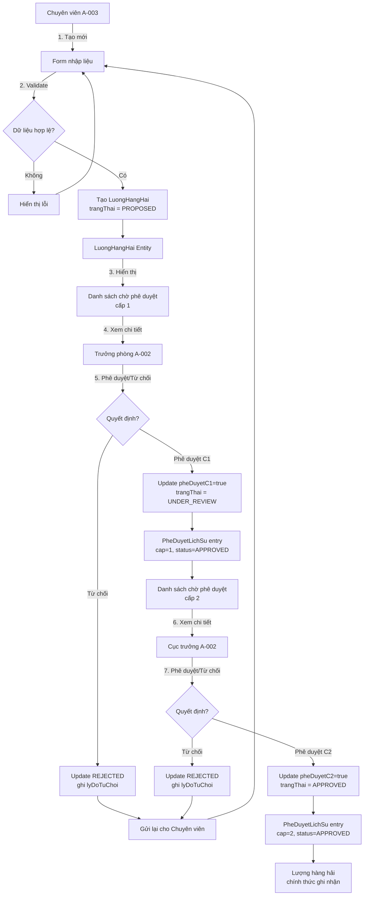
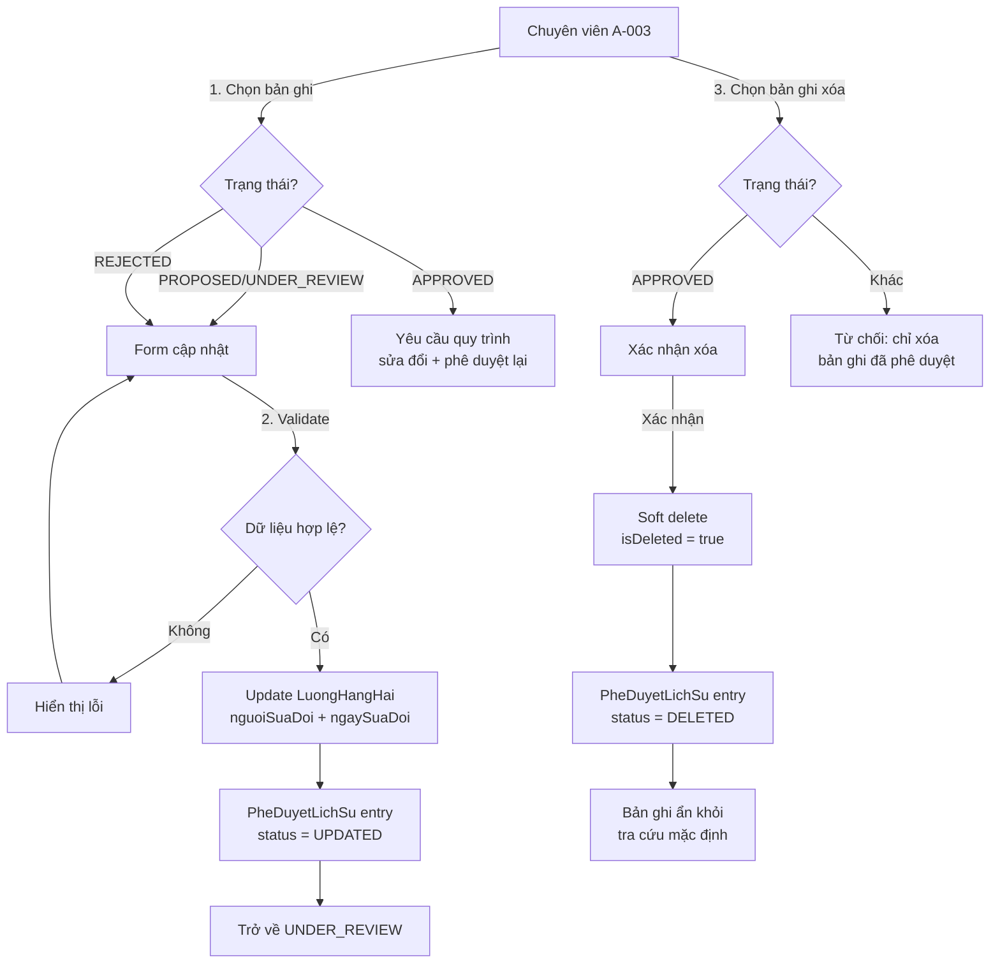
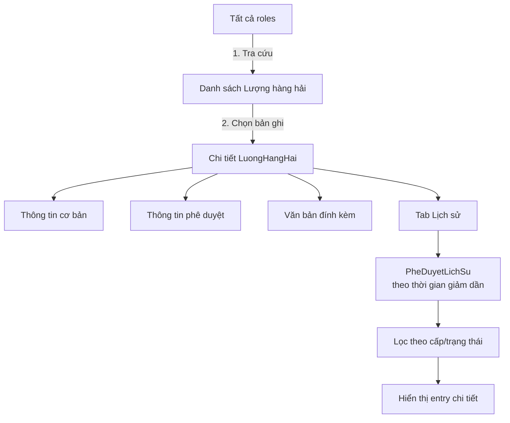

# BA Analysis — Quản lý Lượng hàng hải (F-038 → F-043)

## 1. Tổng quan

### 1.1. Mục đích

Phân tích nghiệp vụ toàn diện cho 6 tính năng quản lý Lượng hàng hải thuộc Module M-003 — Quản lý tài sản KCHTGT khu nước & VTS. Các tính năng bao gồm vòng đời đầy đủ: tạo mới, cập nhật, xóa, phê duyệt 2 cấp, xem chi tiết và lịch sử thay đổi.

### 1.2. Phạm vi

| STT | Feature ID | Tên tính năng | Độ ưu tiên | Actor chính |
|-----|-----------|--------------|------------|-------------|
| 1 | F-038 | Quản lý Lượng hàng hải — Tạo mới | P0 | Chuyên viên (A-003) |
| 2 | F-039 | Quản lý Lượng hàng hải — Cập nhật | P0 | Chuyên viên (A-003) |
| 3 | F-040 | Quản lý Lượng hàng hải — Xóa | P1 | Chuyên viên (A-003) |
| 4 | F-041 | Phê duyệt Lượng hàng hải | P0 | Lãnh đạo (A-002) |
| 5 | F-042 | Xem chi tiết Lượng hàng hải | P0 | Tất cả roles |
| 6 | F-043 | Quản lý Lượng hàng hải — Lịch sử | P1 | Chuyên viên (A-003) |

### 1.3. Phân loại độ phức tạp

**Complex: >10 business rules, cross-domain workflow**

- 6 features liên kết chặt chẽ (CRUD + approval + history)
- 3 actors chính (Chuyên viên, Lãnh đạo, Tất cả roles)
- Quy trình phê duyệt 2 cấp (phòng → cục)
- Domain model mới: `LuongHangHai`, `LuongHangHaiAttachment`, `PheDuyetLichSu`
- Routing: **engineering-system-architect** (Q1=Yes: creates new domain elements)

---

## 2. Use Cases

### 2.1. F-038 — Tạo mới Lượng hàng hải

**Actor:** Chuyên viên (A-003)

**Preconditions:**
- Người dùng đã đăng nhập với vai trò Chuyên viên
- Người dùng có quyền `luonghanghai:create`

**Main Flow:**
1. Chuyên viên truy cập giao diện "Tạo mới Lượng hàng hải"
2. Hệ thống hiển thị form với các trường: Loại tàu, Số lượng, Ngày ghi nhận, Giờ điền, Tải trọng, Diện tích đăng bộ, Ghi chú
3. Chuyên viên nhập đầy đủ thông tin bắt buộc
4. Hệ thống validate dữ liệu đầu vào (kiểu dữ liệu, khoảng giá trị, trường bắt buộc)
5. Chuyên viên nhấn "Lưu"
6. Hệ thống tạo bản ghi với trạng thái `PROPOSED` (chờ phê duyệt)
7. Hệ thống tự động ghi nhận người tạo và thời gian tạo
8. Hệ thống hiển thị thông báo "Tạo mới Lượng hàng hải thành công — đang chờ phê duyệt"

**Alternative Flows:**
- **AF-038-1:** Dữ liệu không hợp lệ → Hệ thống hiển thị lỗi chi tiết tại từng trường, không lưu
- **AF-038-2:** Thiếu trường bắt buộc → Hệ thống highlight trường thiếu và hiển thị thông báo lỗi

**Postconditions:**
- Bản ghi `LuongHangHai` được tạo với `trangThai = PROPOSED`
- `pheDuyetC1 = false`, `pheDuyetC2 = false`
- `nguoiTao` = username của chuyên viên
- `ngayTao` = thời gian hiện tại
- Bản ghi xuất hiện trong danh sách "Chờ phê duyệt cấp 1"

---

### 2.2. F-039 — Cập nhật Lượng hàng hải

**Actor:** Chuyên viên (A-003)

**Preconditions:**
- Người dùng đã đăng nhập với vai trò Chuyên viên
- Bản ghi Lượng hàng hải tồn tại với trạng thái `PROPOSED` hoặc `UNDER_REVIEW`
- Người dùng có quyền `luonghanghai:update`

**Main Flow:**
1. Chuyên viên chọn bản ghi Lượng hàng hải cần cập nhật
2. Hệ thống hiển thị form với dữ liệu hiện tại
3. Chuyên viên chỉnh sửa các trường cần thay đổi
4. Hệ thống validate dữ liệu đầu vào
5. Chuyên viên nhấn "Lưu"
6. Hệ thống cập nhật bản ghi, ghi nhận `nguoiSuaDoi` và `ngaySuaDoi`
7. Hệ thống tạo entry mới trong `PheDuyetLichSu` với `trangThai = UPDATED`
8. Hệ thống hiển thị thông báo "Cập nhật Lượng hàng hải thành công — đang chờ phê duyệt lại"

**Alternative Flows:**
- **AF-039-1:** Bản ghi đã `APPROVED` → Không cho phép cập nhật trực tiếp, yêu cầu quy trình sửa đổi có phê duyệt lại
- **AF-039-2:** Dữ liệu không hợp lệ → Hệ thống hiển thị lỗi chi tiết, không lưu
- **AF-039-3:** Bản ghi bị từ chối (`REJECTED`) → Cho phép cập nhật và gửi lại quy trình phê duyệt

**Postconditions:**
- Bản ghi `LuongHangHai` được cập nhật
- `ngaySuaDoi` = thời gian hiện tại, `nguoiSuaDoi` = username
- Entry mới trong `PheDuyetLichSu`
- Trạng thái trở về `UNDER_REVIEW` nếu bản ghi đã `APPROVED`

---

### 2.3. F-040 — Xóa Lượng hàng hải

**Actor:** Chuyên viên (A-003)

**Preconditions:**
- Người dùng đã đăng nhập với vai trò Chuyên viên
- Bản ghi Lượng hàng hải tồn tại với trạng thái `APPROVED`
- Người dùng có quyền `luonghanghai:delete`

**Main Flow:**
1. Chuyên viên chọn bản ghi Lượng hàng hải cần xóa
2. Hệ thống hiển thị xác nhận xóa với thông tin bản ghi
3. Chuyên viên xác nhận xóa
4. Hệ thống kiểm tra trạng thái bản ghi (chỉ xóa được bản ghi `APPROVED`)
5. Hệ thống xóa bản ghi (soft delete — giữ lại trong CSDL với flag `isDeleted`)
6. Hệ thống ghi entry vào `PheDuyetLichSu` với `trangThai = DELETED`
7. Hệ thống hiển thị thông báo "Xóa Lượng hàng hải thành công"

**Alternative Flows:**
- **AF-040-1:** Bản ghi không ở trạng thái `APPROVED` → Hiển thị thông báo lỗi "Chỉ xóa được bản ghi đã được phê duyệt"
- **AF-040-2:** Người dùng hủy xác nhận → Không thực hiện xóa, quay lại danh sách

**Postconditions:**
- Bản ghi `LuongHangHai` bị xóa (soft delete)
- Entry trong `PheDuyetLichSu` ghi nhận hành động xóa
- Bản ghi không còn xuất hiện trong danh sách tra cứu mặc định

---

### 2.4. F-041 — Phê duyệt Lượng hàng hải

**Actor:** Lãnh đạo (A-002) — Trưởng phòng (cấp 1), Cục trưởng (cấp 2)

**Preconditions:**
- Người dùng đã đăng nhập với vai trò Lãnh đạo
- Bản ghi Lượng hàng hải tồn tại với trạng thái chờ phê duyệt
- Người dùng có quyền `luonghanghai:approve`

**Main Flow (Cấp 1 — Trưởng phòng):**
1. Trưởng phòng truy cập danh sách "Chờ phê duyệt cấp 1"
2. Hệ thống hiển thị danh sách bản ghi với trạng thái `PROPOSED`
3. Trưởng phòng chọn bản ghi và xem chi tiết
4. Trưởng phòng quyết định: Phê duyệt hoặc Từ chối
5. **Nếu Phê duyệt:** Trưởng phòng nhập lý do phê duyệt (bắt buộc)
6. Hệ thống cập nhật `pheDuyetC1 = true`, `nguoiPheDuyetC1`, `ngayPheDuyetC1`
7. Hệ thống tạo entry trong `PheDuyetLichSu` với `capPheDuyet = 1`, `trangThai = APPROVED`
8. Bản ghi chuyển sang trạng thái `UNDER_REVIEW` (chờ cấp 2)
9. Hệ thống hiển thị thông báo "Phê duyệt cấp 1 thành công — chờ phê duyệt cấp 2"

**Main Flow (Cấp 2 — Cục trưởng):**
1. Cục trưởng truy cập danh sách "Chờ phê duyệt cấp 2"
2. Hệ thống hiển thị danh sách bản ghi với trạng thái `UNDER_REVIEW` (đã duyệt cấp 1)
3. Cục trưởng chọn bản ghi và xem chi tiết
4. Cục trưởng quyết định: Phê duyệt hoặc Từ chối
5. **Nếu Phê duyệt:** Cục trưởng nhập lý do phê duyệt (bắt buộc)
6. Hệ thống cập nhật `pheDuyetC2 = true`, `nguoiPheDuyetC2`, `ngayPheDuyetC2`
7. Hệ thống tạo entry trong `PheDuyetLichSu` với `capPheDuyet = 2`, `trangThai = APPROVED`
8. Bản ghi chuyển sang trạng thái `APPROVED`
9. Hệ thống hiển thị thông báo "Phê duyệt cấp 2 thành công — Lượng hàng hải chính thức ghi nhận"

**Alternative Flows:**
- **AF-041-1:** Từ chối cấp 1 → Trưởng phòng nhập lý do từ chối (bắt buộc), bản ghi chuyển về `PROPOSED`, gửi lại cho chuyên viên
- **AF-041-2:** Từ chối cấp 2 → Cục trưởng nhập lý do từ chối (bắt buộc), bản ghi chuyển về `PROPOSED`, gửi lại cho chuyên viên
- **AF-041-3:** Trưởng phòng cố tình phê duyệt cấp 2 → Hệ thống từ chối, hiển thị thông báo "Trưởng phòng chỉ phê duyệt cấp 1"
- **AF-041-4:** Cục trưởng cố tình phê duyệt cấp 1 → Hệ thống từ chối, hiển thị thông báo "Cục trưởng chỉ phê duyệt cấp 2"

**Postconditions:**
- Trạng thái bản ghi được cập nhật theo kết quả phê duyệt
- Entry trong `PheDuyetLichSu` ghi nhận toàn bộ lịch sử phê duyệt
- Lý do phê duyệt/từ chối được lưu trữ

---

### 2.5. F-042 — Xem chi tiết Lượng hàng hải

**Actor:** Tất cả roles (A-002, A-003, A-004, Admin)

**Preconditions:**
- Người dùng đã đăng nhập
- Bản ghi Lượng hàng hải tồn tại

**Main Flow:**
1. Người dùng truy cập danh sách Lượng hàng hải hoặc tìm kiếm theo bộ lọc
2. Người dùng chọn bản ghi cần xem chi tiết
3. Hệ thống hiển thị đầy đủ thông tin bản ghi:
   - Thông tin cơ bản (loại tàu, số lượng, ngày ghi nhận, giờ điền, tải trọng, diện tích đăng bộ, ghi chú)
   - Thông tin phê duyệt (trạng thái, người phê duyệt cấp 1 & 2, ngày phê duyệt)
   - Văn bản đính kèm (nếu có)
   - Lịch sử thay đổi (nếu có)
4. Người dùng có thể tải xuống văn bản đính kèm

**Alternative Flows:**
- **AF-042-1:** Không có quyền xem → Hệ thống hiển thị thông báo "Bạn không có quyền xem thông tin này"
- **AF-042-2:** Bản ghi đã bị xóa → Hệ thống hiển thị thông báo "Bản ghi đã bị xóa"

**Postconditions:**
- Không có thay đổi dữ liệu, chỉ đọc thông tin

---

### 2.6. F-043 — Quản lý Lượng hàng hải — Lịch sử

**Actor:** Chuyên viên (A-003)

**Preconditions:**
- Người dùng đã đăng nhập với vai trò Chuyên viên
- Bản ghi Lượng hàng hải tồn tại

**Main Flow:**
1. Chuyên viên truy cập chi tiết bản ghi Lượng hàng hải
2. Chuyên viên chọn tab "Lịch sử thay đổi"
3. Hệ thống hiển thị danh sách các entry trong `PheDuyetLichSu` theo thứ tự thời gian giảm dần
4. Mỗi entry hiển thị: cấp phê duyệt, trạng thái, người thực hiện, ngày thực hiện, lý do
5. Chuyên viên có thể lọc theo cấp phê duyệt hoặc trạng thái

**Alternative Flows:**
- **AF-043-1:** Không có lịch sử → Hệ thống hiển thị "Chưa có thay đổi"

**Postconditions:**
- Không có thay đổi dữ liệu, chỉ đọc lịch sử

---

## 3. Business Rules

### 3.1. F-038 — Tạo mới

| Rule ID | Rule | Applies-to | Source |
|---------|------|-----------|--------|
| BR-038-01 | Lượng hàng hải phải được phê duyệt trước khi chính thức ghi nhận trong hệ thống | LuongHangHai | Feature brief F-038 |
| BR-038-02 | Bản ghi mới luôn ở trạng thái `PROPOSED` (chờ phê duyệt cấp 1) | LuongHangHai | Feature brief F-038 |
| BR-038-03 | Trường `loaiTau` là bắt buộc, độ dài tối đa 100 ký tự | LuongHangHai.loaiTau | Entity definition |
| BR-038-04 | Trường `soLuong` là bắt buộc, phải là số nguyên dương | LuongHangHai.soLuong | Entity definition |
| BR-038-05 | Trường `ngayGhiNhan` là bắt buộc, không được lớn hơn ngày hiện tại | LuongHangHai.ngayGhiNhan | Entity definition |
| BR-038-06 | Trường `taiTrong` là tùy chọn, phải là số thực dương | LuongHangHai.taiTrong | Entity definition |
| BR-038-07 | Trường `dienTichDangBo` là tùy chọn, phải là số thực dương | LuongHangHai.dienTichDangBo | Entity definition |
| BR-038-08 | Chỉ Chuyên viên (A-003) có quyền tạo mới Lượng hàng hải | LuongHangHai | Actor registry |

### 3.2. F-039 — Cập nhật

| Rule ID | Rule | Applies-to | Source |
|---------|------|-----------|--------|
| BR-039-01 | Cập nhật Lượng hàng hải phải được phê duyệt lại | LuongHangHai | Feature brief F-039 |
| BR-039-02 | Chỉ bản ghi ở trạng thái `PROPOSED` hoặc `UNDER_REVIEW` mới được cập nhật trực tiếp | LuongHangHai.trangThai | Feature brief F-039 |
| BR-039-03 | Bản ghi `APPROVED` không cho phép cập nhật trực tiếp, cần quy trình sửa đổi có phê duyệt lại | LuongHangHai.trangThai | Business logic |
| BR-039-04 | Mọi thay đổi phải được ghi nhận vào `PheDuyetLichSu` | PheDuyetLichSu | Entity definition |
| BR-039-05 | Trường `nguoiSuaDoi` và `ngaySuaDoi` được tự động cập nhật | LuongHangHai | Entity definition |
| BR-039-06 | Bản ghi bị từ chối (`REJECTED`) có thể được cập nhật và gửi lại phê duyệt | LuongHangHai.trangThai | Feature brief F-041 |

### 3.3. F-040 — Xóa

| Rule ID | Rule | Applies-to | Source |
|---------|------|-----------|--------|
| BR-040-01 | Xóa chỉ được thực hiện với dữ liệu đã được phê duyệt (`APPROVED`) | LuongHangHai.trangThai | Feature brief F-040 |
| BR-040-02 | Xóa là soft delete — dữ liệu được giữ lại trong CSDL với flag `isDeleted` | LuongHangHai | Business logic |
| BR-040-03 | Hành động xóa phải được ghi nhận vào `PheDuyetLichSu` | PheDuyetLichSu | Entity definition |
| BR-040-04 | Chỉ Chuyên viên (A-003) có quyền xóa Lượng hàng hải | LuongHangHai | Actor registry |

### 3.4. F-041 — Phê duyệt

| Rule ID | Rule | Applies-to | Source |
|---------|------|-----------|--------|
| BR-041-01 | Quy trình phê duyệt bắt buộc 2 cấp: trưởng phòng (cấp 1) rồi đến cục trưởng (cấp 2) | LuongHangHai | Feature brief F-041 |
| BR-041-02 | Nếu bị từ chối ở cấp 1, bản ghi gửi lại cho chuyên viên để chỉnh sửa | LuongHangHai.trangThai | Feature brief F-041 |
| BR-041-03 | Nếu bị từ chối ở cấp 2, bản ghi gửi lại cho chuyên viên để chỉnh sửa | LuongHangHai.trangThai | Feature brief F-041 |
| BR-041-04 | Lý do từ chối là trường bắt buộc khi phê duyệt cấp từ chối | PheDuyetLichSu.lyDo | Feature brief F-041 |
| BR-041-05 | Thời gian phê duyệt mỗi cấp phải được ghi nhận và hiển thị trong giao diện | LuongHangHai.ngayPheDuyetC1, C2 | Feature brief F-041 |
| BR-041-06 | Khi hoàn tất cả 2 cấp phê duyệt, bản ghi chuyển sang trạng thái `APPROVED` | LuongHangHai.trangThai | Feature brief F-041 |
| BR-041-07 | Trưởng phòng chỉ được phê duyệt cấp 1, không được phê duyệt cấp 2 | PheDuyetLichSu.capPheDuyet | Feature brief F-041 |
| BR-041-08 | Cục trưởng chỉ được phê duyệt cấp 2 | PheDuyetLichSu.capPheDuyet | Feature brief F-041 |
| BR-041-09 | Trạng thái `PROPOSED` → chờ cấp 1; `UNDER_REVIEW` → chờ cấp 2; `APPROVED` → hoàn tất; `REJECTED` → từ chối | LuongHangHai.trangThai | Entity definition |
| BR-041-10 | Mọi quyết định phê duyệt/từ chối phải được ghi nhận vào `PheDuyetLichSu` | PheDuyetLichSu | Entity definition |

### 3.5. F-042 — Xem chi tiết

| Rule ID | Rule | Applies-to | Source |
|---------|------|-----------|--------|
| BR-042-01 | Tất cả roles có quyền tra cứu, xem chi tiết Lượng hàng hải | LuongHangHai | Feature brief F-042 |
| BR-042-02 | Văn bản đính kèm có thể xem và tải xuống | LuongHangHaiAttachment | Feature brief F-042 |
| BR-042-03 | Bản ghi đã xóa (soft delete) không hiển thị trong kết quả tra cứu mặc định | LuongHangHai.isDeleted | Business logic |

### 3.6. F-043 — Lịch sử

| Rule ID | Rule | Applies-to | Source |
|---------|------|-----------|--------|
| BR-043-01 | Hệ thống theo dõi lịch sử thay đổi của mọi bản ghi Lượng hàng hải | PheDuyetLichSu | Feature brief F-043 |
| BR-043-02 | Lịch sử hiển thị theo thứ tự thời gian giảm dần (mới nhất trước) | PheDuyetLichSu | Business logic |
| BR-043-03 | Chuyên viên có quyền xem lịch sử của tất cả bản ghi | PheDuyetLichSu | Actor registry |

---

## 4. Entity Definitions

### 4.1. LuongHangHai

| Field | Type | Nullable | Length | Constraints | Description |
|-------|------|----------|--------|-------------|-------------|
| `id` | Long | No | — | PK, AUTO_INCREMENT | Khóa chính |
| `loaiTau` | String | No | 100 | NOT NULL | Loại tàu |
| `soLuong` | Integer | No | — | > 0 | Số lượng |
| `ngayGhiNhan` | LocalDate | No | — | ≤ ngày hiện tại | Ngày ghi nhận |
| `gioDien` | String | Yes | 10 | Format HH:mm | Giờ điền |
| `taiTrong` | BigDecimal | Yes | — | > 0 | Tải trọng |
| `dienTichDangBo` | BigDecimal | Yes | — | > 0 | Diện tích đăng bộ |
| `ghiChu` | String | Yes | 500 | — | Ghi chú |
| `trangThai` | Enum | No | 30 | PROPOSED/UNDER_REVIEW/APPROVED/REJECTED | Trạng thái phê duyệt |
| `pheDuyetC1` | Boolean | No | — | Default: false | Phê duyệt cấp 1 |
| `nguoiPheDuyetC1` | String | Yes | 100 | — | Người phê duyệt cấp 1 |
| `ngayPheDuyetC1` | LocalDateTime | Yes | — | — | Ngày phê duyệt cấp 1 |
| `pheDuyetC2` | Boolean | No | — | Default: false | Phê duyệt cấp 2 |
| `nguoiPheDuyetC2` | String | Yes | 100 | — | Người phê duyệt cấp 2 |
| `ngayPheDuyetC2` | LocalDateTime | Yes | — | — | Ngày phê duyệt cấp 2 |
| `lyDoTuChoi` | String | Yes | 500 | — | Lý do từ chối |
| `nguoiTao` | String | No | 100 | — | Người tạo |
| `ngayTao` | LocalDateTime | No | — | Auto-set on create | Ngày tạo |
| `nguoiSuaDoi` | String | Yes | 100 | — | Người sửa đổi |
| `ngaySuaDoi` | LocalDateTime | Yes | — | Auto-set on update | Ngày sửa đổi |
| `isDeleted` | Boolean | No | — | Default: false | Soft delete flag |

**Package:** `com.hanghai.kchtg.luonghanghai.entity`
**Table name:** `luong_hang_hai`

### 4.2. LuongHangHaiAttachment

| Field | Type | Nullable | Length | Constraints | Description |
|-------|------|----------|--------|-------------|-------------|
| `id` | Long | No | — | PK, AUTO_INCREMENT | Khóa chính |
| `luongHangHaiId` | Long | No | — | FK → LuongHangHai.id | Khóa ngoại |
| `tenTaiLieu` | String | No | 255 | NOT NULL | Tên tài liệu |
| `duongDan` | String | No | 500 | NOT NULL | Đường dẫn MinIO |
| `kichThuoc` | Long | Yes | — | — | Kích thước (bytes) |
| `loaiTaiLieu` | String | Yes | 50 | — | Loại tài liệu |
| `nguoiTaiLen` | String | Yes | 100 | — | Người tải lên |
| `ngayTaiLen` | LocalDateTime | Yes | — | Auto-set | Ngày tải lên |

**Package:** `com.hanghai.kchtg.luonghanghai.entity`
**Table name:** `luong_hang_hai_attachment`

### 4.3. PheDuyetLichSu

| Field | Type | Nullable | Length | Constraints | Description |
|-------|------|----------|--------|-------------|-------------|
| `id` | Long | No | — | PK, AUTO_INCREMENT | Khóa chính |
| `luongHangHaiId` | Long | No | — | FK → LuongHangHai.id | Khóa ngoại |
| `capPheDuyet` | Integer | No | — | 1 hoặc 2 | Cấp phê duyệt |
| `trangThai` | String | No | 30 | APPROVED/REJECTED/UPDATED/DELETED | Trạng thái |
| `nguoiPheDuyet` | String | No | 100 | NOT NULL | Người phê duyệt |
| `ngayPheDuyet` | LocalDateTime | No | — | — | Ngày phê duyệt |
| `lyDo` | String | Yes | 500 | — | Lý do phê duyệt/từ chối |

**Package:** `com.hanghai.kchtg.luonghanghai.entity`
**Table name:** `phe_duyet_lich_su`

### 4.4. LuongHangHaiApprovalStatus (Enum)

```
PROPOSED      — Chờ phê duyệt cấp 1
UNDER_REVIEW  — Đã duyệt cấp 1, chờ duyệt cấp 2
APPROVED      — Đã phê duyệt cả 2 cấp
REJECTED      — Bị từ chối
```

---

## 5. Acceptance Criteria (BDD)

### 5.1. F-038 — Tạo mới

| STT | Scenario | Given | When | Then |
|-----|----------|-------|------|------|
| AC-038-01 | Tạo mới thành công | Người dùng đăng nhập vai trò Chuyên viên | Nhập đầy đủ thông tin và nhấn Lưu | Bản ghi được tạo với trạng thái PROPOSED, hiển thị thông báo thành công |
| AC-038-02 | Tạo mới thiếu trường bắt buộc | Người dùng đăng nhập vai trò Chuyên viên | Nhập thiếu trường bắt buộc và nhấn Lưu | Hệ thống hiển thị lỗi, không tạo bản ghi |
| AC-038-03 | Tạo mới với dữ liệu không hợp lệ | Người dùng đăng nhập vai trò Chuyên viên | Nhập số lượng ≤ 0 hoặc ngày > hiện tại và nhấn Lưu | Hệ thống hiển thị lỗi validation, không tạo bản ghi |
| AC-038-04 | Người dùng không có quyền tạo | Người dùng đăng nhập vai trò khác Chuyên viên | Truy cập giao diện tạo mới | Hệ thống từ chối, hiển thị thông báo không có quyền |
| AC-038-05 | Tạo mới với trường tùy chọn trống | Người dùng đăng nhập vai trò Chuyên viên | Nhập chỉ trường bắt buộc, bỏ trống trường tùy chọn | Bản ghi được tạo thành công |

### 5.2. F-039 — Cập nhật

| STT | Scenario | Given | When | Then |
|-----|----------|-------|------|------|
| AC-039-01 | Cập nhật thành công | Bản ghi ở trạng thái PROPOSED | Chỉnh sửa thông tin và nhấn Lưu | Bản ghi được cập nhật, hiển thị thông báo thành công |
| AC-039-02 | Cập nhật bản ghi đã APPROVED | Bản ghi ở trạng thái APPROVED | Cố gắng chỉnh sửa và nhấn Lưu | Hệ thống từ chối, yêu cầu quy trình sửa đổi có phê duyệt lại |
| AC-039-03 | Cập nhật bản ghi bị từ chối | Bản ghi ở trạng thái REJECTED | Chỉnh sửa thông tin và nhấn Lưu | Bản ghi được cập nhật, gửi lại quy trình phê duyệt |
| AC-039-04 | Cập nhật với dữ liệu không hợp lệ | Bản ghi ở trạng thái PROPOSED | Nhập số lượng ≤ 0 và nhấn Lưu | Hệ thống hiển thị lỗi validation, không cập nhật |
| AC-039-05 | Cập nhật ghi nhận lịch sử | Bản ghi ở trạng thái PROPOSED | Chỉnh sửa thông tin và nhấn Lưu | Entry mới được tạo trong PheDuyetLichSu với trangThai = UPDATED |

### 5.3. F-040 — Xóa

| STT | Scenario | Given | When | Then |
|-----|----------|-------|------|------|
| AC-040-01 | Xóa bản ghi APPROVED thành công | Bản ghi ở trạng thái APPROVED | Xác nhận xóa | Bản ghi bị xóa (soft delete), không còn trong danh sách tra cứu |
| AC-040-02 | Xóa bản ghi chưa phê duyệt | Bản ghi ở trạng thái PROPOSED | Cố gắng xóa | Hệ thống từ chối, hiển thị thông báo "Chỉ xóa được bản ghi đã được phê duyệt" |
| AC-040-03 | Xóa bản ghi bị từ chối | Bản ghi ở trạng thái REJECTED | Cố gắng xóa | Hệ thống từ chối, hiển thị thông báo "Chỉ xóa được bản ghi đã được phê duyệt" |
| AC-040-04 | Hủy xác nhận xóa | Bản ghi ở trạng thái APPROVED | Nhấn Hủy trong hộp thoại xác nhận | Không thực hiện xóa, quay lại danh sách |
| AC-040-05 | Xóa ghi nhận lịch sử | Bản ghi ở trạng thái APPROVED | Xác nhận xóa | Entry mới được tạo trong PheDuyetLichSu với trangThai = DELETED |

### 5.4. F-041 — Phê duyệt

| STT | Scenario | Given | When | Then |
|-----|----------|-------|------|------|
| AC-041-01 | Phê duyệt cấp 1 thành công | Bản ghi ở trạng thái PROPOSED | Trưởng phòng phê duyệt và nhập lý do | pheDuyetC1 = true, trạng thái = UNDER_REVIEW, entry trong PheDuyetLichSu |
| AC-041-02 | Phê duyệt cấp 2 thành công | Bản ghi ở trạng thái UNDER_REVIEW | Cục trưởng phê duyệt và nhập lý do | pheDuyetC2 = true, trạng thái = APPROVED, entry trong PheDuyetLichSu |
| AC-041-03 | Từ chối cấp 1 | Bản ghi ở trạng thái PROPOSED | Trưởng phòng từ chối và nhập lý do | trạng thái = REJECTED, lyDoTuChoi được điền, gửi lại cho chuyên viên |
| AC-041-04 | Từ chối cấp 2 | Bản ghi ở trạng thái UNDER_REVIEW | Cục trưởng từ chối và nhập lý do | trạng thái = REJECTED, lyDoTuChoi được điền, gửi lại cho chuyên viên |
| AC-041-05 | Lý do từ chối là bắt buộc | Bản ghi ở trạng thái PROPOSED | Trưởng phòng cố tình từ chối mà không nhập lý do | Hệ thống từ chối, hiển thị thông báo "Lý do từ chối là bắt buộc" |
| AC-041-06 | Trưởng phòng không phê duyệt cấp 2 | Bản ghi ở trạng thái UNDER_REVIEW | Trưởng phòng cố tình phê duyệt cấp 2 | Hệ thống từ chối, hiển thị thông báo "Trưởng phòng chỉ phê duyệt cấp 1" |
| AC-041-07 | Cục trưởng không phê duyệt cấp 1 | Bản ghi ở trạng thái PROPOSED | Cục trưởng cố tình phê duyệt cấp 1 | Hệ thống từ chối, hiển thị thông báo "Cục trưởng chỉ phê duyệt cấp 2" |
| AC-041-08 | Phê duyệt đầy đủ 2 cấp | Bản ghi ở trạng thái PROPOSED | Phê duyệt cấp 1 rồi cấp 2 | Bản ghi chuyển sang trạng thái APPROVED, chính thức ghi nhận |

### 5.5. F-042 — Xem chi tiết

| STT | Scenario | Given | When | Then |
|-----|----------|-------|------|------|
| AC-042-01 | Xem chi tiết bản ghi | Bản ghi tồn tại | Chọn bản ghi và xem chi tiết | Hiển thị đầy đủ thông tin cơ bản, phê duyệt, đính kèm |
| AC-042-02 | Tra cứu với bộ lọc | Nhiều bản ghi | Nhập bộ lọc (loại tàu, ngày, trạng thái) | Hiển thị danh sách kết quả phù hợp |
| AC-042-03 | Xem văn bản đính kèm | Bản ghi có đính kèm | Nhấn vào văn bản đính kèm | Hiển thị/tải xuống văn bản |
| AC-042-04 | Xem bản ghi đã xóa | Bản ghi đã bị xóa (soft delete) | Tìm kiếm bản ghi | Không hiển thị trong kết quả mặc định |
| AC-042-05 | Tất cả roles xem được | Bản ghi tồn tại | Người dùng bất kỳ role truy cập | Hiển thị thông tin (không cho phép chỉnh sửa) |

### 5.6. F-043 — Lịch sử

| STT | Scenario | Given | When | Then |
|-----|----------|-------|------|------|
| AC-043-01 | Xem lịch sử thay đổi | Bản ghi có lịch sử | Chọn tab "Lịch sử thay đổi" | Hiển thị danh sách entry theo thứ tự thời gian giảm dần |
| AC-043-02 | Lịch sử rỗng | Bản ghi chưa có thay đổi | Chọn tab "Lịch sử thay đổi" | Hiển thị "Chưa có thay đổi" |
| AC-043-03 | Lọc theo cấp phê duyệt | Bản ghi có nhiều entry | Lọc theo cấp 1 hoặc cấp 2 | Hiển thị chỉ entry phù hợp |
| AC-043-04 | Lọc theo trạng thái | Bản ghi có nhiều entry | Lọc theo APPROVED/REJECTED | Hiển thị chỉ entry phù hợp |
| AC-043-05 | Xem chi tiết entry | Bản ghi có entry trong lịch sử | Nhấn vào entry | Hiển thị chi tiết: người thực hiện, ngày, lý do |

---

## 6. Data Flow Diagrams

### 6.1. Luồng tạo mới và phê duyệt (F-038 → F-041)



### 6.2. Luồng cập nhật và xóa (F-039, F-040)



### 6.3. Luồng xem chi tiết và lịch sử (F-042, F-043)



---

## 7. Role/Permission Matrix

| Feature | Role | Permission | Actor ID | Notes |
|---------|------|-----------|----------|-------|
| F-038 | Chuyên viên | `luonghanghai:create` | A-003 | Tạo mới Lượng hàng hải |
| F-038 | Admin | `luonghanghai:create` | A-001 | Tạo mới (nếu cần) |
| F-039 | Chuyên viên | `luonghanghai:update` | A-003 | Cập nhật bản ghi PROPOSED/UNDER_REVIEW/REJECTED |
| F-039 | Admin | `luonghanghai:update` | A-001 | Cập nhật (nếu cần) |
| F-040 | Chuyên viên | `luonghanghai:delete` | A-003 | Xóa bản ghi APPROVED |
| F-040 | Admin | `luonghanghai:delete` | A-001 | Xóa (nếu cần) |
| F-041 | Trưởng phòng | `luonghanghai:approve:c1` | A-002 | Phê duyệt cấp 1 |
| F-041 | Cục trưởng | `luonghanghai:approve:c2` | A-002 | Phê duyệt cấp 2 |
| F-041 | Admin | `luonghanghai:approve` | A-001 | Phê duyệt mọi cấp |
| F-042 | Tất cả | `luonghanghai:read` | A-002, A-003, A-004 | Xem chi tiết, tra cứu |
| F-042 | Admin | `luonghanghai:read` | A-001 | Xem chi tiết, tra cứu |
| F-043 | Chuyên viên | `luonghanghai:history` | A-003 | Xem lịch sử thay đổi |
| F-043 | Admin | `luonghanghai:history` | A-001 | Xem lịch sử thay đổi |

---

## 8. API Endpoints (Reference — pattern from vanban module)

| Method | Endpoint | Feature | Permission | Description |
|--------|----------|---------|-----------|-------------|
| POST | `/api/v1/luong-hang-hai` | F-038 | `luonghanghai:create` | Tạo mới |
| GET | `/api/v1/luong-hang-hai` | F-042 | `luonghanghai:read` | Danh sách |
| GET | `/api/v1/luong-hang-hai/{id}` | F-042 | `luonghanghai:read` | Chi tiết |
| PUT | `/api/v1/luong-hang-hai/{id}` | F-039 | `luonghanghai:update` | Cập nhật |
| DELETE | `/api/v1/luong-hang-hai/{id}` | F-040 | `luonghanghai:delete` | Xóa |
| POST | `/api/v1/luong-hang-hai/{id}/approve/c1` | F-041 | `luonghanghai:approve:c1` | Phê duyệt cấp 1 |
| POST | `/api/v1/luong-hang-hai/{id}/approve/c2` | F-041 | `luonghanghai:approve:c2` | Phê duyệt cấp 2 |
| GET | `/api/v1/luong-hang-hai/{id}/history` | F-043 | `luonghanghai:history` | Lịch sử |
| GET | `/api/v1/luong-hang-hai/search` | F-042 | `luonghanghai:read` | Tìm kiếm |
| GET | `/api/v1/luong-hang-hai/status/{status}` | F-042 | `luonghanghai:read` | Lọc theo trạng thái |

---

## 9. Non-Functional Requirements (NFRs)

### 9.1. Performance

| ID | Requirement | Target |
|----|-------------|--------|
| NFR-PERF-01 | Thời gian phản hồi API tạo mới | ≤ 2 giây |
| NFR-PERF-02 | Thời gian phản hồi API tra cứu (có phân trang) | ≤ 3 giây với ≤ 10.000 bản ghi |
| NFR-PERF-03 | Thời gian phản hồi API xem chi tiết | ≤ 1 giây |
| NFR-PERF-04 | Hỗ trợ tối thiểu 50 người dùng đồng thời | 50 concurrent users |

### 9.2. Security

| ID | Requirement | Target |
|----|-------------|--------|
| NFR-SEC-01 | Xác thực qua JWT token | JWT-based auth |
| NFR-SEC-02 | Phân quyền theo role tại controller | `@PreAuthorize` annotations |
| NFR-SEC-03 | Mã hóa dữ liệu nhạy cảm | TLS 1.2+ cho truyền dẫn |
| NFR-SEC-04 | Audit log cho mọi thao tác CRUD | Log qua SLF4J + repository |
| NFR-SEC-05 | Ngăn chặn SQL injection | Spring Data JPA parameterized queries |

### 9.3. Reliability

| ID | Requirement | Target |
|----|-------------|--------|
| NFR-REL-01 | Downtime cho phép | ≤ 4 giờ/năm (99.5% uptime) |
| NFR-REL-02 | Backup CSDL | Daily backup, retention 30 ngày |
| NFR-REL-03 | Soft delete để khôi phục dữ liệu | isDeleted flag, không xóa vật lý |
| NFR-REL-04 | Transaction integrity | `@Transactional` cho mọi write operation |

### 9.4. Usability

| ID | Requirement | Target |
|----|-------------|--------|
| NFR-USE-01 | Giao diện tiếng Việt | Formal Vietnamese UI |
| NFR-USE-02 | Responsive design | Desktop + tablet |
| NFR-USE-03 | Thông báo lỗi rõ ràng, dễ hiểu | Vietnamese error messages |
| NFR-USE-04 | Hướng dẫn sử dụng inline | Tooltips + help text |

### 9.5. Maintainability

| ID | Requirement | Target |
|----|-------------|--------|
| NFR-MAINT-01 | Code coverage tối thiểu | ≥ 70% unit test coverage |
| NFR-MAINT-02 | Documentation | Javadoc cho service + controller |
| NFR-MAINT-03 | Versioning API | `/api/v1/` prefix |
| NFR-MAINT-04 | Logging | SLF4J + structured log format |

---

## 10. Test Scenarios Summary

| Feature | Scenario | Type | Priority |
|---------|----------|------|----------|
| F-038 | Tạo mới thành công | Positive | Critical |
| F-038 | Thiếu trường bắt buộc | Negative | Critical |
| F-038 | Dữ liệu không hợp lệ | Negative | Major |
| F-039 | Cập nhật bản ghi PROPOSED | Positive | Critical |
| F-039 | Cập nhật bản ghi APPROVED | Negative | Critical |
| F-039 | Cập nhật bản ghi REJECTED | Positive | Major |
| F-040 | Xóa bản ghi APPROVED | Positive | Critical |
| F-040 | Xóa bản ghi chưa phê duyệt | Negative | Critical |
| F-041 | Phê duyệt cấp 1 | Positive | Critical |
| F-041 | Phê duyệt cấp 2 | Positive | Critical |
| F-041 | Từ chối cấp 1 | Negative | Critical |
| F-041 | Từ chối cấp 2 | Negative | Critical |
| F-041 | Lý do từ chối bắt buộc | Negative | Major |
| F-041 | Quyền phê duyệt đúng cấp | Negative | Critical |
| F-042 | Xem chi tiết | Positive | Major |
| F-042 | Tra cứu với bộ lọc | Positive | Major |
| F-043 | Xem lịch sử thay đổi | Positive | Major |
| F-043 | Lọc lịch sử | Positive | Normal |

---

## 11. Pipeline Triage

### Q1: Creates new domain elements?

**Answer: YES**

- `LuongHangHai` — entity mới (11+ fields, approval workflow)
- `LuongHangHaiAttachment` — entity mới (attachment management)
- `PheDuyetLichSu` — entity mới (approval history)
- `LuongHangHaiApprovalStatus` — enum mới
- Package mới: `com.hanghai.kchtg.luonghanghai`

### Q2: Affects system architecture?

**Answer: YES**

- Thêm module mới trong kiến trúc hiện tại
- Thêm 3 entity JPA mới
- Thêm approval workflow 2 cấp (pattern từ vanban module nhưng mở rộng)
- Thêm MinIO integration cho attachment
- Thêm repository, service, controller mới

### Q3: Approach clear from existing architecture?

**Answer: NO**

- Pattern từ vanban module có thể tham khảo (entity, repository, service, controller, DTO)
- Tuy nhiên approval workflow 2 cấp phức tạp hơn vanban (chỉ có 1 cấp)
- Cần thiết kế context map cho LuongHangHaiAttachment (MinIO) và PheDuyetLichSu
- Cần xác định boundary conditions cho soft delete + approval state machine

### Triage Verdict

| Question | Answer | Rationale |
|----------|--------|-----------|
| Q1 | Yes | 3 entities mới + 1 enum mới |
| Q2 | Yes | Module mới, approval workflow 2 cấp, MinIO integration |
| Q3 | No | Pattern tham khảo được nhưng cần thiết kế thêm |

**Route: engineering-system-architect**

---

## 12. Ambiguities

| ID | Description | Impact | Question | Options |
|----|-------------|--------|----------|---------|
| [AMBIGU-001] | Không rõ phân biệt Trưởng phòng vs Cục trưởng trong actor registry (cùng A-002) | Cao | Làm sao phân biệt cấp phê duyệt trong hệ thống? | Option A: Thêm field `capPheDuyet` trong actor. Option B: Dùng role hierarchy. Option C: Dùng group/department |
| [AMBIGU-002] | Không rõ định nghĩa "giờ điền" (gioDien) — giờ ghi nhận hay giờ hệ thống? | Thấp | gioDien là giờ người dùng nhập hay giờ hệ thống tự động? | Option A: Người dùng nhập. Option B: Tự động từ ngayGhiNhan |
| [AMBIGU-003] | Không rõ dung lượng tối đa cho văn bản đính kèm | Thấp | Giới hạn kích thước file đính kèm là bao nhiêu? | Cần bổ sung từ yêu cầu hệ thống |
| [AMBIGU-004] | Không rõ thời gian giữ lại bản ghi đã xóa (soft delete retention) | Thấp | Bao lâu sau khi soft delete mới xóa vật lý? | Cần bổ sung policy retention |
| [AMBIGU-005] | Không rõ có cần notification (email/SMS) khi phê duyệt/từ chối không | Thấp | F-041 mention "thông báo" nhưng out of scope | Cần xác định scope notification |

---

## 13. Code Pattern Reference (vanban module)

### 13.1. Entity Pattern

```
Package: com.hanghai.kchtg.luonghanghai.entity
Annotations: @Entity, @Table, @Data, @NoArgsConstructor, @AllArgsConstructor, @Builder
Timestamps: @PrePersist → ngayTao, @PreUpdate → ngaySuaDoi
Relationships: @OneToMany (LuongHangHaiAttachment), @ManyToOne (PheDuyetLichSu)
Enums: @Enumerated(EnumType.STRING)
```

### 13.2. Repository Pattern

```
Package: com.hanghai.kchtg.luonghanghai.repository
Interface: extends JpaRepository<Entity, Long>
Methods: findByStatus, findByLoaiTauContaining, searchDocuments (JPQL @Query)
Pagination: Page<Entity> với Pageable
```

### 13.3. Service Pattern

```
Package: com.hanghai.kchtg.luonghanghai.service
Annotations: @Service, @RequiredArgsConstructor, @Slf4j, @Transactional
Methods: create, getById, findAll, update, delete, approveC1, approveC2, getHistory
DTO conversion: toResponse() helper method
```

### 13.4. Controller Pattern

```
Package: com.hanghai.kchtg.luonghanghai.controller
Annotations: @RestController, @RequestMapping("/api/v1/luong-hang-hai"), @RequiredArgsConstructor
Security: @PreAuthorize("@auth.check(authentication, 'luonghanghai:read')")
Response: ApiResponse<T> wrapper
Validation: @Valid on request body
```

### 13.5. DTO Pattern

```
Package: com.hanghai.kchtg.luonghanghai.dto
CreateRequest: @Data, @NoArgsConstructor, @AllArgsConstructor, @Builder, @NotBlank validation
Response: @Data, @NoArgsConstructor, @AllArgsConstructor, @Builder
```

---

## 14. Summary

### 14.1. Key Findings

- 6 features tạo thành vòng đời đầy đủ của Lượng hàng hải (CRUD + approval + history)
- Quy trình phê duyệt 2 cấp là điểm khác biệt chính so với vanban module
- 3 entities mới cần thiết kế: LuongHangHai, LuongHangHaiAttachment, PheDuyetLichSu
- Pattern từ vanban module có thể tái sử dụng cho entity/repository/service/controller structure
- 5 NFR areas được cover: Performance, Security, Reliability, Usability, Maintainability

### 14.2. Artifacts Produced

- `docs/modules/M-003-quan-ly-tai-san-kchtgt-khu-nuoc-vts/ba/00-lean-spec.md` — BA analysis document (this file)

### 14.3. Next Steps

1. **engineering-system-architect** — thiết kế domain model, context map, API contract
2. **engineering-technical-lead** — lập implementation tasks dựa trên spec
3. **QA** — viết test cases dựa trên acceptance criteria
4. **Reviewer** — review toàn bộ spec và domain model

---

# EXTENSION — F-044 đến F-067 (Đê/Kè, Cơ sở sửa chữa, Trạm radar, Hệ thống VTS)

> **Phạm vi mở rộng:** Sections 15–28 bổ sung BA cho 24 features còn lại của M-003 (F-044→F-067). Các features này chia sẻ cùng approval workflow 2 cấp, state machine, và NFR như F-038–F-043. Chỉ các điểm khác biệt (entity fields, permission codes, geo constraints) được ghi chú riêng.

> **Gap resolutions từ code (bắt buộc đọc trước khi dùng spec này):**
> 1. **Actor A-004 conflict (F-056/059/062/065):** Feature briefs ghi A-004 cho C2 approval là sai. A-004 = "Nguoi dung tai Cang" (Port Operator) theo actor-registry — KHÔNG phải lãnh đạo. Code (HeThongVTSController `@PreAuthorize('vts:approve:c2')`, DESIGN-tram-radar-vts.md) xác nhận C2 = Cục trưởng (A-002), nhất quán với mọi group khác. TramRadarController THIẾU `@PreAuthorize` — đây là security gap cần fix (flagged cho reviewer). Spec này dùng A-002 cho cả C1 và C2 trên tất cả 30 features.
> 2. **Cross-domain FK:** Code xác nhận KHÔNG có FK `de_ke→khu_nuoc` và KHÔNG có FK `he_thong_vts→luong_hang_hai`. Các domain là DECOUPLED hoàn toàn — thiết kế đã chủ ý. Không cần referential integrity giữa các domain.
> 3. **Real-time NFR (TramRadar/VTS):** TramRadar có `kinhDo`/`viDo` fields (DECIMAL 10,6) lưu trữ tọa độ địa lý. KHÔNG có WebSocket, SSE, GeoServer, hay scheduler integration trong code. Đây là plain CRUD với geo-coordinate storage. NFR = standard CRUD + geo coordinate validation. Không áp dụng real-time SLA.

---

## 15. Phạm vi — F-044 đến F-067

| STT | Feature ID | Tên tính năng | Group | Priority | Actor chính |
|-----|-----------|--------------|-------|----------|-------------|
| 7 | F-044 | Quản lý Đê/Kè — Tạo mới | Đê/Kè | P0 | Chuyên viên (A-003) |
| 8 | F-045 | Quản lý Đê/Kè — Cập nhật | Đê/Kè | P0 | Chuyên viên (A-003) |
| 9 | F-046 | Quản lý Đê/Kè — Xóa | Đê/Kè | P1 | Chuyên viên (A-003) |
| 10 | F-047 | Phê duyệt Đê/Kè | Đê/Kè | P0 | Lãnh đạo (A-002) |
| 11 | F-048 | Xem chi tiết Đê/Kè | Đê/Kè | P0 | Tất cả roles |
| 12 | F-049 | Quản lý Đê/Kè — Lịch sử | Đê/Kè | P1 | Chuyên viên (A-003) |
| 13 | F-050 | Quản lý Cơ sở sửa chữa, đóng tàu — Tạo mới | CoSuaChua | P0 | Chuyên viên (A-003) |
| 14 | F-051 | Quản lý Cơ sở sửa chữa, đóng tàu — Cập nhật | CoSuaChua | P0 | Chuyên viên (A-003) |
| 15 | F-052 | Quản lý Cơ sở sửa chữa, đóng tàu — Xóa | CoSuaChua | P1 | Chuyên viên (A-003) |
| 16 | F-053 | Phê duyệt Cơ sở sửa chữa, đóng tàu | CoSuaChua | P0 | Lãnh đạo (A-002) |
| 17 | F-054 | Xem chi tiết Cơ sở sửa chữa, đóng tàu | CoSuaChua | P0 | Tất cả roles |
| 18 | F-055 | Quản lý Cơ sở sửa chữa, đóng tàu — Lịch sử | CoSuaChua | P1 | Chuyên viên (A-003) |
| 19 | F-056 | Quản lý Trạm radar — Tạo mới | TramRadar | P0 | Chuyên viên (A-003) |
| 20 | F-057 | Quản lý Trạm radar — Cập nhật | TramRadar | P0 | Chuyên viên (A-003) |
| 21 | F-058 | Quản lý Trạm radar — Xóa | TramRadar | P1 | Chuyên viên (A-003) |
| 22 | F-059 | Phê duyệt Trạm radar | TramRadar | P0 | Lãnh đạo (A-002) |
| 23 | F-060 | Xem chi tiết Trạm radar | TramRadar | P0 | Tất cả roles |
| 24 | F-061 | Quản lý Trạm radar — Lịch sử | TramRadar | P1 | Chuyên viên (A-003) |
| 25 | F-062 | Quản lý Hệ thống VTS — Tạo mới | VTS | P0 | Chuyên viên (A-003) |
| 26 | F-063 | Quản lý Hệ thống VTS — Cập nhật | VTS | P0 | Chuyên viên (A-003) |
| 27 | F-064 | Quản lý Hệ thống VTS — Xóa | VTS | P1 | Chuyên viên (A-003) |
| 28 | F-065 | Phê duyệt Hệ thống VTS | VTS | P0 | Lãnh đạo (A-002) |
| 29 | F-066 | Xem chi tiết Hệ thống VTS | VTS | P0 | Tất cả roles |
| 30 | F-067 | Quản lý Hệ thống VTS — Lịch sử | VTS | P1 | Chuyên viên (A-003) |

---

## 16. Entity Definitions — Đê/Kè (F-044→F-049)

### 16.1. DeKe

| Field | Type | Nullable | Length/Precision | Constraints | Description |
|-------|------|----------|---------|-------------|-------------|
| `id` | Long | No | — | PK, AUTO_INCREMENT | Khóa chính |
| `loaiDe` | String | No | 100 | NOT NULL | Loại đê/kè |
| `viTri` | String | No | 255 | NOT NULL | Vị trí địa lý |
| `chieuDai` | BigDecimal | No | DECIMAL(10,2) | > 0 | Chiều dài (m) |
| `chieuRong` | BigDecimal | No | DECIMAL(10,2) | > 0 | Chiều rộng (m) |
| `chieuCao` | BigDecimal | No | DECIMAL(10,2) | > 0 | Chiều cao (m) |
| `matVatLieu` | String | Yes | 100 | — | Vật liệu mặt đê |
| `tinhTrang` | String | Yes | 50 | — | Tình trạng (tốt/trung bình/kém) |
| `trangThaiPheDuyet` | Enum | No | 30 | DeKeApprovalStatus | Trạng thái phê duyệt |
| `pheDuyetC1` | Boolean | No | — | Default: false | Phê duyệt cấp 1 |
| `nguoiPheDuyetC1` | String | Yes | 100 | — | Người phê duyệt C1 |
| `ngayPheDuyetC1` | LocalDateTime | Yes | — | — | Ngày phê duyệt C1 |
| `pheDuyetC2` | Boolean | No | — | Default: false | Phê duyệt cấp 2 |
| `nguoiPheDuyetC2` | String | Yes | 100 | — | Người phê duyệt C2 |
| `ngayPheDuyetC2` | LocalDateTime | Yes | — | — | Ngày phê duyệt C2 |
| `lyDoTuChoi` | String | Yes | 500 | — | Lý do từ chối |
| `nguoiTao` | String | No | 100 | — | Người tạo |
| `ngayTao` | LocalDateTime | No | — | Auto-set on create | Ngày tạo |
| `nguoiSuaDoi` | String | Yes | 100 | — | Người sửa đổi |
| `ngaySuaDoi` | LocalDateTime | Yes | — | Auto-set on update | Ngày sửa đổi |
| `isDeleted` | Boolean | No | — | Default: false | Soft delete flag |

**Package:** `com.hanghai.kchtg.deke.entity` | **Table:** `de_ke`

**Note (from code):** Enum class trong code là `DeKeApprovalStatus` (không phải `TrangThaiPheDuyet` như DESIGN doc ghi). Field name là `trangThaiPheDuyet` (not `trangThai`). Source: `DeKe.java` line 39.

**Cross-domain:** KHÔNG có FK đến `khu_nuoc` hay `luong_hang_hai`. Decoupled by design.

### 16.2. DeKeAttachment

| Field | Type | Nullable | Length | Constraints | Description |
|-------|------|----------|--------|-------------|-------------|
| `id` | Long | No | — | PK | Khóa chính |
| `deKeId` | Long | No | — | FK → DeKe.id | Khóa ngoại |
| `tenTaiLieu` | String | No | 255 | NOT NULL | Tên tài liệu |
| `duongDan` | String | No | 500 | NOT NULL | Đường dẫn MinIO |
| `kichThuoc` | Long | Yes | — | — | Kích thước (bytes) |
| `loaiTaiLieu` | String | Yes | 50 | — | Loại tài liệu |
| `nguoiTaiLen` | String | Yes | 100 | — | Người tải lên |
| `ngayTaiLen` | LocalDateTime | Yes | — | Auto-set | Ngày tải lên |

**Table:** `de_ke_attachment`

### 16.3. DeKeApprovalStatus (Enum)

```
PROPOSED      — Chờ phê duyệt cấp 1
UNDER_REVIEW  — Đã duyệt cấp 1, chờ duyệt cấp 2
APPROVED      — Đã phê duyệt cả 2 cấp
REJECTED      — Bị từ chối
```

---

## 17. Entity Definitions — Cơ sở sửa chữa, đóng tàu (F-050→F-055)

### 17.1. CoSuaChuaDongTau

| Field | Type | Nullable | Length | Constraints | Description |
|-------|------|----------|--------|-------------|-------------|
| `id` | Long | No | — | PK | Khóa chính |
| `tenCoSo` | String | No | 255 | NOT NULL | Tên cơ sở |
| `diaChi` | String | No | 500 | NOT NULL | Địa chỉ |
| `tinhThanh` | String | No | 100 | NOT NULL | Tỉnh/thành phố |
| `soDienThoai` | String | Yes | 20 | — | Số điện thoại |
| `email` | String | Yes | 100 | — | Email |
| `loaiCoSo` | String | No | 100 | NOT NULL | Loại cơ sở |
| `khaNang` | String | Yes | 255 | — | Khả năng xử lý |
| `chuQuan` | String | Yes | 255 | — | Chủ quản |
| `trangThai` | Enum | No | 30 | TrangThaiPheDuyet | Trạng thái phê duyệt |
| `pheDuyetC1` | Boolean | No | — | Default: false | Phê duyệt C1 |
| `nguoiPheDuyetC1` | String | Yes | 100 | — | Người phê duyệt C1 |
| `ngayPheDuyetC1` | LocalDateTime | Yes | — | — | Ngày phê duyệt C1 |
| `pheDuyetC2` | Boolean | No | — | Default: false | Phê duyệt C2 |
| `nguoiPheDuyetC2` | String | Yes | 100 | — | Người phê duyệt C2 |
| `ngayPheDuyetC2` | LocalDateTime | Yes | — | — | Ngày phê duyệt C2 |
| `lyDoTuChoi` | String | Yes | 500 | — | Lý do từ chối |
| `nguoiTao` | String | No | 100 | — | Người tạo |
| `ngayTao` | LocalDateTime | No | — | Auto-set | Ngày tạo |
| `nguoiSuaDoi` | String | Yes | 100 | — | Người sửa đổi |
| `ngaySuaDoi` | LocalDateTime | Yes | — | Auto-set | Ngày sửa đổi |
| `isDeleted` | Boolean | No | — | Default: false | Soft delete |

**Package:** `com.hanghai.kchtg.cosuachua.entity` | **Table:** `co_sua_chua_dong_tau`

### 17.2. CoSuaChuaDongTauAttachment

| Field | Type | Nullable | Length | Constraints | Description |
|-------|------|----------|--------|-------------|-------------|
| `id` | Long | No | — | PK | Khóa chính |
| `coSuaChuaId` | Long | No | — | FK → CoSuaChuaDongTau.id | Khóa ngoại |
| `tenTaiLieu` | String | No | 255 | NOT NULL | Tên tài liệu |
| `duongDan` | String | No | 500 | NOT NULL | Đường dẫn MinIO |
| `kichThuoc` | Long | Yes | — | — | Kích thước (bytes) |
| `loaiTaiLieu` | String | Yes | 50 | — | Loại tài liệu |
| `nguoiTaiLen` | String | Yes | 100 | — | Người tải lên |
| `ngayTaiLen` | LocalDateTime | Yes | — | Auto-set | Ngày tải lên |

**Table:** `co_sua_chua_dong_tau_attachment`

---

## 18. Entity Definitions — Trạm radar (F-056→F-061)

### 18.1. TramRadar

| Field | Type | Nullable | Length/Precision | Constraints | Description |
|-------|------|----------|---------|-------------|-------------|
| `id` | Long | No | — | PK | Khóa chính |
| `tenTram` | String | No | 255 | NOT NULL | Tên trạm |
| `viTri` | String | No | 500 | NOT NULL | Vị trí mô tả |
| `kinhDo` | BigDecimal | Yes | DECIMAL(10,6) | [-180, 180] | Kinh độ (°) |
| `viDo` | BigDecimal | Yes | DECIMAL(10,6) | [-90, 90] | Vĩ độ (°) |
| `loaiTram` | String | Yes | 100 | — | Loại trạm |
| `coTrinh` | String | Yes | 100 | — | Có trinh sát |
| `dienTichPhaXa` | BigDecimal | Yes | DECIMAL(10,2) | > 0 | Diện tích phát xạ (km²) |
| `nguonGoc` | String | Yes | 255 | — | Nguồn gốc |
| `tinhTrang` | String | Yes | 50 | — | Tình trạng |
| `trangThai` | String | No | 20 | NOT NULL | Trạng thái phê duyệt (String trong DB) |
| `pheDuyetC1` | Boolean | No | — | Default: false | Phê duyệt C1 |
| `nguoiPheDuyetC1` | String | Yes | 100 | — | Người phê duyệt C1 |
| `ngayPheDuyetC1` | LocalDateTime | Yes | — | — | Ngày phê duyệt C1 |
| `pheDuyetC2` | Boolean | No | — | Default: false | Phê duyệt C2 |
| `nguoiPheDuyetC2` | String | Yes | 100 | — | Người phê duyệt C2 |
| `ngayPheDuyetC2` | LocalDateTime | Yes | — | — | Ngày phê duyệt C2 |
| `lyDoTuChoi` | String | Yes | 500 | — | Lý do từ chối |
| `nguoiTao` | String | Yes | 100 | — | Người tạo |
| `ngayTao` | LocalDateTime | Yes | — | Auto-set | Ngày tạo |
| `nguoiSuaDoi` | String | Yes | 100 | — | Người sửa đổi |
| `ngaySuaDoi` | LocalDateTime | Yes | — | Auto-set | Ngày sửa đổi |
| `isDeleted` | Boolean | No | — | Default: false | Soft delete (`@SQLRestriction`) |

**Package:** `com.hanghai.kchtg.tramradar.entity` | **Table:** `tram_radar`

**Geo fields (from code, TramRadar.java):** `kinhDo` DECIMAL(10,6), `viDo` DECIMAL(10,6). Storage only — NO GeoServer integration, NO real-time monitoring in implemented code. NFR: standard CRUD + coordinate range validation.

**Cross-domain:** KHÔNG có FK đến `luong_hang_hai` hay `khu_nuoc`. Decoupled by design.

**Security gap:** `TramRadarController` KHÔNG có `@PreAuthorize` annotations (confirmed from code). All endpoints are unprotected at controller level. This is a security deficit requiring fix before production. Flag for security reviewer.

### 18.2. TramRadarAttachment

| Field | Type | Nullable | Length | Constraints | Description |
|-------|------|----------|--------|-------------|-------------|
| `id` | Long | No | — | PK | Khóa chính |
| `tramRadarId` | Long | No | — | FK → TramRadar.id | Khóa ngoại |
| `tenTaiLieu` | String | No | 255 | NOT NULL | Tên tài liệu |
| `duongDan` | String | No | 500 | NOT NULL | Đường dẫn MinIO |
| `kichThuoc` | Long | Yes | — | — | Kích thước (bytes) |
| `loaiTaiLieu` | String | Yes | 50 | — | Loại tài liệu |
| `nguoiTaiLen` | String | Yes | 100 | — | Người tải lên |
| `ngayTaiLen` | LocalDateTime | Yes | — | Auto-set | Ngày tải lên |

**Table:** `tram_radar_attachment`

---

## 19. Entity Definitions — Hệ thống VTS (F-062→F-067)

### 19.1. HeThongVTS

| Field | Type | Nullable | Length | Constraints | Description |
|-------|------|----------|--------|-------------|-------------|
| `id` | Long | No | — | PK | Khóa chính |
| `tenHeThong` | String | No | 255 | NOT NULL | Tên hệ thống |
| `viTri` | String | No | 500 | NOT NULL | Vị trí mô tả |
| `tinhTrang` | String | Yes | 50 | — | Tình trạng |
| `mucDoPhuTrach` | String | Yes | 255 | — | Mức độ phụ trách |
| `nguonGoc` | String | Yes | 255 | — | Nguồn gốc |
| `doiTac` | String | Yes | 255 | — | Đối tác |
| `trangThai` | String | No | 20 | NOT NULL | Trạng thái phê duyệt (String trong DB) |
| `pheDuyetC1` | Boolean | No | — | Default: false | Phê duyệt C1 |
| `nguoiPheDuyetC1` | String | Yes | 100 | — | Người phê duyệt C1 |
| `ngayPheDuyetC1` | LocalDateTime | Yes | — | — | Ngày phê duyệt C1 |
| `pheDuyetC2` | Boolean | No | — | Default: false | Phê duyệt C2 |
| `nguoiPheDuyetC2` | String | Yes | 100 | — | Người phê duyệt C2 |
| `ngayPheDuyetC2` | LocalDateTime | Yes | — | — | Ngày phê duyệt C2 |
| `lyDoTuChoi` | String | Yes | 500 | — | Lý do từ chối |
| `nguoiTao` | String | Yes | 100 | — | Người tạo |
| `ngayTao` | LocalDateTime | Yes | — | Auto-set | Ngày tạo |
| `nguoiSuaDoi` | String | Yes | 100 | — | Người sửa đổi |
| `ngaySuaDoi` | LocalDateTime | Yes | — | Auto-set | Ngày sửa đổi |
| `isDeleted` | Boolean | No | — | Default: false | Soft delete (`@SQLRestriction`) |

**Package:** `com.hanghai.kchtg.vts.entity` | **Table:** `he_thong_vts`
**Service name:** `HeThongVTSDataService` (tránh xung đột tên với Spring VTS concept).

**Cross-domain:** KHÔNG có FK đến `luong_hang_hai` hay bất kỳ domain khác trong M-003. Decoupled by design.

### 19.2. HeThongVTSAttachment

| Field | Type | Nullable | Length | Constraints | Description |
|-------|------|----------|--------|-------------|-------------|
| `id` | Long | No | — | PK | Khóa chính |
| `heThongVTSId` | Long | No | — | FK → HeThongVTS.id | Khóa ngoại |
| `tenTaiLieu` | String | No | 255 | NOT NULL | Tên tài liệu |
| `duongDan` | String | No | 500 | NOT NULL | Đường dẫn MinIO |
| `kichThuoc` | Long | Yes | — | — | Kích thước (bytes) |
| `loaiTaiLieu` | String | Yes | 50 | — | Loại tài liệu |
| `nguoiTaiLen` | String | Yes | 100 | — | Người tải lên |
| `ngayTaiLen` | LocalDateTime | Yes | — | Auto-set | Ngày tải lên |

**Table:** `he_thong_vts_attachment`

---

## 20. Business Rules — Đê/Kè (F-044→F-049)

### 20.1. F-044 — Tạo mới

| Rule ID | Rule | Applies-to | Source |
|---------|------|-----------|--------|
| BR-044-01 | Đê/kè phải được phê duyệt trước khi chính thức ghi nhận | DeKe | Feature brief F-044 |
| BR-044-02 | Bản ghi mới luôn ở trạng thái `PROPOSED` | DeKe.trangThaiPheDuyet | DESIGN.md |
| BR-044-03 | `loaiDe` bắt buộc, max 100 | DeKe.loaiDe | Entity |
| BR-044-04 | `viTri` bắt buộc, max 255 | DeKe.viTri | Entity |
| BR-044-05 | `chieuDai`, `chieuRong`, `chieuCao` bắt buộc, > 0 | DeKe dimensions | Entity |
| BR-044-06 | `matVatLieu` tùy chọn, max 100 | DeKe.matVatLieu | Entity |
| BR-044-07 | `tinhTrang` tùy chọn, max 50 | DeKe.tinhTrang | Entity |
| BR-044-08 | Chỉ Chuyên viên (A-003) có quyền tạo | Permission `deke:create` | DESIGN.md |

### 20.2. F-045 — Cập nhật

| Rule ID | Rule | Applies-to | Source |
|---------|------|-----------|--------|
| BR-045-01 | Cập nhật phải được phê duyệt lại | DeKe | DESIGN.md |
| BR-045-02 | Chỉ PROPOSED/UNDER_REVIEW/REJECTED được cập nhật | DeKe.trangThaiPheDuyet | DESIGN.md |
| BR-045-03 | APPROVED không cho phép cập nhật trực tiếp | DeKe | DESIGN.md |
| BR-045-04 | Mọi thay đổi ghi nhận vào PheDuyetLichSu với status=UPDATED | PheDuyetLichSu | DESIGN.md |
| BR-045-05 | `nguoiSuaDoi` + `ngaySuaDoi` tự động cập nhật | DeKe | Entity `@PreUpdate` |

### 20.3. F-046 — Xóa

| Rule ID | Rule | Applies-to | Source |
|---------|------|-----------|--------|
| BR-046-01 | Xóa chỉ với bản ghi APPROVED | DeKe.trangThaiPheDuyet | DESIGN.md |
| BR-046-02 | Soft delete — isDeleted = true | DeKe.isDeleted | DESIGN.md |
| BR-046-03 | Hành động xóa ghi nhận vào PheDuyetLichSu (status=DELETED) | PheDuyetLichSu | DESIGN.md |
| BR-046-04 | Chỉ Chuyên viên có quyền xóa | Permission `deke:delete` | DESIGN.md |

### 20.4. F-047 — Phê duyệt

| Rule ID | Rule | Applies-to | Source |
|---------|------|-----------|--------|
| BR-047-01 | 2 cấp phê duyệt: Trưởng phòng (C1) → Cục trưởng (C2) | DeKe | DESIGN.md |
| BR-047-02 | Từ chối cấp 1 → REJECTED, gửi lại cho chuyên viên | DeKe.trangThaiPheDuyet | DESIGN.md |
| BR-047-03 | Từ chối cấp 2 → REJECTED, gửi lại cho chuyên viên | DeKe.trangThaiPheDuyet | DESIGN.md |
| BR-047-04 | Lý do từ chối bắt buộc khi REJECTED | PheDuyetLichSu.lyDo | DESIGN.md |
| BR-047-05 | Thời gian phê duyệt mỗi cấp được ghi nhận | DeKe.ngayPheDuyetC1/C2 | DESIGN.md |
| BR-047-06 | Hoàn tất 2 cấp → APPROVED | DeKe.trangThaiPheDuyet | DESIGN.md |
| BR-047-07 | Cả 2 cấp đều dùng A-002 (Trưởng phòng C1, Cục trưởng C2) | Permission `deke:approve:c1` / `deke:approve:c2` | Code evidence |

### 20.5. F-048 — Xem chi tiết

| Rule ID | Rule | Applies-to | Source |
|---------|------|-----------|--------|
| BR-048-01 | Tất cả roles có quyền tra cứu và xem chi tiết | Permission `deke:read` | DESIGN.md |
| BR-048-02 | Văn bản đính kèm có thể xem và tải xuống (MinIO presigned URL) | DeKeAttachment | DESIGN.md |
| BR-048-03 | Bản ghi đã xóa không hiển thị trong tra cứu mặc định | DeKe.isDeleted + `@SQLRestriction` | DESIGN.md |
| BR-048-04 | Tra cứu theo loại đê, vị trí, trạng thái phê duyệt | Search endpoint | DESIGN.md |

### 20.6. F-049 — Lịch sử

| Rule ID | Rule | Applies-to | Source |
|---------|------|-----------|--------|
| BR-049-01 | Lịch sử theo dõi mọi bản ghi DeKe | PheDuyetLichSu | DESIGN.md |
| BR-049-02 | Lịch sử hiển thị theo thứ tự giảm dần (mới nhất trước) | PheDuyetLichSu | DESIGN.md |
| BR-049-03 | Permission `deke:history` để xem lịch sử | DeKe | DESIGN.md |

---

## 21. Business Rules — Cơ sở sửa chữa, đóng tàu (F-050→F-055)

### 21.1. F-050 — Tạo mới

| Rule ID | Rule | Applies-to | Source |
|---------|------|-----------|--------|
| BR-050-01 | Cơ sở sửa chữa phải được phê duyệt trước khi ghi nhận | CoSuaChuaDongTau | Feature brief |
| BR-050-02 | Bản ghi mới luôn PROPOSED | CoSuaChuaDongTau.trangThai | DESIGN-cosua.md |
| BR-050-03 | `tenCoSo` bắt buộc, max 255 | Entity | DESIGN-cosua.md |
| BR-050-04 | `diaChi` bắt buộc, max 500 | Entity | DESIGN-cosua.md |
| BR-050-05 | `tinhThanh` bắt buộc, max 100 | Entity | DESIGN-cosua.md |
| BR-050-06 | `loaiCoSo` bắt buộc, max 100 | Entity | DESIGN-cosua.md |
| BR-050-07 | `soDienThoai` tùy chọn, max 20 | Entity | DESIGN-cosua.md |
| BR-050-08 | `email` tùy chọn, max 100 | Entity | DESIGN-cosua.md |
| BR-050-09 | `khaNang` tùy chọn, max 255 | Entity | DESIGN-cosua.md |
| BR-050-10 | `chuQuan` tùy chọn, max 255 | Entity | DESIGN-cosua.md |
| BR-050-11 | Chỉ Chuyên viên (A-003) có quyền tạo | Permission `cosuachua:create` | DESIGN-cosua.md |

### 21.2. F-051→F-055

Rules F-051→F-055 kế thừa toàn bộ pattern từ F-045→F-049 (cập nhật, xóa, phê duyệt, xem, lịch sử). Permission codes: `cosuachua:update`, `cosuachua:delete`, `cosuachua:approve:c1`, `cosuachua:approve:c2`, `cosuachua:read`, `cosuachua:history`.

| Rule ID | Rule | Applies-to | Source |
|---------|------|-----------|--------|
| BR-051-01 | Cập nhật phải được phê duyệt lại | CoSuaChuaDongTau | DESIGN-cosua.md |
| BR-051-02 | Chỉ PROPOSED/UNDER_REVIEW/REJECTED cập nhật được | CoSuaChuaDongTau.trangThai | DESIGN-cosua.md |
| BR-051-03 | APPROVED không cho phép cập nhật trực tiếp | CoSuaChuaDongTau | DESIGN-cosua.md |
| BR-052-01 | Xóa chỉ với APPROVED (soft delete) | CoSuaChuaDongTau.isDeleted | DESIGN-cosua.md |
| BR-053-01 | 2 cấp phê duyệt: Trưởng phòng C1 → Cục trưởng C2 | CoSuaChuaDongTau | DESIGN-cosua.md |
| BR-053-02 | Lý do từ chối bắt buộc khi REJECTED | PheDuyetLichSu.lyDo | DESIGN-cosua.md |
| BR-054-01 | Tất cả roles xem chi tiết | Permission `cosuachua:read` | DESIGN-cosua.md |
| BR-055-01 | Lịch sử giảm dần theo thời gian | PheDuyetLichSu ORDER BY DESC | DESIGN-cosua.md |

---

## 22. Business Rules — Trạm radar (F-056→F-061)

### 22.1. F-056 — Tạo mới (specific fields)

| Rule ID | Rule | Applies-to | Source |
|---------|------|-----------|--------|
| BR-056-01 | Trạm radar phải được phê duyệt trước khi ghi nhận | TramRadar | Feature brief |
| BR-056-02 | Bản ghi mới luôn PROPOSED | TramRadar.trangThai | DESIGN-radar-vts.md |
| BR-056-03 | `tenTram` bắt buộc, max 255 | Entity | Code TramRadar.java |
| BR-056-04 | `viTri` bắt buộc, max 500 | Entity | Code TramRadar.java |
| BR-056-05 | `kinhDo` tùy chọn, phạm vi [-180, 180], DECIMAL(10,6) | TramRadar.kinhDo | Code TramRadar.java |
| BR-056-06 | `viDo` tùy chọn, phạm vi [-90, 90], DECIMAL(10,6) | TramRadar.viDo | Code TramRadar.java |
| BR-056-07 | `loaiTram` tùy chọn, max 100 | Entity | DESIGN-radar-vts.md |
| BR-056-08 | `coTrinh` tùy chọn, max 100 | Entity | DESIGN-radar-vts.md |
| BR-056-09 | `dienTichPhaXa` tùy chọn, > 0, DECIMAL(10,2) | TramRadar.dienTichPhaXa | Code TramRadar.java |
| BR-056-10 | `nguonGoc` tùy chọn, max 255 | Entity | DESIGN-radar-vts.md |
| BR-056-11 | `kinhDo`/`viDo` là lưu trữ CRUD — không real-time, không GeoServer | TramRadar | Code evidence (no WebSocket/SSE) |
| BR-056-12 | Chỉ Chuyên viên (A-003) có quyền tạo | Permission `tramradar:create` | DESIGN-radar-vts.md |

### 22.2. F-057→F-061

Rules kế thừa pattern chuẩn. Permission codes: `tramradar:update`, `tramradar:delete`, `tramradar:approve:c1`, `tramradar:approve:c2`, `tramradar:read`, `tramradar:history`.

**Lưu ý quan trọng:** TramRadarController hiện THIẾU `@PreAuthorize` annotations (xác nhận từ code review). Tất cả endpoints đang unprotected ở controller level. Cần add `@PreAuthorize("@auth.check(authentication, 'tramradar:XXX')")` vào mỗi endpoint trước production. HeThongVTSController đã có `@PreAuthorize` đầy đủ — dùng làm reference pattern.

| Rule ID | Rule | Applies-to | Source |
|---------|------|-----------|--------|
| BR-057-01 | Cập nhật phải được phê duyệt lại | TramRadar | DESIGN-radar-vts.md |
| BR-057-02 | Chỉ PROPOSED/UNDER_REVIEW/REJECTED cập nhật được | TramRadar.trangThai | DESIGN-radar-vts.md |
| BR-057-03 | APPROVED không cho phép cập nhật trực tiếp | TramRadar | DESIGN-radar-vts.md |
| BR-058-01 | Xóa chỉ với APPROVED (soft delete, `@SQLRestriction`) | TramRadar.isDeleted | Code TramRadar.java |
| BR-059-01 | 2 cấp phê duyệt A-002: Trưởng phòng C1 → Cục trưởng C2 | TramRadar | Code evidence (feature brief A-004 là sai) |
| BR-059-02 | Lý do từ chối bắt buộc khi REJECTED | PheDuyetLichSu.lyDo | DESIGN-radar-vts.md |
| BR-060-01 | Tất cả roles xem chi tiết | Permission `tramradar:read` | DESIGN-radar-vts.md |
| BR-061-01 | Lịch sử giảm dần theo thời gian | PheDuyetLichSu ORDER BY DESC | DESIGN-radar-vts.md |

---

## 23. Business Rules — Hệ thống VTS (F-062→F-067)

### 23.1. F-062 — Tạo mới (specific fields)

| Rule ID | Rule | Applies-to | Source |
|---------|------|-----------|--------|
| BR-062-01 | Hệ thống VTS phải được phê duyệt trước khi ghi nhận | HeThongVTS | Feature brief |
| BR-062-02 | Bản ghi mới luôn PROPOSED | HeThongVTS.trangThai | DESIGN-radar-vts.md |
| BR-062-03 | `tenHeThong` bắt buộc, max 255 | Entity | Code HeThongVTS.java |
| BR-062-04 | `viTri` bắt buộc, max 500 | Entity | Code HeThongVTS.java |
| BR-062-05 | `tinhTrang` tùy chọn, max 50 | Entity | DESIGN-radar-vts.md |
| BR-062-06 | `mucDoPhuTrach` tùy chọn, max 255 | Entity | DESIGN-radar-vts.md |
| BR-062-07 | `nguonGoc` tùy chọn, max 255 | Entity | DESIGN-radar-vts.md |
| BR-062-08 | `doiTac` tùy chọn, max 255 | Entity | Code HeThongVTS.java |
| BR-062-09 | Chỉ Chuyên viên (A-003) có quyền tạo | Permission `vts:create` | Code HeThongVTSController.java |
| BR-062-10 | KHÔNG có FK đến luong_hang_hai hay domain khác trong M-003 | HeThongVTS | Code evidence (decoupled) |

### 23.2. F-063→F-067

Rules kế thừa pattern chuẩn. Permission codes: `vts:update`, `vts:delete`, `vts:approve:c1`, `vts:approve:c2`, `vts:read`, `vts:history`. Tất cả đã có `@PreAuthorize` đầy đủ trong HeThongVTSController.

| Rule ID | Rule | Applies-to | Source |
|---------|------|-----------|--------|
| BR-063-01 | Cập nhật phải được phê duyệt lại | HeThongVTS | DESIGN-radar-vts.md |
| BR-063-02 | Chỉ PROPOSED/UNDER_REVIEW/REJECTED cập nhật được | HeThongVTS.trangThai | DESIGN-radar-vts.md |
| BR-064-01 | Xóa chỉ với APPROVED (soft delete, `@SQLRestriction`) | HeThongVTS.isDeleted | Code HeThongVTS.java |
| BR-065-01 | 2 cấp phê duyệt A-002: Trưởng phòng C1 → Cục trưởng C2 | HeThongVTS | Code HeThongVTSController `vts:approve:c1/c2` |
| BR-065-02 | Lý do từ chối bắt buộc khi REJECTED | PheDuyetLichSu.lyDo | DESIGN-radar-vts.md |
| BR-066-01 | Tất cả roles xem chi tiết | Permission `vts:read` | Code HeThongVTSController |
| BR-067-01 | Lịch sử giảm dần theo thời gian | PheDuyetLichSu ORDER BY DESC | DESIGN-radar-vts.md |

---

## 24. Acceptance Criteria (BDD) — Đê/Kè (F-044→F-049)

| ID | Feature | Scenario | Given | When | Then |
|----|---------|----------|-------|------|------|
| AC-044-01 | F-044 | Tạo mới thành công | Chuyên viên đăng nhập, có quyền `deke:create` | Nhập đủ loaiDe, viTri, chieuDai/Rong/Cao và nhấn Lưu | Bản ghi tạo với trangThaiPheDuyet=PROPOSED, thông báo thành công |
| AC-044-02 | F-044 | Thiếu trường bắt buộc | Chuyên viên đăng nhập | Để trống loaiDe hoặc viTri và nhấn Lưu | Validation error, không tạo bản ghi |
| AC-044-03 | F-044 | Dimension ≤ 0 | Chuyên viên đăng nhập | Nhập chieuDai = 0 | Validation error "@Positive", không tạo |
| AC-044-04 | F-044 | Không có quyền | Người dùng không có `deke:create` | Truy cập tạo mới | 403 Forbidden |
| AC-045-01 | F-045 | Cập nhật PROPOSED | Bản ghi PROPOSED tồn tại | Chuyên viên cập nhật và lưu | Bản ghi cập nhật, entry PheDuyetLichSu status=UPDATED |
| AC-045-02 | F-045 | Cập nhật APPROVED bị từ chối | Bản ghi APPROVED | Cố gắng cập nhật | IllegalStateException, thông báo "Không thể cập nhật bản ghi APPROVED" |
| AC-046-01 | F-046 | Xóa APPROVED thành công | Bản ghi APPROVED | Xác nhận xóa | isDeleted=true, không hiển thị trong danh sách mặc định |
| AC-046-02 | F-046 | Xóa bản ghi không phải APPROVED | Bản ghi PROPOSED | Cố gắng xóa | Lỗi "Chỉ xóa bản ghi đã phê duyệt" |
| AC-047-01 | F-047 | Phê duyệt C1 thành công | Bản ghi PROPOSED, user có `deke:approve:c1` | Phê duyệt C1 | pheDuyetC1=true, trangThaiPheDuyet=UNDER_REVIEW |
| AC-047-02 | F-047 | Phê duyệt C2 thành công | Bản ghi UNDER_REVIEW, user có `deke:approve:c2` | Phê duyệt C2 | pheDuyetC2=true, trangThaiPheDuyet=APPROVED |
| AC-047-03 | F-047 | Từ chối không có lý do | Bản ghi PROPOSED | Từ chối mà không nhập lý do | Validation error "Lý do từ chối bắt buộc" |
| AC-047-04 | F-047 | Từ chối → REJECTED | Bản ghi PROPOSED | Từ chối với lý do | trangThaiPheDuyet=REJECTED, lyDoTuChoi ghi nhận |
| AC-048-01 | F-048 | Xem chi tiết | Bản ghi tồn tại, user đăng nhập | Chọn bản ghi | Hiển thị đầy đủ: dimensions, phê duyệt, attachment |
| AC-048-02 | F-048 | Tra cứu theo loaiDe | Nhiều bản ghi | Nhập loaiDe làm filter | Danh sách lọc đúng |
| AC-049-01 | F-049 | Xem lịch sử | Bản ghi có entries | Chọn tab lịch sử | Danh sách giảm dần theo ngày |
| AC-049-02 | F-049 | Lịch sử rỗng | Bản ghi chưa có thay đổi | Chọn tab lịch sử | Hiển thị "Chưa có thay đổi" |

---

## 25. Acceptance Criteria (BDD) — Cơ sở sửa chữa, đóng tàu (F-050→F-055)

| ID | Feature | Scenario | Given | When | Then |
|----|---------|----------|-------|------|------|
| AC-050-01 | F-050 | Tạo mới thành công | Chuyên viên, có `cosuachua:create` | Nhập tenCoSo, diaChi, tinhThanh, loaiCoSo và lưu | Bản ghi tạo, trangThai=PROPOSED |
| AC-050-02 | F-050 | Thiếu loaiCoSo | Chuyên viên | Để trống loaiCoSo | Validation error |
| AC-050-03 | F-050 | Email format không hợp lệ | Chuyên viên | Nhập email sai định dạng | Validation error nếu email được validate |
| AC-051-01 | F-051 | Cập nhật PROPOSED | Bản ghi PROPOSED | Cập nhật tinhThanh | Bản ghi cập nhật, PheDuyetLichSu UPDATED |
| AC-051-02 | F-051 | Cập nhật APPROVED bị từ chối | Bản ghi APPROVED | Cố gắng cập nhật | IllegalStateException |
| AC-052-01 | F-052 | Xóa APPROVED | Bản ghi APPROVED | Xác nhận xóa | Soft delete thành công |
| AC-053-01 | F-053 | Phê duyệt 2 cấp đầy đủ | Bản ghi PROPOSED | C1 phê duyệt → C2 phê duyệt | trangThai=APPROVED |
| AC-053-02 | F-053 | Từ chối C1 | Bản ghi PROPOSED | Từ chối C1 với lý do | trangThai=REJECTED, gửi lại chuyên viên |
| AC-054-01 | F-054 | Xem chi tiết với attachment | Bản ghi có attachment | Xem chi tiết | Hiển thị attachment, MinIO presigned URL |
| AC-054-02 | F-054 | Lọc theo tinhThanh | Nhiều bản ghi | Search tinhThanh="Hà Nội" | Danh sách lọc đúng |
| AC-055-01 | F-055 | Lịch sử phê duyệt | Bản ghi đã qua nhiều bước | Xem lịch sử | Entries giảm dần, bao gồm C1/C2/REJECTED |

---

## 26. Acceptance Criteria (BDD) — Trạm radar (F-056→F-061)

| ID | Feature | Scenario | Given | When | Then |
|----|---------|----------|-------|------|------|
| AC-056-01 | F-056 | Tạo mới thành công | Chuyên viên, `tramradar:create` | Nhập tenTram, viTri và lưu | Bản ghi tạo, trangThai=PROPOSED |
| AC-056-02 | F-056 | Thiếu tenTram | Chuyên viên | tenTram rỗng | Validation error @NotBlank |
| AC-056-03 | F-056 | kinhDo ngoài phạm vi | Chuyên viên | kinhDo = 200 | Validation error @DecimalMax("180") |
| AC-056-04 | F-056 | viDo ngoài phạm vi | Chuyên viên | viDo = -100 | Validation error @DecimalMin("-90") |
| AC-056-05 | F-056 | Tạo mới không cần kinhDo/viDo | Chuyên viên | Để trống kinhDo, viDo | Bản ghi tạo thành công (geo fields nullable) |
| AC-057-01 | F-057 | Cập nhật kinhDo/viDo | Bản ghi PROPOSED | Cập nhật tọa độ hợp lệ | Tọa độ cập nhật, PheDuyetLichSu UPDATED |
| AC-058-01 | F-058 | Xóa APPROVED | Bản ghi APPROVED | Xác nhận xóa | `@SQLRestriction` ẩn bản ghi khỏi query |
| AC-059-01 | F-059 | Phê duyệt C1 bởi A-002 (Trưởng phòng) | Bản ghi PROPOSED | C1 approve | trangThai=UNDER_REVIEW (A-002, không phải A-004) |
| AC-059-02 | F-059 | Phê duyệt C2 bởi A-002 (Cục trưởng) | Bản ghi UNDER_REVIEW | C2 approve | trangThai=APPROVED |
| AC-059-03 | F-059 | Permission guard tại controller | Endpoint `/approve/c1` | User không có `tramradar:approve:c1` | 403 (SAU KHI fix security gap @PreAuthorize) |
| AC-060-01 | F-060 | Xem chi tiết bao gồm tọa độ | Bản ghi có kinhDo/viDo | Xem chi tiết | kinhDo, viDo hiển thị trong response |
| AC-060-02 | F-060 | Tìm kiếm theo tinhTrang | Nhiều bản ghi | Search tinhTrang="tốt" | Danh sách lọc đúng |
| AC-061-01 | F-061 | Lịch sử giảm dần | Bản ghi đã qua approval | Xem lịch sử | Entries theo ngayPheDuyet DESC |

---

## 27. Acceptance Criteria (BDD) — Hệ thống VTS (F-062→F-067)

| ID | Feature | Scenario | Given | When | Then |
|----|---------|----------|-------|------|------|
| AC-062-01 | F-062 | Tạo mới thành công | Chuyên viên, `vts:create` | Nhập tenHeThong, viTri và lưu | Bản ghi tạo, trangThai=PROPOSED |
| AC-062-02 | F-062 | Thiếu tenHeThong | Chuyên viên | tenHeThong rỗng | Validation error @NotBlank |
| AC-062-03 | F-062 | Thiếu viTri | Chuyên viên | viTri rỗng | Validation error @NotBlank |
| AC-062-04 | F-062 | Người dùng không có quyền | User không có `vts:create` | Gọi POST /api/v1/he-thong-vts | 403 Forbidden (@PreAuthorize đã có) |
| AC-063-01 | F-063 | Cập nhật doiTac | Bản ghi PROPOSED | Cập nhật doiTac mới | Bản ghi cập nhật, entry PheDuyetLichSu UPDATED |
| AC-063-02 | F-063 | Cập nhật APPROVED | Bản ghi APPROVED | Cố gắng cập nhật | IllegalStateException |
| AC-064-01 | F-064 | Xóa APPROVED | Bản ghi APPROVED, user `vts:delete` | Xóa | isDeleted=true, không hiển thị |
| AC-064-02 | F-064 | Xóa PROPOSED | Bản ghi PROPOSED | Cố gắng xóa | Lỗi "Chỉ xóa bản ghi đã phê duyệt" |
| AC-065-01 | F-065 | Phê duyệt C1 bởi A-002 (Trưởng phòng) | Bản ghi PROPOSED, user `vts:approve:c1` | C1 approve | trangThai=UNDER_REVIEW |
| AC-065-02 | F-065 | Phê duyệt C2 bởi A-002 (Cục trưởng) | Bản ghi UNDER_REVIEW, user `vts:approve:c2` | C2 approve | trangThai=APPROVED |
| AC-065-03 | F-065 | Từ chối không có lý do | Bản ghi bất kỳ | Từ chối, lyDo rỗng | Validation error |
| AC-065-04 | F-065 | A-004 không được phê duyệt | User A-004 (Port Operator) | Gọi approve endpoint | 403 Forbidden (A-004 không có vts:approve:c2) |
| AC-066-01 | F-066 | Xem chi tiết với tất cả roles | Bản ghi APPROVED, user A-004 | Xem chi tiết | Hiển thị đầy đủ (A-004 có `vts:read`) |
| AC-066-02 | F-066 | Lọc theo tinhTrang | Nhiều bản ghi | Search tinhTrang="trung bình" | Danh sách lọc đúng |
| AC-067-01 | F-067 | Lịch sử đầy đủ | Bản ghi qua C1→C2→APPROVED | Xem lịch sử | Entries: PROPOSED create, UPDATED, C1 approve, C2 approve |
| AC-067-02 | F-067 | Không có lịch sử | Bản ghi mới tạo | Xem lịch sử | "Chưa có thay đổi" |

---

## 28. Role/Permission Matrix — F-044 đến F-067

### 28.1. Đê/Kè (F-044→F-049)

| Feature | Actor | Permission | Notes |
|---------|-------|-----------|-------|
| F-044 | A-003 (Chuyên viên) | `deke:create` | Tạo mới DeKe |
| F-045 | A-003 | `deke:update` | Cập nhật PROPOSED/UNDER_REVIEW/REJECTED |
| F-046 | A-003 | `deke:delete` | Soft delete APPROVED |
| F-047 | A-002 (Trưởng phòng) | `deke:approve:c1` | Phê duyệt C1 |
| F-047 | A-002 (Cục trưởng) | `deke:approve:c2` | Phê duyệt C2 |
| F-048 | A-002, A-003, A-004 | `deke:read` | Xem chi tiết, tra cứu |
| F-049 | A-003 | `deke:history` | Xem lịch sử |

### 28.2. Cơ sở sửa chữa, đóng tàu (F-050→F-055)

| Feature | Actor | Permission | Notes |
|---------|-------|-----------|-------|
| F-050 | A-003 | `cosuachua:create` | Tạo mới |
| F-051 | A-003 | `cosuachua:update` | Cập nhật |
| F-052 | A-003 | `cosuachua:delete` | Soft delete APPROVED |
| F-053 | A-002 (Trưởng phòng) | `cosuachua:approve:c1` | Phê duyệt C1 |
| F-053 | A-002 (Cục trưởng) | `cosuachua:approve:c2` | Phê duyệt C2 |
| F-054 | A-002, A-003, A-004 | `cosuachua:read` | Xem chi tiết, tra cứu |
| F-055 | A-003 | `cosuachua:history` | Xem lịch sử |

### 28.3. Trạm radar (F-056→F-061)

| Feature | Actor | Permission | Notes |
|---------|-------|-----------|-------|
| F-056 | A-003 | `tramradar:create` | Tạo mới (SECURITY GAP: controller chưa có @PreAuthorize) |
| F-057 | A-003 | `tramradar:update` | Cập nhật (SECURITY GAP) |
| F-058 | A-003 | `tramradar:delete` | Soft delete APPROVED (SECURITY GAP) |
| F-059 | A-002 (Trưởng phòng) | `tramradar:approve:c1` | C1 — A-002, KHÔNG phải A-004 |
| F-059 | A-002 (Cục trưởng) | `tramradar:approve:c2` | C2 — A-002, KHÔNG phải A-004 |
| F-060 | A-002, A-003, A-004 | `tramradar:read` | Xem chi tiết (SECURITY GAP) |
| F-061 | A-003 | `tramradar:history` | Xem lịch sử (SECURITY GAP) |

### 28.4. Hệ thống VTS (F-062→F-067)

| Feature | Actor | Permission | Notes |
|---------|-------|-----------|-------|
| F-062 | A-003 | `vts:create` | Tạo mới (có @PreAuthorize) |
| F-063 | A-003 | `vts:update` | Cập nhật (có @PreAuthorize) |
| F-064 | A-003 | `vts:delete` | Soft delete APPROVED (có @PreAuthorize) |
| F-065 | A-002 (Trưởng phòng) | `vts:approve:c1` | C1 — A-002, KHÔNG phải A-004 |
| F-065 | A-002 (Cục trưởng) | `vts:approve:c2` | C2 — A-002, KHÔNG phải A-004 |
| F-066 | A-002, A-003, A-004 | `vts:read` | Xem chi tiết (có @PreAuthorize) |
| F-067 | A-003 | `vts:history` | Xem lịch sử (có @PreAuthorize) |

---

## 29. API Endpoints — F-044 đến F-067

### 29.1. Đê/Kè

| Method | Endpoint | Feature | Permission |
|--------|----------|---------|-----------|
| POST | `/api/v1/de-ke` | F-044 | `deke:create` |
| GET | `/api/v1/de-ke` | F-048 | `deke:read` |
| GET | `/api/v1/de-ke/{id}` | F-048 | `deke:read` |
| PUT | `/api/v1/de-ke/{id}` | F-045 | `deke:update` |
| DELETE | `/api/v1/de-ke/{id}` | F-046 | `deke:delete` |
| POST | `/api/v1/de-ke/{id}/approve/c1` | F-047 | `deke:approve:c1` |
| POST | `/api/v1/de-ke/{id}/approve/c2` | F-047 | `deke:approve:c2` |
| GET | `/api/v1/de-ke/search` | F-048 | `deke:read` |
| GET | `/api/v1/de-ke/status-phe-duyet/{trangThai}` | F-048 | `deke:read` |
| GET | `/api/v1/de-ke/{id}/history` | F-049 | `deke:history` |

### 29.2. Cơ sở sửa chữa, đóng tàu

| Method | Endpoint | Feature | Permission |
|--------|----------|---------|-----------|
| POST | `/api/v1/co-so-sua-chua` | F-050 | `cosuachua:create` |
| GET | `/api/v1/co-so-sua-chua` | F-054 | `cosuachua:read` |
| GET | `/api/v1/co-so-sua-chua/{id}` | F-054 | `cosuachua:read` |
| PUT | `/api/v1/co-so-sua-chua/{id}` | F-051 | `cosuachua:update` |
| DELETE | `/api/v1/co-so-sua-chua/{id}` | F-052 | `cosuachua:delete` |
| POST | `/api/v1/co-so-sua-chua/{id}/approve/c1` | F-053 | `cosuachua:approve:c1` |
| POST | `/api/v1/co-so-sua-chua/{id}/approve/c2` | F-053 | `cosuachua:approve:c2` |
| GET | `/api/v1/co-so-sua-chua/search` | F-054 | `cosuachua:read` |
| GET | `/api/v1/co-so-sua-chua/status-phe-duyet/{trangThai}` | F-054 | `cosuachua:read` |
| GET | `/api/v1/co-so-sua-chua/{id}/history` | F-055 | `cosuachua:history` |

### 29.3. Trạm radar

| Method | Endpoint | Feature | Permission | Security Status |
|--------|----------|---------|-----------|----------------|
| POST | `/api/v1/tram-radar` | F-056 | `tramradar:create` | MISSING @PreAuthorize |
| GET | `/api/v1/tram-radar` | F-060 | `tramradar:read` | MISSING @PreAuthorize |
| GET | `/api/v1/tram-radar/{id}` | F-060 | `tramradar:read` | MISSING @PreAuthorize |
| PUT | `/api/v1/tram-radar/{id}` | F-057 | `tramradar:update` | MISSING @PreAuthorize |
| DELETE | `/api/v1/tram-radar/{id}` | F-058 | `tramradar:delete` | MISSING @PreAuthorize |
| POST | `/api/v1/tram-radar/{id}/approve/c1` | F-059 | `tramradar:approve:c1` | MISSING @PreAuthorize |
| POST | `/api/v1/tram-radar/{id}/approve/c2` | F-059 | `tramradar:approve:c2` | MISSING @PreAuthorize |
| GET | `/api/v1/tram-radar/search` | F-060 | `tramradar:read` | MISSING @PreAuthorize |
| GET | `/api/v1/tram-radar/{id}/history` | F-061 | `tramradar:history` | MISSING @PreAuthorize |

### 29.4. Hệ thống VTS

| Method | Endpoint | Feature | Permission |
|--------|----------|---------|-----------|
| POST | `/api/v1/he-thong-vts` | F-062 | `vts:create` |
| GET | `/api/v1/he-thong-vts` | F-066 | `vts:read` |
| GET | `/api/v1/he-thong-vts/{id}` | F-066 | `vts:read` |
| PUT | `/api/v1/he-thong-vts/{id}` | F-063 | `vts:update` |
| DELETE | `/api/v1/he-thong-vts/{id}` | F-064 | `vts:delete` |
| POST | `/api/v1/he-thong-vts/{id}/approve/c1` | F-065 | `vts:approve:c1` |
| POST | `/api/v1/he-thong-vts/{id}/approve/c2` | F-065 | `vts:approve:c2` |
| GET | `/api/v1/he-thong-vts/search` | F-066 | `vts:read` |
| GET | `/api/v1/he-thong-vts/status-phe-duyet/{trangThai}` | F-066 | `vts:read` |
| GET | `/api/v1/he-thong-vts/{id}/history` | F-067 | `vts:history` |

---

## 30. NFR Bổ sung — F-044 đến F-067

### 30.1. Performance (inherited từ F-038-043)

| ID | Requirement | Target | Applies-to |
|----|-------------|--------|-----------|
| NFR-PERF-05 | API response tạo mới/cập nhật | ≤ 2 giây | DeKe, CoSuaChua, TramRadar, VTS |
| NFR-PERF-06 | API tra cứu có phân trang | ≤ 3 giây (≤10.000 bản ghi) | Tất cả |
| NFR-PERF-07 | Xem chi tiết bao gồm attachment list | ≤ 1.5 giây | Tất cả |

### 30.2. Security (gaps và additions)

| ID | Requirement | Target | Status |
|----|-------------|--------|--------|
| NFR-SEC-06 | `@PreAuthorize` trên tất cả TramRadar endpoints | MUST FIX trước production | GAP — TramRadarController missing |
| NFR-SEC-07 | Coordinate validation kinhDo/viDo | [-180,180] / [-90,90] via @DecimalMin/@DecimalMax | Implemented in DTO |
| NFR-SEC-08 | A-004 không có quyền approve (C1 hoặc C2) trên bất kỳ domain nào | Enforcement via permission-matrix | Documented — cần verify permission-matrix |

### 30.3. Geo Coordinate (TramRadar specific)

| ID | Requirement | Target |
|----|-------------|--------|
| NFR-GEO-01 | kinhDo range validation | DECIMAL(10,6), [-180.000000, 180.000000] |
| NFR-GEO-02 | viDo range validation | DECIMAL(10,6), [-90.000000, 90.000000] |
| NFR-GEO-03 | Geo fields nullable | Không bắt buộc khi tọa độ chưa rõ |
| NFR-GEO-04 | Không có real-time map/GeoServer integration trong Phase 1 | N/A — plain CRUD storage |

### 30.4. Reliability, Usability, Maintainability

Kế thừa toàn bộ từ sections 9.3–9.5 (F-038-043): soft delete, @Transactional, pagination, Vietnamese UI, 70% test coverage, SLF4J logging.

---

## 31. Module-Level Summary — M-003 (30 features)

### 31.1. Shared Patterns Across All 30 Features

| Pattern | Value | Applies-to |
|---------|-------|-----------|
| Approval workflow | 2-cấp: Trưởng phòng (C1) → Cục trưởng (C2), cả hai là A-002 | F-041, F-047, F-053, F-059, F-065 |
| State machine | PROPOSED → UNDER_REVIEW → APPROVED; PROPOSED/UNDER_REVIEW → REJECTED → PROPOSED | Tất cả 5 groups |
| Delete constraint | Soft delete (isDeleted=true), chỉ APPROVED mới xóa được | F-040, F-046, F-052, F-058, F-064 |
| History tracking | PheDuyetLichSu entries tại mỗi create/update/approve/reject/delete | F-043, F-049, F-055, F-061, F-067 |
| @SQLRestriction | `is_deleted = false` filter tự động (Hibernate) | TramRadar, HeThongVTS |
| MinIO attachment | Tất cả entities đều có Attachment sub-entity + MinIO | 5 × 2 = 10 entities |
| Cross-domain decoupling | KHÔNG FK giữa domain entities trong M-003 | Confirmed từ code |

### 31.2. Các điểm khác biệt theo domain

| Domain | Entity đặc trưng | Unique constraints | Permission prefix |
|--------|-----------------|-------------------|------------------|
| Lượng hàng hải | loaiTau, soLuong, ngayGhiNhan ≤ today | soLuong > 0 (Integer), ngayGhiNhan @PastOrPresent | `luonghanghai:` |
| Đê/Kè | loaiDe, viTri, 3 dimensions | chieuDai/Rong/Cao > 0 (BigDecimal) | `deke:` |
| Cơ sở sửa chữa | tenCoSo, diaChi, tinhThanh, loaiCoSo | email optional, soDienThoai optional | `cosuachua:` |
| Trạm radar | tenTram, viTri + kinhDo/viDo geo coordinates | kinhDo ∈[-180,180], viDo ∈[-90,90] | `tramradar:` |
| Hệ thống VTS | tenHeThong, viTri, doiTac | Service name: HeThongVTSDataService | `vts:` |

### 31.3. Security Gaps Summary

| Gap | Location | Severity | Action |
|-----|----------|----------|--------|
| Missing @PreAuthorize | TramRadarController (tất cả 9 endpoints) | Critical | Add `@PreAuthorize("@auth.check(authentication, 'tramradar:XXX')")` cho từng endpoint. Reference: HeThongVTSController |
| Feature brief A-004 actor error | F-059, F-065 feature-brief.md | Medium | Brief đã incorrect — code/spec là nguồn truth, brief có thể update sau |

*Extended by sdlc-ba-pro for M-003 covering F-044→F-067. Source-of-truth: implemented code + DESIGN docs.*
*Code evidence base: `src/main/java/com/hanghai/kchtg/{deke,cosuachua,tramradar,vts}/`*
