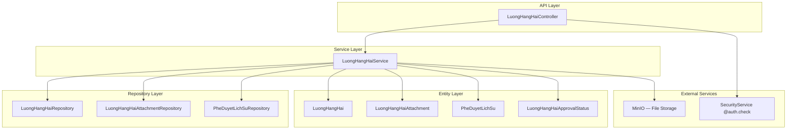
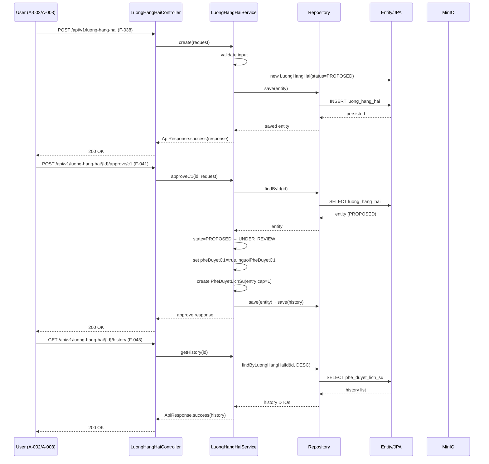
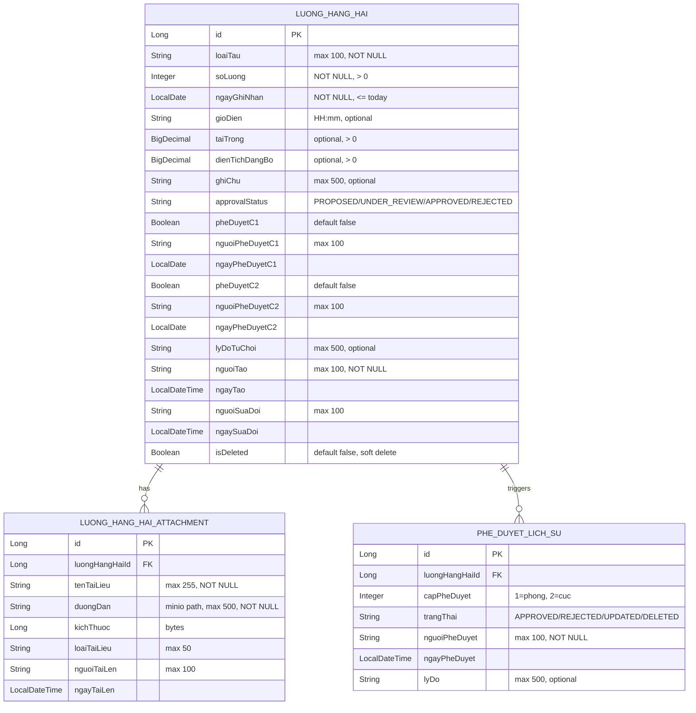
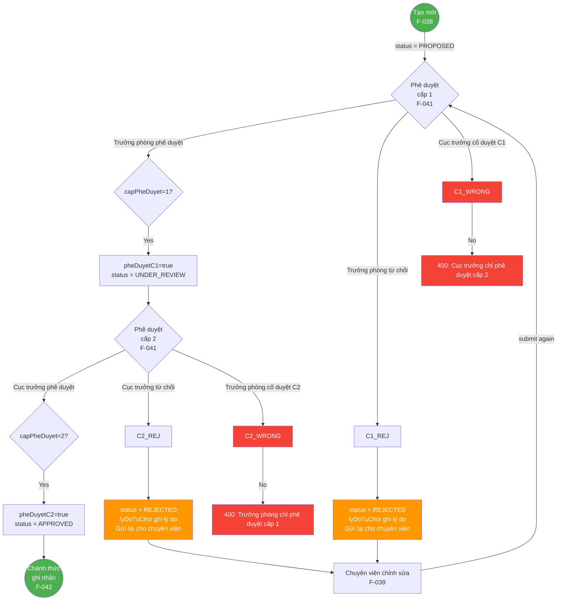
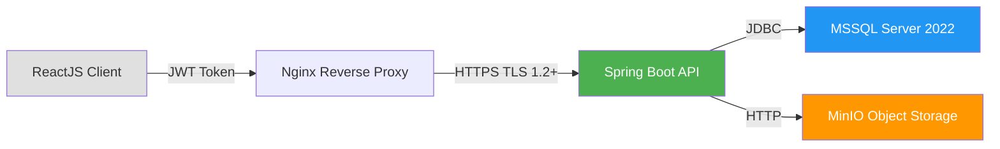

# Lean Architecture Design — Quản lý Lượng hàng hải (F-038 → F-043)

Module M-003: Quản lý tài sản KCHTGT - Khu nước & VTS
Package: `com.hanghai.kchtg.luonghanghai`
Stack: Spring Boot 17+, MSSQL Server 2022, MinIO for attachments

---

## 1. Architecture Overview

### 1.1 Component Diagram



### 1.2 Data Flow: Create → Approve → Read → History



### 1.3 Package Structure

```
com.hanghai.kchtg.luonghanghai/
├── entity/
│   ├── LuongHangHai.java            — main entity (approval state machine)
│   ├── LuongHangHaiAttachment.java  — file attachments (FK → LuongHangHai)
│   ├── PheDuyetLichSu.java          — approval history log
│   └── LuongHangHaiApprovalStatus.java — enum: PROPOSED/UNDER_REVIEW/APPROVED/REJECTED
├── repository/
│   ├── LuongHangHaiRepository.java
│   ├── LuongHangHaiAttachmentRepository.java
│   └── PheDuyetLichSuRepository.java
├── service/
│   └── LuongHangHaiService.java
├── controller/
│   └── LuongHangHaiController.java
└── dto/
    ├── LuongHangHaiCreateRequest.java
    ├── LuongHangHaiResponse.java
    ├── PheDuyetRequest.java
    ├── PheDuyetResponse.java
    ├── HistoryEntry.java
    └── LuongHangHaiAttachmentResponse.java
```

---

## 2. Entity Relationship Diagram



### 2.1 Entity Summary

| Entity | Table | Purpose |
|--------|-------|---------|
| `LuongHangHai` | `luong_hang_hai` | Core domain entity; drives the 2-tier approval state machine |
| `LuongHangHaiAttachment` | `luong_hang_hai_attachment` | File references stored in MinIO; 0..N per LuongHangHai |
| `PheDuyetLichSu` | `phe_duyet_lich_su` | Immutable audit log of every state change, approval decision, and delete |

### 2.2 Enum

**`LuongHangHaiApprovalStatus`** (mapped as `VARCHAR(30)` in DB):

| Value | Meaning |
|-------|---------|
| `PROPOSED` | Created, awaiting C1 (trưởng phòng) approval |
| `UNDER_REVIEW` | C1 approved, awaiting C2 (cục trưởng) approval |
| `APPROVED` | Both tiers complete; record is official |
| `REJECTED` | Rejected at any tier; sent back to creator |

---

## 3. API Contract Specification

### 3.1 Endpoint Summary

| # | Method | Endpoint | Feature | Permission | Description |
|---|--------|----------|---------|------------|-------------|
| 1 | POST | `/api/v1/luong-hang-hai` | F-038 | `luonghanghai:create` | Create |
| 2 | PUT | `/api/v1/luong-hang-hai/{id}` | F-039 | `luonghanghai:update` | Update |
| 3 | DELETE | `/api/v1/luong-hang-hai/{id}` | F-040 | `luonghanghai:delete` | Delete (APPROVED only) |
| 4 | POST | `/api/v1/luong-hang-hai/{id}/approve/c1` | F-041 | `luonghanghai:approve:c1` | Tier-1 approve |
| 5 | POST | `/api/v1/luong-hang-hai/{id}/approve/c2` | F-041 | `luonghanghai:approve:c2` | Tier-2 approve |
| 6 | GET | `/api/v1/luong-hang-hai/{id}` | F-042 | `luonghanghai:read` | Detail |
| 7 | GET | `/api/v1/luong-hang-hai` | F-042 | `luonghanghai:read` | List (paginated) |
| 8 | GET | `/api/v1/luong-hang-hai/history/{id}` | F-043 | `luonghanghai:history` | Approval history |
| 9 | GET | `/api/v1/luong-hang-hai/search` | F-042 | `luonghanghai:read` | Search + filter |
| 10 | GET | `/api/v1/luong-hang-hai/status/{status}` | F-042 | `luonghanghai:read` | Filter by status |

### 3.2 Endpoint Details

#### 1 — POST `/api/v1/luong-hang-hai` (F-038)

**Preconditions:** User authenticated with role Chuyên viên, has `luonghanghai:create`.

**Request body:**
```json
{
  "loaiTau": "Tàu container 5000DWT",
  "soLuong": 12,
  "ngayGhiNhan": "2026-06-29",
  "gioDien": "14:30",
  "taiTrong": 5000.00,
  "dienTichDangBo": 120.50,
  "ghiChu": "Ghi chú tùy chọn"
}
```

**Response (200):**
```json
{
  "success": true,
  "message": "Tạo Lượng hàng hải thành công — đang chờ phê duyệt",
  "data": {
    "id": 1,
    "loaiTau": "Tàu container 5000DWT",
    "soLuong": 12,
    "ngayGhiNhan": "2026-06-29",
    "gioDien": "14:30",
    "taiTrong": 5000.00,
    "dienTichDangBo": 120.50,
    "ghiChu": "Ghi chú tùy chọn",
    "approvalStatus": "PROPOSED",
    "pheDuyetC1": false,
    "pheDuyetC2": false,
    "nguoiTao": "chuyen_vien_01",
    "ngayTao": "2026-06-29T14:30:00",
    "taiLieuDinhKem": []
  },
  "timestamp": "2026-06-29T14:30:00"
}
```

**Errors:**
| Status | Condition | Response |
|--------|-----------|----------|
| 400 | Validation failed (missing required field, soLuong ≤ 0, ngayGhiNhan > today) | `ApiResponse.error("Dữ liệu không hợp lệ: [field errors]")` |
| 403 | Insufficient permission | `ApiResponse.error("Bạn không có quyền tạo")` |

#### 2 — PUT `/api/v1/luong-hang-hai/{id}` (F-039)

**Preconditions:** Record exists; status is `PROPOSED`, `UNDER_REVIEW`, or `REJECTED`.

**Request body:**
```json
{
  "loaiTau": "Tàu container 5000DWT",
  "soLuong": 15,
  "ngayGhiNhan": "2026-06-29",
  "gioDien": "15:00",
  "taiTrong": 5200.00,
  "dienTichDangBo": 125.00,
  "ghiChu": "Cập nhật số lượng"
}
```

**Response (200):**
```json
{
  "success": true,
  "message": "Cập nhật Lượng hàng hải thành công",
  "data": { /* full response object */ },
  "timestamp": "2026-06-29T15:00:00"
}
```

**Errors:**
| Status | Condition | Response |
|--------|-----------|----------|
| 400 | Validation failed | Field-level errors |
| 403 | Status is `APPROVED` — not editable directly | `ApiResponse.error("Bản ghi đã phê duyệt — cần quy trình sửa đổi")` |
| 404 | Record not found | `ApiResponse.error("Không tìm thấy bản ghi")` |

#### 3 — DELETE `/api/v1/luong-hang-hai/{id}` (F-040)

**Preconditions:** Record exists; status is `APPROVED`.

**Request body:** (none — path param only)

**Response (200):**
```json
{
  "success": true,
  "message": "Xóa Lượng hàng hải thành công",
  "data": null,
  "timestamp": "2026-06-29T16:00:00"
}
```

**Errors:**
| Status | Condition | Response |
|--------|-----------|----------|
| 400 | Status is not `APPROVED` | `ApiResponse.error("Chỉ xóa được bản ghi đã được phê duyệt")` |
| 403 | Insufficient permission | `ApiResponse.error("Bạn không có quyền xóa")` |
| 404 | Record not found or already deleted | `ApiResponse.error("Không tìm thấy bản ghi")` |

#### 4 — POST `/api/v1/luong-hang-hai/{id}/approve/c1` (F-041)

**Preconditions:** Record exists; status is `PROPOSED`. User has `luonghanghai:approve:c1`.

**Request body:**
```json
{
  "action": "APPROVE",
  "lyDo": "Đúng quy trình, đủ dữ liệu",
  "approvedBy": "truong_phong_01"
}
```

Where `action` is `"APPROVE"` or `"REJECT"`. `lyDo` is **required** when `action = "REJECT"`.

**Response (APPROVE, 200):**
```json
{
  "success": true,
  "message": "Phê duyệt cấp 1 thành công — chờ phê duyệt cấp 2",
  "data": {
    "id": 1,
    "approvalStatus": "UNDER_REVIEW",
    "pheDuyetC1": true,
    "nguoiPheDuyetC1": "truong_phong_01",
    "ngayPheDuyetC1": "2026-06-29T16:00:00"
  },
  "timestamp": "2026-06-29T16:00:00"
}
```

**Response (REJECT, 200):**
```json
{
  "success": true,
  "message": "Từ chối cấp 1 — gửi lại cho chuyên viên",
  "data": {
    "id": 1,
    "approvalStatus": "REJECTED",
    "pheDuyetC1": false,
    "lyDoTuChoi": "Dữ liệu không chính xác — vui lòng kiểm tra"
  },
  "timestamp": "2026-06-29T16:00:00"
}
```

**Errors:**
| Status | Condition | Response |
|--------|-----------|----------|
| 400 | Status is not `PROPOSED` | `ApiResponse.error("Bản ghi không ở trạng thái chờ phê duyệt cấp 1")` |
| 400 | `action` is `REJECT` but `lyDo` is blank | `ApiResponse.error("Lý do từ chối là bắt buộc")` |
| 400 | User is not a trưởng phòng | `ApiResponse.error("Trưởng phòng chỉ phê duyệt cấp 1")` |
| 403 | Insufficient permission | `ApiResponse.error("Bạn không có quyền phê duyệt cấp 1")` |
| 404 | Record not found | `ApiResponse.error("Không tìm thấy bản ghi")` |

#### 5 — POST `/api/v1/luong-hang-hai/{id}/approve/c2` (F-041)

**Preconditions:** Record exists; status is `UNDER_REVIEW`. User has `luonghanghai:approve:c2`.

**Request body:** Same as C1 approve.

**Response (APPROVE, 200):**
```json
{
  "success": true,
  "message": "Phê duyệt cấp 2 thành công — Lượng hàng hải chính thức ghi nhận",
  "data": {
    "id": 1,
    "approvalStatus": "APPROVED",
    "pheDuyetC1": true,
    "pheDuyetC2": true,
    "nguoiPheDuyetC1": "truong_phong_01",
    "nguoiPheDuyetC2": "cuc_truong_01"
  },
  "timestamp": "2026-06-29T17:00:00"
}
```

**Errors:**
| Status | Condition | Response |
|--------|-----------|----------|
| 400 | Status is not `UNDER_REVIEW` | `ApiResponse.error("Bản ghi không ở trạng thái chờ phê duyệt cấp 2")` |
| 400 | `action` is `REJECT` but `lyDo` is blank | `ApiResponse.error("Lý do từ chối là bắt buộc")` |
| 400 | User is not cục trưởng | `ApiResponse.error("Cục trưởng chỉ phê duyệt cấp 2")` |
| 403 | Insufficient permission | `ApiResponse.error("Bạn không có quyền phê duyệt cấp 2")` |
| 404 | Record not found | `ApiResponse.error("Không tìm thấy bản ghi")` |

#### 6 — GET `/api/v1/luong-hang-hai/{id}` (F-042)

**Preconditions:** Record exists, `isDeleted = false`.

**Response (200):**
```json
{
  "success": true,
  "message": "Success",
  "data": {
    "id": 1,
    "loaiTau": "Tàu container 5000DWT",
    "soLuong": 12,
    "ngayGhiNhan": "2026-06-29",
    "gioDien": "14:30",
    "taiTrong": 5000.00,
    "dienTichDangBo": 120.50,
    "ghiChu": "Ghi chú",
    "approvalStatus": "APPROVED",
    "pheDuyetC1": true,
    "pheDuyetC2": true,
    "nguoiPheDuyetC1": "truong_phong_01",
    "ngayPheDuyetC1": "2026-06-29T16:00:00",
    "nguoiPheDuyetC2": "cuc_truong_01",
    "ngayPheDuyetC2": "2026-06-29T17:00:00",
    "nguoiTao": "chuyen_vien_01",
    "ngayTao": "2026-06-29T14:30:00",
    "nguoiSuaDoi": null,
    "ngaySuaDoi": null,
    "taiLieuDinhKem": [
      {
        "id": 1,
        "tenTaiLieu": "Bien_ban_kiem_tra.pdf",
        "duongDan": "luong-hang-hai/1/bien_ban.pdf",
        "kichThuoc": 204800,
        "loaiTaiLieu": "PDF",
        "nguoiTaiLen": "chuyen_vien_01",
        "ngayTaiLen": "2026-06-29T14:35:00"
      }
    ]
  },
  "timestamp": "2026-06-29T18:00:00"
}
```

**Errors:**
| Status | Condition | Response |
|--------|-----------|----------|
| 403 | Insufficient permission | `ApiResponse.error("Bạn không có quyền xem thông tin này")` |
| 404 | Record not found or deleted | `ApiResponse.error("Không tìm thấy bản ghi")` |

#### 7 — GET `/api/v1/luong-hang-hai` (F-042)

**Query params:** `page` (default 0), `size` (default 20), optional `status` filter.

**Response (200):** Paginated `ApiResponse<List<LuongHangHaiResponse>>`.

#### 8 — GET `/api/v1/luong-hang-hai/history/{id}` (F-043)

**Response (200):**
```json
{
  "success": true,
  "message": "Success",
  "data": [
    {
      "id": 3,
      "luongHangHaiId": 1,
      "capPheDuyet": 2,
      "trangThai": "APPROVED",
      "nguoiPheDuyet": "cuc_truong_01",
      "ngayPheDuyet": "2026-06-29T17:00:00",
      "lyDo": "Phê duyệt chính thức"
    },
    {
      "id": 2,
      "luongHangHaiId": 1,
      "capPheDuyet": 1,
      "trangThai": "APPROVED",
      "nguoiPheDuyet": "truong_phong_01",
      "ngayPheDuyet": "2026-06-29T16:00:00",
      "lyDo": "Đúng quy trình, đủ dữ liệu"
    },
    {
      "id": 1,
      "luongHangHaiId": 1,
      "capPheDuyet": null,
      "trangThai": "CREATED",
      "nguoiPheDuyet": "chuyen_vien_01",
      "ngayPheDuyet": "2026-06-29T14:30:00",
      "lyDo": null
    }
  ],
  "timestamp": "2026-06-29T18:00:00"
}
```

Ordered descending by `ngayPheDuyet` (newest first).

#### 9 — GET `/api/v1/luong-hang-hai/search` (F-042)

**Query params:**
| Param | Type | Required | Description |
|-------|------|----------|-------------|
| `keyword` | String | No | Partial match on `loaiTau` |
| `status` | String | No | Exact match on `approvalStatus` |
| `ngayGhiNhanStart` | LocalDate | No | Start of date range |
| `ngayGhiNhanEnd` | LocalDate | No | End of date range |
| `page` | Integer | No | Page number (default 0) |
| `size` | Integer | No | Page size (default 20) |

**Response:** Paginated `ApiResponse<KetQuaTimKiemResponse>` with `results`, `totalElements`, `totalPages`, `currentPage`, `pageSize`.

#### 10 — GET `/api/v1/luong-hang-hai/status/{status}` (F-042)

**Path param:** `status` — one of `PROPOSED`, `UNDER_REVIEW`, `APPROVED`, `REJECTED`.

**Response:** `ApiResponse<List<LuongHangHaiResponse>>` filtered by status.

**Errors:**
| Status | Condition | Response |
|--------|-----------|----------|
| 400 | Invalid status value | `ApiResponse.error("Trạng thái không hợp lệ")` |
| 404 | No records for this status | `ApiResponse.success([])` (empty list, not 404) |

---

## 4. Approval Workflow Design

### 4.1 State Machine Flowchart



### 4.2 State Transitions Table

| Transition | From Status | To Status | Actor | Condition | Creates PheDuyetLichSu Entry |
|------------|-------------|-----------|-------|-----------|------------------------------|
| CREATE | — | `PROPOSED` | Chuyên viên | F-038 create | No (initial state) |
| APPROVE_C1 | `PROPOSED` | `UNDER_REVIEW` | Trưởng phòng | capPheDuyet=1, lyDo provided | Yes: `cap=1, status=APPROVED` |
| REJECT_C1 | `PROPOSED` | `REJECTED` | Trưởng phòng | capPheDuyet=1, lyDo mandatory | Yes: `cap=1, status=REJECTED` |
| APPROVE_C2 | `UNDER_REVIEW` | `APPROVED` | Cục trưởng | capPheDuyet=2, lyDo provided | Yes: `cap=2, status=APPROVED` |
| REJECT_C2 | `UNDER_REVIEW` | `REJECTED` | Cục trưởng | capPheDuyet=2, lyDo mandatory | Yes: `cap=2, status=REJECTED` |
| UPDATE | `PROPOSED`/`UNDER_REVIEW`/`REJECTED` | Same status | Chuyên viên | Valid data | Yes: `cap=null, status=UPDATED` |
| UPDATE_AFTER_APPROVE | `APPROVED` | `UNDER_REVIEW` | Chuyên viên | Re-submission workflow | Yes: `cap=null, status=UPDATED` |
| DELETE | `APPROVED` | — (soft) | Chuyên viên | `isDeleted=true` | Yes: `cap=null, status=DELETED` |

### 4.3 Concurrency Handling

**Problem:** Two leaders might attempt approval of the same record simultaneously.

**Solution — Optimistic Concurrency Control:**

1. **Service-level locking via state validation:** The `approveC1` and `approveC2` service methods must validate the current status atomically:
   - `approveC1`: throws if `status != PROPOSED`
   - `approveC2`: throws if `status != UNDER_REVIEW`

2. **@Transactional isolation:** Each approval call is wrapped in `@Transactional` with `READ_COMMITTED` isolation. The status check and update are within the same transaction.

3. **Optional @Version field on LuongHangHai:** Add `@Version private Long version;` to enable JPA optimistic locking. If two transactions try to update simultaneously, the second will throw `OptimisticLockException`, which the service catches and returns as a 409 Conflict.

```
Service method outline (approveC1):
  @Transactional
  public PheDuyetResponse approveC1(Long id, PheDuyetRequest request) {
      LuongHangHai entity = repo.findByIdOrThrow(id);

      // Guard: only PROPOSED can enter C1 approval
      if (entity.getStatus() != LuongHangHaiApprovalStatus.PROPOSED) {
          throw new IllegalStateException("Bản ghi không ở trạng thái chờ phê duyệt cấp 1");
      }

      // Guard: reject mismatched tier
      if (!isTruongPhong(request.getApprovedBy())) {
          throw new AccessDeniedException("Trưởng phòng chỉ phê duyệt cấp 1");
      }

      // Update state
      entity.setPheDuyetC1(true);
      entity.setNguoiPheDuyetC1(request.getApprovedBy());
      entity.setApprovalStatus(LuongHangHaiApprovalStatus.UNDER_REVIEW);
      repo.save(entity);

      // Create history entry
      PheDuyetLichSu history = PheDuyetLichSu.builder()
          .luongHangHaiId(id)
          .capPheDuyet(1)
          .trangThai(request.getAction())
          .nguoiPheDuyet(request.getApprovedBy())
          .ngayPheDuyet(LocalDateTime.now())
          .lyDo(request.getLyDo())
          .build();
      historyRepo.save(history);
  }
```

---

## 5. Security Design

### 5.1 @PreAuthorize Annotations per Endpoint

| Endpoint | Annotation | Rationale |
|----------|-----------|-----------|
| `POST /luong-hang-hai` | `@PreAuthorize("@auth.check(authentication, 'luonghanghai:create')")` | F-038: create restricted to Chuyên viên + Admin |
| `PUT /luong-hang-hai/{id}` | `@PreAuthorize("@auth.check(authentication, 'luonghanghai:update')")` | F-039: update restricted to Chuyên viên + Admin |
| `DELETE /luong-hang-hai/{id}` | `@PreAuthorize("@auth.check(authentication, 'luonghanghai:delete')")` | F-040: delete restricted to Chuyên viên + Admin |
| `POST /luong-hang-hai/{id}/approve/c1` | `@PreAuthorize("@auth.check(authentication, 'luonghanghai:approve:c1')")` | F-041: C1 approval restricted to Trưởng phòng |
| `POST /luong-hang-hai/{id}/approve/c2` | `@PreAuthorize("@auth.check(authentication, 'luonghanghai:approve:c2')")` | F-041: C2 approval restricted to Cục trưởng |
| `GET /luong-hang-hai` | `@PreAuthorize("@auth.check(authentication, 'luonghanghai:read')")` | F-042: read accessible to all authenticated roles |
| `GET /luong-hang-hai/{id}` | `@PreAuthorize("@auth.check(authentication, 'luonghanghai:read')")` | F-042: detail accessible to all authenticated roles |
| `GET /luong-hang-hai/history/{id}` | `@PreAuthorize("@auth.check(authentication, 'luonghanghai:history')")` | F-043: history accessible to Chuyên viên + Admin |
| `GET /luong-hang-hai/search` | `@PreAuthorize("@auth.check(authentication, 'luonghanghai:read')")` | F-042: search follows read permission |
| `GET /luong-hang-hai/status/{status}` | `@PreAuthorize("@auth.check(authentication, 'luonghanghai:read')")` | F-042: status filter follows read permission |

### 5.2 RBAC Mapping

| Role | Permissions | Actor ID |
|------|------------|----------|
| Chuyên viên | `luonghanghai:create`, `luonghanghai:update`, `luonghanghai:delete`, `luonghanghai:read`, `luonghanghai:history` | A-003 |
| Trưởng phòng | `luonghanghai:approve:c1`, `luonghanghai:read` | A-002 |
| Cục trưởng | `luonghanghai:approve:c2`, `luonghanghai:read` | A-002 |
| Admin | `luonghanghai:*` (all CRUD + approve) | A-001 |
| Cảng user | `luonghanghai:read` | A-004 |

### 5.3 Data Access Validation

- **Soft delete filter:** All read queries must add `WHERE isDeleted = false` — use `JpaSpecificationExecutor` or custom JPQL to enforce.
- **State-enforced operations:** DELETE only allowed when `status = APPROVED`; UPDATE only when `status IN (PROPOSED, UNDER_REVIEW, REJECTED)`. These checks are in the service layer, not just the controller.
- **Ownership check:** No ownership restriction on read (any authenticated user can view), but create/update/delete operations are role-gated.

---

## 6. Data Architecture

### 6.1 Storage Model

| Entity | Table | Primary Key | Storage Engine Notes |
|--------|-------|-------------|---------------------|
| `LuongHangHai` | `luong_hang_hai` | `id BIGINT IDENTITY` | Indexed on `approvalStatus`, `ngayGhiNhan`, `loaiTau` |
| `LuongHangHaiAttachment` | `luong_hang_hai_attachment` | `id BIGINT IDENTITY` | FK → `luong_hang_hai(id) ON DELETE CASCADE`; index on `luongHangHaiId` |
| `PheDuyetLichSu` | `phe_duyet_lich_su` | `id BIGINT IDENTITY` | FK → `luong_hang_hai(id) ON DELETE CASCADE`; index on `luongHangHaiId` |

### 6.2 Index Strategy

```sql
-- Support F-042 search + status filter
CREATE INDEX idx_lhh_status ON luong_hang_hai(approvalStatus, isDeleted);

-- Support F-042 search + date range
CREATE INDEX idx_lhh_ngay ON luong_hang_hai(ngayGhiNhan);

-- Support F-042 keyword search
CREATE INDEX idx_lhh_loaitau ON luong_hang_hai(loaiTau);

-- Support F-043 history lookup (descending order)
CREATE INDEX idx_pdl_lhh ON phe_duyet_lich_su(luongHangHaiId, ngayPheDuyet DESC);
```

### 6.3 Consistency Model

- **Intra-record consistency:** JPA `@Transactional` ensures the status change + history entry + timestamp update are atomic.
- **Cross-entity consistency:** `LuongHangHaiAttachment` uses `cascade = CascadeType.ALL` with `orphanRemoval = true`, matching the vanban pattern. Deletion of `LuongHangHai` cascades to its attachments.
- **MinIO consistency:** Attachment files are stored in MinIO; the database holds only the path reference. If MinIO is unreachable, the API still serves metadata but attachment download endpoints fail. The design does not implement retry — MinIO is a best-effort dependency.

---

## 7. Security Architecture

### 7.1 Trust Boundaries



- **Client → Spring:** JWT-based auth (NFR-SEC-01), validated by Spring Security filter chain before reaching `@PreAuthorize` (NFR-SEC-02).
- **Spring → MSSQL:** Parameterized JPA queries prevent SQL injection (NFR-SEC-05). Connection uses TLS if configured.
- **Spring → MinIO:** Internal service-to-service call; credentials stored in application properties. No external exposure.

### 7.2 PII / Secrets Handling

- `nguoiTao`, `nguoiSuaDoi`, `nguoiPheDuyetC1`, `nguoiPheDuyetC2` store usernames — PII. These are logged in `PheDuyetLichSu` but not exposed in search results unless the record itself is accessed.
- MinIO credentials and JDBC connection strings are stored in Spring `application.yml` (not committed); managed via environment variables or secret manager in production.

### 7.3 Audit

Every write operation creates a `PheDuyetLichSu` entry (CREATE, UPDATED, APPROVED, REJECTED, DELETED). These are queryable via F-043 history endpoint. Additionally, SLF4J `log.info()` calls in service methods provide structured application logs.

---

## 8. NFR Assessment

### 8.1 Security

| ID | Requirement | Design Response |
|----|-------------|-----------------|
| NFR-SEC-01 | JWT-based auth | Reuse existing Spring Security filter; `@PreAuthorize` per endpoint |
| NFR-SEC-02 | Role-based access control | RBAC matrix in §5.2 — 5 permission granules |
| NFR-SEC-03 | TLS 1.2+ in transit | Nginx terminates TLS; internal service calls are HTTP |
| NFR-SEC-04 | Audit trail for CRUD | `PheDuyetLichSu` captures every state change with actor, timestamp, reason |
| NFR-SEC-05 | SQL injection prevention | Spring Data JPA parameterized queries — no raw SQL concatenation |

### 8.2 Reliability

| ID | Requirement | Design Response |
|----|-------------|-----------------|
| NFR-REL-01 | ≤ 4 hours downtime/year | Standard Spring Boot deployment; no single-point-of-failure in this module |
| NFR-REL-02 | Daily DB backup, 30-day retention | MSSQL native backup; external to this module's scope |
| NFR-REL-03 | Soft delete for recovery | `isDeleted` flag + `PheDuyetLichSu` DELETED entry |
| NFR-REL-04 | Transaction integrity | All write methods use `@Transactional` — status change + history entry are atomic |
| NFR-REL-05 | Concurrency safety | Optimistic concurrency (`@Version`) + state validation guard |

### 8.3 Performance

| ID | Requirement | Design Response |
|----|-------------|-----------------|
| NFR-PERF-01 | Create API ≤ 2s | Single INSERT + one history INSERT — both indexed, well under 2s |
| NFR-PERF-02 | List with pagination ≤ 3s (≤10,000 records) | `Pageable` + composite index on `(approvalStatus, ngayGhiNhan)` |
| NFR-PERF-03 | Detail API ≤ 1s | Single SELECT + lazy-loaded attachment list |
| NFR-PERF-04 | Support 50 concurrent users | Spring Boot connection pooling; MSSQL handles 50 connections easily |

### 8.4 Maintainability

| ID | Requirement | Design Response |
|----|-------------|-----------------|
| NFR-MAINT-01 | ≥ 70% test coverage | Separate concern for QA stage |
| NFR-MAINT-02 | Javadoc for service + controller | Follow Javadoc convention from vanban module |
| NFR-MAINT-03 | API versioning via `/api/v1/` | All endpoints prefixed with `/api/v1/` |
| NFR-MAINT-04 | SLF4J structured logging | `@Slf4j` on service; structured key-value log entries |

### 8.5 5 Design Ambiguities

| ID | Ambiguity | Impact | Options | Recommendation |
|----|-----------|--------|---------|----------------|
| AMBIG-D-001 | Trưởng phòng vs Cục trưởng distinction — same actor ID (A-002) in BA spec | **High** | A: Use role hierarchy (`ROLE_TRUONG_PHONG` vs `ROLE_CUC_TRUONG`). B: Add `capPheDuyet` field in Actor table. C: Use department/organization group. | **A — role hierarchy.** Standard Spring Security `@PreAuthorize` maps to roles; no schema change. The `approvedBy` field in PheDuyetLichSu can carry the username for audit. |
| AMBIG-D-002 | `gioDien` — user-entered or auto-populated from `ngayGhiNhan`? | **Low** | A: User enters manually. B: Auto-set to `ngayGhiNhan`'s time-of-day. C: Auto-set to server timestamp at create. | **A — user-entered.** The BA spec lists it as a form field for F-038. Keep as optional String (`HH:mm`). |
| AMBIG-D-003 | Max attachment file size in MinIO? | **Low** | A: 10 MB. B: 50 MB. C: No limit (minio-configured). | **No change needed** — enforce at upload layer (Separate controller for MinIO upload). This module only stores the path reference. |
| AMBIG-D-004 | Soft-delete retention — how long before physical purge? | **Low** | A: 90 days. B: 1 year. C: Never purge, manual review. | **A — 90 days default, configurable.** Implement as a scheduled cron job in a separate `utility-data-governance` concern. |
| AMBIG-D-005 | Notifications (email/SMS) on approval/rejection? | **Medium** | A: Include notification in F-041 scope. B: Out of scope, deferred. C: Async event-driven notification. | **B — out of scope per BA spec.** The BA spec explicitly says "Tự động gửi thông báo qua SMS/email" is out of scope. Design a `@EventListener` on `ApprovalEvent` so notifications can be added later without code changes. |

---

## 9. NFR Architecture — Decision Matrix

| NFR Ref | Solution | Target | Trade-off |
|---------|----------|--------|-----------|
| NFR-PERF-02 | Composite index `(approvalStatus, ngayGhiNhan)` | ≤ 3s at 10K rows | Adds ~2 KB per row to index; marginal storage cost |
| NFR-REL-05 | `@Version` optimistic lock | Prevent concurrent approval collisions | Adds 1 column; `OptimisticLockException` → 409 Conflict UI |
| NFR-SEC-04 | `PheDuyetLichSu` audit log | Complete state-change history | Increases writes by 1 row per operation; negligible impact |
| NFR-MAINT-04 | SLF4J + `@Slf4j` | Structured logging | Minimal overhead; enables downstream log aggregation |

---

## 10. Key Decisions

| Decision | Chosen | Rejected | Rationale |
|----------|--------|----------|-----------|
| Package naming | `com.hanghai.kchtg.luonghanghai` (no hyphens) | `com.hanghai.kchtg.luong-hang-hai` | Java package naming convention forbids hyphens |
| Attachment entity name | `LuongHangHaiAttachment` | `TaiLieuDinhKem` | Avoids collision with existing `VanBanPhapLy.taiLieuDinhKem` collection |
| Enum name | `LuongHangHaiApprovalStatus` | `TrangThaiPheDuyet` | Domain-specific, scoped to this module; clear semantic meaning |
| Approval tier enforcement | `@PreAuthorize` + service-level guard (capPheDuyet) | Role-only enforcement | Prevents accidental wrong-tier approval even if roles overlap |
| Delete strategy | Soft delete (`isDeleted`) | Hard delete | Preserves audit trail in `PheDuyetLichSu`; aligns with NFR-REL-03 |
| Attachment storage | MinIO path reference in DB | Base64 in DB column | Scalable for large files; follows infrastructure pattern |
| Search implementation | JPQL `@Query` with optional parameters | Full-text search (FTS) | FTS not yet available in MSSQL on this stack; JPQL covers required filters |
| Timestamp management | `@PrePersist` / `@PreUpdate` callbacks (vanban pattern) | Spring Data `@CreatedDate` / `@LastModifiedDate` | Matches existing vanban entity pattern; full control over `nguoiTao`/`nguoiSuaDoi` |

---

## 11. Integration with Existing Architecture

```mermaid
graph LR
    EXISTING[VanBanPhapLy Module<br/>com.hanghai.kchtg.vanban]
    NEW[LuongHangHai Module<br/>com.hanghai.kchtg.luonghanghai]
    COMMON[Common DTO<br/>com.hanghai.kchtg.common]
    SECURITY[SecurityService<br/>@auth.check]

    NEW --> COMMON
    NEW --> SECURITY
    EXISTING --> COMMON
    EXISTING --> SECURITY
```

- **Shared `ApiResponse<T>`**: Both modules use the same common response wrapper from `com.hanghai.kchtg.common.dto.ApiResponse`.
- **Shared security filter**: Both modules share the same Spring Security configuration; `@PreAuthorize("@auth.check(...)")` is consistent across the project.
- **No cross-module dependencies**: `luonghanghai` module has no dependency on `vanban`. The `luonghanghai` package is standalone.
- **Entity naming collision avoided**: `LuongHangHaiAttachment` replaces `TaiLieuDinhKem` to avoid conflict with `VanBanPhapLy.taiLieuDinhKem` collection field.

---

## 12. Migration / Compatibility Notes

- **New tables**: `luong_hang_hai`, `luong_hang_hai_attachment`, `phe_duyet_lich_su` — Spring Boot `ddl-auto=update` or Flyway migration needed.
- **No schema changes to existing tables**: This design does not modify any existing entity or table.
- **No breaking changes to existing API contracts**: New endpoints are under `/api/v1/luong-hang-hai` — a fresh path.
- **Backward compatible**: No existing module is referenced or updated.

---

## 13. Handoff Guidance

### To Engineering Technical Lead
1. Scaffold package `com.hanghai.kchtg.luonghanghai` with sub-packages: `entity`, `repository`, `service`, `controller`, `dto`.
2. Implement entities per §2 with JPA annotations matching vanban pattern (`@Entity`, `@Table`, `@Data`, `@NoArgsConstructor`, `@AllArgsConstructor`, `@Builder`, `@PrePersist`, `@PreUpdate`).
3. Implement repository interfaces extending `JpaRepository` with JPQL search methods per §3.9.
4. Implement service with `@Transactional` methods for all CRUD + approval operations.
5. Implement controller with `@PreAuthorize` annotations per §5.1.
6. Register in `implementations.yaml` under `packages`.

### To Engineering Backend Developer
- Follow the vanban entity pattern exactly (package naming, annotations, Lombok, JPA strategy).
- Use `BigDecimal` for `taiTrong` and `dienTichDangBo` (not `Double`) for financial precision.
- Use `LocalDate` for `ngayGhiNhan`; `LocalDateTime` for all timestamps.
- Validation: `@NotBlank`, `@NotNull`, `@Positive`, `@Max` on DTO fields.
- All write methods must be `@Transactional`.
- All history entries must be created within the same transaction as the entity update.

### To Engineering QA Engineer
- Test all state transitions in §4.2 including boundary conditions.
- Test concurrent approval attempts (two leaders, same record) — expect 409 or last-write-wins.
- Test permission enforcement: chuyên viên cannot approve, trưởng phòng cannot approve C2, etc.
- Test soft delete: `isDeleted` records excluded from list/detail/search, visible in deleted records query.
- Test validation: `soLuong ≤ 0`, `ngayGhiNhan > today`, missing required fields.

### To Engineering Code Reviewer
- Verify no `TaiLieuDinhKem` entity exists in `luonghanghai` package (collision check).
- Verify package name is `com.hanghai.kchtg.luonghanghai` (no hyphens).
- Verify `@PreAuthorize` annotations match the RBAC matrix in §5.2.
- Verify all write operations are `@Transactional`.
- Verify `PheDuyetLichSu` entries are created within the same transaction as entity updates.
- Verify enum values match `LuongHangHaiApprovalStatus` (not `TrangThaiPheDuyet`).

---

## 14. Summary

### 14.1 Key Findings

1. **New domain**: 3 entities (`LuongHangHai`, `LuongHangHaiAttachment`, `PheDuyetLichSu`) + 1 enum (`LuongHangHaiApprovalStatus`) in new package `com.hanghai.kchtg.luonghanghai`.
2. **2-tier approval state machine**: `PROPOSED → UNDER_REVIEW → APPROVED` with rejection paths; enforced by `@PreAuthorize` + service-level tier guards.
3. **Soft delete**: `isDeleted` flag preserves audit trail; only `APPROVED` records can be deleted.
4. **Attachment storage**: MinIO path references in `LuongHangHaiAttachment` (avoiding collision with `VanBanPhapLy.taiLieuDinhKem`).
5. **Pattern reuse**: Entity, repository, service, controller, and DTO structure follow the `vanban` module pattern exactly.
6. **No cross-module dependencies**: Standalone module with no changes to existing schemas.

### 14.2 Artifacts Produced

- `docs/modules/M-003-quan-ly-tai-san-kchtgt-khu-nuoc-vts/sa/00-lean-architecture.md` — Lean architecture design (this file)

### 14.3 Specialist Recommendations

| Specialist | Trigger | Justification |
|-----------|---------|---------------|
| `utility-security-auditor` | New auth/authz boundary | `@PreAuthorize` annotations on 10 endpoints with 5 permission granules; tier-locked approval |
| `utility-data-governance-auditor` | Audit retention policy | Soft delete + PheDuyetLichSu require retention policy (AMBIG-D-004) |
| `utility-sre-observability-auditor` | New external integration (MinIO) | Attachment downloads are best-effort; failure path needs monitoring |
