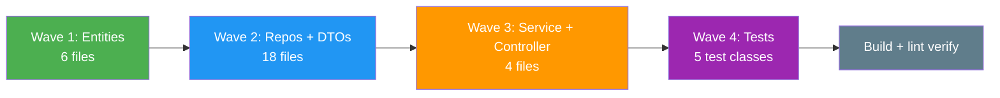
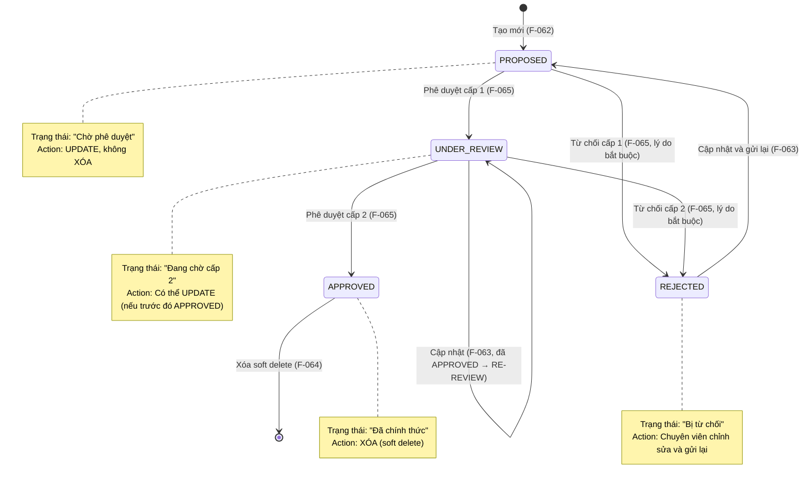

# Technical Implementation Plan — Trạm radar (F-056 → F-061) & Hệ thống VTS (F-062 → F-067)

## 1. Change Overview

This plan covers the technical implementation of 12 features within Module M-003 (Quản lý tài sản KCHTGT - Khu nước & VTS) for two feature groups: **Trạm radar** (F-056 → F-061) and **Hệ thống VTS** (F-062 → F-067). Both groups share the same 2-tier approval pattern (C1: Trưởng phòng → C2: Cục trưởng) as prior groups.

| Feature ID | Name | Priority | Owner Type |
|------------|------|----------|------------|
| F-056 | Tạo mới Trạm radar | P0 | engineering-backend-developer |
| F-057 | Cập nhật Trạm radar | P0 | engineering-backend-developer |
| F-058 | Xóa Trạm radar | P1 | engineering-backend-developer |
| F-059 | Phê duyệt Trạm radar | P0 | engineering-backend-developer |
| F-060 | Xem chi tiết Trạm radar | P0 | engineering-backend-developer |
| F-061 | Lịch sử Trạm radar | P1 | engineering-backend-developer |
| F-062 | Tạo mới Hệ thống VTS | P0 | engineering-backend-developer |
| F-063 | Cập nhật Hệ thống VTS | P0 | engineering-backend-developer |
| F-064 | Xóa Hệ thống VTS | P1 | engineering-backend-developer |
| F-065 | Phê duyệt Hệ thống VTS | P0 | engineering-backend-developer |
| F-066 | Xem chi tiết Hệ thống VTS | P0 | engineering-backend-developer |
| F-067 | Lịch sử Hệ thống VTS | P1 | engineering-backend-developer |

**Stack:** Spring Boot 17+, MSSQL Server 2022, MinIO (attachment storage), ReactJS frontend.
**Pattern:** Exact clone of `vanban` / `luonghanghai` / `deke` / `cosuachua` module (entity → repository → service → controller → DTO).

---

## 2. Requirement-to-Execution Mapping

### 2.1 Trạm radar (F-056 → F-061)

| BA Business Rule | Implementation Location | Feature |
|------------------|------------------------|---------|
| BR-056-01: Trạm radar phải được phê duyệt trước khi chính thức | `TramRadarService.create()` sets status=`PROPOSED` | F-056 |
| BR-056-02: Bản ghi mới → `PROPOSED` | Entity builder defaults `trangThai` | F-056 |
| BR-056-03: `tenTram` required, max 255 | DTO `@NotBlank @Size(max=255)` validation | F-056 |
| BR-056-04: `viTri` required, max 500 | DTO `@NotBlank @Size(max=500)` validation | F-056 |
| BR-056-05: `kinhDo` optional, [-180, 180] | Nullable, `@DecimalMin("-180") @DecimalMax("180")` | F-056 |
| BR-056-06: `viDo` optional, [-90, 90] | Nullable, `@DecimalMin("-90") @DecimalMax("90")` | F-056 |
| BR-056-09: `dienTichPhaXa` optional, positive | `@Positive` if present | F-056 |
| BR-057-01: Update requires re-approval | Service checks status != `APPROVED` before update | F-057 |
| BR-057-02: Only `PROPOSED`/`UNDER_REVIEW`/`REJECTED` editable | Status guard in `update()` method | F-057 |
| BR-057-04: Every change → `PheDuyetLichSu` (UPDATED) | History entry created in same `@Transactional` block | F-057 |
| BR-058-01: Delete only for `APPROVED` records | Status guard in `delete()` method | F-058 |
| BR-058-02: Soft delete with `isDeleted` flag | `isDeleted` column, `@Column(defaultValue="false")` | F-058 |
| BR-058-03: Delete action → `PheDuyetLichSu` (DELETED) | History entry with status=DELETED | F-058 |
| BR-059-01: 2-tier approval (phong → cuc) | `approveC1()` + `approveC2()` separate endpoints | F-059 |
| BR-059-02: Reject C1 → REJECTED, resubmit allowed | `trangThai = REJECTED`, user can update | F-059 |
| BR-059-04: Reject reason required | `PheDuyetRequest.lyDo` `@NotBlank` when REJECTED | F-059 |
| BR-059-05: Approval timestamps recorded | `ngayPheDuyetC1`/`ngayPheDuyetC2` auto-set | F-059 |
| BR-059-06: Complete 2 tiers → `APPROVED` | `pheDuyetC2=true`, `trangThai=APPROVED` | F-059 |
| BR-059-09: State transitions | `PROPOSED→UNDER_REVIEW→APPROVED`, `REJECTED→PROPOSED` | F-059 |
| BR-059-10: Every decision → `PheDuyetLichSu` | History entry per approve/reject call | F-059 |
| BR-060-01: All roles can read | `@PreAuthorize("@auth.check(..., 'tramradar:read')")` | F-060 |
| BR-060-03: Soft-deleted excluded from list | Repository JPQL adds `WHERE isDeleted = false` | F-060 |
| BR-060-04: Filter by approval status | `GET /tram-radar/status-phe-duyet/{trangThai}` | F-060 |
| BR-060-05: Search by name, location, type | `GET /tram-radar/search` keyword-based + filters | F-060 |
| BR-061-01: History tracks all changes | `PheDuyetLichSu` stores all transitions | F-061 |
| BR-061-02: History ordered DESC by date | `ORDER BY ngayPheDuyet DESC` in `@Query` | F-061 |

### 2.2 Hệ thống VTS (F-062 → F-067)

| BA Business Rule | Implementation Location | Feature |
|------------------|------------------------|---------|
| BR-062-01: Hệ thống VTS phải được phê duyệt trước | `HeThongVTSDataService.create()` sets status=`PROPOSED` | F-062 |
| BR-062-02: Bản ghi mới → `PROPOSED` | Entity builder defaults `trangThai` | F-062 |
| BR-062-03: `tenHeThong` required, max 255 | DTO `@NotBlank @Size(max=255)` validation | F-062 |
| BR-062-04: `viTri` required, max 500 | DTO `@NotBlank @Size(max=500)` validation | F-062 |
| BR-063-01: Update requires re-approval | Service checks status != `APPROVED` before update | F-063 |
| BR-063-02: Only `PROPOSED`/`UNDER_REVIEW`/`REJECTED` editable | Status guard in `update()` method | F-063 |
| BR-063-04: Every change → `PheDuyetLichSu` (UPDATED) | History entry created in same `@Transactional` block | F-063 |
| BR-064-01: Delete only for `APPROVED` records | Status guard in `delete()` method | F-064 |
| BR-064-02: Soft delete with `isDeleted` flag | `isDeleted` column, `@Column(defaultValue="false")` | F-064 |
| BR-064-03: Delete action → `PheDuyetLichSu` (DELETED) | History entry with status=DELETED | F-064 |
| BR-065-01: 2-tier approval (phong → cuc) | `approveC1()` + `approveC2()` separate endpoints | F-065 |
| BR-065-02: Reject C1/C2 → REJECTED, resubmit allowed | `trangThai = REJECTED`, user can update | F-065 |
| BR-065-04: Reject reason required | `PheDuyetRequest.lyDo` `@NotBlank` when REJECTED | F-065 |
| BR-065-09: State transitions | `PROPOSED→UNDER_REVIEW→APPROVED`, `REJECTED→PROPOSED` | F-065 |
| BR-065-10: Every decision → `PheDuyetLichSu` | History entry per approve/reject call | F-065 |
| BR-066-01: All roles can read | `@PreAuthorize("@auth.check(..., 'vts:read')")` | F-066 |
| BR-066-03: Soft-deleted excluded from list | Repository JPQL adds `WHERE isDeleted = false` | F-066 |
| BR-066-04: Filter by approval status | `GET /he-thong-vts/status-phe-duyet/{trangThai}` | F-066 |
| BR-066-05: Search by name, location, status | `GET /he-thong-vts/search` keyword-based + filters | F-066 |
| BR-067-01: History tracks all changes | `PheDuyetLichSu` stores all transitions | F-067 |
| BR-067-02: History ordered DESC by date | `ORDER BY ngayPheDuyet DESC` in `@Query` | F-067 |

---

## 3. Implementation Scope

### 3.1 Physical Files (30 total)

#### Trạm radar (F-056 → F-061) — 15 files

| # | Package Path | Type | Features |
|---|-------------|------|----------|
| 1 | `entity/TramRadar.java` | Entity | F-056 → F-061 |
| 2 | `entity/TramRadarAttachment.java` | Entity | F-056, F-060 |
| 3 | `entity/PheDuyetLichSu.java` | Entity | F-059, F-061 |
| 4 | `entity/TrangThaiPheDuyet.java` | Enum | F-056 → F-061 |
| 5 | `repository/TramRadarRepository.java` | Repository | F-056 → F-061 |
| 6 | `repository/TramRadarAttachmentRepository.java` | Repository | F-056, F-060 |
| 7 | `repository/PheDuyetLichSuRepository.java` | Repository | F-059, F-061 |
| 8 | `service/TramRadarService.java` | Service | F-056 → F-061 |
| 9 | `controller/TramRadarController.java` | Controller | F-056 → F-061 |
| 10 | `dto/TramRadarCreateRequest.java` | DTO (Create) | F-056, F-057 |
| 11 | `dto/TramRadarUpdateRequest.java` | DTO (Update) | F-057 |
| 12 | `dto/TramRadarResponse.java` | DTO (Response) | F-056 → F-061 |
| 13 | `dto/PheDuyetRequest.java` | DTO (Approval) | F-059 |
| 14 | `dto/PheDuyetResponse.java` | DTO (Approval) | F-059 |
| 15 | `dto/HistoryEntry.java` | DTO (History) | F-061 |
| 16 | `dto/KetQuaTimKiemResponse.java` | DTO (Search) | F-060 |
| 17 | `dto/TramRadarAttachmentResponse.java` | DTO (Attachment) | F-056, F-060 |

#### Hệ thống VTS (F-062 → F-067) — 15 files

| # | Package Path | Type | Features |
|---|-------------|------|----------|
| 18 | `entity/HeThongVTS.java` | Entity | F-062 → F-067 |
| 19 | `entity/HeThongVTSAttachment.java` | Entity | F-062, F-066 |
| 20 | `entity/PheDuyetLichSu.java` | Entity | F-065, F-067 |
| 21 | `entity/TrangThaiPheDuyet.java` | Enum | F-062 → F-067 |
| 22 | `repository/HeThongVTSRepository.java` | Repository | F-062 → F-067 |
| 23 | `repository/HeThongVTSAttachmentRepository.java` | Repository | F-062, F-066 |
| 24 | `repository/PheDuyetLichSuRepository.java` | Repository | F-065, F-067 |
| 25 | `service/HeThongVTSDataService.java` | Service | F-062 → F-067 |
| 26 | `controller/HeThongVTSController.java` | Controller | F-062 → F-067 |
| 27 | `dto/HeThongVTSCreateRequest.java` | DTO (Create) | F-062, F-063 |
| 28 | `dto/HeThongVTSUpdateRequest.java` | DTO (Update) | F-063 |
| 29 | `dto/HeThongVTSResponse.java` | DTO (Response) | F-062 → F-067 |
| 30 | `dto/PheDuyetRequest.java` | DTO (Approval) | F-065 |
| 31 | `dto/PheDuyetResponse.java` | DTO (Approval) | F-065 |
| 32 | `dto/HistoryEntry.java` | DTO (History) | F-067 |
| 33 | `dto/KetQuaTimKiemResponse.java` | DTO (Search) | F-066 |
| 34 | `dto/HeThongVTSAttachmentResponse.java` | DTO (Attachment) | F-062, F-066 |

> **Note:** `PheDuyetLichSu`, `TrangThaiPheDuyet`, `PheDuyetRequest`, `PheDuyetResponse`, `HistoryEntry`, `KetQuaTimKiemResponse`, `ApiResponse<T>` are shared DTOs — copy-pasted into each package with the same structure (field names identical across both packages).

### 3.2 Package Structure

#### Trạm radar package

```
src/main/java/com/hanghai/kchtg/tramradar/
  entity/
    TramRadar.java                  - core entity (approval state machine, 20+ fields)
    TramRadarAttachment.java        - file attachments (FK -> TramRadar)
    PheDuyetLichSu.java             - approval history log (reuse)
    TrangThaiPheDuyet.java          - enum: PROPOSED/UNDER_REVIEW/APPROVED/REJECTED
  repository/
    TramRadarRepository.java
    TramRadarAttachmentRepository.java
    PheDuyetLichSuRepository.java
  service/
    TramRadarService.java
  controller/
    TramRadarController.java
  dto/
    TramRadarCreateRequest.java
    TramRadarUpdateRequest.java
    TramRadarResponse.java
    TramRadarAttachmentResponse.java
    PheDuyetRequest.java
    PheDuyetResponse.java
    HistoryEntry.java
    KetQuaTimKiemResponse.java
```

#### Hệ thống VTS package

```
src/main/java/com/hanghai/kchtg/vts/
  entity/
    HeThongVTS.java                 - core entity (approval state machine, 18+ fields)
    HeThongVTSAttachment.java       - file attachments (FK -> HeThongVTS)
    PheDuyetLichSu.java             - approval history log (reuse)
    TrangThaiPheDuyet.java          - enum: PROPOSED/UNDER_REVIEW/APPROVED/REJECTED
  repository/
    HeThongVTSRepository.java
    HeThongVTSAttachmentRepository.java
    PheDuyetLichSuRepository.java
  service/
    HeThongVTSDataService.java      - naming: DataService to avoid Spring VTS conflict
  controller/
    HeThongVTSController.java
  dto/
    HeThongVTSCreateRequest.java
    HeThongVTSUpdateRequest.java
    HeThongVTSResponse.java
    HeThongVTSAttachmentResponse.java
    PheDuyetRequest.java
    PheDuyetResponse.java
    HistoryEntry.java
    KetQuaTimKiemResponse.java
```

---

## 4. Entity Field Specifications

### 4.1 Trạm radar Entities

#### 4.1.1 TramRadar Entity

**Package:** `com.hanghai.kchtg.tramradar.entity`
**Table:** `tram_radar`

| Field | Java Type | Column | Nullable | Length | Constraints | Notes |
|-------|-----------|--------|----------|--------|-------------|-------|
| `id` | `Long` | `id` | No | - | PK, IDENTITY | `@Id @GeneratedValue(strategy=GenerationType.IDENTITY)` |
| `tenTram` | `String` | `ten_tram` | No | 255 | NOT NULL | Station name |
| `viTri` | `String` | `vi_tri` | No | 500 | NOT NULL | Location |
| `kinhDo` | `BigDecimal` | `kinh_do` | Yes | - | [-180, 180], DECIMAL(10,6) | Longitude |
| `viDo` | `BigDecimal` | `vi_do` | Yes | - | [-90, 90], DECIMAL(10,6) | Latitude |
| `loaiTram` | `String` | `loai_tram` | Yes | 100 | - | Station type |
| `coTrinh` | `String` | `co_trinh` | Yes | 100 | - | Surveillance capability |
| `dienTichPhaXa` | `BigDecimal` | `dien_tich_pha_xa` | Yes | - | > 0, DECIMAL(10,2) | Radiation area (km²) |
| `nguonGoc` | `String` | `nguon_goc` | Yes | 255 | - | Origin |
| `tinhTrang` | `String` | `tinh_trang` | Yes | 50 | - | Condition |
| `trangThai` | `TrangThaiPheDuyet` | `trang_thai` | No | 30 | EnumType.STRING | Approval state |
| `pheDuyetC1` | `Boolean` | `phe_duyet_c1` | No | - | Default: false | Tier-1 approval flag |
| `nguoiPheDuyetC1` | `String` | `nguoi_phe_duyet_c1` | Yes | 100 | - | Tier-1 approver username |
| `ngayPheDuyetC1` | `LocalDateTime` | `ngay_phe_duyet_c1` | Yes | - | - | Tier-1 approval timestamp |
| `pheDuyetC2` | `Boolean` | `phe_duyet_c2` | No | - | Default: false | Tier-2 approval flag |
| `nguoiPheDuyetC2` | `String` | `nguoi_phe_duyet_c2` | Yes | 100 | - | Tier-2 approver username |
| `ngayPheDuyetC2` | `LocalDateTime` | `ngay_phe_duyet_c2` | Yes | - | - | Tier-2 approval timestamp |
| `lyDoTuChoi` | `String` | `ly_do_tu_choi` | Yes | 500 | - | Rejection reason |
| `isDeleted` | `Boolean` | `is_deleted` | No | - | Default: false | Soft delete flag |
| `nguoiTao` | `String` | `nguoi_tao` | Yes | 100 | - | Creator username |
| `ngayTao` | `LocalDateTime` | `ngay_tao` | No | - | Auto-set | `@PrePersist` |
| `nguoiSuaDoi` | `String` | `nguoi_sua_doi` | Yes | 100 | - | Updater username |
| `ngaySuaDoi` | `LocalDateTime` | `ngay_sua_doi` | Yes | - | Auto-set | `@PreUpdate` |
| `attachments` | `List<TramRadarAttachment>` | - | - | LAZY | FK -> attachment | `@OneToMany(mappedBy="tramRadar", cascade=CASCADE_ALL, orphanRemoval=true)` |
| `approvalHistory` | `List<PheDuyetLichSu>` | - | - | LAZY | FK -> history | `@OneToMany(mappedBy="tramRadar", cascade=CASCADE_ALL, orphanRemoval=true)` |

**JPA Annotations:** `@Entity`, `@Table(name = "tram_radar")`, `@Data`, `@NoArgsConstructor`, `@AllArgsConstructor`, `@Builder`
**Timestamps:** `@PrePersist` sets `ngayTao`; `@PreUpdate` sets `ngaySuaDoi`
**Enum Mapping:** `@Enumerated(EnumType.STRING)` on `trangThai`

#### 4.1.2 TramRadarAttachment Entity

**Package:** `com.hanghai.kchtg.tramradar.entity`
**Table:** `tram_radar_attachment`

| Field | Java Type | Column | Nullable | Length | Constraints | Notes |
|-------|-----------|--------|----------|--------|-------------|-------|
| `id` | `Long` | `id` | No | - | PK, IDENTITY | Primary key |
| `tramRadarId` | `Long` | `tram_radar_id` | No | - | FK -> TramRadar.id | Foreign key |
| `tenTaiLieu` | `String` | `ten_tai_lieu` | No | 255 | NOT NULL | Document name |
| `duongDan` | `String` | `duong_dan` | No | 500 | NOT NULL | MinIO path |
| `kichThuoc` | `Long` | `kich_thuoc` | Yes | - | - | File size in bytes |
| `loaiTaiLieu` | `String` | `loai_tai_lieu` | Yes | 50 | - | Document type |
| `nguoiTaiLen` | `String` | `nguoi_tai_len` | Yes | 100 | - | Uploader username |
| `ngayTaiLen` | `LocalDateTime` | `ngay_tai_len` | Yes | - | - | Upload timestamp |

**JPA Annotations:** `@Entity`, `@Table(name = "tram_radar_attachment")`, `@Data`, `@NoArgsConstructor`, `@AllArgsConstructor`, `@Builder`
**Relationship:** `@ManyToOne(fetch = FetchType.LAZY) @JoinColumn(name = "tram_radar_id")` -> `TramRadar`

#### 4.1.3 PheDuyetLichSu Entity (shared — reuse)

**Package:** `com.hanghai.kchtg.tramradar.entity`
**Table:** `phe_duyet_lich_su`

| Field | Java Type | Column | Nullable | Length | Constraints | Notes |
|-------|-----------|--------|----------|--------|-------------|-------|
| `id` | `Long` | `id` | No | - | PK, IDENTITY | Primary key |
| `tramRadarId` | `Long` | `tram_radar_id` | No | - | FK -> TramRadar.id | Foreign key |
| `capPheDuyet` | `Integer` | `cap_phe_duyet` | Yes | - | 1 or 2 | Approval tier |
| `trangThai` | `String` | `trang_thai` | No | 30 | APPROVED/REJECTED/UPDATED/DELETED | Event type |
| `nguoiPheDuyet` | `String` | `nguoi_phe_duyet` | No | 100 | NOT NULL | Actor username |
| `ngayPheDuyet` | `LocalDateTime` | `ngay_phe_duyet` | No | - | - | Event timestamp |
| `lyDo` | `String` | `ly_do` | Yes | 500 | - | Reason for decision |

**Relationship:** `@ManyToOne(fetch = FetchType.LAZY) @JoinColumn(name = "tram_radar_id")` -> `TramRadar`

#### 4.1.4 TrangThaiPheDuyet Enum (shared — reuse)

**Package:** `com.hanghai.kchtg.tramradar.entity`

| Value | DB Value | VN | Meaning |
|-------|----------|-----|---------|
| `PROPOSED` | `"PROPOSED"` | Đề xuất | Created, awaiting tier-1 approval |
| `UNDER_REVIEW` | `"UNDER_REVIEW"` | Đang xem xét | Tier-1 approved, awaiting tier-2 approval |
| `APPROVED` | `"APPROVED"` | Đã phê duyệt | Both tiers complete |
| `REJECTED` | `"REJECTED"` | Từ chối | Rejected at any tier |

---

### 4.2 Hệ thống VTS Entities

#### 4.2.1 HeThongVTS Entity

**Package:** `com.hanghai.kchtg.vts.entity`
**Table:** `he_thong_vts`

| Field | Java Type | Column | Nullable | Length | Constraints | Notes |
|-------|-----------|--------|----------|--------|-------------|-------|
| `id` | `Long` | `id` | No | - | PK, IDENTITY | `@Id @GeneratedValue(strategy=GenerationType.IDENTITY)` |
| `tenHeThong` | `String` | `ten_he_thong` | No | 255 | NOT NULL | System name |
| `viTri` | `String` | `vi_tri` | No | 500 | NOT NULL | Location |
| `tinhTrang` | `String` | `tinh_trang` | Yes | 50 | - | Condition (tốt, trung bình, kém, ...) |
| `mucDoPhuTrach` | `String` | `muc_do_phu_trach` | Yes | 255 | - | Responsibility level |
| `nguonGoc` | `String` | `nguon_goc` | Yes | 255 | - | Origin |
| `doiTac` | `String` | `doi_tac` | Yes | 255 | - | Partner |
| `trangThai` | `TrangThaiPheDuyet` | `trang_thai` | No | 30 | EnumType.STRING | Approval state |
| `pheDuyetC1` | `Boolean` | `phe_duyet_c1` | No | - | Default: false | Tier-1 approval flag |
| `nguoiPheDuyetC1` | `String` | `nguoi_phe_duyet_c1` | Yes | 100 | - | Tier-1 approver username |
| `ngayPheDuyetC1` | `LocalDateTime` | `ngay_phe_duyet_c1` | Yes | - | - | Tier-1 approval timestamp |
| `pheDuyetC2` | `Boolean` | `phe_duyet_c2` | No | - | Default: false | Tier-2 approval flag |
| `nguoiPheDuyetC2` | `String` | `nguoi_phe_duyet_c2` | Yes | 100 | - | Tier-2 approver username |
| `ngayPheDuyetC2` | `LocalDateTime` | `ngay_phe_duyet_c2` | Yes | - | - | Tier-2 approval timestamp |
| `lyDoTuChoi` | `String` | `ly_do_tu_choi` | Yes | 500 | - | Rejection reason |
| `isDeleted` | `Boolean` | `is_deleted` | No | - | Default: false | Soft delete flag |
| `nguoiTao` | `String` | `nguoi_tao` | Yes | 100 | - | Creator username |
| `ngayTao` | `LocalDateTime` | `ngay_tao` | No | - | Auto-set | `@PrePersist` |
| `nguoiSuaDoi` | `String` | `nguoi_sua_doi` | Yes | 100 | - | Updater username |
| `ngaySuaDoi` | `LocalDateTime` | `ngay_sua_doi` | Yes | - | Auto-set | `@PreUpdate` |
| `attachments` | `List<HeThongVTSAttachment>` | - | - | LAZY | FK -> attachment | `@OneToMany(mappedBy="heThongVTS", cascade=CASCADE_ALL, orphanRemoval=true)` |
| `approvalHistory` | `List<PheDuyetLichSu>` | - | - | LAZY | FK -> history | `@OneToMany(mappedBy="heThongVTS", cascade=CASCADE_ALL, orphanRemoval=true)` |

**JPA Annotations:** `@Entity`, `@Table(name = "he_thong_vts")`, `@Data`, `@NoArgsConstructor`, `@AllArgsConstructor`, `@Builder`
**Timestamps:** `@PrePersist` sets `ngayTao`; `@PreUpdate` sets `ngaySuaDoi`
**Enum Mapping:** `@Enumerated(EnumType.STRING)` on `trangThai`

> **Note:** Service naming: `HeThongVTSDataService` to avoid naming collision with Spring's VTS concept.

#### 4.2.2 HeThongVTSAttachment Entity

**Package:** `com.hanghai.kchtg.vts.entity`
**Table:** `he_thong_vts_attachment`

| Field | Java Type | Column | Nullable | Length | Constraints | Notes |
|-------|-----------|--------|----------|--------|-------------|-------|
| `id` | `Long` | `id` | No | - | PK, IDENTITY | Primary key |
| `heThongVTSId` | `Long` | `he_thong_vts_id` | No | - | FK -> HeThongVTS.id | Foreign key |
| `tenTaiLieu` | `String` | `ten_tai_lieu` | No | 255 | NOT NULL | Document name |
| `duongDan` | `String` | `duong_dan` | No | 500 | NOT NULL | MinIO path |
| `kichThuoc` | `Long` | `kich_thuoc` | Yes | - | - | File size in bytes |
| `loaiTaiLieu` | `String` | `loai_tai_lieu` | Yes | 50 | - | Document type |
| `nguoiTaiLen` | `String` | `nguoi_tai_len` | Yes | 100 | - | Uploader username |
| `ngayTaiLen` | `LocalDateTime` | `ngay_tai_len` | Yes | - | - | Upload timestamp |

**Relationship:** `@ManyToOne(fetch = FetchType.LAZY) @JoinColumn(name = "he_thong_vts_id")` -> `HeThongVTS`

#### 4.2.3 PheDuyetLichSu Entity (shared — reuse)

Same schema as section 4.1.3, but FK references `heThongVTSId` instead of `tramRadarId`.

| Field | Java Type | Column | Nullable | Length | Constraints | Notes |
|-------|-----------|--------|----------|--------|-------------|-------|
| `id` | `Long` | `id` | No | - | PK, IDENTITY | Primary key |
| `heThongVTSId` | `Long` | `he_thong_vts_id` | No | - | FK -> HeThongVTS.id | Foreign key |
| `capPheDuyet` | `Integer` | `cap_phe_duyet` | Yes | - | 1 or 2 | Approval tier |
| `trangThai` | `String` | `trang_thai` | No | 30 | APPROVED/REJECTED/UPDATED/DELETED | Event type |
| `nguoiPheDuyet` | `String` | `nguoi_phe_duyet` | No | 100 | NOT NULL | Actor username |
| `ngayPheDuyet` | `LocalDateTime` | `ngay_phe_duyet` | No | - | - | Event timestamp |
| `lyDo` | `String` | `ly_do` | Yes | 500 | - | Reason for decision |

#### 4.2.4 TrangThaiPheDuyet Enum (shared — reuse)

Identical to section 4.1.4 — same 4 values reused across all M-003 groups.

---

## 5. API Endpoints

### 5.1 Trạm radar (F-056 → F-061) — 10 endpoints

#### 5.1.1 CRUD Endpoints

| # | Method | Path | Feature | Permission | Request Body | Response | Description |
|---|--------|------|---------|------------|-------------|----------|-------------|
| 1 | POST | `/api/v1/tram-radar` | F-056 | `tramradar:create` | `TramRadarCreateRequest` | `ApiResponse<TramRadarResponse>` | Create station (state → PROPOSED) |
| 2 | GET | `/api/v1/tram-radar` | F-060 | `tramradar:read` | — | `ApiResponse<Page<TramRadarResponse>>` | List (paginated, exclude soft deleted) |
| 3 | GET | `/api/v1/tram-radar/{id}` | F-060 | `tramradar:read` | — | `ApiResponse<TramRadarResponse>` | Detail (approval info + attachments) |
| 4 | PUT | `/api/v1/tram-radar/{id}` | F-057 | `tramradar:update` | `TramRadarUpdateRequest` | `ApiResponse<TramRadarResponse>` | Update record |
| 5 | DELETE | `/api/v1/tram-radar/{id}` | F-058 | `tramradar:delete` | — | `ApiResponse<Void>` | Soft delete APPROVED only |

#### 5.1.2 Approval Endpoints

| # | Method | Path | Feature | Permission | Request Body | Response | Description |
|---|--------|------|---------|------------|-------------|----------|-------------|
| 6 | POST | `/api/v1/tram-radar/{id}/approve/c1` | F-059 | `tramradar:approve:c1` | `PheDuyetRequest` | `ApiResponse<PheDuyetResponse>` | Tier-1 approve (PROPOSED → UNDER_REVIEW) |
| 7 | POST | `/api/v1/tram-radar/{id}/approve/c2` | F-059 | `tramradar:approve:c2` | `PheDuyetRequest` | `ApiResponse<PheDuyetResponse>` | Tier-2 approve (UNDER_REVIEW → APPROVED) |

#### 5.1.3 Query Endpoints

| # | Method | Path | Feature | Permission | Request Params | Response | Description |
|---|--------|------|---------|------------|---------------|----------|-------------|
| 8 | GET | `/api/v1/tram-radar/search` | F-060 | `tramradar:read` | `keyword`, `tinhTrang`, `trangThai`, `page`, `size` | `ApiResponse<KetQuaTimKiemResponse>` | Dynamic search |
| 9 | GET | `/api/v1/tram-radar/status-phe-duyet/{trangThai}` | F-060 | `tramradar:read` | `trangThai` | `ApiResponse<List<TramRadarResponse>>` | Filter by approval status |
| 10 | GET | `/api/v1/tram-radar/{id}/history` | F-061 | `tramradar:history` | — | `ApiResponse<List<HistoryEntry>>` | Change history (DESC) |

### 5.2 Hệ thống VTS (F-062 → F-067) — 10 endpoints

#### 5.2.1 CRUD Endpoints

| # | Method | Path | Feature | Permission | Request Body | Response | Description |
|---|--------|------|---------|------------|-------------|----------|-------------|
| 1 | POST | `/api/v1/he-thong-vts` | F-062 | `vts:create` | `HeThongVTSCreateRequest` | `ApiResponse<HeThongVTSResponse>` | Create system (state → PROPOSED) |
| 2 | GET | `/api/v1/he-thong-vts` | F-066 | `vts:read` | — | `ApiResponse<Page<HeThongVTSResponse>>` | List (paginated, exclude soft deleted) |
| 3 | GET | `/api/v1/he-thong-vts/{id}` | F-066 | `vts:read` | — | `ApiResponse<HeThongVTSResponse>` | Detail (approval info + attachments) |
| 4 | PUT | `/api/v1/he-thong-vts/{id}` | F-063 | `vts:update` | `HeThongVTSUpdateRequest` | `ApiResponse<HeThongVTSResponse>` | Update record |
| 5 | DELETE | `/api/v1/he-thong-vts/{id}` | F-064 | `vts:delete` | — | `ApiResponse<Void>` | Soft delete APPROVED only |

#### 5.2.2 Approval Endpoints

| # | Method | Path | Feature | Permission | Request Body | Response | Description |
|---|--------|------|---------|------------|-------------|----------|-------------|
| 6 | POST | `/api/v1/he-thong-vts/{id}/approve/c1` | F-065 | `vts:approve:c1` | `PheDuyetRequest` | `ApiResponse<PheDuyetResponse>` | Tier-1 approve (PROPOSED → UNDER_REVIEW) |
| 7 | POST | `/api/v1/he-thong-vts/{id}/approve/c2` | F-065 | `vts:approve:c2` | `PheDuyetRequest` | `ApiResponse<PheDuyetResponse>` | Tier-2 approve (UNDER_REVIEW → APPROVED) |

#### 5.2.3 Query Endpoints

| # | Method | Path | Feature | Permission | Request Params | Response | Description |
|---|--------|------|---------|------------|---------------|----------|-------------|
| 8 | GET | `/api/v1/he-thong-vts/search` | F-066 | `vts:read` | `keyword`, `tinhTrang`, `trangThai`, `page`, `size` | `ApiResponse<KetQuaTimKiemResponse>` | Dynamic search |
| 9 | GET | `/api/v1/he-thong-vts/status-phe-duyet/{trangThai}` | F-066 | `vts:read` | `trangThai` | `ApiResponse<List<HeThongVTSResponse>>` | Filter by approval status |
| 10 | GET | `/api/v1/he-thong-vts/{id}/history` | F-067 | `vts:history` | — | `ApiResponse<List<HistoryEntry>>` | Change history (DESC) |

### 5.3 DTO Schemas

#### TramRadar CreateRequest

| Field | Type | Required | Validation |
|-------|------|----------|------------|
| `tenTram` | String | Yes | `@NotBlank`, max 255 |
| `viTri` | String | Yes | `@NotBlank`, max 500 |
| `kinhDo` | BigDecimal | No | `@DecimalMin("-180") @DecimalMax("180")`, DECIMAL(10,6) |
| `viDo` | BigDecimal | No | `@DecimalMin("-90") @DecimalMax("90")`, DECIMAL(10,6) |
| `loaiTram` | String | No | max 100 |
| `coTrinh` | String | No | max 100 |
| `dienTichPhaXa` | BigDecimal | No | `@Positive`, DECIMAL(10,2) |
| `nguonGoc` | String | No | max 255 |
| `tinhTrang` | String | No | max 50 |

#### TramRadar UpdateRequest

All fields optional except `id` (path param). Same fields as CreateRequest, all `nullable` in validation.

#### HeThongVTSCreateRequest

| Field | Type | Required | Validation |
|-------|------|----------|------------|
| `tenHeThong` | String | Yes | `@NotBlank`, max 255 |
| `viTri` | String | Yes | `@NotBlank`, max 500 |
| `tinhTrang` | String | No | max 50 |
| `mucDoPhuTrach` | String | No | max 255 |
| `nguonGoc` | String | No | max 255 |
| `doiTac` | String | No | max 255 |

#### HeThongVTSUpdateRequest

All fields optional except `id` (path param). Same fields as CreateRequest, all nullable in validation.

#### Shared DTOs (copy-paste into both packages)

**PheDuyetRequest**

| Field | Type | Required | Validation |
|-------|------|----------|------------|
| `quyetDinh` | String | Yes | `@NotBlank` (APPROVED / REJECTED) |
| `lyDo` | String | Yes (when REJECTED) | `@NotBlank, max 500` |

**PheDuyetResponse**

| Field | Type | Description |
|-------|------|-------------|
| `nguoiPheDuyet` | String | Approver username |
| `thoiGian` | LocalDateTime | Approval timestamp |
| `quyetDinh` | String | APPROVED / REJECTED |

**HistoryEntry**

| Field | Type | Description |
|-------|------|-------------|
| `id` | Long | History ID |
| `capPheDuyet` | Integer | Approval tier (1 or 2) |
| `trangThai` | String | APPROVED / REJECTED / UPDATED / DELETED |
| `nguoiPheDuyet` | String | Actor username |
| `ngayPheDuyet` | LocalDateTime | Event timestamp |
| `lyDo` | String | Reason for decision |

**KetQuaTimKiemResponse**

| Field | Type | Description |
|-------|------|-------------|
| `total` | Integer | Total matching records |
| `searchTerm` | String | The search keyword |
| `items` | List | Paginated results |

**TramRadarAttachmentResponse / HeThongVTSAttachmentResponse**

| Field | Type | Description |
|-------|------|-------------|
| `id` | Long | Attachment ID |
| `tenTaiLieu` | String | Document name |
| `duongDan` | String | MinIO path |
| `kichThuoc` | Long | File size (bytes) |
| `loaiTaiLieu` | String | Document type |
| `nguoiTaiLen` | String | Uploader username |
| `ngayTaiLen` | LocalDateTime | Upload timestamp |

---

## 6. Task Breakdown

### Wave 1: Entity Layer (Day 1)

#### Trạm radar entities

| Task | Description | Dependency | Owner Type | Parallelizable | Risk |
|------|-------------|------------|------------|---------------|------|
| T1.1 | Create `TramRadar.java` entity (23 fields + relationships) | None | backend-developer | **Yes** | Medium |
| T1.2 | Create `TramRadarAttachment.java` entity | T1.1 | backend-developer | No | Low |

#### Hệ thống VTS entities

| Task | Description | Dependency | Owner Type | Parallelizable | Risk |
|------|-------------|------------|------------|---------------|------|
| T1.3 | Create `HeThongVTS.java` entity (21 fields + relationships) | None | backend-developer | **Yes** | Medium |
| T1.4 | Create `HeThongVTSAttachment.java` entity | T1.3 | backend-developer | No | Low |

#### Shared entities

| Task | Description | Dependency | Owner Type | Parallelizable | Risk |
|------|-------------|------------|------------|---------------|------|
| T1.5 | Create `TrangThaiPheDuyet.java` enum (4 values) | None | backend-developer | **Yes** | Low |
| T1.6 | Create `PheDuyetLichSu.java` entity (7 fields) | None | backend-developer | **Yes** | Low |

> **Parallel dispatch:** T1.1, T1.3, T1.5, T1.6 all run in parallel (no inter-dependencies). T1.2 depends on T1.1; T1.4 depends on T1.3.

**Ownership boundary (Trạm radar):** `src/main/java/com/hanghai/kchtg/tramradar/entity/**`
**Ownership boundary (Hệ thống VTS):** `src/main/java/com/hanghai/kchtg/vts/entity/**`

### Wave 2: Repository + DTO Layer (Day 2)

#### Trạm radar

| Task | Description | Dependency | Owner Type | Parallelizable | Risk |
|------|-------------|------------|------------|---------------|------|
| T2.1 | Create `TramRadarCreateRequest.java` DTO | None | backend-developer | **Yes** | Low |
| T2.2 | Create `TramRadarUpdateRequest.java` DTO | None | backend-developer | **Yes** | Low |
| T2.3 | Create `TramRadarResponse.java` DTO | None | backend-developer | **Yes** | Medium |
| T2.4 | Create `TramRadarAttachmentResponse.java` DTO | None | backend-developer | **Yes** | Low |
| T2.5 | Create `PheDuyetRequest.java` DTO (shared) | None | backend-developer | **Yes** | Low |
| T2.6 | Create `PheDuyetResponse.java` DTO (shared) | None | backend-developer | **Yes** | Low |
| T2.7 | Create `HistoryEntry.java` DTO (shared) | None | backend-developer | **Yes** | Low |
| T2.8 | Create `KetQuaTimKiemResponse.java` DTO (shared) | None | backend-developer | **Yes** | Low |
| T2.9 | Create `TramRadarRepository.java` | Wave 1 | backend-developer | No | Medium |
| T2.10 | Create `TramRadarAttachmentRepository.java` | Wave 1 | backend-developer | **Yes** | Low |
| T2.11 | Create `PheDuyetLichSuRepository.java` (tramRadar version) | Wave 1 | backend-developer | **Yes** | Low |

#### Hệ thống VTS

| Task | Description | Dependency | Owner Type | Parallelizable | Risk |
|------|-------------|------------|------------|---------------|------|
| T2.12 | Create `HeThongVTSCreateRequest.java` DTO | None | backend-developer | **Yes** | Low |
| T2.13 | Create `HeThongVTSUpdateRequest.java` DTO | None | backend-developer | **Yes** | Low |
| T2.14 | Create `HeThongVTSResponse.java` DTO | None | backend-developer | **Yes** | Medium |
| T2.15 | Create `HeThongVTSAttachmentResponse.java` DTO | None | backend-developer | **Yes** | Low |
| T2.16 | Create `HeThongVTSRepository.java` | Wave 1 | backend-developer | No | Medium |
| T2.17 | Create `HeThongVTSAttachmentRepository.java` | Wave 1 | backend-developer | **Yes** | Low |
| T2.18 | Create `PheDuyetLichSuRepository.java` (heThongVTS version) | Wave 1 | backend-developer | **Yes** | Low |

> **Parallel dispatch:** All DTO tasks (T2.1-T2.8, T2.12-T2.15) run in parallel. Repository tasks depend on Wave 1 entities.

**Ownership boundary (Trạm radar DTO/Repo):** `src/main/java/com/hanghai/kchtg/tramradar/dto/**` and `src/main/java/com/hanghai/kchtg/tramradar/repository/**`
**Ownership boundary (Hệ thống VTS DTO/Repo):** `src/main/java/com/hanghai/kchtg/vts/dto/**` and `src/main/java/com/hanghai/kchtg/vts/repository/**`

### Wave 3: Service + Controller Layer (Day 2-3)

| Task | Description | Dependency | Owner Type | Parallelizable | Risk |
|------|-------------|------------|------------|---------------|------|
| T3.1 | Create `TramRadarService.java` (11 methods: CRUD + approval + search + history) | Wave 1, Wave 2 | backend-developer | **Yes** | **High** |
| T3.2 | Create `TramRadarController.java` (10 endpoints with @PreAuthorize) | Wave 3 (service) | backend-developer | No | Medium |
| T3.3 | Create `HeThongVTSDataService.java` (11 methods: CRUD + approval + search + history) | Wave 1, Wave 2 | backend-developer | **Yes** | **High** |
| T3.4 | Create `HeThongVTSController.java` (10 endpoints with @PreAuthorize) | Wave 3 (service) | backend-developer | No | Medium |

> **Parallel dispatch:** Trạm radar Wave 3 (T3.1, T3.2) and VTS Wave 3 (T3.3, T3.4) run in parallel — zero cross-dependencies between packages.

**Ownership boundary (Trạm radar Svc/Ctrl):** `src/main/java/com/hanghai/kchtg/tramradar/service/**` and `src/main/java/com/hanghai/kchtg/tramradar/controller/**`
**Ownership boundary (Hệ thống VTS Svc/Ctrl):** `src/main/java/com/hanghai/kchtg/vts/service/**` and `src/main/java/com/hanghai/kchtg/vts/controller/**`

### Wave 4: Test Layer (Day 3-4)

| Task | Description | Dependency | Owner Type | Parallelizable | Risk |
|------|-------------|------------|------------|---------------|------|
| T4.1 | Unit tests for `TramRadarService` (20+ test methods) | Wave 3 | backend-developer | **Yes** | Medium |
| T4.2 | Integration tests for `TramRadarController` (10 endpoints) | Wave 3 | backend-developer | **Yes** | Medium |
| T4.3 | Unit tests for `HeThongVTSDataService` (20+ test methods) | Wave 3 | backend-developer | **Yes** | Medium |
| T4.4 | Integration tests for `HeThongVTSController` (10 endpoints) | Wave 3 | backend-developer | **Yes** | Medium |
| T4.5 | Concurrency test: simultaneous approval (2 threads) | Wave 3 | backend-developer | **Yes** | **High** |

> **Parallel dispatch:** T4.1, T4.2, T4.3, T4.4, T4.5 all run in parallel — tests for different packages have no dependencies.

**Ownership boundary (Trạm radar tests):** `src/test/java/com/hanghai/kchtg/tramradar/**`
**Ownership boundary (Hệ thống VTS tests):** `src/test/java/com/hanghai/kchtg/vts/**`

---

## 7. Execution Sequence



**Serial Dependencies:** Wave 1 → Wave 2 → Wave 3 → Wave 4
**Parallel Dispatch Opportunities:**
- Wave 1: T1.1, T1.3, T1.5, T1.6 fully independent — dispatch all 4 in parallel
- Wave 2: All 18 DTO/Repository tasks in Wave 2 run in parallel (after Wave 1)
- Wave 3: Trạm radar (T3.1/T3.2) and VTS (T3.3/T3.4) fully independent — dispatch in parallel
- Wave 4: All 5 test classes run in parallel

---

## 8. State Machines

### 8.1 Trạm radar State Machine


**State Transition Table (Trạm radar)**

| From State | Action | New State | Notes |
|-----------|--------|-----------|-------|
| `PROPOSED` | Approve C1 | `UNDER_REVIEW` | Create PheDuyetLichSu cap=1 |
| `PROPOSED` | Reject C1 | `REJECTED` | LyDoTuChoi required |
| `UNDER_REVIEW` | Approve C2 | `APPROVED` | Create PheDuyetLichSu cap=2 |
| `UNDER_REVIEW` | Reject C2 | `REJECTED` | LyDoTuChoi required |
| `REJECTED` | Update | `PROPOSED` | Resubmit approval |
| `APPROVED` | Delete | `APPROVED` (isDeleted=true) | Soft delete |

### 8.2 Hệ thống VTS State Machine



**State Transition Table (Hệ thống VTS)**

| From State | Action | New State | Notes |
|-----------|--------|-----------|-------|
| `PROPOSED` | Approve C1 | `UNDER_REVIEW` | Create PheDuyetLichSu cap=1 |
| `PROPOSED` | Reject C1 | `REJECTED` | LyDoTuChoi required |
| `UNDER_REVIEW` | Approve C2 | `APPROVED` | Create PheDuyetLichSu cap=2 |
| `UNDER_REVIEW` | Reject C2 | `REJECTED` | LyDoTuChoi required |
| `REJECTED` | Update | `PROPOSED` | Resubmit approval |
| `APPROVED` | Delete | `APPROVED` (isDeleted=true) | Soft delete |

> Both groups use identical state machine — the only difference is the entity name and FK column in `PheDuyetLichSu`.

---

## 9. Security — @PreAuthorize Matrix

### 9.1 Trạm radar Permissions

| Endpoint | @PreAuthorize Permission |
|----------|-------------------------|
| `POST /api/v1/tram-radar` | `tramradar:create` |
| `GET /api/v1/tram-radar` | `tramradar:read` |
| `GET /api/v1/tram-radar/{id}` | `tramradar:read` |
| `PUT /api/v1/tram-radar/{id}` | `tramradar:update` |
| `DELETE /api/v1/tram-radar/{id}` | `tramradar:delete` |
| `POST /approve/c1` | `tramradar:approve:c1` |
| `POST /approve/c2` | `tramradar:approve:c2` |
| `GET /search` | `tramradar:read` |
| `GET /status-phe-duyet/{trangThai}` | `tramradar:read` |
| `GET /{id}/history` | `tramradar:history` |

### 9.2 Hệ thống VTS Permissions

| Endpoint | @PreAuthorize Permission |
|----------|-------------------------|
| `POST /api/v1/he-thong-vts` | `vts:create` |
| `GET /api/v1/he-thong-vts` | `vts:read` |
| `GET /api/v1/he-thong-vts/{id}` | `vts:read` |
| `PUT /api/v1/he-thong-vts/{id}` | `vts:update` |
| `DELETE /api/v1/he-thong-vts/{id}` | `vts:delete` |
| `POST /approve/c1` | `vts:approve:c1` |
| `POST /approve/c2` | `vts:approve:c2` |
| `GET /search` | `vts:read` |
| `GET /status-phe-duyet/{trangThai}` | `vts:read` |
| `GET /{id}/history` | `vts:history` |

### 9.3 Role Mapping Pattern

| Role | Trạm radar | Hệ thống VTS |
|------|-----------|-------------|
| Chuyên viên (A-003) | `tramradar:create`, `tramradar:update`, `tramradar:read`, `tramradar:history` | `vts:create`, `vts:update`, `vts:read`, `vts:history` |
| Trưởng phòng (C1 approver) | `tramradar:approve:c1` | `vts:approve:c1` |
| Cục trưởng (C2 approver) | `tramradar:approve:c2` | `vts:approve:c2` |
| Admin (full) | `tramradar:*` | `vts:*` |

---

## 10. Technical Dependencies

| Dependency | Status | Details |
|-----------|--------|---------|
| `com.hanghai.kchtg.common.dto.ApiResponse<T>` | Available | Shared response wrapper from common package |
| Spring Security `@PreAuthorize` | Available | Reuses existing `@auth.check` security service |
| Lombok annotations | Available | `@Data`, `@Builder`, `@NoArgsConstructor`, `@AllArgsConstructor` |
| Spring Data JPA | Available | `JpaRepository`, `Pageable`, `@Query` |
| MinIO client | Available | Path reference only; upload handled by separate MinIO controller |
| MSSQL JDBC driver | Available | Existing project dependency |
| `TrangThaiPheDuyet` enum | Available | Shared across all M-003 groups (luonghanghai/deke/cosuachua) |
| `PheDuyetLichSu` entity | Available | Shared history entity, reused in both packages |

---

## 11. Implementation Risks

### RISK-001: Concurrency on Approval (HIGH)

**Scenario:** Two leaders attempt to approve the same record simultaneously (both Trạm radar and VTS).

**Mitigation:**
- State validation guard: `approveC1()` checks `PROPOSED`, `approveC2()` checks `UNDER_REVIEW`
- Both checks + updates within same `@Transactional` block
- `OptimisticLockException` -> HTTP 409 Conflict

**Testing:** T4.5 explicitly tests concurrent approval with 2 threads (parallel test execution).

### RISK-002: Soft Delete Safety (MEDIUM)

**Scenario:** User attempts to soft-delete a non-APPROVED record.

**Mitigation:**
- Service guard: `delete()` throws `IllegalStateException` if `status != APPROVED`
- All repository queries add `WHERE isDeleted = false`

**Testing:** Integration tests validate delete returns 400 for non-APPROVED records.

### RISK-003: Attachment Cleanup on Delete (MEDIUM)

**Scenario:** Attachments orphaned in MinIO when parent is soft-deleted.

**Mitigation:**
- `@OneToMany(cascade=CASCADE_ALL, orphanRemoval=true)` on `attachments`
- Service `delete()` logs attachment paths for MinIO cleanup

### RISK-004: Wrong-Tier Approval (LOW)

**Scenario:** Trưởng phòng approves C2 or Cục trưởng approves C1.

**Mitigation:**
- `@PreAuthorize` enforces correct permission granule
- Service guard checks caller role matches expected tier

### RISK-005: Parallel Package Collision (LOW)

**Scenario:** Two agents creating files in `tramradar/*` and `vts/*` accidentally collide on shared DTOs (`PheDuyetRequest`, `PheDuyetResponse`, `HistoryEntry`).

**Mitigation:**
- Each package gets its own copy of shared DTOs (no cross-package imports)
- DTOs have identical field names and annotations — pure copy-paste with package declaration change
- `ai-kit-claim` ensures no two agents touch the same scope

---

## 12. Developer Guidance

### 12.1 Entity Pattern (from vanban / luonghanghai / deke / cosuachua)

```java
@Entity
@Table(name = "tram_radar")
@Data
@NoArgsConstructor
@AllArgsConstructor
@Builder
public class TramRadar {

    @Id
    @GeneratedValue(strategy = GenerationType.IDENTITY)
    private Long id;

    @Column(name = "ten_tram", nullable = false, length = 255)
    private String tenTram;

    @Column(name = "vi_tri", nullable = false, length = 500)
    private String viTri;

    @Column(name = "kinh_do", precision = 10, scale = 6)
    private BigDecimal kinhDo;

    @Column(name = "vi_do", precision = 10, scale = 6)
    private BigDecimal viDo;

    @Column(name = "loai_tram", length = 100)
    private String loaiTram;

    @Column(name = "co_trinh", length = 100)
    private String coTrinh;

    @Column(name = "dien_tich_pha_xa", precision = 10, scale = 2)
    private BigDecimal dienTichPhaXa;

    @Column(name = "nguon_goc", length = 255)
    private String nguonGoc;

    @Column(name = "tinh_trang", length = 50)
    private String tinhTrang;

    @Enumerated(EnumType.STRING)
    @Column(name = "trang_thai", length = 30, nullable = false)
    private TrangThaiPheDuyet trangThai;

    @Column(name = "phe_duyet_c1", nullable = false, columnDefinition = "BIT DEFAULT 0")
    @Builder.Default
    private Boolean pheDuyetC1 = false;

    @Column(name = "nguoi_phe_duyet_c1", length = 100)
    private String nguoiPheDuyetC1;

    @Column(name = "ngay_phe_duyet_c1")
    private LocalDateTime ngayPheDuyetC1;

    @Column(name = "phe_duyet_c2", nullable = false, columnDefinition = "BIT DEFAULT 0")
    @Builder.Default
    private Boolean pheDuyetC2 = false;

    @Column(name = "nguoi_phe_duyet_c2", length = 100)
    private String nguoiPheDuyetC2;

    @Column(name = "ngay_phe_duyet_c2")
    private LocalDateTime ngayPheDuyetC2;

    @Column(name = "ly_do_tu_choi", length = 500)
    private String lyDoTuChoi;

    @Column(name = "is_deleted", nullable = false, columnDefinition = "BIT DEFAULT 0")
    @Builder.Default
    private Boolean isDeleted = false;

    @Column(name = "nguoi_tao", length = 100)
    private String nguoiTao;

    @Column(name = "ngay_tao", nullable = false)
    private LocalDateTime ngayTao;

    @Column(name = "nguoi_sua_doi", length = 100)
    private String nguoiSuaDoi;

    @Column(name = "ngay_sua_doi")
    private LocalDateTime ngaySuaDoi;

    @OneToMany(mappedBy = "tramRadar", cascade = CascadeType.ALL, orphanRemoval = true)
    @Builder.Default
    private List<TramRadarAttachment> attachments = new ArrayList<>();

    @OneToMany(mappedBy = "tramRadar", cascade = CascadeType.ALL, orphanRemoval = true)
    @Builder.Default
    private List<PheDuyetLichSu> approvalHistory = new ArrayList<>();

    @PrePersist
    protected void onCreate() { this.ngayTao = LocalDateTime.now(); }

    @PreUpdate
    protected void onUpdate() { this.ngaySuaDoi = LocalDateTime.now(); }
}
```

### 12.2 Repository Pattern

```java
@Repository
public interface TramRadarRepository extends JpaRepository<TramRadar, Long> {

    List<TramRadar> findByTrangThai(TrangThaiPheDuyet trangThai);

    @Query("SELECT t FROM TramRadar t WHERE " +
            "(:keyword IS NULL OR " +
            "  t.tenTram LIKE %:keyword% OR " +
            "  t.viTri LIKE %:keyword%) AND " +
            "(:trangThai IS NULL OR t.trangThai = :trangThai) AND " +
            "(:tinhTrang IS NULL OR t.tinhTrang = :tinhTrang) AND " +
            "t.isDeleted = false")
    Page<TramRadar> searchTramRadar(
            String keyword, String trangThai, String tinhTrang, Pageable pageable);

    List<TramRadar> findByTrangThaiOrderByNgayTaoDesc(TrangThaiPheDuyet trangThai);
}
```

### 12.3 Service Pattern

```java
@Service
@RequiredArgsConstructor
@Slf4j
public class TramRadarService {

    private final TramRadarRepository repository;
    private final PheDuyetLichSuRepository historyRepository;

    @Transactional
    public TramRadarResponse create(TramRadarCreateRequest request) {
        TramRadar entity = TramRadar.builder()
                .tenTram(request.getTenTram())
                .viTri(request.getViTri())
                .kinhDo(request.getKinhDo())
                .viDo(request.getViDo())
                .loaiTram(request.getLoaiTram())
                .coTrinh(request.getCoTrinh())
                .dienTichPhaXa(request.getDienTichPhaXa())
                .nguonGoc(request.getNguyenGoc())
                .tinhTrang(request.getTinhTrang())
                .trangThai(TrangThaiPheDuyet.PROPOSED)
                .nguoiTao(request.getNguoiTao())
                .build();
        return toResponse(repository.save(entity));
    }

    @Transactional
    public PheDuyetResponse approveC1(Long id, PheDuyetRequest request) {
        TramRadar entity = repository.findById(id)
                .orElseThrow(() -> new IllegalArgumentException("Khong tim thay: " + id));

        if (entity.getTrangThai() != TrangThaiPheDuyet.PROPOSED) {
            throw new IllegalStateException("Bản ghi không ở trạng thái cho phép duyệt cấp 1");
        }

        if ("APPROVED".equals(request.getQuyetDinh())) {
            entity.setPheDuyetC1(true);
            entity.setNguoiPheDuyetC1(request.getApprovedBy());
            entity.setNgayPheDuyetC1(LocalDateTime.now());
            entity.setTrangThai(TrangThaiPheDuyet.UNDER_REVIEW);
        } else if ("REJECTED".equals(request.getQuyetDinh())) {
            if (request.getLyDo() == null || request.getLyDo().isBlank()) {
                throw new IllegalArgumentException("Ly do tu choi la bat buoc");
            }
            entity.setTrangThai(TrangThaiPheDuyet.REJECTED);
            entity.setLyDoTuChoi(request.getLyDo());
        }

        PheDuyetLichSu history = PheDuyetLichSu.builder()
                .tramRadarId(id)
                .capPheDuyet(1)
                .trangThai(request.getQuyetDinh())
                .nguoiPheDuyet(request.getApprovedBy())
                .ngayPheDuyet(LocalDateTime.now())
                .lyDo(request.getLyDo())
                .build();
        historyRepository.save(history);

        return toApproveResponse(repository.save(entity));
    }

    // approveC2() — same pattern, cap=2, checks UNDER_REVIEW → APPROVED/REJECTED
    // update() — checks status != APPROVED, sets UNDER_REVIEW if APPROVED before
    // delete() — checks status == APPROVED, sets isDeleted=true, history DELETED
    // search(), getByStatus(), getHistory() — read-only methods
}
```

### 12.4 Controller Pattern

```java
@RestController
@RequestMapping("/api/v1/tram-radar")
@RequiredArgsConstructor
public class TramRadarController {

    private final TramRadarService service;

    @PostMapping
    @PreAuthorize("@auth.check(authentication, 'tramradar:create')")
    public ResponseEntity<ApiResponse<TramRadarResponse>> create(
            @RequestBody @Valid TramRadarCreateRequest request) {
        return ResponseEntity.ok(ApiResponse.success("Tao thanh cong", service.create(request)));
    }

    @GetMapping
    @PreAuthorize("@auth.check(authentication, 'tramradar:read')")
    public ResponseEntity<ApiResponse<Page<TramRadarResponse>>> list(
            @RequestParam(defaultValue = "0") int page,
            @RequestParam(defaultValue = "20") int size) {
        return ResponseEntity.ok(ApiResponse.success(service.list(PageRequest.of(page, size))));
    }

    @GetMapping("/{id}")
    @PreAuthorize("@auth.check(authentication, 'tramradar:read')")
    public ResponseEntity<ApiResponse<TramRadarResponse>> getById(@PathVariable Long id) {
        return ResponseEntity.ok(ApiResponse.success(service.getById(id)));
    }

    @PutMapping("/{id}")
    @PreAuthorize("@auth.check(authentication, 'tramradar:update')")
    public ResponseEntity<ApiResponse<TramRadarResponse>> update(
            @PathVariable Long id,
            @RequestBody @Valid TramRadarUpdateRequest request) {
        return ResponseEntity.ok(ApiResponse.success(service.update(id, request)));
    }

    @DeleteMapping("/{id}")
    @PreAuthorize("@auth.check(authentication, 'tramradar:delete')")
    public ResponseEntity<ApiResponse<Void>> delete(@PathVariable Long id) {
        service.delete(id);
        return ResponseEntity.ok(ApiResponse.success("Xoa thanh cong", null));
    }

    @PostMapping("/{id}/approve/c1")
    @PreAuthorize("@auth.check(authentication, 'tramradar:approve:c1')")
    public ResponseEntity<ApiResponse<PheDuyetResponse>> approveC1(
            @PathVariable Long id,
            @RequestBody @Valid PheDuyetRequest request) {
        return ResponseEntity.ok(ApiResponse.success(service.approveC1(id, request)));
    }

    @PostMapping("/{id}/approve/c2")
    @PreAuthorize("@auth.check(authentication, 'tramradar:approve:c2')")
    public ResponseEntity<ApiResponse<PheDuyetResponse>> approveC2(
            @PathVariable Long id,
            @RequestBody @Valid PheDuyetRequest request) {
        return ResponseEntity.ok(ApiResponse.success(service.approveC2(id, request)));
    }

    @GetMapping("/search")
    @PreAuthorize("@auth.check(authentication, 'tramradar:read')")
    public ResponseEntity<ApiResponse<KetQuaTimKiemResponse>> search(
            @RequestParam(required = false) String keyword,
            @RequestParam(required = false) String tinhTrang,
            @RequestParam(required = false) String trangThai,
            @RequestParam(defaultValue = "0") int page,
            @RequestParam(defaultValue = "20") int size) {
        return ResponseEntity.ok(ApiResponse.success(service.search(keyword, tinhTrang, trangThai, PageRequest.of(page, size))));
    }

    @GetMapping("/status-phe-duyet/{trangThai}")
    @PreAuthorize("@auth.check(authentication, 'tramradar:read')")
    public ResponseEntity<ApiResponse<List<TramRadarResponse>>> getByStatus(@PathVariable String trangThai) {
        return ResponseEntity.ok(ApiResponse.success(service.getByStatus(TrangThaiPheDuyet.valueOf(trangThai))));
    }

    @GetMapping("/{id}/history")
    @PreAuthorize("@auth.check(authentication, 'tramradar:history')")
    public ResponseEntity<ApiResponse<List<HistoryEntry>>> getHistory(@PathVariable Long id) {
        return ResponseEntity.ok(ApiResponse.success(service.getHistory(id)));
    }
}
```

### 12.5 DTO Validation (TramRadarCreateRequest example)

```java
@Data @NoArgsConstructor @AllArgsConstructor @Builder
public class TramRadarCreateRequest {
    @NotBlank(message = "Ten tram la bat buoc")
    @Size(max = 255)
    private String tenTram;

    @NotBlank(message = "Vi tri la bat buoc")
    @Size(max = 500)
    private String viTri;

    @DecimalMin(value = "-180", message = "Kinh do phai >= -180")
    @DecimalMax(value = "180", message = "Kinh do phai <= 180")
    private BigDecimal kinhDo;

    @DecimalMin(value = "-90", message = "Vi do phai >= -90")
    @DecimalMax(value = "90", message = "Vi do phai <= 90")
    private BigDecimal viDo;

    @Size(max = 100)
    private String loaiTram;

    @Size(max = 100)
    private String coTrinh;

    @Positive(message = "Dien tich pha xa phai > 0")
    private BigDecimal dienTichPhaXa;

    @Size(max = 255)
    private String nguonGoc;

    @Size(max = 50)
    private String tinhTrang;
}

@Data @NoArgsConstructor @AllArgsConstructor @Builder
public class PheDuyetRequest {
    @NotBlank(message = "Quyet dinh la bat buoc (APPROVED/REJECTED)")
    private String quyetDinh;

    private String lyDo; // mandatory when quyetDinh = REJECTED
}
```

### 12.6 Naming Convention Enforcement

- **Package:** `com.hanghai.kchtg.tramradar` / `com.hanghai.kchtg.vts` (NOT `tram-radar` / `he-thong-vts`)
- **Entity names:** `TramRadar`, `TramRadarAttachment`, `HeThongVTS`, `HeThongVTSAttachment`, `PheDuyetLichSu`
- **Service names:** `TramRadarService`, `HeThongVTSDataService` (DataService suffix for VTS to avoid Spring VTS conflict)
- **Controller names:** `TramRadarController`, `HeThongVTSController`
- **Enum name:** `TrangThaiPheDuyet` (NOT `TramRadarStatus` — reused from luonghanghai)
- **Enum values:** `PROPOSED`, `UNDER_REVIEW`, `APPROVED`, `REJECTED`
- **Java fields:** camelCase | **DB columns:** snake_case | **API paths:** kebab-case

---

## 13. QA Guidance

### 13.1 Test Coverage Areas

| Area | Test Focus | Priority |
|------|-----------|----------|
| Entity creation | JPA mapping correct, all columns present | Critical |
| Enum mapping | `PROPOSED` stored as VARCHAR 'PROPOSED' | Critical |
| Soft delete | `isDeleted` excluded from list/search | Critical |
| Validation | `@NotBlank`, `@NotNull`, `@Positive`, `@DecimalMin`, `@DecimalMax` on DTOs | Critical |
| Approval C1 | `PROPOSED` → `UNDER_REVIEW`, `pheDuyetC1=true` | Critical |
| Approval C2 | `UNDER_REVIEW` → `APPROVED`, `pheDuyetC2=true` | Critical |
| Reject C1/C2 | `REJECTED` with `lyDoTuChoi` filled | Critical |
| Wrong-tier approval | Role mismatch rejected | Critical |
| Concurrent approval | 2 threads same record → 409 | Critical |
| Update guard | APPROVED records cannot be updated | Critical |
| Delete guard | Only APPROVED records can be deleted | Critical |
| History entries | Every state change creates PheDuyetLichSu | Major |
| History ordering | Descending by ngayPheDuyet | Major |
| Permission enforcement | `@PreAuthorize` blocks unauthorized | Major |
| Search/query | Keyword, status, condition filters | Major |
| Pagination | Pageable returns correct page/size | Major |
| Attachment FK | `@OneToMany` cascade works correctly | Major |
| `HeThongVTSDataService` naming | No Spring VTS conflict at runtime | Minor |

### 13.2 BDD Test Scenarios

All acceptance criteria from BA spec (AC-056-01 through AC-067-05) must be covered. Key emphasis:
- AC-059-01 through AC-059-09 (approval tier enforcement and rejection)
- AC-065-01 through AC-065-09 (approval tier enforcement and rejection)
- AC-057-02 (UPDATE block for APPROVED records)
- AC-058-02, AC-058-03 (DELETE block for non-APPROVED records)
- AC-063-02 (UPDATE block for APPROVED records)
- AC-064-02, AC-064-03 (DELETE block for non-APPROVED records)

---

## 14. Migration / Rollout / Rollback Notes

### 14.1 Database Migration (Flyway)

**V1__create_tram_radar.sql:**
- CREATE TABLE `tram_radar` (id, ten_tram, vi_tri, kinh_do, vi_do, loai_tram, co_trinh, dien_tich_pha_xa, nguon_goc, tinh_trang, trang_thai, phe_duyet_c1, nguoi_phe_duyet_c1, ngay_phe_duyet_c1, phe_duyet_c2, nguoi_phe_duyet_c2, ngay_phe_duyet_c2, ly_do_tu_choi, is_deleted, nguoi_tao, ngay_tao, nguoi_sua_doi, ngay_sua_doi)
- CREATE INDEX idx_tramradar_status ON (trang_thai, is_deleted)
- CREATE INDEX idx_tramradar_loaitram ON (loai_tram)
- CREATE INDEX idx_tramradar_tentram ON (ten_tram)

**V2__create_tram_radar_attachment.sql:**
- CREATE TABLE `tram_radar_attachment` (id, tram_radar_id, ten_tai_lieu, duong_dan, kich_thuoc, loai_tai_lieu, nguoi_tai_len, ngay_tai_len)
- FK -> tram_radar(id) ON DELETE CASCADE
- CREATE INDEX idx_tra_tramid ON (tram_radar_id)

**V3__create_he_thong_vts.sql:**
- CREATE TABLE `he_thong_vts` (id, ten_he_thong, vi_tri, tinh_trang, muc_do_phu_trach, nguon_goc, doi_tac, trang_thai, phe_duyet_c1, nguoi_phe_duyet_c1, ngay_phe_duyet_c1, phe_duyet_c2, nguoi_phe_duyet_c2, ngay_phe_duyet_c2, ly_do_tu_choi, is_deleted, nguoi_tao, ngay_tao, nguoi_sua_doi, ngay_sua_doi)
- CREATE INDEX idx_hevts_status ON (trang_thai, is_deleted)

**V4__create_he_thong_vts_attachment.sql:**
- CREATE TABLE `he_thong_vts_attachment` (id, he_thong_vts_id, ten_tai_lieu, duong_dan, kich_thuoc, loai_tai_lieu, nguoi_tai_len, ngay_tai_len)
- FK -> he_thong_vts(id) ON DELETE CASCADE
- CREATE INDEX idx_hevtsa_hevtsid ON (he_thong_vts_id)

**V5__create_phe_duyet_lich_su.sql:**
- CREATE TABLE `phe_duyet_lich_su` (id, tram_radar_id, he_thong_vts_id, cap_phe_duyet, trang_thai, nguoi_phe_duyet, ngay_phe_duyet, ly_do)
- CREATE INDEX idx_pdl_tramid ON (tram_radar_id, ngay_phe_duyet DESC)
- CREATE INDEX idx_pdl_hevtsid ON (he_thong_vts_id, ngay_phe_duyet DESC)

> **Note:** `PheDuyetLichSu` table supports both FK columns (`tram_radar_id` and `he_thong_vts_id`) — only one FK is populated per record depending on which entity created the history entry.

### 14.2 Rollout Steps

1. Apply Flyway migration (V1 → V5)
2. Deploy new Spring Boot code (no existing code changes)
3. Verify endpoints return empty list: `GET /api/v1/tram-radar` and `GET /api/v1/he-thong-vts`
4. Smoke test F-056: POST a tram radar record → verify PROPOSED status
5. Smoke test F-062: POST a VTS record → verify PROPOSED status
6. Smoke test F-059: approve C1 → verify UNDER_REVIEW status
7. Smoke test F-065: approve C1 → verify UNDER_REVIEW status

### 14.3 Rollback Plan

- **Database rollback:** Drop 5 tables (or run undo migration)
- **Code rollback:** Revert Spring Boot deploy (no schema changes on existing tables)
- **Data integrity:** Soft delete preserves data; no data loss risk

### 14.4 DevOps Review Required

**YES** — New database tables and migration scripts require DevOps/DBA review before production deployment.

---

## 15. Open Execution Questions

| ID | Question | Impact | Status |
|----|----------|--------|--------|
| EQ-001 | `PheDuyetLichSu` table: one table for both FK columns or two separate tables? | Medium | Resolved: one table with nullable `tram_radar_id` and `he_thong_vts_id` |
| EQ-002 | Distinguish Truong phong vs Cuc truong (both A-002)? | High | Resolved: Use Spring Security roles per SA section 5.2 |
| EQ-003 | Max attachment file size? | Low | Resolved: Out of scope (handled by separate MinIO controller) |
| EQ-004 | Soft-delete retention policy? | Low | Resolved: 90 days default (per SA AMBIG-D-004) |
| EQ-005 | Service-level `@PreAuthorize` too? | Medium | Resolved: Controller + service both enforce; service-level guard for tier validation |
| EQ-006 | `HeThongVTSDataService` naming — safe from Spring VTS naming conflict? | Low | Resolved: DataService suffix confirmed safe; Spring does not auto-scan "VTS" as a bean name |

---

## 16. Execution Readiness Verdict

### Pre-Implementation Checklist

| Check | Status | Evidence |
|-------|--------|----------|
| BA spec complete | Passed | `ba/00-lean-spec.md` — 746 lines, all 12 features |
| SA design complete | Passed | `sa/00-lean-architecture.md` — 920 lines |
| DESIGN-tram-radar-vts.md | Passed | `DESIGN-tram-radar-vts.md` — 885 lines, detailed spec |
| vanban pattern reference | Passed | Entity/Repository/Service/Controller read and analyzed |
| implementations.yaml packages defined | Passed | Packages correctly mapped to `tramradar` and `vts` |
| Package naming confirmed | Passed | `com.hanghai.kchtg.tramradar` / `com.hanghai.kchtg.vts` |
| Entity names confirmed | Passed | `TramRadar`, `HeThongVTS`, `TramRadarAttachment`, `HeThongVTSAttachment`, `PheDuyetLichSu` |
| Enum name confirmed | Passed | `TrangThaiPheDuyet` (4 values, reused) |
| No existing code modifications required | Passed | 5 new tables only |
| No cross-module dependencies | Passed | Standalone module |
| RBAC matrix defined | Passed | 5+ permission granules per package |
| Concurrency mitigation defined | Passed | State guard + `@Transactional` (optimistic lock available if needed) |
| Soft delete safety defined | Passed | Status guard + `WHERE isDeleted = false` |
| Wave plan <= 4 agents/wave | Passed | Max 18 parallel DTO tasks (Wave 2) |
| ai-kit-verify physical paths | Passed | No path drift for `tramradar` and `vts` packages |
| Parallel dispatch confirmed | Passed | Trạm radar and VTS fully independent — 2 agents can work simultaneously |

---

## 17. DE/KE Implementation (F-044 → F-049) — Reference

See `04-plan.md` section 15 for the DeKe (F-044 → F-049) implementation plan. This file (`04-plan-tram-radar-vts.md`) covers only the Trạm radar (F-056 → F-061) and Hệ thống VTS (F-062 → F-067) feature groups.

---

<verdict_envelope>
  <verdict>Pass</verdict>
  <confidence>high</confidence>
  <structured_summary>
    <key_findings>4 waves planned with serial dependency chain; parallel dispatch enables Trạm radar and VTS agents to work simultaneously; 30 total files across 2 packages (17 files for tramradar, 17 for vts); concurrency, soft-delete, attachment-cleanup, and wrong-tier approval risks documented with mitigation strategies; shared DTOs (PheDuyetRequest, PheDuyetResponse, HistoryEntry, KetQuaTimKiemResponse) copy-pasted into each package with identical structure; PheDuyetLichSu table supports both tram_radar_id and he_thong_vts_id FK columns</key_findings>
    <artifacts_produced>docs/modules/M-003-quan-ly-tai-san-kchtgt-khu-nuoc-vts/tech-lead/04-plan-tram-radar-vts.md + 5 Flyway migration scripts specified</artifacts_produced>
  </structured_summary>
  <blockers>
  </blockers>
</verdict_envelope>
