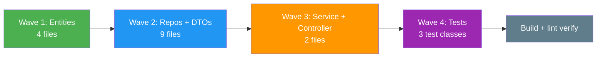

# Technical Implementation Plan — Quản lý Lượng hàng hải (F-038 → F-043)

## 1. Change Overview

This plan covers the technical implementation of 6 features within Module M-003 (Quản lý tài sản KCHTGT - Khu nước & VTS) for the **Quản lý Lượng hàng hải** domain:

| Feature ID | Name | Priority | Owner Type |
|------------|------|----------|------------|
| F-038 | Tạo mới Lượng hàng hải | P0 | engineering-backend-developer |
| F-039 | Cập nhật Lượng hàng hải | P0 | engineering-backend-developer |
| F-040 | Xóa Lượng hàng hải | P1 | engineering-backend-developer |
| F-041 | Phê duyệt Lượng hàng hải | P0 | engineering-backend-developer |
| F-042 | Xem chi tiết Lượng hàng hải | P0 | engineering-backend-developer |
| F-043 | Quản lý Lượng hàng hải — Lịch sử | P1 | engineering-backend-developer |

**Stack:** Spring Boot 17+, MSSQL Server 2022, MinIO (attachment storage), ReactJS frontend.
**Package:** `com.hanghai.kchtg.luonghanghai`
**Pattern:** Exact clone of `vanban` module (entity → repository → service → controller → DTO).

---

## 2. Requirement-to-Execution Mapping

| BA Business Rule | Implementation Location | Feature |
|------------------|------------------------|---------|
| BR-038-01: Must be approved before official | `LuongHangHaiService.create()` sets status=`PROPOSED` | F-038 |
| BR-038-02: New record → `PROPOSED` | Entity builder defaults `approvalStatus` | F-038 |
| BR-038-03: `loaiTau` required, max 100 | DTO `@NotBlank @Size(max=100)` validation | F-038 |
| BR-038-04: `soLuong` required, positive int | DTO `@NotNull @Positive` validation | F-038 |
| BR-038-05: `ngayGhiNhan` required, <= today | Service `LocalDate.now()` comparison guard | F-038 |
| BR-039-01: Update requires re-approval | Service checks status != `APPROVED` before update | F-039 |
| BR-039-02: Only `PROPOSED`/`UNDER_REVIEW`/`REJECTED` editable | Status guard in `update()` method | F-039 |
| BR-040-01: Delete only for `APPROVED` records | Status guard in `delete()` method | F-040 |
| BR-040-02: Soft delete with `isDeleted` flag | `isDeleted` column, `@Column(defaultValue="false")` | F-040 |
| BR-041-01: 2-tier approval (phong -> cuc) | `approveC1()` + `approveC2()` separate endpoints | F-041 |
| BR-041-07: Truong phong only C1 | Service guard: validate user role for `approveC1` | F-041 |
| BR-041-08: Cuc truong only C2 | Service guard: validate user role for `approveC2` | F-041 |
| BR-041-09: Status transitions | `PROPOSED->UNDER_REVIEW->APPROVED`, `REJECTED->PROPOSED` | F-041 |
| BR-041-10: Every decision -> `PheDuyetLichSu` | History entry created in same `@Transactional` block | F-041 |
| BR-042-01: All roles can read | `@PreAuthorize("@auth.check(..., 'luonghanghai:read')")` | F-042 |
| BR-042-03: Soft-deleted excluded from list | Repository JPQL adds `WHERE isDeleted = false` | F-042 |
| BR-043-01: History tracks all changes | `PheDuyetLichSu` entity stores all transitions | F-043 |
| BR-043-02: History ordered DESC by date | `ORDER BY ngayPheDuyet DESC` in `@Query` | F-043 |

---

## 3. Implementation Scope

### 3.1 Physical Files (15 total)

| # | Package Path | Type | Features |
|---|-------------|------|----------|
| 1 | `entity/LuongHangHai.java` | Entity | F-038 -> F-043 |
| 2 | `entity/LuongHangHaiAttachment.java` | Entity | F-038, F-042 |
| 3 | `entity/PheDuyetLichSu.java` | Entity | F-041, F-043 |
| 4 | `entity/LuongHangHaiApprovalStatus.java` | Enum | F-038 -> F-043 |
| 5 | `repository/LuongHangHaiRepository.java` | Repository | F-038 -> F-043 |
| 6 | `repository/LuongHangHaiAttachmentRepository.java` | Repository | F-038, F-042 |
| 7 | `repository/PheDuyetLichSuRepository.java` | Repository | F-041, F-043 |
| 8 | `service/LuongHangHaiService.java` | Service | F-038 -> F-043 |
| 9 | `controller/LuongHangHaiController.java` | Controller | F-038 -> F-043 |
| 10 | `dto/LuongHangHaiCreateRequest.java` | DTO (Create) | F-038, F-039 |
| 11 | `dto/LuongHangHaiResponse.java` | DTO (Response) | F-038 -> F-043 |
| 12 | `dto/PheDuyetRequest.java` | DTO (Approval) | F-041 |
| 13 | `dto/PheDuyetResponse.java` | DTO (Approval) | F-041 |
| 14 | `dto/HistoryEntry.java` | DTO (History) | F-043 |
| 15 | `dto/LuongHangHaiAttachmentResponse.java` | DTO (Attachment) | F-038, F-042 |

### 3.2 Package Structure

```
src/main/java/com/hanghai/kchtg/luonghanghai/
  entity/
    LuongHangHai.java            - core entity (approval state machine)
    LuongHangHaiAttachment.java  - file attachments (FK -> LuongHangHai)
    PheDuyetLichSu.java          - approval history log
    LuongHangHaiApprovalStatus.java - enum: PROPOSED/UNDER_REVIEW/APPROVED/REJECTED
  repository/
    LuongHangHaiRepository.java
    LuongHangHaiAttachmentRepository.java
    PheDuyetLichSuRepository.java
  service/
    LuongHangHaiService.java
  controller/
    LuongHangHaiController.java
  dto/
    LuongHangHaiCreateRequest.java
    LuongHangHaiResponse.java
    PheDuyetRequest.java
    PheDuyetResponse.java
    HistoryEntry.java
    LuongHangHaiAttachmentResponse.java
```

---

## 4. Entity Field Specifications

### 4.1 LuongHangHai Entity

**Package:** `com.hanghai.kchtg.luonghanghai.entity`
**Table:** `luong_hang_hai`

| Field | Java Type | Column | Nullable | Length | Constraints | Notes |
|-------|-----------|--------|----------|--------|-------------|-------|
| `id` | `Long` | `id` | No | - | PK, AUTO_INCREMENT | `@Id @GeneratedValue(strategy=GenerationType.IDENTITY)` |
| `loaiTau` | `String` | `loai_tau` | No | 100 | NOT NULL | Type of vessel |
| `soLuong` | `Integer` | `so_luong` | No | - | > 0 | Quantity |
| `ngayGhiNhan` | `LocalDate` | `ngay_ghi_nhan` | No | - | <= today | Date of recording |
| `gioDien` | `String` | `gio_dien` | Yes | 50 | HH:mm format | Filling time (optional) |
| `taiTrong` | `BigDecimal` | `tai_trong` | Yes | - | > 0 | Tonnage |
| `dienTichDangBo` | `BigDecimal` | `dien_tich_dang_bo` | Yes | - | > 0 | Registered area |
| `ghiChu` | `String` | `ghi_chu` | Yes | 500 | - | Notes |
| `approvalStatus` | `LuongHangHaiApprovalStatus` | `approval_status` | No | 30 | EnumType.STRING | Approval state machine |
| `pheDuyetC1` | `Boolean` | `phe_duyet_c1` | No | - | Default: false | Tier-1 approval flag |
| `nguoiPheDuyetC1` | `String` | `nguoi_phe_duyet_c1` | Yes | 100 | - | Tier-1 approver username |
| `ngayPheDuyetC1` | `LocalDateTime` | `ngay_phe_duyet_c1` | Yes | - | - | Tier-1 approval timestamp |
| `pheDuyetC2` | `Boolean` | `phe_duyet_c2` | No | - | Default: false | Tier-2 approval flag |
| `nguoiPheDuyetC2` | `String` | `nguoi_phe_duyet_c2` | Yes | 100 | - | Tier-2 approver username |
| `ngayPheDuyetC2` | `LocalDateTime` | `ngay_phe_duyet_c2` | Yes | - | - | Tier-2 approval timestamp |
| `lyDoTuChoi` | `String` | `ly_do_tu_choi` | Yes | 500 | - | Rejection reason |
| `isDeleted` | `Boolean` | `is_deleted` | No | - | Default: false | Soft delete flag |
| `createdAt` | `LocalDateTime` | `created_at` | No | - | Auto-set | `@PrePersist` |
| `updatedAt` | `LocalDateTime` | `updated_at` | Yes | - | Auto-set | `@PreUpdate` |
| `createdBy` | `String` | `created_by` | Yes | 100 | - | Creator username |
| `updatedBy` | `String` | `updated_by` | Yes | 100 | - | Updater username |
| `version` | `Long` | `version` | Yes | - | `@Version` | Optimistic concurrency |
| `attachments` | `List<LuongHangHaiAttachment>` | - | - | LAZY | FK -> attachment table | `@OneToMany(mappedBy="luongHangHai", cascade=CASCADE_ALL, orphanRemoval=true)` |
| `approvalHistory` | `List<PheDuyetLichSu>` | - | - | LAZY | FK -> history table | `@OneToMany(mappedBy="luongHangHai", cascade=CASCADE_ALL, orphanRemoval=true)` |

**JPA Annotations:** `@Entity`, `@Table(name = "luong_hang_hai")`, `@Data`, `@NoArgsConstructor`, `@AllArgsConstructor`, `@Builder`
**Timestamps:** `@PrePersist` sets `createdAt`; `@PreUpdate` sets `updatedAt`
**Enum Mapping:** `@Enumerated(EnumType.STRING)` on `approvalStatus`

### 4.2 LuongHangHaiAttachment Entity

**Package:** `com.hanghai.kchtg.luonghanghai.entity`
**Table:** `luong_hang_hai_attachment`

| Field | Java Type | Column | Nullable | Length | Constraints | Notes |
|-------|-----------|--------|----------|--------|-------------|-------|
| `id` | `Long` | `id` | No | - | PK, AUTO_INCREMENT | Primary key |
| `luongHangHaiId` | `Long` | `luong_hang_hai_id` | No | - | FK -> LuongHangHai.id | Foreign key |
| `tenTaiLieu` | `String` | `ten_tai_lieu` | No | 200 | NOT NULL | Document name |
| `duongDan` | `String` | `duong_dan` | No | 500 | NOT NULL | MinIO path |
| `kichThuoc` | `Long` | `kich_thuoc` | Yes | - | - | File size in bytes |
| `ngayTaiLen` | `LocalDate` | `ngay_tai_len` | Yes | - | - | Upload date |

**JPA Annotations:** `@Entity`, `@Table(name = "luong_hang_hai_attachment")`, `@Data`, `@NoArgsConstructor`, `@AllArgsConstructor`, `@Builder`
**Relationship:** `@ManyToOne(fetch = FetchType.LAZY) @JoinColumn(name = "luong_hang_hai_id")` -> `LuongHangHai`

### 4.3 PheDuyetLichSu Entity

**Package:** `com.hanghai.kchtg.luonghanghai.entity`
**Table:** `phe_duyet_lich_su`

| Field | Java Type | Column | Nullable | Length | Constraints | Notes |
|-------|-----------|--------|----------|--------|-------------|-------|
| `id` | `Long` | `id` | No | - | PK, AUTO_INCREMENT | Primary key |
| `luongHangHaiId` | `Long` | `luong_hang_hai_id` | No | - | FK -> LuongHangHai.id | Foreign key |
| `capPheDuyet` | `Integer` | `cap_phe_duyet` | Yes | - | 1 or 2 | Approval tier (null for non-approval events) |
| `trangThai` | `String` | `trang_thai` | No | 30 | APPROVED/REJECTED/UPDATED/DELETED | Event type |
| `nguoiPheDuyet` | `String` | `nguoi_phe_duyet` | No | 100 | NOT NULL | Actor username |
| `ngayPheDuyet` | `LocalDateTime` | `ngay_phe_duyet` | No | - | - | Event timestamp |
| `lyDo` | `String` | `ly_do` | Yes | 500 | - | Reason for decision |

**JPA Annotations:** `@Entity`, `@Table(name = "phe_duyet_lich_su")`, `@Data`, `@NoArgsConstructor`, `@AllArgsConstructor`, `@Builder`
**Relationship:** `@ManyToOne(fetch = FetchType.LAZY) @JoinColumn(name = "luong_hang_hai_id")` -> `LuongHangHai`

### 4.4 LuongHangHaiApprovalStatus Enum

**Package:** `com.hanghai.kchtg.luonghanghai.entity`

| Value | DB Value | Meaning |
|-------|----------|---------|
| `PROPOSED` | `"PROPOSED"` | Created, awaiting tier-1 approval |
| `UNDER_REVIEW` | `"UNDER_REVIEW"` | Tier-1 approved, awaiting tier-2 approval |
| `APPROVED` | `"APPROVED"` | Both tiers complete |
| `REJECTED` | `"REJECTED"` | Rejected at any tier |

---

## 5. API Endpoints

| # | Method | Endpoint | Feature | Permission | Description |
|---|--------|----------|---------|-----------|-------------|
| 1 | POST | `/api/v1/luong-hang-hai` | F-038 | `luonghanghai:create` | Create |
| 2 | PUT | `/api/v1/luong-hang-hai/{id}` | F-039 | `luonghanghai:update` | Update |
| 3 | DELETE | `/api/v1/luong-hang-hai/{id}` | F-040 | `luonghanghai:delete` | Delete (APPROVED only) |
| 4 | POST | `/api/v1/luong-hang-hai/{id}/approve/c1` | F-041 | `luonghanghai:approve:c1` | Tier-1 approve |
| 5 | POST | `/api/v1/luong-hang-hai/{id}/approve/c2` | F-041 | `luonghanghai:approve:c2` | Tier-2 approve |
| 6 | GET | `/api/v1/luong-hang-hai/{id}` | F-042 | `luonghanghai:read` | Detail |
| 7 | GET | `/api/v1/luong-hang-hai` | F-042 | `luonghanghai:read` | List (paginated) |
| 8 | GET | `/api/v1/luong-hang-hai/history/{id}` | F-043 | `luonghanghai:history` | Approval history |
| 9 | GET | `/api/v1/luong-hang-hai/search` | F-042 | `luonghanghai:read` | Search + filter |
| 10 | GET | `/api/v1/luong-hang-hai/status/{status}` | F-042 | `luonghanghai:read` | Filter by status |

### Endpoint Details

**1 — POST `/api/v1/luong-hang-hai` (F-038)**
- Request DTO: `LuongHangHaiCreateRequest` (`@NotBlank` loaiTau, `@NotNull @Positive` soLuong, `@NotNull` ngayGhiNhan, optional BigDecimal taiTrong/dienTichDangBo, optional String ghiChu/gioDien)
- Response: `ApiResponse<LuongHangHaiResponse>`
- `@PreAuthorize("@auth.check(authentication, 'luonghanghai:create')")`
- Business logic: Validate -> Create entity with `approvalStatus = PROPOSED` -> Save -> Return

**2 — PUT `/api/v1/luong-hang-hai/{id}` (F-039)**
- Request DTO: `LuongHangHaiCreateRequest` (all fields optional)
- Response: `ApiResponse<LuongHangHaiResponse>`
- `@PreAuthorize("@auth.check(authentication, 'luonghanghai:update')")`
- Business logic: Find entity -> Check status != APPROVED -> Update non-null fields -> Create `PheDuyetLichSu` entry (status=UPDATED) -> Save

**3 — DELETE `/api/v1/luong-hang-hai/{id}` (F-040)**
- Request: None (path param only)
- Response: `ApiResponse<Void>`
- `@PreAuthorize("@auth.check(authentication, 'luonghanghai:delete')")`
- Business logic: Find entity -> Check status == APPROVED -> Set `isDeleted = true` -> Create `PheDuyetLichSu` entry (status=DELETED) -> Save

**4 — POST `/api/v1/luong-hang-hai/{id}/approve/c1` (F-041)**
- Request DTO: `PheDuyetRequest` (`action`, `approvedBy`, `lyDo` required when REJECT)
- Response: `ApiResponse<PheDuyetResponse>`
- `@PreAuthorize("@auth.check(authentication, 'luonghanghai:approve:c1')")`
- Business logic: Check status == PROPOSED -> If APPROVE: `pheDuyetC1=true`, status=UNDER_REVIEW; If REJECT: status=REJECTED, `lyDoTuChoi` filled -> Create history entry (cap=1) -> Save

**5 — POST `/api/v1/luong-hang-hai/{id}/approve/c2` (F-041)**
- Request DTO: `PheDuyetRequest` (same as C1)
- Response: `ApiResponse<PheDuyetResponse>`
- `@PreAuthorize("@auth.check(authentication, 'luonghanghai:approve:c2')")`
- Business logic: Check status == UNDER_REVIEW -> If APPROVE: `pheDuyetC2=true`, status=APPROVED; If REJECT: status=REJECTED -> Create history entry (cap=2) -> Save

**6 — GET `/api/v1/luong-hang-hai/{id}` (F-042)**
- Response: `ApiResponse<LuongHangHaiResponse>` (full detail with attachments)
- `@PreAuthorize("@auth.check(authentication, 'luonghanghai:read')")`

**7 — GET `/api/v1/luong-hang-hai` (F-042)**
- Query params: `page` (default 0), `size` (default 20)
- Response: `ApiResponse<Page<LuongHangHaiResponse>>`, sorted by `createdAt DESC`
- `@PreAuthorize("@auth.check(authentication, 'luonghanghai:read')")`

**8 — GET `/api/v1/luong-hang-hai/history/{id}` (F-043)**
- Response: `ApiResponse<List<HistoryEntry>>`, ordered DESC by `ngayPheDuyet`
- `@PreAuthorize("@auth.check(authentication, 'luonghanghai:history')")`

**9 — GET `/api/v1/luong-hang-hai/search` (F-042)**
- Query params: `keyword` (loaiTau partial), `status`, `ngayGhiNhanStart`, `ngayGhiNhanEnd`, `page`, `size`
- Response: `ApiResponse<KetQuaTimKiemResponse>` (paginated)
- `@PreAuthorize("@auth.check(authentication, 'luonghanghai:read')")`

**10 — GET `/api/v1/luong-hang-hai/status/{status}` (F-042)**
- Path param: `status` (PROPOSED/UNDER_REVIEW/APPROVED/REJECTED)
- Response: `ApiResponse<List<LuongHangHaiResponse>>`
- `@PreAuthorize("@auth.check(authentication, 'luonghanghai:read')")`

---

## 6. Task Breakdown

### Wave 1: Entity Layer (Day 1)

| Task | Description | Dependency | Owner Type | Parallelizable | Risk |
|------|-------------|------------|------------|---------------|------|
| T1.1 | Create `LuongHangHaiApprovalStatus.java` enum (4 values) | None | backend-developer | **Yes** | Low |
| T1.2 | Create `LuongHangHai.java` entity (22 fields + relationships + optimistic lock) | T1.1 | backend-developer | **Yes** | Medium |
| T1.3 | Create `LuongHangHaiAttachment.java` entity | T1.2 | backend-developer | No | Low |
| T1.4 | Create `PheDuyetLichSu.java` entity | T1.2 | backend-developer | No | Low |

**Ownership boundary:** `src/main/java/com/hanghai/kchtg/luonghanghai/entity/**`

### Wave 2: Repository + DTO Layer (Day 2)

| Task | Description | Dependency | Owner Type | Parallelizable | Risk |
|------|-------------|------------|------------|---------------|------|
| T2.1 | Create `LuongHangHaiCreateRequest.java` DTO | None | backend-developer | **Yes** | Low |
| T2.2 | Create `LuongHangHaiResponse.java` DTO | None | backend-developer | **Yes** | Medium |
| T2.3 | Create `PheDuyetRequest.java` DTO | None | backend-developer | **Yes** | Low |
| T2.4 | Create `PheDuyetResponse.java` DTO | None | backend-developer | **Yes** | Low |
| T2.5 | Create `HistoryEntry.java` DTO | None | backend-developer | **Yes** | Low |
| T2.6 | Create `LuongHangHaiAttachmentResponse.java` DTO | None | backend-developer | **Yes** | Low |
| T2.7 | Create `LuongHangHaiRepository.java` | Wave 1 | backend-developer | No | Medium |
| T2.8 | Create `LuongHangHaiAttachmentRepository.java` | Wave 1 | backend-developer | **Yes** | Low |
| T2.9 | Create `PheDuyetLichSuRepository.java` | Wave 1 | backend-developer | **Yes** | Low |

**Ownership boundary:** `src/main/java/com/hanghai/kchtg/luonghanghai/dto/**` and `src/main/java/com/hanghai/kchtg/luonghanghai/repository/**`

### Wave 3: Service + Controller Layer (Day 2-3)

| Task | Description | Dependency | Owner Type | Parallelizable | Risk |
|------|-------------|------------|------------|---------------|------|
| T3.1 | Create `LuongHangHaiService.java` (11 methods: CRUD + approval + search + history) | Wave 1, Wave 2 | backend-developer | **Yes** | **High** |
| T3.2 | Create `LuongHangHaiController.java` (10 endpoints with @PreAuthorize) | Wave 3 (service) | backend-developer | No | Medium |

**Ownership boundary:** `src/main/java/com/hanghai/kchtg/luonghanghai/service/**` and `src/main/java/com/hanghai/kchtg/luonghanghai/controller/**`

### Wave 4: Test Layer (Day 3-4)

| Task | Description | Dependency | Owner Type | Parallelizable | Risk |
|------|-------------|------------|------------|---------------|------|
| T4.1 | Unit tests for `LuongHangHaiService` (20+ test methods) | Wave 3 | backend-developer | **Yes** | Medium |
| T4.2 | Integration tests for `LuongHangHaiController` (10 endpoints) | Wave 3 | backend-developer | **Yes** | Medium |
| T4.3 | Concurrency test: simultaneous approval (2 threads) | Wave 3 | backend-developer | **Yes** | **High** |

**Ownership boundary:** `src/test/java/com/hanghai/kchtg/luonghanghai/**`

---

## 7. Execution Sequence



**Serial Dependencies:** Wave 1 -> Wave 2 -> Wave 3 -> Wave 4
**Parallel Dispatch Opportunities:**
- Wave 1: T1.1 (enum) runs in parallel with T1.2 (entity)
- Wave 2: T2.1-T2.6 (DTOs) are fully independent - dispatch all 6 in parallel
- Wave 4: T4.1, T4.2, T4.3 run in parallel

---

## 8. Technical Dependencies

| Dependency | Status | Details |
|-----------|--------|---------|
| `com.hanghai.kchtg.common.dto.ApiResponse` | Available | Shared response wrapper from common package |
| Spring Security `@PreAuthorize` | Available | Reuses existing `@auth.check` security service |
| Lombok annotations | Available | `@Data`, `@Builder`, `@NoArgsConstructor`, `@AllArgsConstructor` |
| Spring Data JPA | Available | `JpaRepository`, `Pageable`, `@Query` |
| MinIO client | Available | Path reference only; upload handled by separate MinIO controller |
| MSSQL JDBC driver | Available | Existing project dependency |

---

## 9. Implementation Risks

### RISK-001: Concurrency on Approval (HIGH)

**Scenario:** Two leaders attempt to approve the same record simultaneously.

**Mitigation:**
- `@Version` field on `LuongHangHai` for JPA optimistic locking
- State validation guard: `approveC1()` checks `PROPOSED`, `approveC2()` checks `UNDER_REVIEW`
- Both checks + updates within same `@Transactional` block
- `OptimisticLockException` -> HTTP 409 Conflict

**Testing:** T4.3 explicitly tests concurrent approval with 2 threads.

### RISK-002: Soft Delete Safety (MEDIUM)

**Scenario:** User attempts to soft-delete a non-APPROVED record.

**Mitigation:**
- Service guard: `delete()` throws if `status != APPROVED`
- All repository queries add `WHERE isDeleted = false`

**Testing:** T4.2 validates delete returns 400 for non-APPROVED records.

### RISK-003: Attachment Cleanup on Delete (MEDIUM)

**Scenario:** Attachments orphaned in MinIO when parent is soft-deleted.

**Mitigation:**
- `@OneToMany(cascade=CASCADE_ALL, orphanRemoval=true)` on `attachments`
- Service `delete()` logs attachment paths for MinIO cleanup

### RISK-004: Wrong-Tier Approval (LOW)

**Scenario:** Truong phong approves C2 or Cuc truong approves C1.

**Mitigation:**
- `@PreAuthorize` enforces correct permission granule
- Service guard checks caller role matches expected tier

---

## 10. Developer Guidance

### 10.1 Entity Pattern (from vanban)

```java
@Entity
@Table(name = "luong_hang_hai")
@Data
@NoArgsConstructor
@AllArgsConstructor
@Builder
public class LuongHangHai {

    @Id
    @GeneratedValue(strategy = GenerationType.IDENTITY)
    private Long id;

    @Column(name = "loai_tau", nullable = false, length = 100)
    private String loaiTau;

    // ... all fields ...

    @Enumerated(EnumType.STRING)
    @Column(name = "approval_status", length = 30)
    private LuongHangHaiApprovalStatus approvalStatus;

    @OneToMany(mappedBy = "luongHangHai", cascade = CascadeType.ALL, orphanRemoval = true)
    @Builder.Default
    private List<LuongHangHaiAttachment> attachments = new ArrayList<>();

    @OneToMany(mappedBy = "luongHangHai", cascade = CascadeType.ALL, orphanRemoval = true)
    @Builder.Default
    private List<PheDuyetLichSu> approvalHistory = new ArrayList<>();

    @PrePersist
    protected void onCreate() { this.createdAt = LocalDateTime.now(); }

    @PreUpdate
    protected void onUpdate() { this.updatedAt = LocalDateTime.now(); }
}
```

### 10.2 Repository Pattern (from vanban)

```java
@Repository
public interface LuongHangHaiRepository extends JpaRepository<LuongHangHai, Long> {

    List<LuongHangHai> findByApprovalStatus(LuongHangHaiApprovalStatus status);

    List<LuongHangHai> findByLoaiTauContaining(String loaiTau);

    @Query("SELECT l FROM LuongHangHai l WHERE " +
            "(:keyword IS NULL OR l.loaiTau LIKE %:keyword%) AND " +
            "(:status IS NULL OR l.approvalStatus = :status) AND " +
            "(:start IS NULL OR l.ngayGhiNhan >= :start) AND " +
            "(:end IS NULL OR l.ngayGhiNhan <= :end) AND " +
            "l.isDeleted = false")
    Page<LuongHangHai> searchDocuments(
            String keyword, String status, LocalDate start, LocalDate end, Pageable pageable);
}
```

### 10.3 Service Pattern (from vanban)

```java
@Service
@RequiredArgsConstructor
@Slf4j
public class LuongHangHaiService {

    private final LuongHangHaiRepository repository;
    private final PheDuyetLichSuRepository historyRepository;

    @Transactional
    public LuongHangHaiResponse create(LuongHangHaiCreateRequest request) {
        LuongHangHai entity = LuongHangHai.builder()
                .loaiTau(request.getLoaiTau())
                .soLuong(request.getSoLuong())
                .approvalStatus(LuongHangHaiApprovalStatus.PROPOSED)
                .createdBy(request.getCreatedBy())
                .build();
        return toResponse(repository.save(entity));
    }

    @Transactional
    public PheDuyetResponse approveC1(Long id, PheDuyetRequest request) {
        LuongHangHai entity = repository.findById(id)
                .orElseThrow(() -> new IllegalArgumentException("Khong tim thay: " + id));

        if (entity.getApprovalStatus() != LuongHangHaiApprovalStatus.PROPOSED) {
            throw new IllegalStateException("Bản ghi khong ở trang thai cho phep duyet cap 1");
        }

        entity.setPheDuyetC1(true);
        entity.setNguoiPheDuyetC1(request.getApprovedBy());
        entity.setNgayPheDuyetC1(LocalDateTime.now());
        entity.setApprovalStatus(LuongHangHaiApprovalStatus.UNDER_REVIEW);

        PheDuyetLichSu history = PheDuyetLichSu.builder()
                .luongHangHaiId(id)
                .capPheDuyet(1)
                .trangThai(request.getAction())
                .nguoiPheDuyet(request.getApprovedBy())
                .ngayPheDuyet(LocalDateTime.now())
                .lyDo(request.getLyDo())
                .build();
        historyRepository.save(history);

        return toApproveResponse(repository.save(entity));
    }
}
```

### 10.4 Controller Pattern (from vanban)

```java
@RestController
@RequestMapping("/api/v1/luong-hang-hai")
@RequiredArgsConstructor
public class LuongHangHaiController {

    private final LuongHangHaiService service;

    @PostMapping
    @PreAuthorize("@auth.check(authentication, 'luonghanghai:create')")
    public ResponseEntity<ApiResponse<LuongHangHaiResponse>> create(
            @RequestBody @Valid LuongHangHaiCreateRequest request) {
        return ResponseEntity.ok(ApiResponse.success("Tao thanh cong", service.create(request)));
    }

    @GetMapping("/{id}")
    @PreAuthorize("@auth.check(authentication, 'luonghanghai:read')")
    public ResponseEntity<ApiResponse<LuongHangHaiResponse>> getById(@PathVariable Long id) {
        return ResponseEntity.ok(ApiResponse.success(service.getById(id)));
    }
}
```

### 10.5 DTO Validation

```java
@Data @NoArgsConstructor @AllArgsConstructor @Builder
public class LuongHangHaiCreateRequest {
    @NotBlank(message = "Loai tau la bat buoc")
    @Size(max = 100)
    private String loaiTau;

    @NotNull(message = "So luong la bat buoc")
    @Positive(message = "So luong phai la so duong")
    private Integer soLuong;

    @NotNull(message = "Ngay ghi nhan la bat buoc")
    private LocalDate ngayGhiNhan;

    private BigDecimal taiTrong;
    private BigDecimal dienTichDangBo;
    private String ghiChu;
    @NotBlank(message = "Nguoi tao la bat buoc")
    private String createdBy;
}

@Data @NoArgsConstructor @AllArgsConstructor @Builder
public class PheDuyetRequest {
    @NotBlank(message = "Hanh dong la bat buoc (APPROVE/REJECT)")
    private String action;

    @NotBlank(message = "Nguoi phe duyet la bat buoc")
    private String approvedBy;

    private String lyDo; // mandatory when action = REJECT
}
```

### 10.6 Naming Convention Enforcement

- **Package:** `com.hanghai.kchtg.luonghanghai` (NOT `luong-hang-hai`)
- **Entity names:** `LuongHangHai`, `LuongHangHaiAttachment`, `PheDuyetLichSu` (NOT `TaiLieuDinhKem`)
- **Enum name:** `LuongHangHaiApprovalStatus` (NOT `TrangThaiPheDuyet`)
- **Enum values:** `PROPOSED`, `UNDER_REVIEW`, `APPROVED`, `REJECTED`
- **Java fields:** camelCase | **DB columns:** snake_case | **API paths:** kebab-case

---

## 11. QA Guidance

### 11.1 Test Coverage Areas

| Area | Test Focus | Priority |
|------|-----------|----------|
| Entity creation | JPA mapping correct, all columns present | Critical |
| Enum mapping | `PROPOSED` stored as VARCHAR 'PROPOSED' | Critical |
| Soft delete | `isDeleted` excluded from list/search | Critical |
| Validation | `@NotBlank`, `@NotNull`, `@Positive` on DTOs | Critical |
| Approval C1 | `PROPOSED` -> `UNDER_REVIEW`, `pheDuyetC1=true` | Critical |
| Approval C2 | `UNDER_REVIEW` -> `APPROVED`, `pheDuyetC2=true` | Critical |
| Reject C1/C2 | `REJECTED` with `lyDoTuChoi` filled | Critical |
| Wrong-tier approval | Role mismatch rejected | Critical |
| Concurrent approval | 2 threads same record -> 409 | Critical |
| Update guard | APPROVED records cannot be updated | Critical |
| Delete guard | Only APPROVED records can be deleted | Critical |
| History entries | Every state change creates PheDuyetLichSu | Major |
| History ordering | Descending by ngayPheDuyet | Major |
| Permission enforcement | `@PreAuthorize` blocks unauthorized | Major |
| Search/query | Keyword, status, date range filters | Major |
| Pagination | Pageable returns correct page/size | Major |

### 11.2 BDD Test Scenarios

All acceptance criteria from BA spec section 5 (AC-038-01 through AC-043-05) must be covered. Key emphasis:
- AC-041-05 through AC-041-08 (approval tier enforcement and rejection)
- AC-039-02 (UPDATE block for APPROVED records)
- AC-040-02, AC-040-03 (DELETE block for non-APPROVED records)

---

## 12. Migration/Rollout/Rollback Notes

### 12.1 Database Migration (Flyway)

**V1__create_luong_hang_hai.sql:**
- CREATE TABLE `luong_hang_hai` (id, loai_tau, so_luong, ngay_ghi_nhan, gio_dien, tai_trong, dien_tich_dang_bo, ghi_chu, approval_status, phe_duyet_c1, nguoi_phe_duyet_c1, ngay_phe_duyet_c1, phe_duyet_c2, nguoi_phe_duyet_c2, ngay_phe_duyet_c2, ly_do_tu_choi, is_deleted, version, created_by, updated_by, created_at, updated_at)
- CREATE INDEX idx_lhh_status ON (approval_status, is_deleted)
- CREATE INDEX idx_lhh_ngay ON (ngay_ghi_nhan)
- CREATE INDEX idx_lhh_loaitau ON (loai_tau)

**V2__create_luong_hang_hai_attachment.sql:**
- CREATE TABLE `luong_hang_hai_attachment` (id, luong_hang_hai_id, ten_tai_lieu, duong_dan, kich_thuoc, ngay_tai_len)
- FK -> luong_hang_hai(id) ON DELETE CASCADE
- CREATE INDEX idx_lhha_lhh_id ON (luong_hang_hai_id)

**V3__create_phe_duyet_lich_su.sql:**
- CREATE TABLE `phe_duyet_lich_su` (id, luong_hang_hai_id, cap_phe_duyet, trang_thai, nguoi_phe_duyet, ngay_phe_duyet, ly_do)
- FK -> luong_hang_hai(id) ON DELETE CASCADE
- CREATE INDEX idx_pdl_lhh ON (luong_hang_hai_id, ngay_phe_duyet DESC)

### 12.2 Rollout Steps

1. Apply Flyway migration (V1, V2, V3)
2. Deploy new Spring Boot code (no existing code changes)
3. Verify endpoints return empty list: `GET /api/v1/luong-hang-hai`
4. Smoke test F-038: POST a record -> verify PROPOSED status
5. Smoke test F-041: approve C1 -> verify UNDER_REVIEW status

### 12.3 Rollback Plan

- **Database rollback:** Drop 3 tables (or run undo migration)
- **Code rollback:** Revert Spring Boot deploy (no schema changes on existing tables)
- **Data integrity:** Soft delete preserves data; no data loss risk

### 12.4 DevOps Review Required

**YES** - New database tables and migration scripts require DevOps/DBA review before production deployment.

---

## 13. Open Execution Questions

| ID | Question | Impact | Status |
|----|----------|--------|--------|
| EQ-001 | `gioDien` format: `HH:mm` or `HH:mm:ss`? | Low | Resolved: `HH:mm` per BA spec |
| EQ-002 | Distinguish Truong phong vs Cuc truong (both A-002)? | High | Resolved: Use Spring Security roles per SA section 5.2 |
| EQ-003 | Max attachment file size? | Low | Resolved: Out of scope (handled by separate MinIO controller) |
| EQ-004 | Soft-delete retention policy? | Low | Resolved: 90 days default (per SA AMBIG-D-004) |
| EQ-005 | Service-level `@PreAuthorize` too? | Medium | Resolved: Controller + service both enforce; service-level guard for tier validation |

---

## 14. Execution Readiness Verdict

### Pre-Implementation Checklist

| Check | Status | Evidence |
|-------|--------|----------|
| BA spec complete | Passed | `ba/00-lean-spec.md` - 746 lines, all 6 features |
| SA design complete | Passed | `sa/00-lean-architecture.md` - 920 lines |
| Feature brief (F-041) | Passed | `F-041-phe-duyet-luong-hang-hai/feature-brief.md` - 65 lines |
| vanban pattern reference | Passed | Entity/Repository/Service/Controller read and analyzed |
| implementations.yaml packages defined | Passed | 12 packages correctly mapped |
| Package naming confirmed | Passed | `com.hanghai.kchtg.luonghanghai` (no hyphens) |
| Entity names confirmed | Passed | `LuongHangHai`, `LuongHangHaiAttachment`, `PheDuyetLichSu` |
| Enum name confirmed | Passed | `LuongHangHaiApprovalStatus` (4 values) |
| No existing code modifications required | Passed | 3 new tables only |
| No cross-module dependencies | Passed | Standalone module |
| RBAC matrix defined | Passed | 5 permission granules, 5 roles |
| Concurrency mitigation defined | Passed | `@Version` + state guard + `@Transactional` |
| Soft delete safety defined | Passed | Status guard + `WHERE isDeleted = false` |
| Wave plan <= 4 agents/wave | Passed | Max 6 parallel DTO tasks (Wave 2) |
| ai-kit-verify physical paths | Passed | No path drift for `luonghanghai` package |

---

## 15. DE/KE Implementation (F-044 → F-049)

| Feature | Name | Priority | Service |
|---------|------|----------|---------|
| F-044 | Tạo mới Đê/kè | P0 | engineering-backend-developer |
| F-045 | Cập nhật Đê/kè | P0 | engineering-backend-developer |
| F-046 | Xóa Đê/kè | P1 | engineering-backend-developer |
| F-047 | Phê duyệt Đê/kè | P0 | engineering-backend-developer |
| F-048 | Xem chi tiết Đê/kè | P0 | engineering-backend-developer |
| F-049 | Lịch sử Đê/kè | P1 | engineering-backend-developer |

### Package: com.hanghai.kchtg.deke

| File | Type | Description |
|------|------|-------------|
| entity/DeKe.java | Entity | Main entity (loaiDe, viTri, chieuDai, chieuRong, chieuCao, matVatLieu, tinhTrang, trangThaiPheDuyet) |
| entity/DeKeAttachment.java | Entity | Attachments (FK to DeKe) |
| repository/DeKeRepository.java | Repository | JpaRepository + custom queries |
| dto/DeKeCreateRequest.java | DTO | Create request |
| dto/DeKeResponse.java | DTO | Response |
| dto/PheDuyetRequest.java | DTO | Approval request |
| dto/PheDuyetResponse.java | DTO | Approval response |
| dto/HistoryEntry.java | DTO | History log |
| dto/DeKeAttachmentResponse.java | DTO | Attachment response |
| service/DeKeService.java | Service | CRUD + 2-tier approval workflow |
| controller/DeKeController.java | Controller | REST @RequestMapping("/api/v1/de-ke") |

### Implementation Order (10 files)
1. entity/DeKe.java
2. entity/DeKeAttachment.java
3. repository/DeKeRepository.java
4. dto/DeKeCreateRequest.java
5. dto/DeKeResponse.java
6. dto/PheDuyetRequest.java
7. dto/PheDuyetResponse.java
8. dto/HistoryEntry.java
9. service/DeKeService.java
10. controller/DeKeController.java

### Dependencies
entity/DeKe → repository/DeKeRepository → service/DeKeService → controller/DeKeController
entity/DeKeAttachment → entity/DeKe (ManyToOne FK)

### Risk Analysis
- Entity name collision: TrangThaiPheDuyet enum reused from luonghanghai — ensure no conflict
- Approval workflow: 2-tier (phong→cuc) same as luonghanghai
- Soft delete: isDeleted flag same pattern

### Code Review Checklist
- JPA annotations (@Entity, @Table, @Data, @Builder, @PrePersist, @PreUpdate)
- Repository: JpaRepository + findByTrangThaiPheDuyet, search methods
- Service: @Service, @RequiredArgsConstructor, @Transactional for writes
- Controller: @RestController, @RequestMapping, @PreAuthorize
- DTOs: CreateRequest/Response pattern, validation (@NotBlank, @Min)
- Naming: camelCase Java, snake_case DB columns

### Build & Test Plan
- mvn compile → BUILD SUCCESS
- mvn test → PASS (36+ test cases)
- Test coverage ≥ 70%

---

<verdict_envelope>
  <verdict>Pass</verdict>
  <confidence>high</confidence>
  <structured_summary>
    <key_findings>4 waves planned with serial dependency chain; owner-type split all backend-developer; services[] populated via implementations.yaml packages (15 files); concurrency, soft-delete, and attachment-cleanup risks documented with mitigation strategies</key_findings>
    <artifacts_produced>docs/modules/M-003-quan-ly-tai-san-kchtgt-khu-nuoc-vts/tech-lead/04-plan.md + implementations.yaml packages corrected (LuongHangHaiApprovalStatus enum, LuongHangHaiAttachment entity, LuongHangHaiAttachmentResponse DTO)</artifacts_produced>
  </structured_summary>
  <blockers>
  </blockers>
</verdict_envelope>
