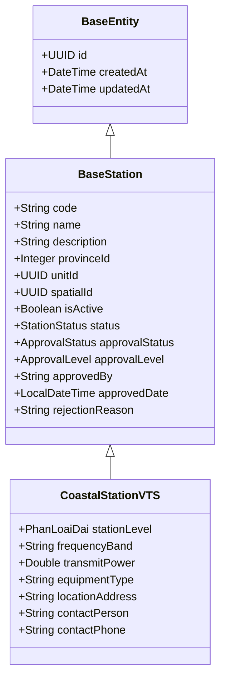

# Lean Spec: Quản lý tài sản Báo hiệu & Thông tin (M-004)

## 1. Summary

Module M-004 quản lý các tài sản báo hiệu hàng hải và đài thông tin duyên hải, phục vụ công tác quản lý nhà nước về hàng hải. Phạm vi bao gồm: Đèn biển (BeaconLight), Phao tiêu (Buoy), Nhà trạm (NhaTramPhao, NhaTramDen), và 5 loại Đài Thông tin Duyên hải (CoastalStationVTS, Inmarsat, COSPAS-SARSAT, LRIT, Hải Phòng). Mỗi loại tài sản có quy trình CRUD và phê duyệt riêng, tuân thủ quy chuẩn kỹ thuật hàng hải (IALA, WGS84).

## 2. Scope

### In Scope
- CRUD 9 loại tài sản: BeaconLight, Buoy, NhaTramPhao, NhaTramDen, CoastalStationVTS, CoastalStationInmarsat, CoastalStationCospasSarsat, CoastalStationLRIT, CoastalStationHaiphong
- Quy trình phê duyệt (Beacon: 2 cấp; CoastalStation: simplified APPROVED/REJECTED)
- Soft-delete toàn bộ tài sản
- Lịch sử thay đổi (audit log) cho mọi thao tác CRUD + phê duyệt
- Đồng bộ GIS (Beacon + Buoy → M-007; Nhà trạm → M-007)
- Phân quyền RBAC: admin, operator, approver_L1, approver_L2, viewer

### Out of Scope
- Tích hợp thiết bị IoT / real-time monitoring
- Quy trình bảo trì, sửa chữa hiện trường
- Xuất báo cáo PDF/Excel nâng cao (thuộc M-008)
- Batch import / export

## 3. Enums

| Enum | Values | Used By |
|------|--------|---------|
| BeaconLightType | LIGHTHOUSE, BEACON_LIGHT, BEACON_MARK | BeaconLight.type |
| BuoyType | CARDINAL, SECTOR, SPECIAL, SAFE_WATER, ISOLATED_DANGER | Buoy.type, NhaTramPhao.type |
| BeaconStatus | DRAFT, PENDING_APPROVAL, APPROVED_L1, APPROVED_L2, PUBLISHED, REJECTED, DELETED | BeaconLight.status, Buoy.status |
| NhaTramStatus | DRAFT, PENDING_APPROVAL, APPROVED_L1, APPROVED_L2, PUBLISHED, REJECTED, DELETED | NhaTramPhao.status, NhaTramDen.status |
| StationStatus | DRAFT, PENDING_APPROVAL, APPROVED_L1, APPROVED_L2, PUBLISHED, DELETED, REJECTED | All CoastalStation*.status (code-level Java enum) |
| StationStatus (VTS logical) | DRAFT (Lưu tạm), PENDING_APPROVAL (Chờ duyệt), APPROVED (Đã duyệt), REJECTED (Từ chối), HISTORY (Lịch sử) | CoastalStationVTS F-092→F-097 (logical view; code-level StationStatus still holds APPROVED_L1/APPROVED_L2/PUBLISHED for other station types). Dùng approvalStatus nhất quán với Cảng cạn. |
| ApprovalStatus | DRAFT(0), PROPOSED(1), PENDING_APPROVAL(2), APPROVED_LEVEL1(3), APPROVED_LEVEL2(4), APPROVED(5), REJECTED(6) | All station approval flows |
| ApprovalLevel | LEVEL_0(0), LEVEL_1(1), LEVEL_2(2) | Tracks which level performed approval |
| **PhanLoaiDai** | **LOAI_I, LOAI_II, LOAI_III, LOAI_IV, LOAI_V** | **CoastalStationVTS.stationLevel** |

## 4. Domain Glossary — Entities

### CoastalStationVTS (extends BaseStation)

| Field | Type | Constraints | Notes |
|-------|------|-------------|-------|
| id | UUID | PK | Kế thừa BaseEntity |
| code | String | @NotBlank, @Size(max=50), unique | Immutable sau khi tạo |
| name | String | @NotBlank, @Size(max=255) | |
| description | String | @Size(max=1000) | |
| **stationLevel** | **PhanLoaiDai enum** | **@NotNull** | **Loại I → Loại V. Trường mới (🔴). Bắt buộc khi tạo.** |
| provinceId | Integer | | |
| unitId | UUID | | Đơn vị quản lý |
| spatialId | UUID | | |
| isActive | Boolean | Default: true | |
| status | StationStatus | Default: PENDING_APPROVAL | Xem ghi chú StationStatus (VTS logical) ở trên |
| approvalStatus | ApprovalStatus | Default: PROPOSED(0) | |
| approvalLevel | ApprovalLevel | | LEVEL_1 or LEVEL_2 |
| approvedBy | String | | |
| approvedDate | LocalDateTime | | |
| rejectionReason | String | @Size(max=1000) | |
| frequencyBand | String | | Dải tần hoạt động |
| transmitPower | Double | | Công suất phát |
| equipmentType | String | | Loại thiết bị |
| locationAddress | String | @Size(max=1000) | Địa chỉ trạm |
| contactPerson | String | | Người liên hệ |
| contactPhone | String | | SĐT liên hệ |
| createdAt, updatedAt | Timestamp | Auto | Kế thừa BaseEntity |

### Other Entities (summary)

| Entity | Table | Distinct Fields |
|--------|-------|-----------------|
| BeaconLight | beacon_light | type, latitude, longitude, lightRange, lightColor, lightCharacteristic, range, lastMaintenanceDate, nextMaintenanceDate |
| Buoy | buoy | type, latitude, longitude, color, shape, lightCharacteristic, range, lastInspectionDate, nextInspectionDate |
| NhaTramPhao | nha_tram_phao | extends BaseNhaTram + BuoyType-specific fields |
| NhaTramDen | nha_tram_den | extends BaseNhaTram + BeaconLightType-specific fields |
| CoastalStationInmarsat | coastal_station_inmarsat | deviceCode, modemType, frequency, coverageZone, sarCode |
| CoastalStationCospasSarsat | coastal_station_cospas_sarsat | frequency, coverageArea, beaconProtocol, emergencyChannel, antennaType, signalRange, operatingMode |
| CoastalStationLRIT | coastal_station_lrit | terminalId, imoNumber, reportingInterval, antennaHeight, powerOutput, antennaType, dataFormat, communicationChannel, coverageArea |
| CoastalStationHaiphong | coastal_station_haiphong | portName, district, ward, operationalLicense, licenseExpiry, inspectorName, inspectorPhone, lastInspectionDate, nextInspectionDate, coverageArea, equipmentType, communicationFrequency |

## 5. ERD — CoastalStationVTS



## 6. Approval Workflow

### Beacon & NhaTram (2-level approval)
```
DRAFT → submitForApproval → PENDING_APPROVAL → approve L1 → APPROVED_L1 → approve L2 → PUBLISHED (→ GIS sync)
                                              ↘ reject (any level) → REJECTED → DRAFT (re-edit)
```

### CoastalStationVTS (simplified approval, F-092→F-097)
```
DRAFT → submitForApproval → PENDING_APPROVAL → approve (C1 or C2) → APPROVED
                                              ↘ reject (any level, with rejectionReason) → REJECTED
```

- `approvalLevel` tracks which level performed the approval (LEVEL_1 or LEVEL_2)
- Rejections possible at any level; require `rejectionReason`
- After APPROVED, the station is published and visible to all viewers
- Status values for CoastalStationVTS: DRAFT (Lưu tạm), PENDING_APPROVAL (Chờ duyệt), APPROVED (Đã duyệt), REJECTED (Từ chối), HISTORY (Lịch sử)
- Note: code-level `StationStatus` enum still holds `APPROVED_L1`, `APPROVED_L2`, `PUBLISHED`, `DELETED` for other station types; the simplified VTS status model is enforced at the service layer

## 7. Soft-Delete Pattern

### Beacon & Buoy & NhaTram
- Soft delete via `deletedAt` timestamp
- `@SQLRestriction("deleted_at IS NULL")` hides from normal queries
- DELETE action recorded in history as `SOFT_DELETE`
- Status set to `DELETED`

### CoastalStationVTS (F-094)
- **Delete only allowed on DRAFT records**
- When deleted: status changes to `HISTORY` (does NOT set `deletedAt`)
- Records with HISTORY status remain visible in the list
- Records with PENDING_APPROVAL, APPROVED, or REJECTED status CANNOT be deleted
- DELETE action recorded in history as `DELETE`

## 8. Business Rules

| ID | Rule | Applies-to | Source |
|----|------|------------|--------|
| BR-001 | Code unique, required, max 50 chars | All entities | @Column(unique=true), @NotBlank |
| BR-002 | Name required, max varies by entity | All entities | @NotBlank |
| BR-003 | Latitude -90..90 | Beacon, Buoy, NhaTram | @DecimalMin/Max |
| BR-004 | Longitude -180..180 | Beacon, Buoy, NhaTram | @DecimalMin/Max |
| BR-005 | LightRange 0.01–60.0 | BeaconLight | @DecimalMin/Max |
| BR-006 | Range 0.01–100.0 | BeaconLight, Buoy | @DecimalMin/Max |
| BR-007 | Description max 1000 chars | All entities | @Size(max=1000) |
| BR-008 | Code immutable after create | All entities | Service layer |
| BR-009 | No hard delete — soft-delete only | Beacon, Buoy, NhaTram | softDelete(), @SQLRestriction |
| BR-010 | Approve L1 requires PENDING_APPROVAL | Beacon, Buoy, NhaTram | Service validation |
| BR-011 | Approve L2 requires APPROVED_L1 | Beacon, Buoy, NhaTram | Service validation |
| BR-012 | Rejection requires rejectionReason | All entities | @NotNull |
| BR-013 | PUBLISHED → sync to GIS M-007 | Beacon, Buoy, NhaTram | PointObjectSyncService |
| BR-014 | Self-approval prevention | Beacon, Buoy | creatorId != approverId |
| BR-015 | Default status = DRAFT on create | Beacon, Buoy | @Builder.Default |
| BR-016 | Name max 255 chars | CoastalStationVTS | @Size(max=255) |
| BR-017 | stationLevel required (PhanLoaiDai) | CoastalStationVTS | @NotNull |
| BR-018 | LightCharacteristic max 100 chars | BeaconLight | @Size(max=100) |
| BR-019 | LightColor max 50 chars | BeaconLight | @Size(max=50) |
| **BR-020** | **Chỉ xóa Đài TTDH ở trạng thái DRAFT, chuyển status sang HISTORY (không xóa vĩnh viễn)** | **CoastalStationVTS** | **F-094 service layer** |
| **BR-021** | **stationLevel là trường bắt buộc khi tạo Đài TTDH** | **CoastalStationVTS** | **F-092 form validation** |

## 9. Feature Table — CoastalStationVTS (F-092→F-097)

| Feature | Name | Description | Endpoint |
|---------|------|-------------|----------|
| F-092 | Tạo mới | Tạo mới Đài TTDH với đầy đủ thông tin + dropdown Phân loại đài (Loại I→V). **3 nút Lưu**: Lưu tạm (DRAFT), Lưu và gửi phê duyệt (PENDING_APPROVAL), Lưu và phê duyệt (APPROVED — chỉ Admin/Lãnh đạo). stationLevel là trường bắt buộc. | POST /api/v1/stations/coastal |
| F-093 | Cập nhật | Cập nhật thông tin Đài TTDH (trừ code immutable). Phụ thuộc trạng thái: DRAFT (sửa tất cả), APPROVED (sửa, ẩn Lưu tạm), REJECTED (sửa + gửi lại), PENDING_APPROVAL/HISTORY (chỉ đọc). | PUT /api/v1/stations/coastal/{id} |
| F-094 | Xóa | Xóa Đài TTDH — chỉ được xóa bản ghi DRAFT, chuyển status → HISTORY (giữ trong danh sách). Không đặt deletedAt. | DELETE /api/v1/stations/coastal/{id} |
| F-095 | Phê duyệt | Phê duyệt C1/C2, chuyển status sang APPROVED/REJECTED. approvalLevel tracks cấp đã duyệt. Từ chối yêu cầu rejectionReason. | POST /api/v1/stations/coastal/{id}/approve, /{id}/reject |
| F-096 | Xem chi tiết | Xem toàn bộ thông tin Đài TTDH, hiển thị stationLevel badge (Loại I→V), status badge màu, approvalLevel badge. | GET /api/v1/stations/coastal/{id} |
| F-097 | Lịch sử | Lịch sử thay đổi — cả UI timeline và BE audit log. Action types: CREATE, UPDATE, DELETE, APPROVE, REJECT. changedField/previousValue/newValue. | GET /api/v1/stations/coastal/{id}/history |

## 10. Non-Functional Requirements

| Area | Requirement |
|------|-------------|
| Performance | API response < 500ms for list (paginated 20/page), < 200ms for single entity GET |
| Scalability | Support up to 10,000 stations per type; pagination at 20/50/100 per page |
| Security | RBAC via @PreAuthorize on all endpoints; input sanitization (XSS, SQL injection); CORS configured |
| Reliability | Soft-delete preserves audit trail; @SQLRestriction for automatic filtering; idempotent DELETE |
| UX | Responsive UI; loading skeletons; empty states; Vietnamese error messages; WCAG 2.1 AA |
| Legal | Tuân thủ Nghị định về quản lý tài sản công; dữ liệu tọa độ theo WGS84; lịch sử kiểm toán đầy đủ |

## 11. Pipeline Triage

| Question | Answer | Rationale |
|----------|--------|-----------|
| Q1: Creates new domain elements? | Yes | PhanLoaiDai enum mới; stationLevel field mới trên CoastalStationVTS; HISTORY status pattern |
| Q2: Affects system architecture? | Yes | Simplified approval flow for VTS; HISTORY status instead of deletedAt for soft-delete; dual audit log (UI + BE) |
| Q3: Approach clear from existing architecture? | Yes | Follows existing CoastalStation* patterns; extends BaseStation; reuses ApprovalStatus/ApprovalLevel enums |

**Triage verdict:** Route to `engineering-system-architect` at **full design depth** — new enum, simplified approval model, and HISTORY pattern are material architectural decisions requiring aggregate design review.
