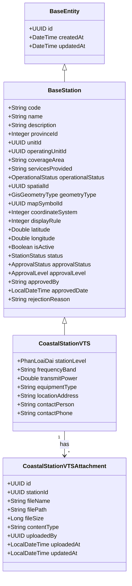

# Lean Spec: Quản lý tài sản Báo hiệu & Thông tin (M-004)

## 1. Summary

Module M-004 quản lý các tài sản báo hiệu hàng hải và đài thông tin duyên hải, phục vụ công tác quản lý nhà nước về hàng hải. Phạm vi bao gồm: Đèn biển (BeaconLight), Phao tiêu (Buoy), Nhà trạm (NhaTramPhao, NhaTramDen), và 5 loại Đài Thông tin Duyên hải (CoastalStationVTS, Inmarsat, COSPAS-SARSAT, LRIT, Hải Phòng). Mỗi loại tài sản có quy trình CRUD và phê duyệt riêng, tuân thủ quy chuẩn kỹ thuật hàng hải (IALA, WGS84).

## 2. Scope

### In Scope
- CRUD 9 loại tài sản: BeaconLight, Buoy, NhaTramPhao, NhaTramDen, CoastalStationVTS, CoastalStationInmarsat, CoastalStationCospasSarsat, CoastalStationLRIT, CoastalStationHaiphong
- Quy trình phê duyệt (Beacon: 2 cấp; CoastalStation: simplified APPROVED/REJECTED)
- Soft-delete toàn bộ tài sản (trừ CoastalStationVTS: xóa DRAFT → chuyển status thành "Lịch sử")
- Lịch sử thay đổi (audit log) cho mọi thao tác CRUD + phê duyệt
- Đồng bộ GIS (Beacon + Buoy → M-007; Nhà trạm → M-007)
- Phân quyền RBAC: admin, operator, approver_L1, approver_L2, viewer

### Out of Scope
- Tích hợp thiết bị IoT / real-time monitoring
- Quy trình bảo trì, sửa chữa hiện trường
- Xuất báo cáo PDF/Excel nâng cao (thuộc M-008)
- Batch import / export

## 3. Enums

| Enum | Values | Used By |
|------|--------|---------|
| BeaconLightType | LIGHTHOUSE, BEACON_LIGHT, BEACON_MARK | BeaconLight.type |
| BuoyType | CARDINAL, SECTOR, SPECIAL, SAFE_WATER, ISOLATED_DANGER | Buoy.type, NhaTramPhao.type |
| BeaconStatus | DRAFT, PENDING_APPROVAL, APPROVED_L1, APPROVED_L2, PUBLISHED, REJECTED, DELETED | BeaconLight.status, Buoy.status |
| NhaTramStatus | DRAFT, PENDING_APPROVAL, APPROVED_L1, APPROVED_L2, PUBLISHED, REJECTED, DELETED | NhaTramPhao.status, NhaTramDen.status |
| StationStatus | DRAFT, PENDING_APPROVAL, APPROVED_L1, APPROVED_L2, PUBLISHED, DELETED, REJECTED | All CoastalStation*.status (code-level Java enum) |
| **CoastalStationVTSStatus** | **Lưu tạm, Chờ duyệt cấp Cảng vụ/Chi cục, Từ chối cấp Cảng vụ/Chi cục, Chờ duyệt cấp Cục, Từ chối cấp Cục, Đã phê duyệt, Lịch sử** | **CoastalStationVTS F-092→F-097 (7 trạng thái). Handoff Section 3 + F-094 (DRAFT→Lịch sử).** |
| ApprovalStatus | DRAFT(0), PROPOSED(1), PENDING_APPROVAL(2), APPROVED_LEVEL1(3), APPROVED_LEVEL2(4), APPROVED(5), REJECTED(6) | All station approval flows |
| ApprovalLevel | LEVEL_0(0), LEVEL_1(1), LEVEL_2(2) | Tracks which level performed approval |
| **PhanLoaiDai** | **LOAI_I, LOAI_II, LOAI_III, LOAI_IV, LOAI_V** | **CoastalStationVTS.stationLevel** |
| **GisGeometryType** | **POINT(1), LINE(2), POLYGON(3)** | **All GIS-enabled entities (NavigationChannel, VtsSystem, CoastalStationVTS, etc.)** |
| **UsageStatus** | **Không sử dụng(0), Đang sử dụng(1)** | **CoastalStationVTS (tình trạng vận hành thực tế, KHÔNG phải trạng thái phê duyệt). Default: Đang sử dụng.** |

## 4. Domain Glossary — Entities

### CoastalStationVTS (extends BaseStation)

| Field | Type | Constraints | Notes |
|-------|------|-------------|-------|
| id | UUID | PK | Kế thừa BaseEntity |
| **code** | **String** | **@NotBlank, @Size(max=50), unique** | **🔴 Sửa: tự sinh format DTTDH-xxxxx, immutable sau khi tạo (R1-R3).** |
| name | String | @NotBlank, @Size(max=255) | |
| description | String | @Size(max=1000) | |
| **stationLevel** | **PhanLoaiDai enum** | **@NotNull** | **🔴 Loại I → Loại V. Bắt buộc khi tạo. Lưu ORDINAL (SMALLINT).** |
| provinceId | Integer | | |
| unitId | UUID | | Đơn vị quản lý |
| **operatingUnitId** | **UUID** | | **🔴 Đơn vị khai thác (tách biệt unitId). Pattern: NavigationChannel.operatingUnitId.** |
| **coverageArea** | **String** | **@Size(max=500)** | **🔴 Vùng phủ sóng. VD: Hải Phòng, Cospas-Sarsat.** |
| **servicesProvided** | **JSON Array / Bitmask** | | **🔴 Multi-select từ 9 dịch vụ cố định (INMARSAT, COSPAS-SARSAT, DSC, RTP, MSI RTP, MSI NAVTEX, MSI EGC, LRIT, Kết nối TT hàng hải). Handoff 2.2.** |
| **usageStatus** | **Integer** | **Default: 1** | **🔴 Tình trạng vận hành: 0=Không sử dụng, 1=Đang sử dụng. KHÔNG liên quan đến trạng thái phê duyệt.** |
| spatialId | UUID | | |
| **geometryType** | **GisGeometryType enum** | | **🔴 Loại đối tượng GIS: POINT(1), LINE(2), POLYGON(3). Lưu ORDINAL. Pattern: NavigationChannel, VtsSystem.** |
| **mapSymbolId** | **UUID** | | **🔴 Biểu tượng bản đồ. Pattern: Port, DryPort.** |
| **coordinateSystem** | **Integer** | | **🔴 Hệ quy chiếu. Pattern: Port, DryPort, Berth.** |
| **displayRule** | **Integer** | | **🔴 Quy tắc hiển thị. Pattern: Port, DryPort, Berth.** |
| **latitude** | **Double** | **@DecimalMin(-90) @DecimalMax(90)** | **🔴 Vĩ độ (WGS84). DTO đã có nhưng entity thiếu.** |
| **longitude** | **Double** | **@DecimalMin(-180) @DecimalMax(180)** | **🔴 Kinh độ (WGS84). DTO đã có nhưng entity thiếu.** |
| isActive | Boolean | Default: true | |
| status | StationStatus | Default: PENDING_APPROVAL | Xem ghi chú StationStatus (VTS logical) ở trên |
| approvalStatus | ApprovalStatus | Default: PROPOSED(0) | |
| approvalLevel | ApprovalLevel | | LEVEL_1 or LEVEL_2 |
| approvedBy | String | | |
| approvedDate | LocalDateTime | | |
| rejectionReason | String | @Size(max=1000) | |
| frequencyBand | String | | Dải tần hoạt động |
| transmitPower | Double | | Công suất phát |
| equipmentType | String | | Loại thiết bị |
| locationAddress | String | @Size(max=1000) | Địa chỉ trạm |
| contactPerson | String | | Người liên hệ |
| contactPhone | String | | SĐT liên hệ |
| createdAt, updatedAt | Timestamp | Auto | Kế thừa BaseEntity |

### CoastalStationVTSAttachment (bảng coastal_station_vts_attachments)

| Field | Type | Constraints | Notes |
|-------|------|-------------|-------|
| **id** | **UUID** | **PK** | **🔴 Bảng mới** |
| **stationId** | **UUID** | **FK → coastal_station_vts.id, NOT NULL** | **🔴** |
| **fileName** | **String** | **@NotBlank, @Size(max=255)** | **🔴 Tên file gốc** |
| **filePath** | **String** | **@NotBlank, @Size(max=500)** | **🔴 Đường dẫn lưu trữ** |
| **fileSize** | **Long** | **@NotNull** | **🔴 Dung lượng (bytes)** |
| **contentType** | **String** | **@Size(max=100)** | **🔴 MIME type** |
| **uploadedBy** | **UUID** | | **🔴 Người upload** |
| **uploadedAt** | **LocalDateTime** | **NOT NULL** | **🔴 Thời điểm upload** |
| **updatedAt** | **LocalDateTime** | **NOT NULL** | **🔴 Thời điểm cập nhật cuối** |

### CoastalStationInmarsat (bảng `coastal_station_inmarsat`) — F-098..F-103

| # | Tên trường nghiệp vụ | Tên thuộc tính Java | Tên cột trong CSDL (DB Column) | Kiểu CSDL & Ràng buộc | Ghi chú |
|---|---|---|---|---|---|
| 1 | Khóa chính | `id` | `id` | `UUID PRIMARY KEY` | Kế thừa BaseEntity |
| 2 | Đơn vị quản lý | `orgUnitId` | `org_unit_id` (`unit_id`) | `UUID NOT NULL` | Scope filter phân cấp đơn vị |
| 3 | Đơn vị khai thác | `operatingOrgId` | `operating_org_id` | `UUID` | Đơn vị vận hành khai thác |
| 4 | Mã đài | `code` / `deviceCode` | `code` (`device_code`) | `VARCHAR(50) UNIQUE` | Tự sinh format `INMARSAT-{seq}` |
| 5 | Tên đài | `name` / `stationName` | `name` (`station_name`) | `VARCHAR(255) NOT NULL` | Tên đài vệ tinh Inmarsat |
| 6 | Địa điểm (Tỉnh/TP) | `provinceId` | `province_id` | `INTEGER NOT NULL` | Mã tỉnh thành (provinces) |
| 7 | Địa điểm chi tiết | `locationAddress` | `location_address` (`location_detail`) | `VARCHAR(1000) NOT NULL` | Địa chỉ cụ thể |
| 8 | Tình trạng hoạt động | `conditionStatus` | `condition_status` | `VARCHAR(50) DEFAULT 'OPERATIONAL'` | OPERATIONAL, MAINTENANCE, STOPPED |
| 9 | Vùng phủ sóng | `coverageZone` | `coverage_zone` (`coverage_area`) | `VARCHAR(1000)` | Vùng biển/vệ tinh phủ sóng |
| 10 | Dịch vụ cung cấp | `services` | `services` | `VARCHAR(1000)` | Multi-select JSON / chuỗi |
| 11 | Tần số liên lạc | `frequency` | `frequency` | `VARCHAR(500)` | Tần số hoạt động |
| 12 | Loại Modem / Thiết bị | `modemType` | `modem_type` | `VARCHAR(500)` | Loại thiết bị |
| 13 | Mã SAR (TKCN) | `sarCode` | `sar_code` | `VARCHAR(500)` | Mã tìm kiếm cứu nạn |
| 14 | Hệ thống vệ tinh | `satelliteSystem` | `satellite_system` | `VARCHAR(500)` | Hệ thống vệ tinh |
| 15 | Ghi chú | `notes` / `description` | `notes` (`description`) | `TEXT` / `VARCHAR(1000)` | Ghi chú kỹ thuật |
| 16 | Cán bộ liên hệ | `contactPerson` | `contact_person` | `VARCHAR(500)` | Cán bộ trực ban |
| 17 | SĐT liên hệ | `contactPhone` | `contact_phone` | `VARCHAR(500)` | Số điện thoại liên lạc |
| 18 | Loại đối tượng (GIS) | `objectType` | `object_type` | `VARCHAR(50)` | POINT, LINE, POLYGON |
| 19 | Biểu tượng bản đồ | `symbol` | `symbol` | `VARCHAR(100)` | Ký hiệu icon bản đồ |
| 20 | Hệ quy chiếu | `coordinateSystem` | `coordinate_system` | `VARCHAR(50) DEFAULT 'WGS84'` | WGS84 |
| 21 | Quy tắc hiển thị | `displayRule` | `display_rule` | `VARCHAR(500)` | Zoom/layer hiển thị |
| 22 | Tọa độ Vĩ độ | `latitude` | `latitude` | `DECIMAL(10,6)` | WGS84 (-90..90) |
| 23 | Tọa độ Kinh độ | `longitude` | `longitude` | `DECIMAL(10,6)` | WGS84 (-180..180) |
| 24 | File đính kèm | `attachments` | Bảng `infrastructure_attachments` | `asset_id = inmarsat.id` | Tệp tài liệu $\le 10\text{MB}$ |
| 25 | Trạng thái phê duyệt | `approvalStatus` | `approval_status` | `SMALLINT DEFAULT 0` | 7 trạng thái chuẩn M-1006 |
| 26 | Cấp phê duyệt | `approvalLevel` | `approval_level` | `SMALLINT` | Level 1 / Level 2 |
| 27 | Thời điểm gửi duyệt | `submittedAt` | `submitted_at` | `TIMESTAMP` | Audit gửi duyệt |
| 28 | Cán bộ gửi duyệt | `submittedBy` | `submitted_by` | `UUID` | FK app_users.id |
| 29 | Cán bộ duyệt C1 | `approverLevel1` | `approver_level1` | `UUID` | Cấp Cảng vụ/Chi cục |
| 30 | Thời điểm duyệt C1 | `approvedDateLevel1`| `approved_date_level1` | `TIMESTAMP` | Thời điểm C1 |
| 31 | Cán bộ duyệt C2 | `approverLevel2` | `approver_level2` (`approved_by`)| `UUID` | Cấp Cục Hàng hải |
| 32 | Thời điểm duyệt C2 | `approvedDateLevel2`| `approved_date_level2` (`approved_date`)| `TIMESTAMP` | Thời điểm C2 |
| 33 | Nội dung duyệt / Từ chối| `rejectionReason` | `rejection_reason` | `VARCHAR(1000)` | Tối thiểu 10 ký tự nếu từ chối |
| 34 | Cán bộ tạo | `createdBy` | `created_by` | `UUID` | Kế thừa BaseEntity |
| 35 | Thời điểm tạo | `createdAt` | `created_at` | `TIMESTAMP` | Kế thừa BaseEntity |
| 36 | Cán bộ cập nhật | `updatedBy` | `updated_by` | `UUID` | Kế thừa BaseEntity |
| 37 | Thời điểm cập nhật | `updatedAt` | `updated_at` | `TIMESTAMP` | Kế thừa BaseEntity |
| 38 | Thông tin vận hành | Liên thông M-011 | Bảng `operation_plans` | `asset_id = inmarsat.id` | Mã KH, Tên KH, Ngày BĐ, Ngày KT |
| 39 | Thông tin bảo trì | Liên thông M-011 | Bảng `maintenance_plans` | `asset_id = inmarsat.id` | Mã KH, Tên KH, TG BĐ, TG KT |
| 40 | Thông tin sự cố | Liên thông M-011 | Bảng `incidents` | `asset_id = inmarsat.id` | Mã sự cố, Loại, Địa điểm, Thời gian |

### Other Entities (summary)

| Entity | Table | Distinct Fields |
|--------|-------|-----------------|
| BeaconLight | beacon_light | type, latitude, longitude, lightRange, lightColor, lightCharacteristic, range, lastMaintenanceDate, nextMaintenanceDate |
| Buoy | buoy | type, latitude, longitude, color, shape, lightCharacteristic, range, lastInspectionDate, nextInspectionDate |
| NhaTramPhao | nha_tram_phao | extends BaseNhaTram + BuoyType-specific fields |
| NhaTramDen | nha_tram_den | extends BaseNhaTram + BeaconLightType-specific fields |
| CoastalStationInmarsat | coastal_station_inmarsat | deviceCode, modemType, frequency, coverageZone, sarCode, services, satelliteSystem |
| CoastalStationCospasSarsat | coastal_station_cospas_sarsat | frequency, coverageArea, beaconProtocol, emergencyChannel, antennaType, signalRange, operatingMode |
| CoastalStationLRIT | coastal_station_lrit | terminalId, imoNumber, reportingInterval, antennaHeight, powerOutput, antennaType, dataFormat, communicationChannel, coverageArea |
| CoastalStationHaiphong | coastal_station_haiphong | portName, district, ward, operationalLicense, licenseExpiry, inspectorName, inspectorPhone, lastInspectionDate, nextInspectionDate, coverageArea, equipmentType, communicationFrequency |

## 5. ERD — CoastalStationVTS



## 6. Approval Workflow

### Beacon & NhaTram (2-level approval)
```
DRAFT → submitForApproval → PENDING_APPROVAL → approve L1 → APPROVED_L1 → approve L2 → PUBLISHED (→ GIS sync)
                                              ↘ reject (any level) → REJECTED → DRAFT (re-edit)
```

### CoastalStationVTS (2 cấp phê duyệt, F-092→F-097)
```
Lưu tạm → Gửi phê duyệt → Chờ duyệt cấp Cảng vụ/Chi cục → Duyệt C1 → Chờ duyệt cấp Cục → Duyệt C2 → Đã phê duyệt
   │  │                      ↘ Từ chối C1 → Từ chối cấp Cảng vụ/Chi cục      ↘ Từ chối C2 → Từ chối cấp Cục
   │  │                           │ (sửa & gửi lại → Chờ duyệt CC)                │ (sửa & gửi lại → Chờ duyệt CC)
   │  └── Xóa → Lịch sử (read-only, vẫn hiển thị trong danh sách, không soft-delete)
   └── Lưu và phê duyệt (chỉ Cấp Cục, R14) ──→ Đã phê duyệt
```

- **7 trạng thái:** Lưu tạm, Chờ duyệt CC, Từ chối CC, Chờ duyệt Cục, Từ chối Cục, Đã phê duyệt, Lịch sử
- **Lịch sử (trạng thái thứ 7):** đến từ DRAFT delete. Read-only, vẫn hiển thị trong danh sách (không @SQLRestriction). Không soft-delete, không deletedAt.
- Từ chối là trạng thái hiện tại, không phải lịch sử (R16)
- Duyệt/Từ chối phải nhập nội dung (lý do)
- Gửi duyệt lại từ Từ chối → luôn về Chờ duyệt CC (R17)
- Sửa Đã phê duyệt → tự về Lưu tạm (R10)
- Chỉ Cấp Cục được phê duyệt trực tiếp (R14)

## 7. Delete Pattern

### Beacon & Buoy & NhaTram
- Soft delete via `deletedAt` timestamp
- `@SQLRestriction("deleted_at IS NULL")` hides from normal queries
- DELETE action recorded in history as `SOFT_DELETE`
- Status set to `DELETED`

### CoastalStationVTS (F-094)
- **Chỉ xóa khi trạng thái = Lưu tạm** (R8)
- **KHÔNG soft-delete** — không đặt `deletedAt`, không `@SQLRestriction`
- **Chuyển status → "Lịch sử"** (trạng thái thứ 7) — vẫn hiển thị trong danh sách
- Không thể xóa nếu đã là Lịch sử
- DELETE ghi lịch sử DELETE

## 8. Business Rules

| ID | Rule | Applies-to | Source |
|----|------|------------|--------|
| BR-001 | Code unique, required, max 50 chars | All entities | @Column(unique=true), @NotBlank |
| BR-002 | Name required, max varies by entity | All entities | @NotBlank |
| BR-003 | Latitude -90..90 | Beacon, Buoy, NhaTram | @DecimalMin/Max |
| BR-004 | Longitude -180..180 | Beacon, Buoy, NhaTram | @DecimalMin/Max |
| BR-005 | LightRange 0.01–60.0 | BeaconLight | @DecimalMin/Max |
| BR-006 | Range 0.01–100.0 | BeaconLight, Buoy | @DecimalMin/Max |
| BR-007 | Description max 1000 chars | All entities | @Size(max=1000) |
| BR-008 | Code immutable after create | All entities | Service layer |
| BR-009 | No hard delete — soft-delete only | Beacon, Buoy, NhaTram | softDelete(), @SQLRestriction |
| BR-010 | Approve L1 requires PENDING_APPROVAL | Beacon, Buoy, NhaTram | Service validation |
| BR-011 | Approve L2 requires APPROVED_L1 | Beacon, Buoy, NhaTram | Service validation |
| BR-012 | Rejection requires rejectionReason | All entities | @NotNull |
| BR-013 | PUBLISHED → sync to GIS M-007 | Beacon, Buoy, NhaTram | PointObjectSyncService |
| BR-014 | Self-approval prevention | Beacon, Buoy | creatorId != approverId |
| BR-015 | Default status = DRAFT on create | Beacon, Buoy | @Builder.Default |
| BR-016 | Name max 255 chars | CoastalStationVTS | @Size(max=255) |
| BR-017 | stationLevel required (PhanLoaiDai) | CoastalStationVTS | @NotNull |
| BR-018 | LightCharacteristic max 100 chars | BeaconLight | @Size(max=100) |
| BR-019 | LightColor max 50 chars | BeaconLight | @Size(max=50) |
| **BR-020** | **Chỉ xóa Đài TTDH khi trạng thái = Lưu tạm, chuyển status → Lịch sử (không soft-delete, không deletedAt, vẫn hiển thị trong danh sách)** | **CoastalStationVTS** | **R8, F-094** |
| **BR-021** | **stationLevel là trường bắt buộc khi tạo Đài TTDH** | **CoastalStationVTS** | **F-092 form validation** |
| **BR-022** | **Code tự sinh format DTTDH-xxxxx, immutable sau khi tạo (R1-R3)** | **CoastalStationVTS.code** | **Handoff R1-R3** |
| **BR-023** | **Đơn vị quản lý mặc định theo user, khóa khi sửa (R4-R5)** | **CoastalStationVTS.unitId** | **Handoff R4-R5** |
| **BR-024** | **7 trạng thái: Lưu tạm, Chờ duyệt CC, Từ chối CC, Chờ duyệt Cục, Từ chối Cục, Đã phê duyệt, Lịch sử. Lịch sử = read-only, đến từ DRAFT delete.** | **CoastalStationVTS.status** | **Handoff Section 3 + F-094** |
| **BR-025** | **Chỉ Sửa khi: Lưu tạm, Từ chối CC, Từ chối Cục, Đã phê duyệt. Chờ duyệt + Lịch sử bị khóa (R7, R11).** | **CoastalStationVTS** | **Handoff R7, R11** |
| **BR-026** | **Sửa Đã phê duyệt → tự về Lưu tạm (R10)** | **CoastalStationVTS** | **Handoff R10** |
| **BR-027** | **Duyệt 2 cấp: CC → Cục. Duyệt/Từ chối phải nhập nội dung. Phê duyệt trực tiếp chỉ Cục (R14). Lịch sử không thể duyệt/từ chối.** | **CoastalStationVTS** | **Handoff Section 4** |
| **BR-028** | **Từ chối không phải lịch sử. Gửi duyệt lại → về Chờ duyệt CC (R16-R17).** | **CoastalStationVTS** | **Handoff R16-R17** |
| **BR-029** | **Dịch vụ: multi-select 9 dịch vụ cố định (Handoff 2.2)** | **CoastalStationVTS.servicesProvided** | **Handoff 2.2** |
| **BR-030** | **Tình trạng: 2 giá trị Đang sử dụng/Không sử dụng, mặc định Đang sử dụng. KHÔNG liên quan trạng thái phê duyệt.** | **CoastalStationVTS.usageStatus** | **Handoff 2.1#10, 3.3** |
| **BR-031** | **Các trường tần số liên lạc, transmitPower, equipmentType bị ẩn với Đài TTDH** | **CoastalStationVTS** | **Handoff 2.5** |
| **BR-032** | **Lịch sử là trạng thái read-only: không sửa, không xóa, không gửi duyệt, không duyệt/từ chối. Vẫn hiển thị trong danh sách.** | **CoastalStationVTS** | **F-094** |

## 9. Feature Table — CoastalStationVTS (F-092→F-097)

| Feature | Name | Description | Endpoint |
|---------|------|-------------|----------|
| F-092 | Tạo mới | Tạo mới Đài TTDH với đầy đủ 12 trường mới (tự sinh code, stationLevel, operatingUnitId, coverageArea, servicesProvided, operationalStatus, geometryType, mapSymbolId, coordinateSystem, displayRule, lat/lng, attachments). **3 nút Lưu**: Lưu tạm (DRAFT), Lưu và gửi phê duyệt (PENDING_APPROVAL), Lưu và phê duyệt (APPROVED — chỉ Admin/Lãnh đạo). stationLevel là trường bắt buộc. StatusTabs: 7 tab (thêm Lịch sử). | POST /api/v1/stations/coastal |
| F-093 | Cập nhật | Cập nhật thông tin Đài TTDH (trừ code immutable). Phụ thuộc trạng thái: Lưu tạm (sửa tất cả), Đã phê duyệt (sửa, ẩn Lưu tạm), Từ chối (sửa + gửi lại), Chờ duyệt/Lịch sử (chỉ đọc). | PUT /api/v1/stations/coastal/{id} |
| F-094 | Xóa | Xóa Đài TTDH — chỉ được xóa bản ghi Lưu tạm, chuyển status → Lịch sử (giữ trong danh sách, không soft-delete, không deletedAt). Không thể xóa nếu đã là Lịch sử. Ghi lịch sử DELETE. | DELETE /api/v1/stations/coastal/{id} |
| F-095 | Phê duyệt | Phê duyệt C1/C2, chuyển status sang APPROVED/REJECTED. approvalLevel tracks cấp đã duyệt. Từ chối yêu cầu rejectionReason. Lịch sử: không thể duyệt/từ chối. | POST /api/v1/stations/coastal/{id}/approve, /{id}/reject |
| F-096 | Xem chi tiết | Xem toàn bộ thông tin Đài TTDH, hiển thị stationLevel badge (Loại I→V), status badge màu (7 màu: Lịch sử=xám đậm), approvalLevel badge. | GET /api/v1/stations/coastal/{id} |
| F-097 | Lịch sử | Lịch sử thay đổi — cả UI timeline và BE audit log. Action types: CREATE, UPDATE, DELETE, APPROVE, REJECT. changedField/previousValue/newValue. DELETE action ghi nhận cho DRAFT→Lịch sử. | GET /api/v1/stations/coastal/{id}/history |

## 10. Non-Functional Requirements

| Area | Requirement |
|------|-------------|
| Performance | API response < 500ms for list (paginated 20/page), < 200ms for single entity GET |
| Scalability | Support up to 10,000 stations per type; pagination at 20/50/100 per page |
| Security | RBAC via @PreAuthorize on all endpoints; input sanitization (XSS, SQL injection); CORS configured |
| Reliability | Soft-delete preserves audit trail for Beacon/Buoy/NhaTram; CoastalStationVTS uses Lịch sử status instead of soft-delete; idempotent DELETE |
| UX | Responsive UI; loading skeletons; empty states; Vietnamese error messages; WCAG 2.1 AA |
| Legal | Tuân thủ Nghị định về quản lý tài sản công; dữ liệu tọa độ theo WGS84; lịch sử kiểm toán đầy đủ |

## 11. Pipeline Triage

| Question | Answer | Rationale |
|----------|--------|-----------|
| Q1: Creates new domain elements? | Yes | PhanLoaiDai enum mới; 12 trường mới trên CoastalStationVTS; CoastalStationVTSAttachment entity + bảng mới; Lịch sử status pattern (7th status); code tự sinh |
| Q2: Affects system architecture? | Yes | Simplified approval flow for VTS; Lịch sử status instead of deletedAt for delete (no soft-delete); dual audit log (UI + BE); OperationalStatus pattern từ Port/DryPort; attachment storage pattern |
| Q3: Approach clear from existing architecture? | Yes | Follows existing CoastalStation* patterns; extends BaseStation; reuses ApprovalStatus/ApprovalLevel enums |

**Triage verdict:** Route to `engineering-system-architect` at **full design depth** — new enum, simplified approval model, and Lịch sử pattern are material architectural decisions requiring aggregate design review.
