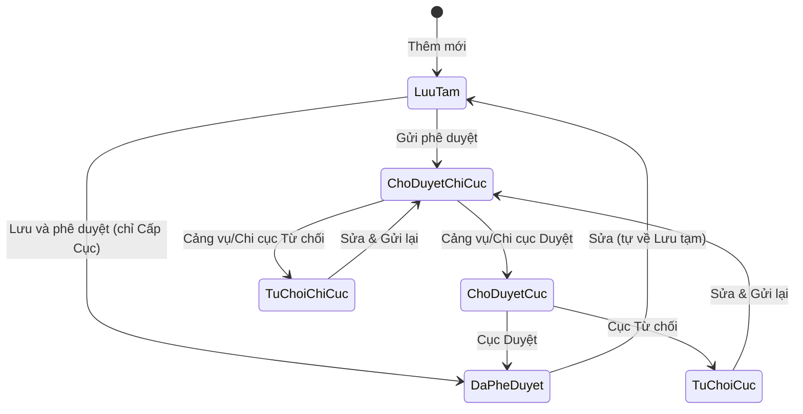

# Handoff Nghiệp vụ: Quản lý thông tin đài TTDH

> **Hệ thống:** MTIS (Hệ thống thông tin hàng hải)
> **Phân hệ:** Kết cấu hạ tầng hàng hải (KCHT) & Tài sản
> **Ngày bàn giao:** 11/08/2026
> **Người nhận:** Backend Developer / BA / QA
> **Phạm vi:** Thuần nghiệp vụ — không bàn về code, entity, tên bảng, tên trường BE

---

## 1. Tổng quan nghiệp vụ

Đài Thông tin Duyên hải (TTDH) là một thành phần thuộc nhóm **Mạng viễn thông hàng hải**, do Cục Hàng hải Việt Nam quản lý. Đài TTDH cung cấp các dịch vụ thông tin liên lạc, cứu nạn và cảnh báo an toàn cho tàu thuyền trên biển.

Module này phục vụ việc quản lý danh mục các đài TTDH trên toàn quốc với đầy đủ thông tin hành chính, kỹ thuật, vị trí địa lý (GIS), cùng luồng phê duyệt 2 cấp và quản lý tài sản trực thuộc.

### 5 ngữ cảnh nghiệp vụ (mã chức năng)

| Ngữ cảnh | Mã chức năng | Phân hệ | Mục đích |
|----------|-------------|---------|----------|
| Tra cứu | TCKC-031 | KCHT | Xem, tìm kiếm — chỉ đọc |
| Quản lý | QLKC-078 | KCHT | Thêm / Sửa / Xóa / Gửi phê duyệt |
| Phê duyệt | PDKC-079 | KCHT | Duyệt 2 cấp: Cảng vụ/Chi cục → Cục |
| Quản lý tài sản | QLTS-134 | Tài sản | Thêm / Sửa / Xóa tài sản thuộc đài |
| Phê duyệt tài sản | PDTS-135 | Tài sản | Duyệt tài sản 2 cấp + duyệt thay đổi nguyên giá |

---

## 2. Các trường thông tin cần lưu

### 2.1. Thông tin chung (hành chính)

| # | Trường | Bắt buộc | Mô tả nghiệp vụ | Ràng buộc |
|---|--------|:---:|---|---|
| 1 | Đơn vị quản lý | ✅ | Đơn vị chịu trách nhiệm quản lý đài | Mặc định theo user đăng nhập; **khóa** khi sửa |
| 2 | Đơn vị khai thác | | Đơn vị đang vận hành thực tế | Có thể khác đơn vị quản lý |
| 3 | Mã đài | (tự sinh) | Mã định danh duy nhất | Hệ thống tự sinh `DTTDH-xxxxx`, không cho sửa |
| 4 | Tên đài | ✅ | Tên chính thức của đài | Tối đa 255 ký tự |
| 5 | Phân loại đài | ✅ | Loại I, II, III, IV, V | Theo phân hạng quy mô / tầm quan trọng |
| 6 | Địa điểm (Tỉnh/TP) | ✅ | Tỉnh/thành phố nơi đặt đài | |
| 7 | Địa điểm chi tiết | ✅ | Địa chỉ cụ thể | Tối đa 500 ký tự |
| 8 | Vùng phủ sóng | | Phạm vi hoạt động | VD: 30 hải lý |
| 9 | Dịch vụ cung cấp | | Các dịch vụ đài cung cấp | Chọn nhiều (xem mục 2.2) |
| 10 | Tình trạng | ✅ | Đang sử dụng / Không sử dụng | Mặc định: Đang sử dụng |
| 11 | Ghi chú | | Thông tin bổ sung | Tối đa 2000 ký tự |

### 2.2. Dịch vụ cung cấp (chọn nhiều)

Một đài TTDH có thể cung cấp đồng thời nhiều dịch vụ:

| Mã | Dịch vụ | Mục đích nghiệp vụ |
|----|---------|-------------------|
| 1 | INMARSAT | Trực canh cấp cứu qua vệ tinh INMARSAT |
| 2 | COSPAS-SARSAT | Trực canh cấp cứu qua hệ thống vệ tinh COSPAS-SARSAT |
| 3 | DSC | Gọi chọn số kỹ thuật số - cấp cứu |
| 4 | RTP | Trực canh cấp cứu qua RTP |
| 5 | MSI RTP | Phát thông tin an toàn hàng hải qua RTP |
| 6 | MSI NAVTEX | Phát thông tin an toàn hàng hải qua NAVTEX |
| 7 | MSI EGC | Phát thông tin an toàn hàng hải qua EGC |
| 8 | LRIT | Nhận dạng và truy theo tầm xa tàu thuyền |
| 9 | Kết nối TT hàng hải | Kết nối thông tin nội bộ ngành hàng hải |

### 2.3. Thông tin vị trí (GIS)

| Trường | Mô tả |
|--------|-------|
| Loại đối tượng | Điểm / Đường / Vùng |
| Biểu tượng | Icon hiển thị trên bản đồ |
| Hệ quy chiếu | Hệ tọa độ |
| Quy tắc hiển thị | Cách hiển thị trên bản đồ |
| Tọa độ | Danh sách điểm tọa độ |

### 2.4. File đính kèm

Cho phép đính kèm nhiều file (quyết định thành lập, hồ sơ kỹ thuật, ảnh hiện trạng...).

### 2.5. Các trường bị ẩn riêng cho Đài TTDH

Các trường sau có trong cấu trúc chung của nhóm Mạng viễn thông nhưng **bị ẩn** với đài TTDH vì không phù hợp nghiệp vụ:

- Thuộc TTDH VTS
- Tần số liên lạc
- Đơn vị tính
- Số lượng
- Model
- Hãng sản xuất
- Năm đưa vào sử dụng

---

## 3. Trạng thái trong danh sách & luồng chuyển trạng thái

### 3.1. Các trạng thái

| # | Trạng thái | Ý nghĩa | Được Sửa? | Được Xóa? | Được Gửi duyệt? |
|---|-----------|---------|:---:|:---:|:---:|
| 1 | **Lưu tạm** | Vừa tạo mới hoặc vừa sửa từ bản ghi Đã phê duyệt, chưa gửi duyệt | ✅ | ✅ | ✅ |
| 2 | **Chờ duyệt cấp Cảng vụ/Chi cục** | Đã gửi phê duyệt, đang chờ cấp dưới duyệt | ❌ | ❌ | ❌ |
| 3 | **Từ chối cấp Cảng vụ/Chi cục** | Bị cấp Chi cục từ chối, trả về để sửa | ✅ | ❌ | ✅ |
| 4 | **Chờ duyệt cấp Cục** | Cấp Chi cục đã duyệt, đang chờ Cục duyệt | ❌ | ❌ | ❌ |
| 5 | **Từ chối cấp Cục** | Bị Cục từ chối, trả về để sửa | ✅ | ❌ | ✅ |
| 6 | **Đã phê duyệt** | Hoàn tất phê duyệt | ✅ | ❌ | ❌ |

### 3.2. Sơ đồ luồng chuyển trạng thái



### 3.3. Phân biệt Tình trạng và Trạng thái

| Khái niệm | Ý nghĩa | Giá trị | Dùng ở đâu |
|-----------|---------|--------|-----------|
| **Tình trạng** | Trạng thái vận hành thực tế của đài | Đang sử dụng / Không sử dụng | Bộ lọc tra cứu, form quản lý |
| **Trạng thái** | Trạng thái trong luồng phê duyệt | Lưu tạm / Chờ duyệt / Từ chối / Đã phê duyệt | Bộ lọc phê duyệt, phân quyền thao tác |

> Màn hình Tra cứu (TCKC-031) chỉ lọc theo **Tình trạng**, không lọc theo **Trạng thái phê duyệt**.
> Màn hình Phê duyệt (PDKC-079) có thêm bộ lọc **Trạng thái** và **Cán bộ cập nhật**.

---

## 4. Quy trình gửi phê duyệt

### 4.1. Luồng phê duyệt chuẩn (2 cấp)

```
Người quản lý                  Cảng vụ/Chi cục                  Cục
─────────────                  ────────────────                  ───
   Tạo mới
     │
     ▼
 Lưu tạm ── Gửi phê duyệt ──▶ Chờ duyệt
                              cấp Chi cục ── Duyệt ──▶ Chờ duyệt
                                                       cấp Cục ── Duyệt ──▶ Đã phê duyệt
                                │   │                             │   │
                                │   └── Từ chối ──▶ Từ chối       │   └── Từ chối ──▶ Từ chối
                                │                  cấp Chi cục    │                  cấp Cục
                                │                        │        │                        │
                                ◀━━━━━━━━━━━━━━━━━━━━━━┛        ◀━━━━━━━━━━━━━━━━━━━━━━━━━━┛
                                          (Sửa & Gửi lại)                  (Sửa & Gửi lại)
```

### 4.2. Các thao tác phê duyệt

| Thao tác | Ai thực hiện | Điều kiện | Kết quả |
|----------|-------------|-----------|---------|
| **Duyệt** | Cảng vụ/Chi cục | Bản ghi đang "Chờ duyệt cấp Cảng vụ/Chi cục" | → Chuyển sang "Chờ duyệt cấp Cục" |
| **Từ chối** | Cảng vụ/Chi cục | Bản ghi đang "Chờ duyệt cấp Cảng vụ/Chi cục" | → Chuyển sang "Từ chối cấp Cảng vụ/Chi cục" |
| **Duyệt** | Cục | Bản ghi đang "Chờ duyệt cấp Cục" | → Chuyển sang "Đã phê duyệt" |
| **Từ chối** | Cục | Bản ghi đang "Chờ duyệt cấp Cục" | → Chuyển sang "Từ chối cấp Cục" |
| **Phê duyệt trực tiếp** | Cục | Bản ghi đang "Lưu tạm" (lúc tạo mới) | → Chuyển thẳng sang "Đã phê duyệt" |

> Khi duyệt hoặc từ chối, người thực hiện **phải nhập nội dung phê duyệt** (lý do) trước khi xác nhận.

### 4.3. Các nút lưu trên form quản lý

| Nút | Hành vi | Kết quả trạng thái |
|-----|---------|-------------------|
| **Lưu tạm** | Chỉ lưu dữ liệu, không gửi duyệt | Lưu tạm |
| **Lưu và gửi phê duyệt** | Lưu + tự động gửi lên cấp Chi cục | Chờ duyệt cấp Cảng vụ/Chi cục |
| **Lưu và phê duyệt** | Lưu + duyệt thẳng (chỉ hiển thị cho Cấp Cục) | Đã phê duyệt |

> Nút "Lưu tạm" khi sửa chỉ bật nếu form có thay đổi dữ liệu (dirty detection).

---

## 5. Các rule nghiệp vụ

### 5.1. Rule về Mã đài

| Rule | Mô tả |
|------|-------|
| **R1** | Mã đài do hệ thống tự sinh theo định dạng `DTTDH-xxxxx` |
| **R2** | Người dùng không được nhập, không được sửa mã đài |
| **R3** | Mã đài là duy nhất trên toàn hệ thống |

### 5.2. Rule về Đơn vị quản lý

| Rule | Mô tả |
|------|-------|
| **R4** | Khi thêm mới: "Đơn vị quản lý" mặc định theo đơn vị của user đăng nhập |
| **R5** | Khi sửa: "Đơn vị quản lý" bị khóa — không thể thay đổi |
| **R6** | Đơn vị khai thác có thể khác đơn vị quản lý (VD: Chi cục A quản lý nhưng đơn vị B vận hành) |

### 5.3. Rule về phân quyền thao tác theo trạng thái

| Rule | Mô tả |
|------|-------|
| **R7** | Chỉ được **Sửa** khi bản ghi ở trạng thái: Lưu tạm, Từ chối cấp Chi cục, Từ chối cấp Cục, hoặc Đã phê duyệt |
| **R8** | Chỉ được **Xóa** khi bản ghi ở trạng thái "Lưu tạm" |
| **R9** | Chỉ được **Gửi phê duyệt** khi bản ghi ở trạng thái: Lưu tạm, Từ chối cấp Chi cục, hoặc Từ chối cấp Cục |
| **R10** | Khi sửa bản ghi **Đã phê duyệt**, trạng thái tự động quay về "Lưu tạm" và cần được duyệt lại |
| **R11** | Bản ghi ở trạng thái "Chờ duyệt" (cấp nào cũng vậy) bị khóa hoàn toàn — không Sửa, không Xóa, không Gửi duyệt |

### 5.4. Rule về phân quyền theo đơn vị

| Rule | Mô tả |
|------|-------|
| **R12** | Cấp Chi cục / Cảng vụ chỉ thao tác được với bản ghi thuộc đơn vị mình |
| **R13** | Cấp Cục được thao tác với mọi bản ghi (toàn quốc) |
| **R14** | Quyền **Phê duyệt trực tiếp** (bỏ qua cấp Chi cục) chỉ dành cho Cấp Cục |

### 5.5. Rule về trạng thái từ chối

| Rule | Mô tả |
|------|-------|
| **R15** | Bản ghi bị từ chối ở bất kỳ cấp nào vẫn được phép sửa và gửi duyệt lại |
| **R16** | Trạng thái từ chối **không phải** là trạng thái lịch sử — nó là trạng thái hiện tại của bản ghi |
| **R17** | Khi gửi duyệt lại từ trạng thái từ chối, bản ghi luôn quay về "Chờ duyệt cấp Cảng vụ/Chi cục" (bắt đầu lại từ đầu) |

### 5.6. Rule về quản lý tài sản

| Rule | Mô tả |
|------|-------|
| **R18** | Tài sản thuộc đài TTDH được quản lý ở màn hình riêng (QLTS-134/PDTS-135) |
| **R19** | Tài sản liên kết với đài TTDH qua mã đài |
| **R20** | Luồng duyệt tài sản cũng theo 2 cấp (Cảng vụ/Chi cục → Cục), tương tự KCHT |
| **R21** | Khi điều chỉnh nguyên giá tài sản (tăng/giảm), cần duyệt lại |

---

## 6. Phân quyền tổng hợp theo vai trò

| Thao tác | Cấp Chi cục / Cảng vụ | Cấp Cục |
|----------|:---:|:---:|
| Xem danh sách, tìm kiếm | ✅ | ✅ |
| Xem chi tiết | ✅ | ✅ |
| Xem vị trí trên bản đồ | ✅ | ✅ |
| Xem lịch sử thay đổi | ✅ | ✅ |
| Thêm mới | ✅ (đơn vị mình) | ✅ (đơn vị mình) |
| Sửa | ✅ (bản ghi đơn vị mình, trạng thái Lưu tạm / Từ chối / Đã phê duyệt) | ✅ (mọi bản ghi Lưu tạm / Từ chối / Đã phê duyệt) |
| Xóa | ✅ (bản ghi Lưu tạm, đơn vị mình) | ✅ (mọi bản ghi Lưu tạm) |
| Gửi phê duyệt | ✅ | ✅ |
| Phê duyệt cấp Chi cục | ✅ | — |
| Phê duyệt cấp Cục | — | ✅ |
| Phê duyệt trực tiếp | — | ✅ |

---

## 7. Bộ lọc tìm kiếm

### 7.1. Tra cứu (TCKC-031)

- Đơn vị quản lý
- Tên đài
- Tình trạng (Đang sử dụng / Không sử dụng)
- Mã đài
- Phân loại đài (Loại I → V)
- Ngày cập nhật
- Địa điểm (Tỉnh/TP)

### 7.2. Phê duyệt (PDKC-079) — có thêm so với Tra cứu

- **Trạng thái** (Chờ duyệt / Từ chối / Đã phê duyệt)
- **Cán bộ cập nhật** (người đã tạo/sửa bản ghi)

---

## 8. Tổng kết nhanh

| Mục | Tóm tắt |
|-----|--------|
| **Đối tượng quản lý** | Đài Thông tin Duyên hải — thuộc nhóm Mạng viễn thông hàng hải |
| **Mã chức năng chính** | TCKC-031, QLKC-078, PDKC-079, QLTS-134, PDTS-135 |
| **Luồng phê duyệt** | 2 cấp: Cảng vụ/Chi cục → Cục (Cấp Cục có quyền duyệt thẳng) |
| **Số trạng thái** | 6 trạng thái (Lưu tạm → Chờ duyệt CC → Từ chối CC → Chờ duyệt Cục → Từ chối Cục → Đã phê duyệt) |
| **Mã đài** | Tự sinh `DTTDH-xxxxx`, không cho sửa |
| **Số dịch vụ** | 9 dịch vụ (INMARSAT, COSPAS-SARSAT, DSC, RTP, MSI RTP, MSI NAVTEX, MSI EGC, LRIT, Kết nối TT hàng hải) |
| **GIS** | Có hỗ trợ tọa độ, bản đồ (Điểm / Đường / Vùng) |
| **Tài sản** | Quản lý riêng, luồng duyệt tương tự, liên kết qua mã đài |
| **Rule đặc biệt** | Sửa bản ghi Đã phê duyệt → tự về Lưu tạm; Từ chối không phải lịch sử; Đơn vị quản lý khóa khi sửa |
