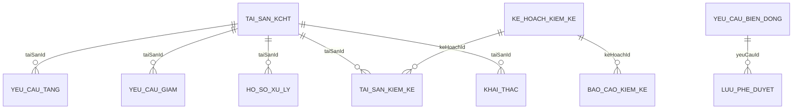

# Lean Spec: M-005 Quan ly bien dong tai san KCHTGT

## 1. Summary

Module M-005 manages asset movements (bien dong tai san) for KCHTGT. Covers 6 features: asset increase (F-122), asset decrease (F-123), asset processing (F-124), inventory audit (F-125), asset exploitation (F-126), and approval workflow (F-127). Backed by 10 JPA entities, 12 enums, 10 REST controllers, 10 services, 10 repositories.

- Package: `com.hanghai.kchtg.assetmovement`
- API base: `/api/v1/asset/`
- Complexity: Complex

## 2. Domain Glossary

### Entities (10)

| Entity | Table | Feature | Description |
|--------|-------|---------|-------------|
| `TaiSanKCHT` | tai_san_kcht | All | Core asset — buoys, radar, beacons, aux. Fields: maTaiSan UK, tenTaiSan, loaiTaiSan, viTri, thongSoKyThuat, nguonKinhPhi, nguyenGia, haoMonLucKe, giaTriConLai, trangThai. Soft-delete. |
| `YeuCauTangTaiSan` | yeu_cau_tang_tai_san | F-122 | Increase request. FK taiSanId. Status via TrangThaiYeuCau. |
| `YeuCauGiamTaiSan` | yeu_cau_giam_tai_san | F-123 | Decrease request. FK taiSanId. References NguyenNhanGiam. |
| `HoSoXuLyTaiSan` | ho_so_xu_ly_tai_san | F-124 | Processing dossier. FK taiSanId. LoaiXuLy: DIEU_CHUYEN, BAN_GIAO, THANH_LY, PHA_BO. |
| `KeHoachKiemKe` | ke_hoach_kiem_ke | F-125 | Inventory plan. Scope, dates, team lead. Lifecycle via TrangThaiKeHoach. |
| `TaiSanKiemKe` | tai_san_kiem_ke | F-125 | Per-asset inventory result. Book vs actual with discrepancy. |
| `BaoCaoKiemKe` | bao_cao_kiem_ke | F-125 | Summary report. Totals, surplus, deficit. |
| `KhaiThacTaiSan` | khai_thac_tai_san | F-126 | Exploitation record. Hours, costs, status, month/year. |
| `YeuCauBienDong` | yeu_cau_bien_dong | F-127 | Central change request. LoaiBienDong: TANG, GIAM, XU_LY, KIEM_KE. |
| `LuuPheDuyet` | luu_phe_duyet | F-127 | Approval trail. capPheDuyet, ketQua (PHE_DUYET/TU_CHOI), lyDo. |

### Enums (12)

| Enum | Values |
|------|--------|
| LoaiTaiSanKCHT | LOAI_PHAO_TIEU, LOAI_TRAM_RADAR, LOAI_DEN_BIEN, LOAI_THIET_BI_PHU_TRI |
| TrangThaiTaiSan | CHO_PHE_DUYET, DANG_QUAN_LY, HUY, GIAI_THE, PHA_BO, DECOMMISSION |
| TrangThaiYeuCau | CHO_PHE_DUYET, DA_PHE_DUYET, TU_CHOI |
| NguyenNhanGiam | GIAI_THE, HU_HONG, PHA_BO, HET_HAN_SU_DUNG |
| LoaiXuLy | DIEU_CHUYEN, BAN_GIAO, THANH_LY, PHA_BO |
| LoaiBienDong | TANG, GIAM, XU_LY, KIEM_KE |
| LoaiKiemKe | DINH_KY, DOT_XUAT |
| TrangThaiKeHoach | CHO_PHE_DUYET, DA_PHE_DUYET, DANG_THUC_HIEN, HOAN_THANH, TU_CHOI |
| TrangThaiKiemKe | CHUA_KIEM_KE, DA_KIEM_KE, CHENH_LECH_THUA, CHENH_LECH_THIEU |
| TrangThaiHoSoXuLy | CHO_PHE_DUYET, DA_PHE_DUYET, TU_CHOI |
| TrangThaiBaoCao | CHO_PHE_DUYET, DA_PHE_DUYET, TU_CHOI |
| KetQuaPheDuyet | PHE_DUYET, TU_CHOI |

## 3. Entity Relationship Diagram

## 4. Feature Inventory

### F-122: Tang tai san KCHT
| AC-ID | Criterion | Source |
|-------|-----------|--------|
| F122-AC-01 | Create increase request with required fields | Source |
| F122-AC-02 | Auto-validate input before save | Source |
| F122-AC-03 | Auto-update total asset value | Source |
| F122-AC-04 | Route to F-127 approval | Source |

Controller: YeuCauTangTaiSanController. Service creates with trangThai=CHO_PHE_DUYET. Approve cascades asset to DANG_QUAN_LY. GAP: DTO fields mismatch entity (loaiTaiSan=null).

### F-123: Giam tai san KCHT
| AC-ID | Criterion | Source |
|-------|-----------|--------|
| F123-AC-01 | Create decrease request | Source |
| F123-AC-02 | Auto-calculate depreciation | Source |
| F123-AC-03 | Decrease <= residual value | Source |
| F123-AC-04 | Route to F-127 | Source |

Controller: YeuCauGiamTaiSanController. Approve maps NguyenNhanGiam to asset status (HUY, GIAI_THE, PHA_BO, DECOMMISSION). GAP: No depreciation calculation.

### F-124: Xu ly tai san KCHT
| AC-ID | Criterion | Source |
|-------|-----------|--------|
| F124-AC-01 | Create processing dossier | Source |
| F124-AC-02 | Check for approved decrease | Source |
| F124-AC-03 | Route to F-127 | Source |
| F124-AC-04 | Auto-update asset status after approval | Source |

Controller: HoSoXuLyTaiSanController. CRUD only. GAP: No precondition check, no approve/reject, no asset cascade.

### F-125: Kiem ke tai san KCHT
| AC-ID | Criterion | Source |
|-------|-----------|--------|
| F125-AC-01 | Create inventory plan | Source |
| F125-AC-02 | Auto-generate asset list from scope | Source |
| F125-AC-03 | Auto-detect discrepancies | Source |
| F125-AC-04 | Auto-report to F-127 | Source |

3 controllers: KeHoachKiemKe (with approve/reject/start/complete), TaiSanKiemKe, BaoCaoKiemKe. GAP: No auto-generation, no discrepancy detection.

### F-126: Khai thac tai san KCHT
| AC-ID | Criterion | Source |
|-------|-----------|--------|
| F126-AC-01 | Update periodic exploitation data | Source |
| F126-AC-02 | Recalculate depreciation | Source |
| F126-AC-03 | Anomaly alerts | Source |
| F126-AC-04 | Periodic reports | Source |

Controller: KhaiThacTaiSanController. calculateHaoMon() is stub. GAP: No real logic.

### F-127: Phe duyet bien dong tai san
| AC-ID | Criterion | Source |
|-------|-----------|--------|
| F127-AC-01 | Auto-classify and route approval | Source |
| F127-AC-02 | Notify approver | Source |
| F127-AC-03 | Approve/reject with reason, return to creator | Source |
| F127-AC-04 | Auto-trigger operations after approval | Source |

2 controllers: YeuCauBienDong, LuuPheDuyet. capPheDuyet always 1. GAP: No routing, notifications, auto-return, or triggers.

## 5. API Endpoint Catalog

All under `/api/v1/asset/`. All return `ApiResponse<T>`. All require `@PreAuthorize`.

| # | Controller | Base Path | Endpoints | Auth Key |
|---|-----------|-----------|-----------|----------|
| 1 | TaiSanKCHTController | tai-san | POST, GET /{id}, GET, PUT /{id}, DELETE /{id} | asset:tai-san |
| 2 | YeuCauTangTaiSanController | yeu-cau-tang | POST, GET /{id}, GET, PUT /{id}, DELETE /{id}, POST /{id}/approve, POST /{id}/reject | asset:yeu-cau-tang |
| 3 | YeuCauGiamTaiSanController | yeu-cau-giam | POST, GET /{id}, GET, PUT /{id}, DELETE /{id}, POST /{id}/approve, POST /{id}/reject | asset:yeu-cau-giam |
| 4 | HoSoXuLyTaiSanController | ho-so-xu-ly | POST, GET /{id}, GET, PUT /{id}, DELETE /{id} | asset:ho-so-xu-ly |
| 5 | KeHoachKiemKeController | ke-hoach-kiem-ke | POST, GET /{id}, GET, PUT /{id}, DELETE /{id}, POST /{id}/approve, /reject, /start, /complete | asset:ke-hoach-kiem-ke |
| 6 | TaiSanKiemKeController | tai-san-kiem-ke | POST, GET /{id}, GET, PUT /{id}, DELETE /{id} | asset:tai-san-kiem-ke |
| 7 | BaoCaoKiemKeController | bao-cao-kiem-ke | POST, GET /{id}, GET, PUT /{id}, DELETE /{id}, POST /{id}/approve, /reject | asset:bao-cao-kiem-ke |
| 8 | KhaiThacTaiSanController | khai-thac | POST, GET /{id}, GET, PUT /{id}, DELETE /{id} | asset:khai-thac |
| 9 | YeuCauBienDongController | yeu-cau-bien-dong | POST, GET /{id}, GET, PUT /{id}, DELETE /{id} | asset:yeu-cau-bien-dong |
| 10 | LuuPheDuyetController | luu-phe-duyet | POST, GET /{id}, GET, PUT /{id}, DELETE /{id} | asset:luu-phe-duyet |

Filters available: maTaiSan (TaiSanKCHT), taiSanId (Tang/Giam/HoSo/KhaiThac), loaiBienDong/trangThai (BienDong), trangThaiKeHoach (KeHoach), keHoachId/trangThaiKiemKe (TaiSanKiemKe), keHoachId (BaoCao), namKhaiThac (KhaiThac), yeuCauId/ketQua (LuuPheDuyet).

## 6. Business Rules

| ID | Rule | Feature | Status |
|----|------|---------|--------|
| BR-01 | Required fields before saving increase | F-122 | Partial |
| BR-02 | nguyenGia > 0 within budget | F-122 | Not impl |
| BR-03 | No duplicate increase at location | F-122 | Not impl |
| BR-04 | Increase -> pending only when valid | F-122 | Not impl |
| BR-05 | Decrease reason from enum list | F-123 | Impl |
| BR-06 | Depreciation per method <= original | F-123 | Not impl |
| BR-07 | Residual value >= 0 | F-123 | Not impl |
| BR-08 | Decrease only after approval | F-123 | Impl |
| BR-09 | Process only after decrease approved | F-124 | Not impl |
| BR-10 | Processing type from enum list | F-124 | Impl |
| BR-11 | Liquidation <= residual value | F-124 | Not impl |
| BR-12 | Dossier with attachments | F-124 | Not impl |
| BR-13 | Status update after processing approval | F-124 | Not impl |
| BR-14 | Plan defines scope | F-125 | Impl |
| BR-15 | Results before end date | F-125 | Not impl |
| BR-16 | Discrepancy documented | F-125 | Not impl |
| BR-17 | Report approved when all done | F-125 | Not impl |
| BR-18 | Discrepancy per state regulations | F-125 | Not impl |
| BR-19 | Monthly exploitation update | F-126 | Not impl |
| BR-20 | Depreciation <= original | F-126 | Not impl |
| BR-21 | Costs within budget | F-126 | Not impl |
| BR-22 | Alerts at 10%/20% threshold | F-126 | Not impl |
| BR-23 | Flow by type and value | F-127 | Not impl |
| BR-24 | Complete dossier required | F-127 | Not impl |
| BR-25 | 5-day decision deadline | F-127 | Not impl |
| BR-26 | Rejected returned with reason | F-127 | Partial |
| BR-27 | Auto-trigger after all approvals | F-127 | Not impl |

## 7. NFRs

| ID | Area | Evidence |
|----|------|----------|
| NFR-01 | Security | @PreAuthorize with asset-scoped keys on all 10 controllers |
| NFR-02 | Audit | createdAt/createdBy/updatedAt/updatedBy on all entities |
| NFR-03 | Integrity | UUID PK, @Version optimistic locking on all entities |
| NFR-04 | Integrity | Soft-delete @SQLRestriction("deleted=false") on 7/10 entities |
| NFR-05 | Resilience | @Transactional(readOnly=true) class-level on all services |
| NFR-06 | API | Paginated Spring Data Page (0/20, createdAt DESC) |
| NFR-07 | API | ApiResponse wrapper, 201 for create, 200 for others |
| NFR-08 | Validation | Start<=end date in KeHoachKiemKe; @Min/@Max on namKhaiThac |

## 8. Pipeline Triage

| Q | Answer | Detail |
|---|--------|--------|
| Q1: New domain elements? | Yes | 10 entities, 12 enums in new package |
| Q2: Affects architecture? | Yes | 10 controllers, new permission keys, audit patterns |
| Q3: Approach clear? | Yes | Follows TaiHistoryController pattern, Spring Data JPA |

Route to **engineering-system-architect** for bounded-context review.

## 9. Gap Summary

| Sev | Count | Key Items |
|-----|-------|-----------|
| HIGH | 4 | DTO/entity mismatch, no depreciation, no precondition checks, no multi-level approval |
| MEDIUM | 5 | No auto-generate lists, no discrepancies, no alerts, no notifications, no auto-return |
| LOW | 2 | No periodic reports, unicode table name |
