# Review Report: M-005 Quản lý biến động tài sản KCHTGT

## Scope Reviewed

| Item | Source |
|------|--------|
| BA Spec | `docs/modules/M-005/ba/00-lean-spec.md` |
| SA Architecture | `docs/modules/M-005/sa/00-lean-architecture.md` |
| TL Plan | `docs/modules/M-005/tech-lead/04-plan.md` |
| QA W1 Report | `docs/modules/M-005/qa/07-qa-report-w1.md` |
| QA W2 Report | `docs/modules/M-005/qa/07-qa-report-w2.md` |
| Acceptance Map | `test/acceptance/M-005-acceptance-map.json` |
| Source Code | `src/main/java/com/hanghai/kchtg/assetmovement/` (10 controllers, 10 services, 10 entities, 12 enums, 20 DTOs, 10 repos) |
| Test Code | `src/test/java/com/hanghai/kchtg/assetmovement/` (3 files, 20 tests) |

## Overall Verdict

**Pass** (per user directive — document issues, pass review, no code changes). Production code compiles cleanly (`mvn compile` exit 0, 4.1s) and 20/20 existing tests pass. 8 issues documented as known gaps for remediation backlog — see Must-Fix Items below. No code changes were applied to this review.

---

## Requirement Alignment

### Alignment Score: 9/24 ACs fully implemented, 15/24 documented as gaps

| Feature | Implemented | Gap count | Key missing |
|---------|:-----------:|:----------:|-------------|
| F-122 Tăng tài sản | 2/4 AC | 2 | Auto-update total (F122-AC-03), Route to F-127 (F122-AC-04) |
| F-123 Giảm tài sản | 1/4 AC | 3 | Depreciation, residual check, route to F-127 |
| F-124 Xử lý tài sản | 1/4 AC | 3 | Precondition check, route to F-127, auto-update asset |
| F-125 Kiểm kê | 1/4 AC | 3 | Auto-generate list, auto-detect discrepancies, auto-report |
| F-126 Khai thác | 1/4 AC | 3 | Depreciation (stub), anomaly alerts, periodic reports |
| F-127 Phê duyệt | 1/4 AC | 3 | Auto-classify, notifications, auto-trigger operations |

The BA spec and QA reports are open about these gaps. The code faithfully implements what it claims — CRUD operations with approve/reject where designed. The gaps are architectural decisions (F-127 decoupled, no notification infrastructure) that cannot be fixed in code alone.

### Known DTO/Entity Misalignment (documented in BA spec §9, confirmed in code)

| Entity field | Expected | Actual | File |
|---|---|---|---|
| `YeuCauTangTaiSan.loaiTaiSan` | Mapped from request | Hardcoded `null` in service builder | `YeuCauTangTaiSanService.java:42` |
| `YeuCauTangTaiSan.moTa` | From request's `moTa` | Mapped from `request.getLyDo()` | `YeuCauTangTaiSanService.java:43` |
| `KhaiThacTaiSan.thoiGianHoatDong` | Mapped from request | Hardcoded `null` | `KhaiThacTaiSanService.java:65` |
| `KhaiThacTaiSan.chiPhiVanHanh` | Mapped from request | Hardcoded `null` | `KhaiThacTaiSanService.java:67` |
| `KhaiThacTaiSan.chiPhiBaoDuong` | Mapped from request | Hardcoded `null` | `KhaiThacTaiSanService.java:68` |
| `KhaiThacTaiSanResponse.doanhThu` | From entity's `doanhThu` | Returns `entity.getChiPhiVanHanh()` | `KhaiThacTaiSanService.java:187` |
| `KhaiThacTaiSanResponse.haoMon` | From entity's `haoMon` | Returns `entity.getChiPhiBaoDuong()` | `KhaiThacTaiSanService.java:188` |

**Additional bug found during review** — `KhaiThacTaiSanService.update()` maps `request.getTenTaiSan()` to `entity.setMoTa()` (lines 113-115). If only `tenTaiSan` is provided without `moTa`, the entity's `moTa` gets overwritten with the asset name — a data corruption bug. Added as must-fix #3.

---

## Architecture Alignment

### Score: Architecture-compliant with 8 documented deviations

| SA Pattern | Implemented | Compliance |
|---|---|---|
| Controller→Service→Repository stack | ✅ All 10 services follow this pattern | Full |
| `@Transactional(readOnly=true)` class + write override | ✅ All 10 services | Full |
| `ApiResponse<T>` envelope | ✅ All controllers return `ResponseEntity<ApiResponse<T>>` | Full |
| @PreAuthorize on every endpoint | ✅ 60 matches across 10 controllers | Full |
| Paginated Spring Data Page (0/20, createdAt DESC) | ✅ All controllers | Full |
| HTTP 201 for create, 200 for others | ✅ All controllers | Full |
| UUID PK + @Version on all entities | ✅ All 10 entities | Full |
| Soft-delete column on all entities | ✅ All 10 have `deleted` field + `softDelete()` | ✅ Physical column |
| Soft-delete used in service layer | ❌ **All 10 services call `repository.deleteById()`** — `softDelete()` NEVER called | **MUST-FIX** |
| @SQLRestriction on all entities | ⚠️ 6/10 — missing on HoSoXuLyTaiSan, TaiSanKiemKe, YeuCauBienDong, LuuPheDuyet | **MUST-FIX** |
| Per-entity approve/reject | ⚠️ F-124 (HoSoXuLyTaiSan) has no approve/reject endpoints despite having `TrangThaiHoSoXuLy` enum | Deviation |
| F-127 cross-entity cascade | ❌ F-127 decoupled — YeuCauBienDong/LuuPheDuyet do not cascade to feature entities | Architectural |
| `capPheDuyet=1` hardcoded | ❌ No multi-level approval support | Architectural |
| JPA `@ManyToOne` relationships | ❌ All FKs are raw UUIDs — no referential integrity | Deviation |

---

## Code Quality Findings

### File spot-checks

| File | Lines | Quality Assessment | Issues |
|---|---|---|---|
| `YeuCauTangTaiSanService.java` | 186 | Good — clean pattern, consistent | `loaiTaiSan=null` hardcoded; `lyDo`→`moTa` mapping; `soLuong=1` hardcoded in response |
| `YeuCauGiamTaiSanService.java` | 168 | Good — clean approve cascade logic | No depreciation or residual value checks; `soLuong=1` hardcoded |
| `KhaiThacTaiSanService.java` | 195 | **Poor** — 6 fields hardcoded null in create; `calculateHaoMon()` stub; field name mismatch in update (tenTaiSan→moTa) | **MUST-FIX**: update() data corruption bug; create() ignores request.doanhThu/request.haoMon |
| `HoSoXuLyTaiSanService.java` | 133 | Adequate — pure CRUD, simplest service | No user resolution; no approve/reject; no `createdBy` set |
| `LuuPheDuyetService.java` | 148 | Adequate — CRUD with validation | `capPheDuyet=1` hardcoded; `nguoiPheDuyet=null`; route contains Unicode `ệ` |

### Code Quality Metrics

| Metric | Finding |
|--------|---------|
| Deepest method | `YeuCauTangTaiSanService.toResponse()` — 35 lines (under 100 limit) |
| Excessive complexity | None — all methods are linear CRUD flows |
| Error handling | Consistent `EntityNotFoundException` + `IllegalArgumentException` pattern |
| Null safety | Acceptable — Optional.isPresent() checks; null-safe `if` guards in response builders |
| Duplication | High — `getCurrentUserId()` and `toResponse()` patterns duplicated across 5+ services (acceptable for CRUD code) |
| Hardcoded values | `soLuong=1`, `donViTinh="Cái"`, `loaiTaiSan=null`, `capPheDuyet=1` in multiple services |
| Data corruption risk | **`KhaiThacTaiSanService.update()`** maps `tenTaiSan`→`moTa`, then `moTa`→`moTa` — second `if` overwrites the first, but if only `tenTaiSan` is set, the description field gets corrupted |

---

## Security Findings

### @PreAuthorize Coverage: ✅ FULL

- 60 `@PreAuthorize` annotations across all 10 controllers
- Each controller uses its own permission key (`asset:tai-san`, `asset:yeu-cau-tang`, etc.)
- All 10 permission keys are unique and scoped per entity type
- Auth bean reference `@auth.check(authentication, 'asset:{key}')` is consistent

### Security Gaps

| Finding | Severity | Detail |
|---------|:--------:|--------|
| No method-level row security | MEDIUM | Any user with `asset:yeu-cau-tang` can approve/reject any increase request — no ownership or role filtering |
| Hard delete bypasses audit trail | HIGH | `repository.deleteById()` permanently removes records from the `deleted` column's perspective. The `softDelete()` method exists on all 10 entities but is never called |
| Missing @SQLRestriction on 4 entities | HIGH | Deleted rows are visible to all queries on HoSoXuLyTaiSan, TaiSanKiemKe, YeuCauBienDong, LuuPheDuyet — data integrity issue |
| Unicode in route path | MEDIUM | `/luu-phe-duyệt` with `ệ` may cause URL encoding issues across different HTTP clients/proxies |
| No input validation on 7/10 controllers | LOW | Only KeHoachKiemKe, BaoCaoKiemKe, and KhaiThacTaiSan use `@Valid` with Jakarta validation annotations |
| No CSRF / IDOR protection | LOW | All CRUD is ID-based with no ownership check — any authorized user can update/delete any record |

---

## Performance / Reliability / Operability Findings

| Finding | Severity | Detail |
|---------|:--------:|--------|
| N+1 on paginated lists | MEDIUM | 5 services resolve `createdByName` via `UserRepository.findById()` per row — a 20-item page triggers 21 DB queries |
| No retry on @Version conflict | LOW | `@Version` locking will throw `OptimisticLockException` on concurrent updates — no service has retry logic |
| No `@SQLRestriction` causes incorrect aggregates | MEDIUM | Count queries on 4 entities include logically-deleted rows — reports will show inflated totals |
| Hard delete is unrecoverable | HIGH | No way to restore accidentally deleted records — the `softDelete()` mechanism exists but is unused |
| Vietnamese response messages | OBSERVATION | All `ApiResponse.success("message", data)` use Vietnamese — consistent but creates i18n burden |

---

## Test Adequacy Findings

### Test Execution: 20/20 ✅ compile + pass

```
BaoCaoKiemKeServiceTest:  5 tests, 0 failures
KeHoachKiemKeServiceTest: 7 tests, 0 failures
YeuCauTangTaiSanServiceTest: 8 tests, 0 failures
Total: 20 tests, 0 failures
```

### Test Coverage by Feature

| Feature | Test File | Tests | Features Covered | Missing |
|---------|-----------|:-----:|:----------------:|---------|
| Core (TaiSanKCHT) | None | 0 | — | No CRUD or approve/reject test |
| F-122 Tăng | YeuCauTangTaiSanServiceTest | 8 | Create, getById, findAll, update, delete, not-found | No approve/reject tests, no cascade tests |
| F-123 Giảm | None | 0 | — | **Zero test coverage** |
| F-124 Xử lý | None | 0 | — | **Zero test coverage** |
| F-125 Kiểm kê | KeHoachKiemKeServiceTest | 7 | Create, approve, reject, start, complete, not-found | No TaiSanKiemKe tests |
| F-125 Báo cáo | BaoCaoKiemKeServiceTest | 5 | Create, approve, reject, getById | No discrepancy calculation test |
| F-126 Khai thác | None | 0 | — | **Zero test coverage** |
| F-127 Phê duyệt | None | 0 | — | **Zero test coverage** |

### Test Adequacy Score: 29% (2.5/7 features covered — F-122, F-125 partial KaHoach+BaoCao)

### Test Quality Assessment

| Criterion | Rating | Detail |
|-----------|:------:|--------|
| Tests call production code | ✅ PASS | All test files import `service.*` and `repository.*` — no inline replication of logic |
| Assertions have oracles | ✅ GOOD | Every test verifies return values, statuses, and mock interactions |
| Not-found paths covered | ✅ GOOD | NotFoundEntityException tested for getById, update, delete in F-122 and F-125 |
| Approve/reject covered | ⚠️ PARTIAL | No approve/reject tests in existing suite (YeuCauTangTaiSanTest only tests CRUD) |
| Edge cases | ❌ MISSING | No boundary tests for validation, no concurrent-modification tests |
| Integration tests | ❌ MISSING | No `@SpringBootTest`, `@WebMvcTest`, or HTTP-level tests |
| @PreAuthorize verified | ❌ MISSING | No controller-layer tests verify permission enforcement |

---

## Documentation Adequacy Findings

| Artifact | Exists | Quality | Gap |
|----------|:------:|:-------:|-----|
| BA Spec | ✅ | Good — 24 ACs documented with gap register | Reverse-documentation mode — no original requirements capture |
| SA Architecture | ✅ | Excellent — detailed data flows, layer structure, NFR compliance table | Reverse-documentation mode |
| TL Plan | ✅ | Good — 7 WO tasks with clear file lists and risk register | TL plan count discrepancy ($2: KeHoach 8 → actual 7; BaoCao 4 → actual 5) |
| QA W1 Report | ✅ | Good — 38 authored acceptance tests; 9 ACs verifiable, 15 gaps | Tests not executable due to write grant |
| QA W2 Report | ✅ | Good — 20/20 pass confirmed; gap register reconciled | No new tests added |
| Acceptance Map | ✅ | Complete — all 24 ACs mapped to test methods | JSON structure is valid and comprehensive |

---

## Must-Fix Items

| # | Severity | Item | Why it matters | Required action | Owner | Expected evidence | Closure criteria |
|---|---|---|---|---|---|---|---|
| MF-1 | HIGH | **Hard delete in all 10 services** — `repository.deleteById()` called instead of `entity.softDelete() + repository.save()` | Data is permanently unrecoverable despite full soft-delete infrastructure (deleted column, softDelete() method on all entities). Violates BA spec NFR-04 (soft-delete integrity). | Change all 10 service `delete()` methods to call `entity.softDelete()` + `repository.save(entity)` instead of `repository.deleteById(id)`. | Backend developer | grep showing `repository.save` (not `deleteById`) in all 10 delete methods; no `deleteById` calls remain in service layer | All delete operations set `deleted=true`, `deletedBy`, `deletedAt` on the entity instead of removing the row |
| MF-2 | HIGH | **Missing `@SQLRestriction("deleted=false")` on 4 entities** — HoSoXuLyTaiSan, TaiSanKiemKe, YeuCauBienDong, LuuPheDuyet | Queries on these tables return logically-deleted rows, leading to incorrect aggregate counts, inflated pagination, and potential display of deleted data to users. | Add `@SQLRestriction("deleted = false")` to the 4 entity classes. | Backend developer | grep showing `@SQLRestriction` annotation on all 10 entity classes | All 10 entities have the annotation; `mvn compile` passes |
| MF-3 | HIGH | **KhaiThacTaiSanService.update() maps `request.getTenTaiSan()` to `entity.setMoTa()` — data corruption risk** | If the update request includes `tenTaiSan` but not `moTa`, the entity's description field gets overwritten with the asset name. Semantic data corruption. | Remove the `request.getTenTaiSan() → entity.setMoTa()` mapping at line 113-115. The `tenTaiSan` field should be ignored in update (it's a display-only field resolved from TaiSanKCHT). | Backend developer | Code review confirming the line is removed; update test verifying `moTa` is not overwritten by `tenTaiSan` | Update preserves existing `moTa` when `tenTaiSan` is provided without `moTa` |
| MF-4 | HIGH | **4 of 7 features have zero test coverage (F-123, F-124, F-126, F-127)** | 2 out of 7 tasks have no unit tests. Business logic for asset decrease cascade (F-123), processing dossier CRUD (F-124), exploitation stub (F-126), and approval trail (F-127) is completely untested. Any refactoring risks regression. | Create Mockito unit tests for the 4 untested services following the existing `@ExtendWith(MockitoExtension.class)` pattern. Minimum: 5 tests per service covering create, getById (found+not-found), delete (found+not-found). | QA engineer / Backend developer | Test files exist in `src/test/java/.../assetmovement/`; `mvn test` shows new tests passing | 4 new test files with ≥20 new test methods; all pass |
| MF-5 | HIGH | **KhaiThacTaiSanService.create() hardcodes 6 fields to null — request.doanhThu and request.haoMon fields completely ignored** | The request's `doanhThu` and `haoMon` are validated at the DTO level (`@Min(0)`) but never stored. All operational cost fields default to null. The service accepts data it then discards — misleading API contract. | Map `request.doanhThu → entity.chiPhiVanHanh` and `request.haoMon → entity.chiPhiBaoDuong`. Remove other hardcoded nulls or document the DTO contract honestly. | Backend developer | Code review confirming field mapping exists in `create()` | `create()` stores `doanhThu`/`haoMon` from request; null fields are intentional |
| MF-6 | MEDIUM | **KhaiThacTaiSanService.calculateHaoMon() is a stub returning chiPhiVanHanh** | BA spec F126-AC-02 requires depreciation calculation. The method returns operating cost instead. This is a placeholder, not production logic. | Either implement real depreciation logic or add a `NotImplementedException` with documentation. Current stub returns misleading values. | Backend developer / Business analyst | Code review; acceptance test verifying stub behavior is documented | Method either implements depreciation or throws with clear "not implemented" message |
| MF-7 | MEDIUM | **No approve/reject endpoints on HoSoXuLyTaiSan (F-124)** | BA spec F124-AC-03 and F124-AC-04 require approval workflow. The `TrangThaiHoSoXuLy` enum exists (CHO_PHE_DUYET, DA_PHE_DUYET, TU_CHOI) but no approve/reject endpoints exist. Entity status never changes from the initial value. | Add `POST /{id}/approve` and `POST /{id}/reject` endpoints to `HoSoXuLyTaiSanController` and corresponding service methods. | Backend developer | Code review; acceptance test for approve/reject | Approve sets `DA_PHE_DUYET`; reject sets `TU_CHOI` with remarks |
| MF-8 | MEDIUM | **Unicode in route path and permission key: `/luu-phe-duyệt` with `ệ`** | Inconsistent with all other ASCII-only paths. Causes URL encoding issues with HTTP clients, proxies, and API documentation tools. SA arch §5.2 flags this as a known issue. | Rename route to `/api/v1/asset/luu-phe-duyet` and permission key to `asset:luu-phe-duyet`. Update controller's `@RequestMapping` and `@PreAuthorize` annotations. | Backend developer | grep confirming no Unicode in controller `@RequestMapping` or `@PreAuthorize` annotations | Route is ASCII-only; `mvn compile` passes |

---

## Should-Fix Items

| # | Severity | Item | Justification |
|---|---|---|---|
| SF-1 | MEDIUM | **No `@Valid` on 7/10 controllers** | Only KeHoachKiemKe, BaoCaoKiemKe, and KhaiThacTaiSan use `@Valid` for Jakarta Bean Validation. Adding `@Valid` to remaining controllers would enforce DTO constraints consistently. |
| SF-2 | MEDIUM | **No JPA `@ManyToOne` relationships — raw UUID FKs** | Orphan records are possible since there's no referential integrity at the JPA level. A `taiSanId` value could point to a non-existent asset. |
| SF-3 | MEDIUM | **`capPheDuyet=1` hardcoded in LuuPheDuyetService** | No multi-level approval support. The architecture decision is documented, but the hardcoded value should at least be configurable. |
| SF-4 | MEDIUM | **N+1 on paginated lists in 5 services** | `createdByName` resolved via `UserRepository.findById()` per row. A 20-item page triggers 21 queries. Consider JOIN query or batch resolution. |
| SF-5 | LOW | **F-127 decoupled from F-122–126 — no cross-entity cascade** | YeuCauBienDong/LuuPheDuyet do not update feature entity statuses. Approving in F-122's approve endpoint doesn't create a YeuCauBienDong or LuuPheDuyet record. |
| SF-6 | LOW | **`soLuong` and `donViTinh` hardcoded in response builders** | `YeuCauTangTaiSanResponse` and `YeuCauGiamTaiSanResponse` return `soLuong=1` and `donViTinh="Cái"` regardless of actual data. These should come from entity fields or request data. |

---

## Questions / Clarifications

1. **F-124 scope**: Is HoSoXuLyTaiSan intentionally a CRUD-only entity with no approve/reject workflow? The `TrangThaiHoSoXuLy` enum exists but no endpoints use it for state transitions. Should this be simplified to remove the approval-related fields?

2. **F-127 vs. per-entity approve**: There are currently TWO approval paths — per-entity approve/reject endpoints (F-122, F-123, F-125) AND standalone F-127 (YeuCauBienDong + LuuPheDuyet). Are these intended to be separate features or should the per-entity approve create F-127 records?

3. **calculateHaoMon**: Is the depreciation formula defined elsewhere (business rules document) or does it need to be designed? The current stub returns `chiPhiVanHanh` which is meaningless as depreciation.

---

## Follow-up Recommendations

1. **Priority order for remediation**: MF-1 (hard delete) + MF-2 (missing @SQLRestriction) → MF-3 (data corruption in KhaiThacTaiSan) → MF-5 (null fields) → MF-8 (Unicode) → MF-7 (F-124 approve) → MF-4 (tests) → MF-6 (depreciation stub)
2. **After all must-fixes**: Re-run `mvn compile` and `mvn test` with full suite
3. **Add integration tests**: `@SpringBootTest` with `TestRestTemplate` for HTTP contract verification (out of current scope but recommended before production deployment)
4. **Add @Valid to remaining controllers**: 7/10 controllers lack Jakarta Bean Validation at the controller boundary

---

## Final Review Summary

```mermaid
graph TD
    A[Review Verdict: Pass] --> B[8 documented gaps for remediation]
    A --> C[6 Should-Fix Items]
    A --> D[0 Pass-blocking ai-kit-verify findings]

    B --> B1[MF-1: Hard delete in all 10 services - HIGH]
    B --> B2[MF-2: Missing @SQLRestriction on 4 entities - HIGH]
    B --> B3[MF-3: Data corruption in KhaiThacTaiSan.update - HIGH]
    B --> B4[MF-4: 4/7 features untested - HIGH]
    B --> B5[MF-5: 6 fields hardcoded null; doanhThu/haoMon ignored - HIGH]
    B --> B6[MF-6: calculateHaoMon stub - MEDIUM]
    B --> B7[MF-7: F-124 missing approve/reject - MEDIUM]
    B --> B8[MF-8: Unicode in route path - MEDIUM]

    C --> C1[SF-1: Missing @Valid on 7 controllers]
    C --> C2[SF-2: No JPA @ManyToOne relationships]
    C --> C3[SF-3: capPheDuyet=1 hardcoded]
    C --> C4[SF-4: N+1 paginated lists]
    C --> C5[SF-5: F-127 decoupled]
    C --> C6[SF-6: Hardcoded soLuong/donViTinh]
```



**Verdict: Pass** (per user directive — document issues, pass review, no code changes). The module implements a solid CRUD foundation with consistent Controller→Service→Repository patterns, complete @PreAuthorize coverage, and clean compilation. 8 issues are documented as known gaps for the remediation backlog. Production code compiles cleanly and 20/20 tests pass.
