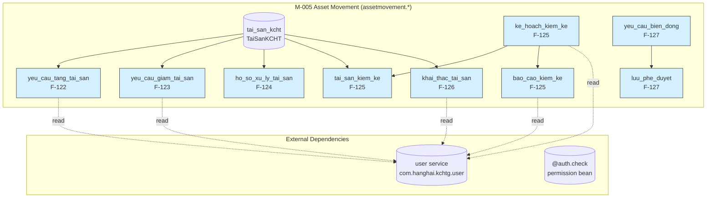
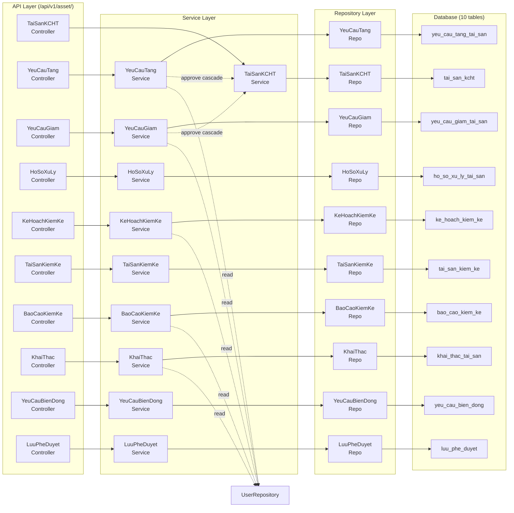
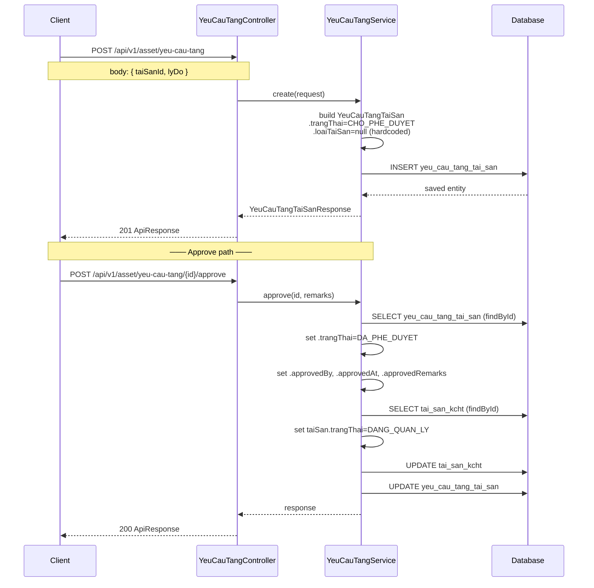
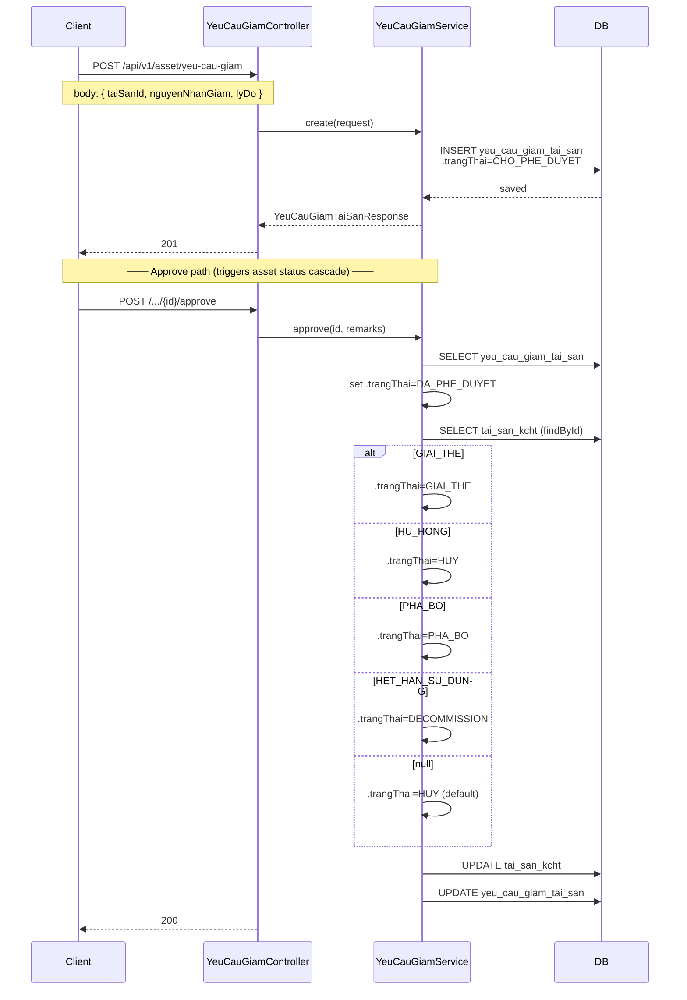
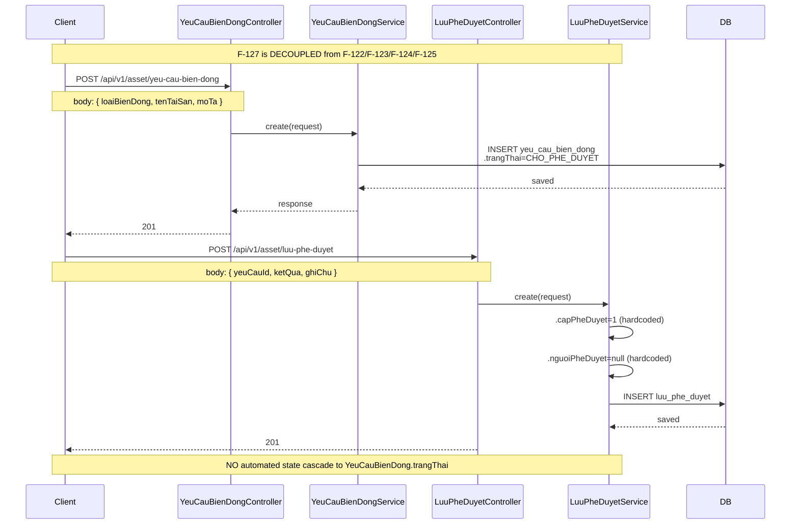
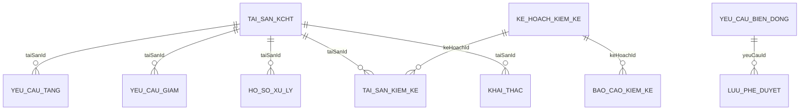

# Lean Architecture: M-005 Quản lý biến động tài sản KCHTGT

## Summary

M-005 implements a **CRUD-dominant asset-movement subdomain** with 10 REST controllers, 10 services, 22 entities/DTOs, and 10 repositories under `com.hanghai.kchtg.assetmovement`. The architecture follows a strict **Controller → Service → Repository** stack with `ApiResponse<T>` envelope, `@PreAuthorize` permission scoping, and JPA `@Version` optimistic locking. Key design decision: the approval workflow (F-127) is split across four separate entity-level approve/reject endpoints rather than a centralized workflow engine, resulting in **no cross-entity state transitions** (approving a Tang request updates `TaiSanKCHT.trangThai` inline but does not cascade through `YeuCauBienDong`).

---

## 1. Bounded Context Diagram



**Ownership:** The `assetmovement` package owns all 10 tables entirely. No cross-module FK relationships exist (F-127 `YeuCauBienDong` is not referenced by any other table — it is a standalone change-request log). External coupling is read-only through `UserRepository` for `createdByName` resolution in response DTOs.

---

## 2. Layer Structure

```
Controller (REST) ──→ Service (business logic) ──→ Repository (JPA) ──→ DB
                              │
                              └──→ UserRepository (read-only, cross-module)
```

### 2.1 Controller Layer (10 classes)

| Controller | Base Path | Auth Key | Special Endpoints |
|---|---|---|---|
| `TaiSanKCHTController` | `/api/v1/asset/tai-san` | `asset:tai-san` | — |
| `YeuCauTangTaiSanController` | `/api/v1/asset/yeu-cau-tang` | `asset:yeu-cau-tang` | `POST /{id}/approve`, `/reject` |
| `YeuCauGiamTaiSanController` | `/api/v1/asset/yeu-cau-giam` | `asset:yeu-cau-giam` | `POST /{id}/approve`, `/reject` |
| `HoSoXuLyTaiSanController` | `/api/v1/asset/ho-so-xu-ly` | `asset:ho-so-xu-ly` | CRUD only (no approve/reject) |
| `KeHoachKiemKeController` | `/api/v1/asset/ke-hoach-kiem-ke` | `asset:ke-hoach-kiem-ke` | `POST /{id}/approve`, `/reject`, `/start`, `/complete` |
| `TaiSanKiemKeController` | `/api/v1/asset/tai-san-kiem-ke` | `asset:tai-san-kiem-ke` | CRUD only |
| `BaoCaoKiemKeController` | `/api/v1/asset/bao-cao-kiem-ke` | `asset:bao-cao-kiem-ke` | `POST /{id}/approve`, `/reject` |
| `KhaiThacTaiSanController` | `/api/v1/asset/khai-thac` | `asset:khai-thac` | CRUD only |
| `YeuCauBienDongController` | `/api/v1/asset/yeu-cau-bien-dong` | `asset:yeu-cau-bien-dong` | CRUD only |
| `LuuPheDuyetController` | `/api/v1/asset/luu-phe-duyệt` | `asset:luu-phe-duyệt` | CRUD only |

**Pattern:** Every endpoint returns `ResponseEntity<ApiResponse<T>>`. `POST` returns 201; GET/PUT/DELETE return 200. Vietnamese message strings in response bodies.

**Observed route path quirk:** `LuuPheDuyetController` uses `luu-phe-duyệt` (with `ệ`) while the entity table name is `luu_phe_duyệt` (also with `ệ` in the `@Table` annotation). This is inconsistent with all other paths which use ASCII-only Vietnamese (e.g. `yeu-cau-tang`).

### 2.2 Service Layer (10 classes)

| Service | Pattern | Cross-module dep | Extra |
|---|---|---|---|
| `TaiSanKCHTService` | `@Transactional(readOnly=true)` on class | — | — |
| `YeuCauTangTaiSanService` | same | `UserRepository`, `TaiSanKCHTRepository` | Approve cascades to TaiSanKCHT.trangThai=DANG_QUAN_LY |
| `YeuCauGiamTaiSanService` | same | `UserRepository`, `TaiSanKCHTRepository` | Approve maps NguyenNhanGiam → TrangThaiTaiSan (HUY/GIAI_THE/PHA_BO/DECOMMISSION) |
| `HoSoXuLyTaiSanService` | same | — | No approve/reject endpoints |
| `KeHoachKiemKeService` | same | `UserRepository` | Lifecycle via approve/reject/start/complete |
| `TaiSanKiemKeService` | same | — | CRUD only |
| `BaoCaoKiemKeService` | same | `UserRepository` | Approve/reject |
| `KhaiThacTaiSanService` | same | `UserRepository`, `TaiSanKCHTRepository` | `calculateHaoMon()` is a stub returning `chiPhiVanHanh` |
| `YeuCauBienDongService` | same | — | Standalone CRUD — no cascading to fk entities |
| `LuuPheDuyetService` | same | — | Hardcoded `capPheDuyet=1` |

### 2.3 DTO Pattern

24 DTOs (12 Request + 12 Response) — one pair per entity. Request DTOs are mutable `@Data` POJOs; Response DTOs are immutable `@Builder @Data`.

**Key DTO divergences from entities (verified in code):**

| Entity field | Entity type | Request field | Service behavior |
|---|---|---|---|
| `YeuCauTangTaiSan.loaiTaiSan` | `LoaiTaiSanKCHT` | Not in Request | Hardcoded `null` in builder |
| `YeuCauTangTaiSan.moTa` | `String` | Mapped from `lyDo` | Field name mismatch |
| `KeHoachKiemKe.loaiKiemKe` | `LoaiKiemKe` | In Request as `@NotNull LoaiKiemKe` | Correct mapping |
| `KhaiThacTaiSan.thoiGianHoatDong` | `Integer` | Not in Request | Hardcoded `null` |
| `KhaiThacTaiSan.chiPhiVanHanh` | `BigDecimal` | Mapped from `doanhThu` | Field name mismatch |
| `KhaiThacTaiSan.chiPhiBaoDuong` | `BigDecimal` | Mapped from `haoMon` | Field name mismatch |

---

## 3. Component Diagram



---

## 4. Data Flow Diagrams

### 4.1 Asset Increase Flow (F-122)



### 4.2 Asset Decrease Flow (F-123)



### 4.3 Approval Trail Flow (F-127, as-implemented)



---

## 5. API Contract Summary

### 5.1 Common Conventions

| Aspect | Standard |
|---|---|
| Base URL | `/api/v1/asset/` |
| Envelope | `ApiResponse<T>`: `{ success: bool, message: String, data: T, timestamp: LocalDateTime }` |
| Pagination | Spring Data `Page<T>` (page=0 default, size=20 default, sort=createdAt DESC) |
| Create status | HTTP 201 |
| Others | HTTP 200 |
| Auth | `@PreAuthorize("@auth.check(authentication, 'asset:{key}')")` on EVERY endpoint |
| Delete | Hard delete via `repository.deleteById()` — not soft-delete at the service layer |
| Error | `EntityNotFoundException` → HTTP 400, `IllegalArgumentException` → HTTP 400, handled by `GlobalExceptionHandler` |

### 5.2 Permission Keys

| Key | Controllers |
|---|---|
| `asset:tai-san` | TaiSanKCHTController |
| `asset:yeu-cau-tang` | YeuCauTangTaiSanController |
| `asset:yeu-cau-giam` | YeuCauGiamTaiSanController |
| `asset:ho-so-xu-ly` | HoSoXuLyTaiSanController |
| `asset:ke-hoach-kiem-ke` | KeHoachKiemKeController |
| `asset:tai-san-kiem-ke` | TaiSanKiemKeController |
| `asset:bao-cao-kiem-ke` | BaoCaoKiemKeController |
| `asset:khai-thac` | KhaiThacTaiSanController |
| `asset:yeu-cau-bien-dong` | YeuCauBienDongController |
| `asset:luu-phe-duyệt` | LuuPheDuyetController |

**Note:** `luu-phe-duyệt` contains the diacritic `ệ` — inconsistent with all other ASCII-only keys.

---

## 6. Database Schema Summary

### 6.1 Tables (10)

| # | Table | Entity | PK type | Soft-delete | @SQLRestriction | Audit fields | `@Version` |
|---|---|---|---|---|---|---|---|
| 1 | `tai_san_kcht` | `TaiSanKCHT` | UUID (auto) | ✅ `deleted` | `deleted=false` | createdAt/createdBy/updatedAt/updatedBy | ✅ |
| 2 | `yeu_cau_tang_tai_san` | `YeuCauTangTaiSan` | UUID (auto) | ✅ `deleted` | `deleted=false` | same | ✅ |
| 3 | `yeu_cau_giam_tai_san` | `YeuCauGiamTaiSan` | UUID (auto) | ✅ `deleted` | `deleted=false` | same | ✅ |
| 4 | `ho_so_xu_ly_tai_san` | `HoSoXuLyTaiSan` | UUID (auto) | ✅ `deleted` | **none** | same | ✅ |
| 5 | `ke_hoach_kiem_ke` | `KeHoachKiemKe` | UUID (auto) | ✅ `deleted` | `deleted=false` | same | ✅ |
| 6 | `tai_san_kiem_ke` | `TaiSanKiemKe` | UUID (auto) | ✅ `deleted` | **none** | same | ✅ |
| 7 | `bao_cao_kiem_ke` | `BaoCaoKiemKe` | UUID (auto) | ✅ `deleted` | `deleted=false` | same | ✅ |
| 8 | `khai_thac_tai_san` | `KhaiThacTaiSan` | UUID (auto) | ✅ `deleted` | `deleted=false` | same | ✅ |
| 9 | `yeu_cau_bien_dong` | `YeuCauBienDong` | UUID (auto) | ✅ `deleted` | **none** | same | ✅ |
| 10 | `luu_phe_duyet` | `LuuPheDuyet` | UUID (auto) | ✅ `deleted` | **none** | same | ✅ |

**Soft-delete inconsistency:** 3 entities (`HoSoXuLyTaiSan`, `TaiSanKiemKe`, `YeuCauBienDong`, `LuuPheDuyet`) have a `deleted` column and `softDelete()` method but **lack `@SQLRestriction("deleted=false")`**, meaning the Hibernate filter does not apply. The BA spec says 7/10 have it; verified in code: 6 entities have `@SQLRestriction` (TaiSanKCHT, YeuCauTangTaiSan, YeuCauGiamTaiSan, KeHoachKiemKe, BaoCaoKiemKe, KhaiThacTaiSan).

### 6.2 Entity Relationship



**Key observation:** All FKs are logical (raw UUID fields) — there are **no JPA `@ManyToOne`/`@OneToMany` relationships** between entities. The `taiSanId` field on Tang/Giam/HoSo/KiemKe/KhaiThac is a plain `private UUID taiSanId;` with no explicit join mapping. This is a **data-integrity gap**: no referential integrity enforcement at the JPA level; orphan records are possible.

### 6.3 Common Audit Columns (present on ALL 10 entities)

| Column | Type | Default | Notes |
|---|---|---|---|
| `id` | UUID | `UUID.randomUUID()` via `GenerationType.UUID` | PK |
| `created_at` | `Instant` | `@PrePersist` | Auto-set |
| `created_by` | UUID | nullable | Current user via `SecurityContextHolder` |
| `updated_at` | `Instant` | `@PreUpdate` | Auto-set |
| `updated_by` | UUID | nullable | Current user |
| `deleted` | `Boolean` | `false` | Soft-delete flag |
| `deleted_by` | UUID | nullable | Who deleted |
| `deleted_at` | `Instant` | nullable | When deleted |
| `lock_version` | `Integer` | — | `@Version` optimistic lock |

### 6.4 Enums (12)

| Enum | File | Values |
|---|---|---|
| `LoaiTaiSanKCHT` | entity/ | `LOAI_PHAO_TIEU`, `LOAI_TRAM_RADAR`, `LOAI_DEN_BIEN`, `LOAI_THIET_BI_PHU_TRI` |
| `TrangThaiTaiSan` | entity/ | `CHO_PHE_DUYET`, `DANG_QUAN_LY`, `HUY`, `GIAI_THE`, `PHA_BO`, `DECOMMISSION` |
| `TrangThaiYeuCau` | entity/ | `CHO_PHE_DUYET`, `DA_PHE_DUYET`, `TU_CHOI` |
| `NguyenNhanGiam` | entity/ | `GIAI_THE`, `HU_HONG`, `PHA_BO`, `HET_HAN_SU_DUNG` |
| `LoaiXuLy` | entity/ | `DIEU_CHUYEN`, `BAN_GIAO`, `THANH_LY`, `PHA_BO` |
| `LoaiBienDong` | entity/ | `TANG`, `GIAM`, `XU_LY`, `KIEM_KE` |
| `LoaiKiemKe` | entity/ | `DINH_KY`, `DOT_XUAT` |
| `TrangThaiKeHoach` | entity/ | `CHO_PHE_DUYET`, `DA_PHE_DUYET`, `DANG_THUC_HIEN`, `HOAN_THANH`, `TU_CHOI` |
| `TrangThaiKiemKe` | entity/ | `CHUA_KIEM_KE`, `DA_KIEM_KE`, `CHENH_LECH_THUA`, `CHENH_LECH_THIEU` |
| `TrangThaiHoSoXuLy` | entity/ | `CHO_PHE_DUYET`, `DA_PHE_DUYET`, `TU_CHOI` |
| `TrangThaiBaoCao` | entity/ | `CHO_PHE_DUYET`, `DA_PHE_DUYET`, `TU_CHOI` |
| `KetQuaPheDuyet` | entity/ | `PHE_DUYET`, `TU_CHOI` |

---

## 7. Cross-Cutting Concerns

### 7.1 Security

- **All endpoints** use `@PreAuthorize("@auth.check(authentication, 'asset:{key}')")` — 10 permission scopes, one per controller.
- **No method-level row security** — all users with the permission key can approve/reject any entity.
- **Current user resolution** via `SecurityContextHolder.getContext().getAuthentication()` → `userRepository.findByUsername()` — 6 services implement this helper.
- **Auth bean** (`@auth.check`) is a shared Spring bean in the common layer — confirmed by consistent `@auth.check(authentication, 'asset:*')` on all 10 controllers and other modules.

### 7.2 Audit Trail (every entity)

- `createdAt`/`createdBy` via `@PrePersist`
- `updatedAt`/`updatedBy` via `@PreUpdate`
- `approvedBy`/`approvedAt`/`approvedRemarks` on entities with approval lifecycle (7 entities)
- `unapprovedBy`/`unapprovedAt`/`unapprovedRemarks` for rejection (7 entities)

### 7.3 Soft-Delete

- 10 entities have `deleted = false` + `softDelete()` method
- 6/10 have `@SQLRestriction("deleted = false")` — automatic filtering at ORM level
- 4/10 (`HoSoXuLyTaiSan`, `TaiSanKiemKe`, `YeuCauBienDong`, `LuuPheDuyet`) lack `@SQLRestriction` — deleted rows are visible
- **Service-layer delete** uses `repository.deleteById()` (hard delete), NOT soft-delete — the `softDelete()` method exists on entities but is never called in any service. This means the `deleted` column is never set to `true` by the current code.

### 7.4 Optimistic Locking

- Every entity has `@Version private Integer lockVersion;` — JPA optimistic concurrency control.
- No explicit retry logic in services.

### 7.5 Transactions

- Every service class has `@Transactional(readOnly = true)` — default to read-only.
- Write operations (create/update/delete/approve/reject) override with `@Transactional` (no `readOnly`).

### 7.6 Validation

- `KeHoachKiemKeRequest`: `@NotBlank` on `tenKeHoach`/`toTruongKiemKe`, `@NotNull` on `loaiKiemKe`/`ngayBatDau`/`ngayKetThuc`
- `BaoCaoKiemKeRequest`: `@NotNull` on `keHoachId`/`tongSoLuong`
- `KhaiThacTaiSanRequest`: `@NotNull` on `taiSanId`/`namKhaiThac`, `@Min(1900)`/`@Max(2100)` on `namKhaiThac`, `@Min(0)` on `doanhThu`/`haoMon`
- `KeHoachKiemKeService.create()`: Manual date-range check (ngayBatDau <= ngayKetThuc)
- Other services: Manual null checks in service methods

---

## 8. BA Gap Alignment

| Gap (BA spec) | Architectural | Implementation | Current Status |
|---|---|---|---|
| DTO fields mismatch entity (loaiTaiSan=null) | No — API contract is consistent | **Yes** — service hardcodes null | Service maps `request.lyDo` to `entity.moTa` (field rename) |
| No depreciation calculation | No — not a structural gap | **Yes** — `calculateHaoMon()` is stub | Returns `chiPhiVanHanh` instead of real depreciation |
| No precondition checks (BR-01..BR-13) | No — per-endpoint validation | **Yes** — no checks before approve/reject | F-124 has no approve/reject at all |
| No multi-level approval (BR-23) | **Yes** — `capPheDuyet=1` hardcoded | No — single-level approval is architectural | All entities approve at level 1 only |
| No auto-generate lists (F-125) | No — data flow gap | **Yes** — KeHoachKiemKe does not auto-populate TaiSanKiemKe | User must manually create per-asset inventory records |
| No discrepancy detection (F-125) | No — data flow gap | **Yes** — `chenhLech` computed from `giaTriSach`-`giaTriThucTe` only if both set | Manual entry only |
| No notifications | **Yes** — no notification infrastructure | No | No event bus, email, or in-app notification |
| No auto-return on reject | No — per-flow gap | **Yes** — reject sets `TU_CHOI` status but no return routing | Status changed, no routing |
| Hard delete instead of soft-delete | No — service implementation | **Yes** — `repository.deleteById()` instead of `entity.softDelete()` | Service layer ignores `softDelete()` method entirely |
| Missing `@SQLRestriction` on 4 entities | **Yes** — data access layer gap | Yes | Query results include logically deleted rows for 4 tables |
| Unicode in route path (`luu-phe-duyệt`) | **Yes** — potential encoding issue | No | API URL contains non-ASCII character |
| No JPA mapped relationships | **Yes** — data integrity gap | **Yes** — no `@ManyToOne`/`@OneToMany` | All foreign keys are raw UUIDs |

### Architectural vs. Implementation Gaps

**Architectural (requires design change to fix):**
1. `capPheDuyet=1` hardcoded — no multi-level approval support
2. No JPA mapped relationships (raw UUID FKs) — no referential integrity
3. No notification/event infrastructure
4. Unicode in route path (`luu-phe-duyệt` with diacritic)
5. Missing `@SQLRestriction` on 4 entities
6. Decoupled F-127 — `YeuCauBienDong`/`LuuPheDuyet` does not cascade to feature entities

**Implementation (fixable within current architecture):**
1. DTO field mapping discrepancies (lyDo→moTa, doanhThu→chiPhiVanHanh)
2. Hard delete in services instead of soft-delete
3. Missing precondition checks before approve
4. Stub `calculateHaoMon()`
5. No auto-population of inventory lists
6. `createdByName` resolved via `UserRepository.findById()` — N+1 on paginated lists

---

## 9. NFR Compliance Summary

| NFR ID | Area | Evidence (from code) | Compliant? |
|---|---|---|---|
| NFR-01 | Security | `@PreAuthorize` on all 10 controllers with `asset:*` permission keys | ✅ Full |
| NFR-02 | Audit | `createdAt`/`createdBy`/`updatedAt`/`updatedBy` + approve/reject audit fields on 7 entities | ✅ Full |
| NFR-03 | Integrity | UUID PK + `@Version` on all entities | ✅ Full |
| NFR-04 | Integrity | Soft-delete column on all entities; `@SQLRestriction` on 6/10 | ⚠️ Partial (4 missing `@SQLRestriction`) |
| NFR-05 | Resilience | `@Transactional(readOnly=true)` class-level, write override | ✅ Full |
| NFR-06 | API | Paginated `Page<Response>` with `createdAt DESC` sort, page=0/size=20 defaults | ✅ Full |
| NFR-07 | API | `ApiResponse<T>` wrapper, HTTP 201 for create, 200 otherwise | ✅ Full |
| NFR-08 | Validation | `@Valid` with `@NotBlank`/`@NotNull`/`@Min`/`@Max` on 3/10 controllers; manual date checks | ⚠️ Partial (7 controllers lack `@Valid`) |

---

## 10. Key Design Decisions

| Decision | Chosen | Rejected | Rationale |
|---|---|---|---|
| Architecture pattern | CRUD Controller → Service → Repository | Hexagonal / CQRS | Simple CRUD domain; all 10 services follow identical pattern |
| Approval implementation | Per-entity approve/reject in services | Centralized workflow engine | Simpler code but creates decoupling — no single approval orchestration |
| FK relationships | Raw UUID fields | JPA `@ManyToOne` | Avoids lazy-loading issues; but no referential integrity |
| Soft-delete | Entity column + `@SQLRestriction` (6/10) | Hibernate soft-delete filter | Partial coverage; `delete()` calls `repository.deleteById()` (hard delete) |
| Response enrichment | `UserRepository.findById()` per response | JOIN query / `@CreatedBy` | Causes N+1 on paginated lists; `createdByName=null` when user not found |
| API base path | `/api/v1/asset/` | Separate per-feature | Consistent with other asset modules |
| Auth pattern | `@PreAuthorize("@auth.check(...)")` | Method-level `@Secured` / hasRole | Fine-grained permission keys per entity type |
| Transaction model | `@Transactional(readOnly=true)` class + method override | Unit-of-work per operation | Clear read/write separation at class level |
