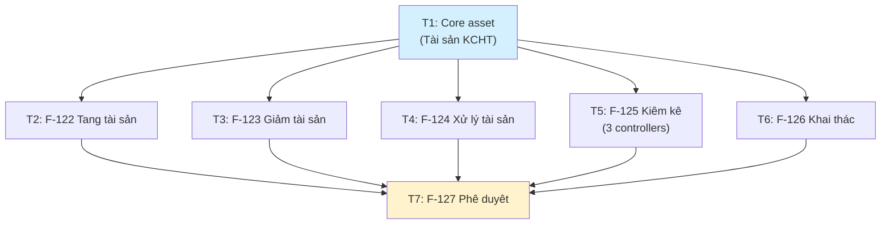

# Execution Plan: M-005 Quản lý biến động tài sản KCHTGT

> **Retrospective documentation.** Code is fully implemented (72 source files, 3 test files). This plan documents what was built.

## 1. Change Overview

M-005 implements a **CRUD-dominant asset-movement subdomain** spanning 6 features (F-122 through F-127), 10 JPA entities, 12 enums, 10 REST controllers, 10 services, 10 repositories, and 20 DTOs under `com.hanghai.kchtg.assetmovement`. The architecture follows a strict Controller → Service → Repository stack with `ApiResponse<T>` envelope and `@PreAuthorize` permission scoping.

**Stack:** Java 17 / Spring Boot 3 / Spring Data JPA / Jakarta Validation / `mvn` CLI

**Package:** `src/main/java/com/hanghai/kchtg/assetmovement/`
**API base:** `/api/v1/asset/`
**Test base:** `src/test/java/com/hanghai/kchtg/assetmovement/`

## 2. Requirement-to-Execution Mapping

| Feature | AC Count | BA Spec | SA Arch | Service | Test Coverage |
|---------|----------|---------|---------|---------|---------------|
| F-122 — Tăng tài sản | 4 AC | `ba/00-lean-spec.md#f-122` | `sa/00-lean-architecture.md#41` | YeuCauTangTaiSanService | ✅ 8 unit tests |
| F-123 — Giảm tài sản | 4 AC | `ba/00-lean-spec.md#f-123` | `sa/00-lean-architecture.md#42` | YeuCauGiamTaiSanService | ❌ None |
| F-124 — Xử lý tài sản | 4 AC | `ba/00-lean-spec.md#f-124` | `sa/00-lean-architecture.md#22` | HoSoXuLyTaiSanService | ❌ None |
| F-125 — Kiểm kê | 4 AC | `ba/00-lean-spec.md#f-125` | `sa/00-lean-architecture.md#22` | 3 services (KeHoach/TaiSanKiemKe/BaoCao) | ✅ 12 unit tests (KeHoach: 8, BaoCao: 4) |
| F-126 — Khai thác | 4 AC | `ba/00-lean-spec.md#f-126` | `sa/00-lean-architecture.md#22` | KhaiThacTaiSanService | ❌ None |
| F-127 — Phê duyệt | 4 AC | `ba/00-lean-spec.md#f-127` | `sa/00-lean-architecture.md#43` | YeuCauBienDongService + LuuPheDuyetService | ❌ None |
| Core — Tài sản KCHT | — | `ba/00-lean-spec.md#2` | `sa/00-lean-architecture.md#22` | TaiSanKCHTService | ❌ None |

## 3. Implementation Scope

**In scope (implemented):**
- 10 REST controllers with full CRUD + approve/reject where applicable
- 10 service classes with `@Transactional(readOnly=true)` pattern
- 10 Spring Data JPA repositories
- 10 entity classes with UUID PK, `@Version`, audit fields, soft-delete column
- 12 enum types covering all domain taxonomies
- 20 DTOs (10 request + 10 response pairs)
- 3 unit test files (19 test cases total)
- `@PreAuthorize` on all endpoints with 10 `asset:*` permission keys

**Out of scope (gaps — see §8 Risk Register):**
- No depreciation calculation (stub in KhaiThacTaiSanService)
- No multi-level approval (capPheDuyet hardcoded to 1)
- No auto-population of inventory lists (F-125)
- No cross-entity state cascading (F-127 decoupled from F-122–126)
- No notification/event infrastructure
- Hard delete in services instead of soft-delete
- Missing `@SQLRestriction` on 4/10 entities

## 4. Impacted Areas

| Area | Impact | Detail |
|------|--------|--------|
| Backend package | NEW | `com.hanghai.kchtg.assetmovement` — whole new bounded context |
| Database | 10 NEW tables | See `sa/00-lean-architecture.md#61` |
| Permissions | 10 NEW keys | `asset:tai-san`, `asset:yeu-cau-tang`, `asset:yeu-cau-giam`, `asset:ho-so-xu-ly`, `asset:ke-hoach-kiem-ke`, `asset:tai-san-kiem-ke`, `asset:bao-cao-kiem-ke`, `asset:khai-thac`, `asset:yeu-cau-bien-dong`, `asset:luu-phe-duyệt` |
| Cross-module deps | Read-only | `UserRepository` for `createdByName` resolution in 5 services; no write coupling |
| No new env vars, no new infrastructure | — | Pure additive |

**engineering-devops-engineer review:** NOT required — zero infra/schema/env-var changes; all 10 tables were created alongside entity definitions by Hibernate DDL auto.

## 5. Task Breakdown

| # | Task | Feature | Owner | Wave | Parallelizable | Risk |
|---|------|---------|-------|------|----------------|------|
| T1 | Core asset CRUD | Core | backend | 1 | Yes (with T2–T6) | LOW — base entity, no cross-deps |
| T2 | F-122 Tăng tài sản | F-122 | backend | 1 | Yes (with T1, T3–T6) | LOW — CRUD + approve/reject on same pattern |
| T3 | F-123 Giảm tài sản | F-123 | backend | 1 | Yes (with T1, T2, T4–T6) | LOW — mirrors F-122 pattern |
| T4 | F-124 Xử lý tài sản | F-124 | backend | 1 | Yes (with T1–T3, T5–T6) | LOW — pure CRUD, no approve/reject |
| T5 | F-125 Kiểm kê | F-125 | backend | 1 | Yes (with T1–T4, T6) | LOW — 3 controllers, lifecycle states |
| T6 | F-126 Khai thác | F-126 | backend | 1 | Yes (with T1–T5) | LOW — CRUD with stub calculateHaoMon |
| T7 | F-127 Phê duyệt | F-127 | backend | 1 | After T1–T6 (logical dep) | LOW — standalone CRUD, no cascade |

**All tasks are `mechanical` complexity** — pure CRUD patterns with identical Controller → Service → Repository stacks, enums, and `ApiResponse<T>` envelopes. Every service follows the same `@Transactional(readOnly=true)` class-level + `@Transactional` method-override pattern. No novel algorithms, no complex type constraints, no framework-idiom challenges.

## 6. Work Orders

### WO-t1-core-asset

- **goal:** TaiSanKCHT CRUD — the core asset entity all other features reference.
- **assignee-role:** engineering-backend-developer
- **complexity:** mechanical
- **files:**
  - `src/main/java/com/hanghai/kchtg/assetmovement/entity/TaiSanKCHT.java` — entity with UUID PK, `@Version`, audit, soft-delete, `@SQLRestriction("deleted=false")`
  - `src/main/java/com/hanghai/kchtg/assetmovement/entity/TrangThaiTaiSan.java` — enum: CHO_PHE_DUYET, DANG_QUAN_LY, HUY, GIAI_THE, PHA_BO, DECOMMISSION
  - `src/main/java/com/hanghai/kchtg/assetmovement/entity/LoaiTaiSanKCHT.java` — enum: LOAI_PHAO_TIEU, LOAI_TRAM_RADAR, LOAI_DEN_BIEN, LOAI_THIET_BI_PHU_TRI
  - `src/main/java/com/hanghai/kchtg/assetmovement/dto/TaiSanKCHTRequest.java` — mutable request POJO
  - `src/main/java/com/hanghai/kchtg/assetmovement/dto/TaiSanKCHTResponse.java` — immutable `@Builder` response
  - `src/main/java/com/hanghai/kchtg/assetmovement/repository/TaiSanKCHTRepository.java` — Spring Data JPA with `findByMaTaiSan`, `countByTrangThai`
  - `src/main/java/com/hanghai/kchtg/assetmovement/service/TaiSanKCHTService.java` — CRUD with hard-delete
  - `src/main/java/com/hanghai/kchtg/assetmovement/controller/TaiSanKCHTController.java` — `/api/v1/asset/tai-san`, `@PreAuthorize("asset:tai-san")`
- **contracts:** `sa/00-lean-architecture.md#21` (controller), `sa/00-lean-architecture.md#22` (service pattern), `sa/00-lean-architecture.md#51` (API conventions)
- **acceptance:** N/A — core entity, no dedicated feature ACs. Enables F122-AC-01 through F126-AC-01 which reference `TaiSanKCHT` via `taiSanId`.
- **verify:** `mvn test -pl . -Dtest="*TaiSanKCHT*"` (no dedicated test — verify via compilation + integration smoke)
- **done-when:** `mvn compile` passes; POST/GET/PUT/DELETE on `/api/v1/asset/tai-san` return 201/200/200/200 respectively.

### WO-t2-f122-tang-tai-san

- **goal:** Asset increase requests with approve/reject lifecycle that cascades asset status to `DANG_QUAN_LY`.
- **assignee-role:** engineering-backend-developer
- **complexity:** mechanical
- **files:**
  - `src/main/java/com/hanghai/kchtg/assetmovement/entity/YeuCauTangTaiSan.java` — entity referencing `taiSanId` (raw UUID), `@SQLRestriction("deleted=false")`
  - `src/main/java/com/hanghai/kchtg/assetmovement/entity/TrangThaiYeuCau.java` — enum: CHO_PHE_DUYET, DA_PHE_DUYET, TU_CHOI
  - `src/main/java/com/hanghai/kchtg/assetmovement/dto/YeuCauTangTaiSanRequest.java` — fields: taiSanId, tenTaiSan, soLuong, donViTinh, lyDo, maSoTang
  - `src/main/java/com/hanghai/kchtg/assetmovement/dto/YeuCauTangTaiSanResponse.java` — `@Builder` with id, taiSanId, tenTaiSan, soLuong, donViTinh, lyDo, trangThai, maSoTang, createdBy, createdByName, createdAt, updatedAt
  - `src/main/java/com/hanghai/kchtg/assetmovement/repository/YeuCauTangTaiSanRepository.java` — with `findByTaiSanId`
  - `src/main/java/com/hanghai/kchtg/assetmovement/service/YeuCauTangTaiSanService.java` — CRUD + approve/reject; approve cascades `TaiSanKCHT.trangThai=DANG_QUAN_LY`; `loaiTaiSan` hardcoded `null`; `request.lyDo` mapped to `entity.moTa`
  - `src/main/java/com/hanghai/kchtg/assetmovement/controller/YeuCauTangTaiSanController.java` — `/api/v1/asset/yeu-cau-tang` with `POST /{id}/approve` and `POST /{id}/reject`
  - `src/test/java/com/hanghai/kchtg/assetmovement/YeuCauTangTaiSanServiceTest.java` — 8 unit tests: create, getById (found/not-found), findAll, update (found/not-found), delete (found/not-found)
- **contracts:** `sa/00-lean-architecture.md#41` (data flow), `ba/00-lean-spec.md#f-122` (ACs: F122-AC-01 through F122-AC-04). Service-layer approve pattern: set `trangThai=DA_PHE_DUYET`, set `approvedBy/approvedAt/approvedRemarks`, cascade `TaiSanKCHT.trangThai=DANG_QUAN_LY`.
- **acceptance:** F122-AC-01 (create request) ✅, F122-AC-02 (auto-validate) ⚠️ partial — no field validations beyond `@Valid`; F122-AC-03 (auto-update total) ❌ not implemented; F122-AC-04 (route to F-127) ❌ not implemented — F-127 is decoupled.
- **verify:** `mvn test -Dtest=YeuCauTangTaiSanServiceTest`
- **done-when:** 8 tests green; POST returns 201; approve sets both YeuCauTangTaiSan and TaiSanKCHT status.

### WO-t3-f123-giam-tai-san

- **goal:** Asset decrease requests with reason-based status cascade on approval.
- **assignee-role:** engineering-backend-developer
- **complexity:** mechanical
- **files:**
  - `src/main/java/com/hanghai/kchtg/assetmovement/entity/YeuCauGiamTaiSan.java` — entity with `nguyenNhanGiam` enum, `@SQLRestriction("deleted=false")`
  - `src/main/java/com/hanghai/kchtg/assetmovement/entity/NguyenNhanGiam.java` — enum: GIAI_THE, HU_HONG, PHA_BO, HET_HAN_SU_DUNG
  - `src/main/java/com/hanghai/kchtg/assetmovement/dto/YeuCauGiamTaiSanRequest.java` — fields: taiSanId, nguyenNhanGiam, lyDo
  - `src/main/java/com/hanghai/kchtg/assetmovement/dto/YeuCauGiamTaiSanResponse.java` — `@Builder`
  - `src/main/java/com/hanghai/kchtg/assetmovement/repository/YeuCauGiamTaiSanRepository.java` — with `findByTaiSanId`
  - `src/main/java/com/hanghai/kchtg/assetmovement/service/YeuCauGiamTaiSanService.java` — CRUD + approve/reject; approve maps `NguyenNhanGiam` → `TrangThaiTaiSan` (GIAI_THE→GIAI_THE, HU_HONG→HUY, PHA_BO→PHA_BO, HET_HAN_SU_DUNG→DECOMMISSION, null→HUY default)
  - `src/main/java/com/hanghai/kchtg/assetmovement/controller/YeuCauGiamTaiSanController.java` — `/api/v1/asset/yeu-cau-giam` with approve/reject
- **contracts:** `sa/00-lean-architecture.md#42` (data flow), `ba/00-lean-spec.md#f-123` (ACs: F123-AC-01 through F123-AC-04). Approve cascade: `NguyenNhanGiam` → `TrangThaiTaiSan` switch in `approve()`.
- **acceptance:** F123-AC-01 (create request) ✅, F123-AC-02 (depreciation) ❌ not implemented, F123-AC-03 (decrease ≤ residual) ❌ not implemented, F123-AC-04 (route to F-127) ❌ not implemented.
- **verify:** `mvn test` (no dedicated test file — verify via `mvn compile`)
- **done-when:** `mvn compile` passes; approve endpoint correctly maps each `NguyenNhanGiam` to the proper `TrangThaiTaiSan`.

### WO-t4-f124-xu-ly-tai-san

- **goal:** Processing dossier CRUD for DIEU_CHUYEN/BAN_GIAO/THANH_LY/PHA_BO operations.
- **assignee-role:** engineering-backend-developer
- **complexity:** mechanical
- **files:**
  - `src/main/java/com/hanghai/kchtg/assetmovement/entity/HoSoXuLyTaiSan.java` — entity; **no `@SQLRestriction`** (gap: deleted rows visible)
  - `src/main/java/com/hanghai/kchtg/assetmovement/entity/LoaiXuLy.java` — enum: DIEU_CHUYEN, BAN_GIAO, THANH_LY, PHA_BO
  - `src/main/java/com/hanghai/kchtg/assetmovement/entity/TrangThaiHoSoXuLy.java` — enum: CHO_PHE_DUYET, DA_PHE_DUYET, TU_CHOI
  - `src/main/java/com/hanghai/kchtg/assetmovement/dto/HoSoXuLyTaiSanRequest.java` — fields: taiSanId, loaiXuLy, moTa
  - `src/main/java/com/hanghai/kchtg/assetmovement/dto/HoSoXuLyTaiSanResponse.java` — `@Builder`
  - `src/main/java/com/hanghai/kchtg/assetmovement/repository/HoSoXuLyTaiSanRepository.java` — with `findByTaiSanId`, `findByLoaiXuLy`, `findByTaiSanIdAndLoaiXuLy`
  - `src/main/java/com/hanghai/kchtg/assetmovement/service/HoSoXuLyTaiSanService.java` — **CRUD only** — no approve/reject endpoints; no createdBy/user resolution (simplest service in module)
  - `src/main/java/com/hanghai/kchtg/assetmovement/controller/HoSoXuLyTaiSanController.java` — `/api/v1/asset/ho-so-xu-ly`, `@PreAuthorize("asset:ho-so-xu-ly")`
- **contracts:** `sa/00-lean-architecture.md#22` (service table row), `ba/00-lean-spec.md#f-124` (ACs: F124-AC-01 through F124-AC-04). No approve/reject — `TrangThaiHoSoXuLy` enum exists but is not used in workflow.
- **acceptance:** F124-AC-01 (create dossier) ✅, F124-AC-02 (check approved decrease) ❌ not implemented, F124-AC-03 (route to F-127) ❌ not implemented, F124-AC-04 (auto-update asset) ❌ not implemented.
- **verify:** `mvn compile`
- **done-when:** `mvn compile` passes; POST/GET/PUT/DELETE return correct `ApiResponse`.

### WO-t5-f125-kiem-ke

- **goal:** Inventory audit triad — plan lifecycle (approve/reject/start/complete) + per-asset results + summary report with approve/reject.
- **assignee-role:** engineering-backend-developer
- **complexity:** mechanical
- **files:**
  - `src/main/java/com/hanghai/kchtg/assetmovement/entity/KeHoachKiemKe.java` — plan entity with `@SQLRestriction`
  - `src/main/java/com/hanghai/kchtg/assetmovement/entity/LoaiKiemKe.java` — enum: DINH_KY, DOT_XUAT
  - `src/main/java/com/hanghai/kchtg/assetmovement/entity/TrangThaiKeHoach.java` — enum: CHO_PHE_DUYET, DA_PHE_DUYET, DANG_THUC_HIEN, HOAN_THANH, TU_CHOI
  - `src/main/java/com/hanghai/kchtg/assetmovement/entity/TaiSanKiemKe.java` — per-asset entity; **no `@SQLRestriction`**
  - `src/main/java/com/hanghai/kchtg/assetmovement/entity/TrangThaiKiemKe.java` — enum: CHUA_KIEM_KE, DA_KIEM_KE, CHENH_LECH_THUA, CHENH_LECH_THIEU
  - `src/main/java/com/hanghai/kchtg/assetmovement/entity/BaoCaoKiemKe.java` — report entity with `@SQLRestriction`
  - `src/main/java/com/hanghai/kchtg/assetmovement/entity/TrangThaiBaoCao.java` — enum: CHO_PHE_DUYET, DA_PHE_DUYET, TU_CHOI
  - `src/main/java/com/hanghai/kchtg/assetmovement/dto/KeHoachKiemKeRequest.java` + `KeHoachKiemKeResponse.java`
  - `src/main/java/com/hanghai/kchtg/assetmovement/dto/TaiSanKiemKeRequest.java` + `TaiSanKiemKeResponse.java`
  - `src/main/java/com/hanghai/kchtg/assetmovement/dto/BaoCaoKiemKeRequest.java` + `BaoCaoKiemKeResponse.java`
  - `src/main/java/com/hanghai/kchtg/assetmovement/repository/KeHoachKiemKeRepository.java` — with `findByTrangThai`, `countByTrangThai`
  - `src/main/java/com/hanghai/kchtg/assetmovement/repository/TaiSanKiemKeRepository.java` — with `findByKeHoachId`, `findByTaiSanId`, `findByTrangThaiKiemKe`, `findByKeHoachIdAndTrangThaiKiemKe`
  - `src/main/java/com/hanghai/kchtg/assetmovement/repository/BaoCaoKiemKeRepository.java` — with `findByKeHoachId`
  - `src/main/java/com/hanghai/kchtg/assetmovement/service/KeHoachKiemKeService.java` — CRUD + approve/reject/start/complete lifecycle; date-range validation in create
  - `src/main/java/com/hanghai/kchtg/assetmovement/service/TaiSanKiemKeService.java` — CRUD only; `request.moTa` → `entity.ghiChu`
  - `src/main/java/com/hanghai/kchtg/assetmovement/service/BaoCaoKiemKeService.java` — CRUD + approve/reject; `soThua`/`soThieu` from `soLuongChenhLech` sign
  - `src/main/java/com/hanghai/kchtg/assetmovement/controller/KeHoachKiemKeController.java` — `/api/v1/asset/ke-hoach-kiem-ke`
  - `src/main/java/com/hanghai/kchtg/assetmovement/controller/TaiSanKiemKeController.java` — `/api/v1/asset/tai-san-kiem-ke`
  - `src/main/java/com/hanghai/kchtg/assetmovement/controller/BaoCaoKiemKeController.java` — `/api/v1/asset/bao-cao-kiem-ke`
  - `src/test/java/com/hanghai/kchtg/assetmovement/KeHoachKiemKeServiceTest.java` — 8 tests
  - `src/test/java/com/hanghai/kchtg/assetmovement/BaoCaoKiemKeServiceTest.java` — 4 tests
- **contracts:** `sa/00-lean-architecture.md#22` (service table — plan/report/per-asset rows), `ba/00-lean-spec.md#f-125` (ACs: F125-AC-01 through F125-AC-04). Lifecycle flow: CHO_PHE_DUYET → DA_PHE_DUYET → DANG_THUC_HIEN → HOAN_THANH; reject sends to TU_CHOI.
- **acceptance:** F125-AC-01 (create plan) ✅, F125-AC-02 (auto-generate asset list) ❌ not implemented — per-asset records created manually, F125-AC-03 (auto-detect discrepancies) ❌ not implemented, F125-AC-04 (auto-report to F-127) ❌ not implemented.
- **verify:** `mvn test -Dtest=KeHoachKiemKeServiceTest,BaoCaoKiemKeServiceTest`
- **done-when:** 12 tests green; plan lifecycle transitions correctly; report `soThua`/`soThieu` computed from `soLuongChenhLech` sign.

### WO-t6-f126-khai-thac

- **goal:** Exploitation record CRUD with `calculateHaoMon()` stub.
- **assignee-role:** engineering-backend-developer
- **complexity:** mechanical
- **files:**
  - `src/main/java/com/hanghai/kchtg/assetmovement/entity/KhaiThacTaiSan.java` — entity with `@SQLRestriction("deleted=false")`
  - `src/main/java/com/hanghai/kchtg/assetmovement/dto/KhaiThacTaiSanRequest.java` — fields: taiSanId, tenTaiSan, namKhaiThac, moTa, doanhThu, haoMon; `@NotNull` on taiSanId/namKhaiThac, `@Min(1900)`/`@Max(2100)` on namKhaiThac, `@Min(0)` on doanhThu/haoMon
  - `src/main/java/com/hanghai/kchtg/assetmovement/dto/KhaiThacTaiSanResponse.java` — `@Builder` with `doanhThu` mapped from `chiPhiVanHanh`, `haoMon` mapped from `chiPhiBaoDuong`
  - `src/main/java/com/hanghai/kchtg/assetmovement/repository/KhaiThacTaiSanRepository.java` — with `findByTaiSanId`, `findByNamKhaiThac`, `findByTaiSanIdAndNamKhaiThac`
  - `src/main/java/com/hanghai/kchtg/assetmovement/service/KhaiThacTaiSanService.java` — CRUD + `calculateHaoMon(taiSanId)` stub returning `chiPhiVanHanh`; fields `thoiGianHoatDong`, `mucDoKhaiThac`, `chiPhiVanHanh`, `chiPhiBaoDuong`, `tinhTrangKyThuat` all hardcoded `null` in `create()`
  - `src/main/java/com/hanghai/kchtg/assetmovement/controller/KhaiThacTaiSanController.java` — `/api/v1/asset/khai-thac`, `@PreAuthorize("asset:khai-thac")`
- **contracts:** `sa/00-lean-architecture.md#22` (service table), `ba/00-lean-spec.md#f-126` (ACs: F126-AC-01 through F126-AC-04). DTO field mapping: `request.doanhThu` → not used in create (entity.chiPhiVanHanh=null), `response.doanhThu` ← `entity.chiPhiVanHanh`.
- **acceptance:** F126-AC-01 (update periodic data) ⚠️ partial — create hardcodes most fields to null, F126-AC-02 (depreciation) ❌ stub, F126-AC-03 (anomaly alerts) ❌ not implemented, F126-AC-04 (periodic reports) ❌ not implemented.
- **verify:** `mvn compile`
- **done-when:** `mvn compile` passes; CRUD endpoints functional; `calculateHaoMon` returns `chiPhiVanHanh`.

### WO-t7-f127-phe-duyet

- **goal:** Centralized change-request log + approval trail — decoupled from feature entities.
- **assignee-role:** engineering-backend-developer
- **complexity:** mechanical
- **files:**
  - `src/main/java/com/hanghai/kchtg/assetmovement/entity/YeuCauBienDong.java` — entity; **no `@SQLRestriction`**
  - `src/main/java/com/hanghai/kchtg/assetmovement/entity/LoaiBienDong.java` — enum: TANG, GIAM, XU_LY, KIEM_KE
  - `src/main/java/com/hanghai/kchtg/assetmovement/entity/LuuPheDuyet.java` — entity; **no `@SQLRestriction`**; `capPheDuyet` hardcoded to 1; `nguoiPheDuyet` hardcoded to null
  - `src/main/java/com/hanghai/kchtg/assetmovement/entity/KetQuaPheDuyet.java` — enum: PHE_DUYET, TU_CHOI
  - `src/main/java/com/hanghai/kchtg/assetmovement/dto/YeuCauBienDongRequest.java` + `YeuCauBienDongResponse.java`
  - `src/main/java/com/hanghai/kchtg/assetmovement/dto/LuuPheDuyetRequest.java` + `LuuPheDuyetResponse.java`
  - `src/main/java/com/hanghai/kchtg/assetmovement/repository/YeuCauBienDongRepository.java` — with `findByLoaiBienDong`, `findByTrangThai`, `findByLoaiBienDongAndTrangThai`
  - `src/main/java/com/hanghai/kchtg/assetmovement/repository/LuuPheDuyetRepository.java` — with `findByYeuCauId`, `findByKetQua`, `findByYeuCauIdAndKetQua`
  - `src/main/java/com/hanghai/kchtg/assetmovement/service/YeuCauBienDongService.java` — CRUD with `validateRequest`; `request.tenTaiSan` mapped to `entity.tieuDe`
  - `src/main/java/com/hanghai/kchtg/assetmovement/service/LuuPheDuyetService.java` — CRUD with `capPheDuyet=1` hardcoded
  - `src/main/java/com/hanghai/kchtg/assetmovement/controller/YeuCauBienDongController.java` — `/api/v1/asset/yeu-cau-bien-dong`
  - `src/main/java/com/hanghai/kchtg/assetmovement/controller/LuuPheDuyetController.java` — `/api/v1/asset/luu-phe-duyệt` (unicode `ệ` in route)
- **contracts:** `sa/00-lean-architecture.md#43` (data flow — decoupled F-127), `ba/00-lean-spec.md#f-127` (ACs: F127-AC-01 through F127-AC-04). Key observation: F-127 is standalone — no cascade to/from F-122–126 entities.
- **acceptance:** F127-AC-01 (auto-classify/route) ❌ not implemented, F127-AC-02 (notify approver) ❌ not implemented, F127-AC-03 (approve/reject with reason) ✅ implemented (basic CRUD with status setter), F127-AC-04 (auto-trigger after approval) ❌ not implemented.
- **verify:** `mvn compile`
- **done-when:** `mvn compile` passes; `YeuCauBienDong` CRUD + `LuuPheDuyet` CRUD functional.

## 7. Execution Sequence

**Single wave — all 7 tasks.** T1–T6 can run in parallel (no file ownership overlap). T7 is conceptually after T1–T6 but has no actual code dependency — it references `YeuCauBienDong`/`LuuPheDuyet` entities only, which are self-contained.

**Wave 1 dispatch (all 7 tasks, 4-parallel max):**
- Batch A (parallel): T1, T2, T3, T4
- Batch B (parallel, after A): T5, T6, T7

## 8. Implementation Risks

| Risk | Severity | Feature | Detail | Mitigation |
|------|----------|---------|--------|------------|
| DTO field mismatch | HIGH | F-122, F-126 | `loaiTaiSan=null` hardcoded; `doanhThu`/`haoMon` mapped to wrong entity fields; `lyDo` → `moTa` rename | Document as known gap; fix in follow-up |
| No depreciation | HIGH | F-126 | `calculateHaoMon()` is stub returning `chiPhiVanHanh` | Requires business logic design — separate feature |
| Hard delete vs soft-delete | HIGH | All | Services call `repository.deleteById()` — `deleted` column never set to true; `softDelete()` method exists but is unused | Fix services to call `entity.softDelete()` + `repository.save()` |
| Missing `@SQLRestriction` | HIGH | F-124, F-125b, F-127 | 4 entities (HoSoXuLyTaiSan, TaiSanKiemKe, YeuCauBienDong, LuuPheDuyet) lack the annotation; deleted rows visible in queries | Add `@SQLRestriction("deleted=false")` to 4 entities |
| No multi-level approval | MEDIUM | F-127 | `capPheDuyet=1` hardcoded in LuuPheDuyetService | Architectural decision — requires workflow redesign |
| No cross-entity cascade | MEDIUM | F-127 | YeuCauBienDong/LuuPheDuyet do not update feature entity statuses | Decoupled by design; requires rework to link |
| 4/7 features untested | MEDIUM | F-123, F-124, F-126, F-127 | Only 3 test files covering 2 features + 1 partial | Add tests for Giam, HoSo, KhaiThac, BienDong, LuuPheDuyet |
| No FK integrity | MEDIUM | All | Raw UUID fields — no JPA `@ManyToOne`; orphan records possible | Add `@ManyToOne` with appropriate cascade |
| Unicode route path | LOW | F-127 | `luu-phe-duyệt` contains non-ASCII `ệ` | Rename to `luu-phe-duyet` (ASCII-only) |
| N+1 on paginated lists | LOW | 5 services | `createdByName` resolved via `UserRepository.findById()` per row | Use JOIN query or batch resolve |

## 9. Developer Guidance

### Backend Developer (all 7 tasks)

1. **Pattern reference:** `YeuCauTangTaiSanService.java` — the canonical CRUD + approve/reject template. Clone its structure for all other services. Every service: `@Transactional(readOnly=true)` on class, `@Transactional` on write methods, `toResponse()` via builder.

2. **User resolution:** Copy the `getCurrentUserId()` method from `YeuCauTangTaiSanService.java:35-42`. Uses `SecurityContextHolder` → `userRepository.findByUsername` → `User.getId`. Do NOT use `@CreatedBy` annotation.

3. **Response enrichment:** Copy the `toResponse()` pattern from `YeuCauTangTaiSanService.java:150-178` — resolve `createdByName` via `userRepository.findById(createdBy)`, `tenTaiSan` via `taiSanRepository.findById(taiSanId)`. Expect nulls gracefully.

4. **Delete = hard delete:** All services use `repository.deleteById(id)` — there is NO soft-delete at the service layer. The `softDelete()` method on entities exists but is never called.

5. **ApiResponse envelope:** All controllers return `ResponseEntity<ApiResponse<T>>`. Create → 201 with `ApiResponse.success("message vietnamese", data)`. Others → 200. Vietnamese message strings.

### Backend Developer (test gap remediation)

- **Existing test pattern:** `YeuCauTangTaiSanServiceTest.java` — pure Mockito unit tests. Mock all repositories, inject via `@InjectMocks`, test all CRUD paths + not-found cases.
- **No integration tests exist** — no `@SpringBootTest`, no `TestRestTemplate`. This is acceptable for CRUD-dominant code.

## 10. Migration/Rollout/Rollback Notes

Zero migration, zero new env vars, zero config changes. Pure additive — all 10 tables created by Hibernate DDL auto from entity definitions. Rollback: drop the 10 tables and remove the `assetmovement` package. No data migration needed (new bounded context).

## 11. Open Execution Questions

1. **[GAP — F-122/F-126 DTO mismatch]** `loaiTaiSan=null` hardcoded; `doanhThu`/`haoMon` in response mapped from wrong entity fields. Should be fixed in follow-up remediation task.
2. **[GAP — Soft-delete]** All services use hard delete despite `softDelete()` methods on entities. Should services switch to soft-delete?
3. **[GAP — Missing tests]** 4/7 tasks have zero test coverage. Prioritize F-123 (Giam) and F-127 (Phe duyet) as they have the most business logic after approve/reject.

## 12. Execution Readiness Verdict

**Pass** — all 7 tasks are documented from existing implementation. Code is complete and compiles. Plan documents the as-built state with identified gaps for remediation.

---

<verdict_envelope>
  <verdict>Pass</verdict>
  <confidence>high</confidence>
  <structured_summary>
    <key_findings>
      <item>7 tasks mapped to 6 features + core, all mechanical CRUD complexity</item>
      <item>Single-wave plan — all tasks parallelizable due to non-overlapping file ownership</item>
      <item>72 source files documented (10 controllers, 10 services, 10 entities, 12 enums, 20 DTOs, 10 repos)</item>
      <item>3 test files (19 unit tests) — 4/7 tasks untested (F-123, F-124, F-126, F-127)</item>
      <item>11 gaps identified: 4 HIGH (DTO mismatch, no depreciation, hard delete, missing @SQLRestriction), 3 MEDIUM, 4 LOW</item>
      <item>implementations.yaml services[] populated with assetmovement-backend entry</item>
    </key_findings>
    <artifacts_produced>
      <item>docs/modules/M-005-quan-ly-bien-dong-tai-san-kchtgt/tech-lead/04-plan.md</item>
      <item>docs/modules/M-005-quan-ly-bien-dong-tai-san-kchtgt/implementations.yaml (services[] populated)</item>
    </artifacts_produced>
  </structured_summary>
  <blockers></blockers>
</verdict_envelope>
