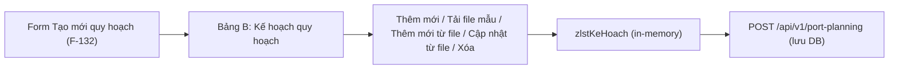

# Đặc tả nghiệp vụ: Kế hoạch quy hoạch (Bảng B)

**Tài liệu:** BA Feature Brief
**Feature:** F-132-Bang-B-Ke-hoach-quy-hoach
**Module:** M-006 — Quản lý văn bản & Thông tin nghiệp vụ
**Người viết:** Business Analyst
**Ngày cập nhật:** 2026-08-13

---

## 1. Tổng quan

### 1.1. Tính năng này làm gì?

Bảng B — **Kế hoạch quy hoạch** (`zlstKeHoach`) là danh sách con nằm trong form Tạo mới quy hoạch bến cảng (F-132). Bảng quản lý các bản ghi kế hoạch quy hoạch, hỗ trợ 5 thao tác:

1. **Thêm mới:** nhập thủ công từng bản ghi qua form
2. **Tải file mẫu:** tải file mẫu (Excel/CSV) để nhập liệu
3. **Thêm mới từ file:** import file tạo mới hàng loạt bản ghi
4. **Cập nhật từ file:** import file cập nhật bản ghi đã tồn tại
5. **Xóa:** xóa từng bản ghi đã tạo

> ⚠ **Quan trọng:** Mọi thao tác trên bảng B (thêm/sửa/xóa) chỉ thao tác trên **dữ liệu trong bảng (in-memory, chưa lưu DB)**. Dữ liệu chỉ được lưu vào DB khi người dùng nhấn nút **"Lưu"** ở form Tạo mới quy hoạch bến cảng (F-132) — lúc đó toàn bộ `zlstKeHoach` được gửi cùng `POST /api/v1/port-planning`.

### 1.2. Tại sao cần tính năng này?

Kế hoạch quy hoạch là phần nội dung chi tiết của một bản quy hoạch bến cảng, gồm mục tiêu, nội dung, nhu cầu vốn, giải pháp thực hiện... Việc hỗ trợ nhập liệu thủ công + import file giúp:
- Giảm thời gian nhập liệu khi số lượng bản ghi lớn
- Đảm bảo dữ liệu đồng nhất qua file mẫu chuẩn
- Cho phép cập nhật hàng loạt mà không phải sửa từng dòng

### 1.3. Luồng hoạt động chính

1. Người dùng mở form Tạo mới quy hoạch bến cảng (F-132).
2. Tại bảng B — Kế hoạch quy hoạch, người dùng chọn thao tác:
   - **Thêm mới** → form nhập 8 trường → Lưu → hiển thị trong bảng
   - **Tải file mẫu** → tải file mẫu về máy → điền dữ liệu → **Thêm mới từ file** hoặc **Cập nhật từ file**
   - **Xóa** → popup xác nhận → xóa khỏi bảng
3. Khi hoàn tất, người dùng nhấn "Lưu" ở form quy hoạch chính để lưu toàn bộ vào DB.

---

## 2. Ai dùng? Dùng như thế nào?

### 2.1. Logic phân quyền chung

Các thao tác trong bảng B được bảo vệ bởi quyền `portplanning:create` (thừa hưởng từ form Tạo mới quy hoạch F-132). Người dùng có quyền tạo quy hoạch thì được phép thao tác trên bảng B.

### 2.2. Logic phân quyền đặc biệt

Không có phân quyền riêng cho bảng B. Quyền thao tác hoàn toàn phụ thuộc vào quyền `portplanning:create` của form cha.

---

## 3. User Stories

### Mức Must (bắt buộc có)

- **US-B-01:** Là Planner, tôi muốn thêm mới bản ghi kế hoạch quy hoạch thủ công để nhập từng mục tiêu quy hoạch.
- **US-B-02:** Là Planner, tôi muốn tải file mẫu để biết cấu trúc file cần điền khi nhập hàng loạt.
- **US-B-03:** Là Planner, tôi muốn thêm mới từ file để tạo hàng loạt bản ghi nhanh chóng.
- **US-B-04:** Là Planner, tôi muốn cập nhật từ file để sửa hàng loạt bản ghi đã tồn tại.
- **US-B-05:** Là Planner, tôi muốn xóa bản ghi đã tạo mới để dọn dẹp dữ liệu nhập sai.

### Mức Should (nên có)

- **US-B-06:** Là Planner, tôi muốn hệ thống hiển thị thông báo rõ ràng khi import thành công/thất bại để biết kết quả thao tác.

---

## 4. Yêu cầu chức năng (Acceptance Criteria)

### 4.1. Thêm mới (thủ công)

**AC-B-01 — Hiển thị form thêm mới:** Người dùng nhấn nút "Thêm mới", hệ thống hiển thị form thêm mới với 8 trường rỗng (Mục tiêu quy hoạch, Dự báo quy hoạch đến năm, Nội dung quy hoạch, Nhu cầu sử dụng đất và mặt nước, Nhu cầu vốn đầu tư, Giải pháp thực hiện quy hoạch, Dự án ưu tiên đầu tư, Tổ chức thực hiện quy hoạch).

**AC-B-02 — Validation bắt buộc:** Các trường "Mục tiêu quy hoạch", "Dự báo quy hoạch đến năm", "Nội dung quy hoạch" là bắt buộc. Nếu bỏ trống và nhấn "Lưu", hiển thị lỗi "Trường này là bắt buộc", chặn submit.

**AC-B-03 — Trùng Mục tiêu quy hoạch:** "Mục tiêu quy hoạch" phải duy nhất trong bảng B. Nếu trùng với bản ghi đã có, hiển thị lỗi "Mục tiêu quy hoạch đã tồn tại" và chặn submit.

**AC-B-04 — Lưu bản ghi:** Khi nhấn "Lưu", bản ghi được thêm vào cuối danh sách bảng B (chỉ hiển thị, **không lưu DB**). Thông báo "Đã thêm kế hoạch quy hoạch".

**AC-B-05 — Hủy:** Nhấn "Hủy" đóng form thêm mới, không thêm bản ghi.

### 4.2. Tải file mẫu

**AC-B-06 — Tải file mẫu:** Nhấn "Tải file mẫu", hệ thống tải về file Excel/CSV với header là 8 cột tương ứng 8 trường của bảng B (xem chi tiết mục 9.2).

### 4.3. Thêm mới từ file

**AC-B-07 — Chọn file:** Nhấn "Thêm mới từ file", hệ thống mở hộp thoại chọn file từ máy. Chỉ chấp nhận định dạng `.xlsx`, `.xls`, `.csv`.

**AC-B-08 — Đọc và validate file:** Hệ thống đọc dữ liệu, validate từng dòng (header đúng 8 cột, Mục tiêu quy hoạch không rỗng, không trùng). Nếu file sai định dạng hoặc rỗng, hiển thị lỗi tương ứng.

**AC-B-09 — Tạo mới hàng loạt:** Sau khi validate hợp lệ, hệ thống tạo mới các bản ghi tương ứng trong bảng B (chưa lưu DB). Thông báo "Đã thêm N bản ghi từ file".

**AC-B-10 — Không sửa bản ghi đang có:** File "thêm mới từ file" không được ghi đè bản ghi đang có. Nếu "Mục tiêu quy hoạch" trong file trùng với bản ghi đã có trong bảng, dòng đó bị bỏ qua kèm cảnh báo (xem mục 9.3).

### 4.4. Cập nhật từ file

**AC-B-11 — Xác định bản ghi qua Mục tiêu quy hoạch:** Khi import "cập nhật từ file", hệ thống dùng trường "Mục tiêu quy hoạch" để xác định bản ghi cần cập nhật.

**AC-B-12 — Cập nhật bản ghi tồn tại:** Nếu "Mục tiêu quy hoạch" đã tồn tại trong bảng B, hệ thống cập nhật thông tin của bản ghi đó (ghi đè các trường còn lại).

**AC-B-13 — Không tạo bản ghi mới:** Nếu "Mục tiêu quy hoạch" trong file **không tồn tại** trong bảng B, hệ thống **không tạo bản ghi mới** — dòng đó bị bỏ qua kèm cảnh báo "Không tìm thấy bản ghi có Mục tiêu quy hoạch [X]".

### 4.5. Xóa

**AC-B-14 — Popup xác nhận:** Nhấn nút "Xóa" trên dòng, hệ thống hiển thị popup "Bạn có chắc chắn muốn xóa bản ghi [Mục tiêu quy hoạch]? Thao tác này không thể hoàn tác."

**AC-B-15 — Xóa bản ghi:** Nhấn "Xóa" trong popup, bản ghi được xóa khỏi bảng B (chưa lưu DB). Nhấn "Hủy" đóng popup, giữ nguyên bản ghi.

---

## 5. Quy tắc nghiệp vụ (Business Rules)

**BR-B-01 — Dữ liệu in-memory:** Mọi thao tác trên bảng B (thêm/sửa/xóa) chỉ thay đổi dữ liệu trong bảng, **không ghi DB**. Dữ liệu chỉ được lưu khi nhấn "Lưu" ở form Tạo mới quy hoạch bến cảng (F-132).

**BR-B-02 — Mục tiêu quy hoạch là khóa định danh:** Trường "Mục tiêu quy hoạch" đóng vai trò khóa định danh trong bảng B — duy nhất và bắt buộc. Dùng để phân biệt và xác định bản ghi khi cập nhật từ file.

**BR-B-03 — Thêm mới từ file không ghi đè:** File "thêm mới từ file" chỉ tạo mới, không được phép ghi đè bản ghi đang có. Dòng trùng "Mục tiêu quy hoạch" bị bỏ qua.

**BR-B-04 — Cập nhật từ file không tạo mới:** File "cập nhật từ file" chỉ cập nhật bản ghi đã tồn tại, không tạo bản ghi mới. Dòng có "Mục tiêu quy hoạch" không tồn tại bị bỏ qua.

**BR-B-05 — Định dạng file:** Chỉ chấp nhận file `.xlsx`, `.xls`, `.csv`. Header file mẫu phải khớp đúng 8 cột của bảng B.

---

## 6. Vòng đời và liên kết với các tính năng khác

### 6.1. Quan hệ với F-132 (Tạo mới quy hoạch bến cảng)

Bảng B là **danh sách con** của form Tạo mới quy hoạch bến cảng (F-132). Dữ liệu bảng B được gom vào `zlstKeHoach` khi lưu quy hoạch chính:



### 6.2. Các bảng con khác

Bảng B cùng cấp với:
- Bảng C — Dự báo hàng hóa thông qua cảng (`zlstDuBaoHhQuaCang`)
- Bảng D — Danh mục quy hoạch chi tiết (`zlstDanhMucChiTiet`)
- Bảng E — File đính kèm (`zlstFileDk`)

---

## 7. Mô hình dữ liệu

### 7.1. Bảng `zlstKeHoach` — Kế hoạch quy hoạch

Lưu danh sách kế hoạch quy hoạch của từng bản quy hoạch. Mỗi bản ghi gồm 8 trường:

| Trường | Kiểu | Bắt buộc | Mô tả |
|---|---|---|---|
| `mucTieuQuyHoach` | TEXT | Có | Mục tiêu quy hoạch — **khóa định danh**, duy nhất trong bảng |
| `duBaoQuyHoachDenNam` | YEAR (chọn 1 năm) | Có | Dự báo quy hoạch đến năm |
| `noiDungQuyHach` | TEXT | Có | Nội dung quy hoạch |
| `nhuCauSuDungDatVaNuoc` | TEXT | Không | Nhu cầu sử dụng đất và mặt nước |
| `nhuCauVonDauTu` | TEXT | Không | Nhu cầu vốn đầu tư |
| `giaiPhapThucHienQuyHoach` | TEXT | Không | Giải pháp thực hiện quy hoạch |
| `duAnUuTienDauTu` | TEXT | Không | Dự án ưu tiên đầu tư |
| `toChucThucHienQuyHoach` | TEXT | Không | Tổ chức thực hiện quy hoạch |

> **Ghi chú:** Trong bảng B, dữ liệu được quản lý dạng danh sách in-memory (không phải bảng DB riêng). Khi lưu quy hoạch chính, danh sách này được serialize thành mảng `zlstKeHoach` gửi trong request body.

---

## 8. API Endpoints

Bảng B không có API riêng. Dữ liệu `zlstKeHoach` được gửi kèm trong request body của API tạo quy hoạch chính:

| Method | Endpoint | Mô tả |
|---|---|---|
| POST | `/api/v1/port-planning` | Tạo quy hoạch bến cảng (kèm mảng `zlstKeHoach`) |

```json
{
  "fkDonViQl": "...",
  "fkCangBien": "...",
  "quyetDinhSo": "174/QĐ-BGTVT",
  "quyetDinhNgay": "2024-03-20",
  "zlstKeHoach": [
    {
      "mucTieuQuyHoach": "Phát triển cảng biển trọng điểm",
      "duBaoQuyHoachDenNam": 2030,
      "noiDungQuyHach": "Mở rộng khu bến...",
      "nhuCauSuDungDatVaNuoc": "150 ha đất, 500 ha mặt nước",
      "nhuCauVonDauTu": "50.000 tỷ đồng",
      "giaiPhapThucHienQuyHoach": "Thu hút đầu tư...",
      "duAnUuTienDauTu": "Cảng nước sâu...",
      "toChucThucHienQuyHoach": "UBND TP Hải Phòng"
    }
  ]
}
```

---

## 9. Chi tiết nghiệp vụ từng phần

### 9.1. Thêm mới (thủ công)

**Form thêm mới** gồm 8 trường với các loại điều khiển tương ứng:

| STT | Tên trường | Loại điều khiển | Bắt buộc | Mô tả |
| --- | --- | --- | --- | --- |
| 1 | Mục tiêu quy hoạch | Input | Có | Nhập mục tiêu quy hoạch. Là khóa định danh, duy nhất trong bảng. |
| 2 | Dự báo quy hoạch đến năm | DatePicker (year) | Có | Chọn 1 năm dự báo. |
| 3 | Nội dung quy hoạch | Textarea | Có | Nhập nội dung quy hoạch. |
| 4 | Nhu cầu sử dụng đất và mặt nước | Textarea | Không | Nhập nhu cầu sử dụng đất và mặt nước. |
| 5 | Nhu cầu vốn đầu tư | Textarea | Không | Nhập nhu cầu vốn đầu tư. |
| 6 | Giải pháp thực hiện quy hoạch | Textarea | Không | Nhập giải pháp thực hiện quy hoạch. |
| 7 | Dự án ưu tiên đầu tư | Textarea | Không | Nhập dự án ưu tiên đầu tư. |
| 8 | Tổ chức thực hiện quy hoạch | Textarea | Không | Nhập tổ chức thực hiện quy hoạch. |

**Nút hành động:**

| Nút | Hành động |
| --- | --- |
| **Lưu** | Validate → thêm bản ghi vào cuối bảng B (chỉ hiển thị, không lưu DB). Thông báo "Đã thêm kế hoạch quy hoạch". |
| **Hủy** | Đóng form, không thêm bản ghi. |

### 9.2. Tải file mẫu

Nhấn "Tải file mẫu" → tải file Excel/CSV về máy. File mẫu có **header 8 cột** tương ứng 8 trường:

| # | Cột trong file | Tương ứng trường | Bắt buộc |
| --- | --- | --- | --- |
| 1 | Mục tiêu quy hoạch | `mucTieuQuyHoach` | Có |
| 2 | Dự báo quy hoạch đến năm | `duBaoQuyHoachDenNam` | Có |
| 3 | Nội dung quy hoạch | `noiDungQuyHach` | Có |
| 4 | Nhu cầu sử dụng đất và mặt nước | `nhuCauSuDungDatVaNuoc` | Không |
| 5 | Nhu cầu vốn đầu tư | `nhuCauVonDauTu` | Không |
| 6 | Giải pháp thực hiện quy hoạch | `giaiPhapThucHienQuyHoach` | Không |
| 7 | Dự án ưu tiên đầu tư | `duAnUuTienDauTu` | Không |
| 8 | Tổ chức thực hiện quy hoạch | `toChucThucHienQuyHoach` | Không |

### 9.3. Thêm mới từ file

**Quy trình:**

1. Nhấn "Thêm mới từ file" → mở hộp thoại chọn file từ máy (`.xlsx`, `.xls`, `.csv`).
2. Chọn file → hệ thống đọc dữ liệu.
3. Validate từng dòng theo bảng lỗi dưới đây.
4. Tạo mới các bản ghi hợp lệ vào bảng B.
5. Hiển thị thông báo kết quả.

**Các case và exception:**

| Tình huống | Xử lý |
| --- | --- |
| File rỗng (0 dòng dữ liệu) | Lỗi "File rỗng, không có dữ liệu để thêm" |
| File sai định dạng (không phải xlsx/xls/csv) | Lỗi "Định dạng file không được hỗ trợ" |
| Header không khớp 8 cột mẫu | Lỗi "Cấu trúc file không đúng với file mẫu" |
| "Mục tiêu quy hoạch" trống | Dòng đó bị bỏ qua, cảnh báo "Dòng [N]: Mục tiêu quy hoạch không được để trống" |
| "Mục tiêu quy hoạch" trùng bản ghi đã có trong bảng | Dòng đó bị bỏ qua (không ghi đè), cảnh báo "Dòng [N]: Mục tiêu quy hoạch đã tồn tại" |
| "Dự báo quy hoạch đến năm" trống hoặc không đúng định dạng năm | Dòng đó bị bỏ qua, cảnh báo "Dòng [N]: Dự báo quy hoạch đến năm không hợp lệ" |
| "Nội dung quy hoạch" trống | Dòng đó bị bỏ qua, cảnh báo "Dòng [N]: Nội dung quy hoạch không được để trống" |
| Tất cả dòng hợp lệ | Thêm toàn bộ, thông báo "Đã thêm N bản ghi từ file" |
| Có dòng lỗi + dòng hợp lệ | Thêm dòng hợp lệ, cảnh báo danh sách dòng bị bỏ qua |

> **Nguyên tắc:** "Thêm mới từ file" **chỉ tạo mới**, không sửa bản ghi đang có. Bản ghi trùng "Mục tiêu quy hoạch" luôn bị bỏ qua.

### 9.4. Cập nhật từ file

**Quy trình:**

1. Nhấn "Cập nhật từ file" → mở hộp thoại chọn file.
2. Chọn file → hệ thống đọc dữ liệu.
3. Với mỗi dòng, xác định bản ghi qua trường "Mục tiêu quy hoạch".
4. Nếu tìm thấy → cập nhật thông tin bản ghi đó.
5. Nếu không tìm thấy → bỏ qua (không tạo mới).

**Các case và exception:**

| Tình huống | Xử lý |
| --- | --- |
| File rỗng | Lỗi "File rỗng, không có dữ liệu để cập nhật" |
| File sai định dạng | Lỗi "Định dạng file không được hỗ trợ" |
| Header không khớp | Lỗi "Cấu trúc file không đúng với file mẫu" |
| "Mục tiêu quy hoạch" tồn tại trong bảng | Cập nhật các trường còn lại của bản ghi đó |
| "Mục tiêu quy hoạch" **không** tồn tại trong bảng | Bỏ qua dòng, cảnh báo "Không tìm thấy bản ghi có Mục tiêu quy hoạch [X]" — **không tạo mới** |
| "Mục tiêu quy hoạch" trống | Bỏ qua, cảnh báo "Dòng [N]: Mục tiêu quy hoạch không được để trống" |
| "Dự báo quy hoạch đến năm" trống hoặc không đúng định dạng năm | Bỏ qua, cảnh báo "Dòng [N]: Dự báo quy hoạch đến năm không hợp lệ" |
| "Nội dung quy hoạch" trống | Bỏ qua, cảnh báo "Dòng [N]: Nội dung quy hoạch không được để trống" |
| Tất cả dòng hợp lệ | Cập nhật toàn bộ, thông báo "Đã cập nhật N bản ghi từ file" |

> **Nguyên tắc:** "Cập nhật từ file" **chỉ cập nhật bản ghi đã tồn tại**, không tạo bản ghi mới cho "Mục tiêu quy hoạch" chưa có.

### 9.5. Xóa

**Quy trình:**

1. Nhấn nút "Xóa" trên dòng bản ghi.
2. Hiển thị popup xác nhận: "Bạn có chắc chắn muốn xóa bản ghi **[Mục tiêu quy hoạch]**? Thao tác này không thể hoàn tác."
3. Nhấn "Xóa" → xóa bản ghi khỏi bảng B (chưa lưu DB). Thông báo "Đã xóa kế hoạch quy hoạch".
4. Nhấn "Hủy" → đóng popup, giữ nguyên bản ghi.

**Các case và exception:**

| Tình huống | Xử lý |
| --- | --- |
| Xóa bản ghi mới tạo (chưa lưu DB) | Xóa khỏi bảng, không cần xử lý DB |
| Bảng trống (0 bản ghi) | Không có nút "Xóa" nào để bấm |
| Nhấn "Hủy" trong popup | Giữ nguyên bản ghi |

> **Ghi chú:** Vì dữ liệu bảng B chưa lưu DB (in-memory), thao tác xóa chỉ xóa khỏi danh sách hiển thị. Khi nhấn "Lưu" ở form quy hoạch chính, chỉ các bản ghi còn lại trong bảng được lưu.

---

## 10. Yêu cầu phi chức năng

### 10.1. Hiệu năng

- Mở form thêm mới ≤ 300ms
- Import file ≤ 2 giây cho file ≤ 1000 dòng
- Tải file mẫu ≤ 1 giây

### 10.2. Khả năng mở rộng

- Hỗ trợ thêm trường mới vào bảng B bằng cách mở rộng file mẫu và form

### 10.3. Bảo mật

- Quyền `portplanning:create` được kiểm tra trước khi thao tác trên bảng B
- File import không được chứa macro/script (chỉ đọc dữ liệu thuần)

### 10.4. Độ tin cậy

- Import file validate từng dòng, không làm hỏng toàn bộ nếu 1 dòng lỗi
- Dữ liệu in-memory không bị mất nếu người dùng chưa nhấn "Lưu" form chính (có cảnh báo khi rời trang)

### 10.5. Trải nghiệm người dùng

- Form thêm mới có loading skeleton khi tải
- Thông báo kết quả import rõ ràng (số bản ghi thành công + danh sách dòng bị bỏ qua)
- Popup xóa có màu cảnh báo đỏ

---

## 11. Yêu cầu giao diện người dùng

### 11.1. Bố cục

Bảng B nằm trong form Tạo mới quy hoạch, là một section có tiêu đề "Kế hoạch quy hoạch".

### 11.2. Thành phần

1. **Thanh công cụ:** nút "Thêm mới" (actionPrimary), "Tải file mẫu" (textSecondary), "Thêm mới từ file" (textSecondary), "Cập nhật từ file" (textSecondary).
2. **DataTable:** các cột: STT, Mục tiêu quy hoạch, Dự báo quy hoạch đến năm, Nội dung quy hoạch, ..., Thao tác (Xóa).
3. **Phân trang:** 10/20/50 dòng/trang.

### 11.3. Trạng thái giao diện

- **Đang import:** hiển thị spinner "Đang đọc file..."
- **Bảng trống:** empty state "Chưa có kế hoạch quy hoạch nào"
- **Import lỗi:** cảnh báo đỏ + danh sách dòng bị bỏ qua
