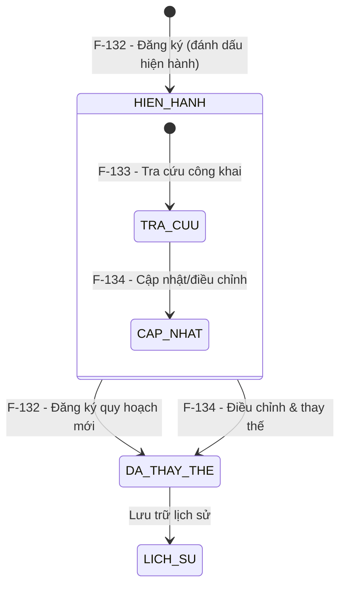

# Đặc tả nghiệp vụ: Tạo mới quy hoạch bến cảng

**Tài liệu:** BA Feature Brief
**Feature:** F-132
**Module:** M-006 — Quản lý văn bản & Thông tin nghiệp vụ
**Người viết:** Business Analyst
**Ngày cập nhật:** 2026-08-13

---

## 1. Tổng quan

### 1.1. Tính năng này làm gì?

Cho phép người dùng có thẩm quyền (Planner, Admin) đăng ký (tạo mới) một bản quy hoạch bến cảng hàng hải vào hệ thống, bao gồm thông tin chung (tên đồ án, cơ quan phê duyệt, ngày phê duyệt, phạm vi áp dụng, tỷ lệ bản đồ), kèm danh sách hạng mục quy hoạch và file đính kèm (bản đồ, biên bản phê duyệt). Hệ thống lưu trữ và quản lý phiên bản quy hoạch (hiện hành / đã thay thế / lịch sử).

### 1.2. Tại sao cần tính năng này?

Quy hoạch bến cảng là cơ sở pháp lý và kỹ thuật cho mọi quyết định đầu tư, khai thác cảng biển. Việc số hóa đăng ký và quản lý quy hoạch giúp: đảm bảo thông tin quy hoạch chính xác, cập nhật và nhất quán; tránh xung đột giữa hạng mục đầu tư mới với quy hoạch hiện hành; lưu trữ hồ sơ pháp lý đầy đủ phục vụ tra cứu và kiểm toán.

### 1.3. Luồng hoạt động chính

1. Người dùng đăng nhập, vào menu **Quản lý văn bản & Thông tin nghiệp vụ > Quản lý quy hoạch bến cảng**.
2. Hệ thống hiển thị danh sách quy hoạch (theo nhóm hiện hành / đã thay thế / lịch sử).
3. Người dùng nhấn **"Tạo mới"**.
4. Hệ thống hiển thị form đăng ký quy hoạch: thông tin chung + hạng mục quy hoạch + file đính kèm.
5. Người dùng nhập thông tin và nhấn **"Lưu"**.
6. Hệ thống gọi `POST /api/v1/port-planning`, validate dữ liệu và lưu bản ghi với `status` tương ứng.
7. Nếu thành công: hiển thị thông báo "Tạo quy hoạch bến cảng thành công", chuyển hướng về danh sách.
8. Nếu thất bại: thông báo lỗi hiển thị tại trường tương ứng.

> ⚠ **Lưu ý quan trọng:** Quy hoạch bến cảng **KHÔNG có luồng phê duyệt** (không có trạng thái Lưu tạm / Chờ duyệt / Duyệt 2 cấp như nhóm Đê/kè M-003). Bản ghi sau khi tạo có hiệu lực ngay theo trạng thái `status` được gán.

---

## 2. Ai dùng? Dùng như thế nào?

Quyền thao tác và xem tính năng được áp dụng theo hệ thống phân quyền tập trung của hệ thống. Mỗi vai trò người dùng sẽ có phạm vi truy cập và thao tác khác nhau trên tính năng này, được kiểm soát bởi cơ chế RBAC (Role-Based Access Control).

### 2.1. Logic phân quyền chung

Các thao tác trong tính năng được bảo vệ bởi các quyền (permissions) tương ứng. Người dùng chỉ có thể thực hiện những thao tác mà vai trò của họ được cấp quyền (xem chi tiết tại tính năng Phân quyền).

### 2.2. Logic phân quyền đặc biệt cho tài khoản Admin Cục

Đối với tài khoản **Admin Cục**, áp dụng logic phân quyền đặc biệt sau:

- **Xem full dữ liệu:** Admin Cục có quyền xem toàn bộ dữ liệu trên hệ thống, không giới hạn phạm vi đơn vị hay khu vực.
- **Xem thông tin người chỉnh sửa:** Với mỗi bản ghi, Admin Cục thấy được thông tin người chỉnh sửa cuối cùng (họ tên, tên đăng nhập).
- **Xem thời gian cập nhật:** Admin Cục thấy được thời gian cập nhật cuối cùng của dữ liệu (timestamp).
- **Xem người tạo mới:** Admin Cục thấy được thông tin người tạo mới bản ghi (họ tên, tên đăng nhập).
- **Xem thời gian tạo mới:** Admin Cục thấy được thời gian tạo mới dữ liệu (timestamp).

> **Ghi chú:** Các trường `createdBy`, `createdAt`, `updatedBy`, `updatedAt` đã có trong bảng `port_planning` và chỉ hiển thị đối với tài khoản Admin Cục.

---

## 3. User Stories

Dưới đây là các câu chuyện người dùng, sắp xếp theo mức độ ưu tiên (Must > Should > Could):

### Mức Must (bắt buộc có)

- **US-132-01:** Là Planner, tôi muốn đăng ký quy hoạch bến cảng mới với đầy đủ thông tin (tên đồ án, cơ quan phê duyệt, ngày phê duyệt, phạm vi áp dụng) để ghi nhận quy hoạch vào hệ thống.
- **US-132-02:** Là Planner, tôi muốn hệ thống kiểm tra tên đồ án không trùng lặp để đảm bảo tính duy nhất của dữ liệu.
- **US-132-03:** Là Planner, tôi muốn upload file bản đồ, đồ án và biên bản phê duyệt để lưu trữ hồ sơ đầy đủ.
- **US-132-04:** Là Planner, tôi muốn thêm các hạng mục quy hoạch (mục tiêu, chỉ tiêu) để theo dõi tiến độ thực hiện.

### Mức Should (nên có)

- **US-132-05:** Là Planner, tôi muốn nhận thông báo rõ ràng khi đăng ký thành công hoặc thất bại để biết trạng thái thao tác.
- **US-132-06:** Là Planner, tôi muốn được chuyển hướng về danh sách sau khi đăng ký thành công.

### Mức Could (có thể có sau)

- **US-132-07:** Là Planner, tôi muốn so sánh quy hoạch hiện hành với quy hoạch đã thay thế để thấy được sự khác biệt.

---

## 4. Yêu cầu chức năng (Acceptance Criteria)

Mỗi yêu cầu dưới đây mô tả một điều hệ thống phải làm được, kèm theo cách xử lý khi có lỗi hoặc dữ liệu không như mong đợi.

**AC-132-01 — Hiển thị form đăng ký:** Người dùng có vai trò Planner hoặc Admin nhấn "Tạo mới", hệ thống hiển thị form với các nhóm: Thông tin chung, Hạng mục quy hoạch, File đính kèm. Nếu không có quyền, nút "Tạo mới" bị ẩn và API trả về 403 Forbidden.

**AC-132-02 — Validation tên đồ án:** Hệ thống kiểm tra `projectName` bắt buộc (không để trống). Nếu trùng với đồ án đã tồn tại, hiển thị lỗi "Tên đồ án quy hoạch bến cảng đã tồn tại" và chặn submit.

**AC-132-03 — Đăng ký thành công:** Người dùng điền đầy đủ thông tin hợp lệ và nhấn "Lưu". Hệ thống tạo bản ghi với `status` tương ứng, thông báo "Tạo quy hoạch bến cảng thành công", chuyển hướng về danh sách.

**AC-132-04 — Upload file đính kèm:** Hệ thống cho phép upload file bản đồ, đồ án và biên bản phê duyệt. File phải thuộc định dạng hỗ trợ (PDF, DWG, SHP). Nếu định dạng không hợp lệ, hiển thị lỗi.

**AC-132-05 — Thêm hạng mục quy hoạch:** Người dùng thêm hạng mục với tên hạng mục (bắt buộc), đơn vị tính, giá trị kế hoạch. Hạng mục không tên bị chặn.

**AC-132-06 — Không có quyền:** Người dùng không có quyền `portplanning:create` truy cập tạo mới. Nút bị ẩn. Gọi API trực tiếp → 403 Forbidden.

**AC-132-07 — Đánh dấu hiện hành (phiên bản):** Khi đăng ký quy hoạch mới và đánh dấu `status = HIEN_HANH`, quy hoạch hiện hành cũ tự động chuyển sang `DA_THAY_THE`. Chỉ Admin mới được phép đánh dấu hiện hành.

---

## 5. Quy tắc nghiệp vụ (Business Rules)

Các quy tắc này là "luật chơi" mà mọi thành phần trong hệ thống phải tuân thủ:

**BR-132-01 — Tên đồ án duy nhất:** `projectName` là duy nhất trong toàn hệ thống, không được trùng lặp với đồ án đã tồn tại.

**BR-132-02 — Cơ quan và ngày phê duyệt hợp lệ:** Quy hoạch bến cảng phải có cơ quan phê duyệt (`approvalAuthority`) và ngày phê duyệt (`approvalDate`) hợp lệ. Ngày phê duyệt không được trong tương lai.

**BR-132-03 — Quản lý phiên bản:** Một quy hoạch chỉ được đánh dấu `HIEN_HANH` nếu đã có đầy đủ hồ sơ. Khi đánh dấu quy hoạch mới là hiện hành, quy hoạch cũ tự động chuyển sang `DA_THAY_THE`.

**BR-132-04 — Định dạng file:** File bản đồ quy hoạch phải là định dạng được hệ thống hỗ trợ (PDF, DWG, SHP).

**BR-132-05 — Không có luồng phê duyệt:** Quy hoạch bến cảng **không đi qua luồng phê duyệt** (không có trạng thái Lưu tạm / Chờ duyệt / Duyệt 2 cấp). Bản ghi tạo ra có hiệu lực ngay theo `status` được gán. Đây là điểm khác biệt quan trọng so với nhóm tài sản KCHTGT (M-002, M-003).

**BR-132-06 — Ghi nhật ký:** Mọi thao tác tạo mới đều ghi `createdBy`, `createdAt` để phục vụ kiểm toán.

### 5.1. Quy tắc liên kết — dev cần biết

> ⚠ **QUAN TRỌNG CHO DEVELOPER:** Vì các tính năng liên quan (F-133, F-134) **chưa có tài liệu chi tiết**, developer cần nắm các liên kết sau để thiết kế đúng ngay từ đầu.

**BR-LINK-01 — Tạo mới → Tra cứu (F-133):** Bản ghi tạo ra từ F-132 được tra cứu công khai qua F-133 (`Tra cứu quy hoạch bến cảng`). F-133 là read-only (search + detail), không có thao tác sửa/xóa. Dữ liệu tra cứu lấy từ bản ghi đã đăng ký.

**BR-LINK-02 — Tạo mới → Cập nhật (F-134):** Bản ghi đăng ký từ F-132 có thể được điều chỉnh/bổ sung qua F-134 (`Cập nhật quy hoạch bến cảng`), bao gồm đăng ký điều chỉnh, đánh giá tác động, phê duyệt thay đổi. Mỗi lần điều chỉnh tạo bản ghi `PlanningAdjustment`.

**BR-LINK-03 — Quản lý phiên bản khi có quy hoạch mới:** Khi đăng ký quy hoạch mới (F-132) và đánh dấu hiện hành, quy hoạch cũ tự động chuyển `DA_THAY_THE` và được lưu làm lịch sử (`LICH_SU`). Developer cần đảm bảo logic chuyển trạng thái này trong `PortPlanningService`.

**BR-LINK-04 — Tích hợp bản đồ GIS:** Quy hoạch bến cảng có liên kết với dữ liệu GIS qua `PlanningGisController` (`/api/gis/planning`). Tọa độ quy hoạch hiển thị trên bản đồ (tham khảo THKCHT_268N trong hệ thống tham chiếu).

**BR-LINK-05 — Không phụ thuộc luồng phê duyệt:** Khác với nhóm Đê/kè (M-003) và Cầu cảng (M-002), quy hoạch bến cảng không có luồng phê duyệt 2 cấp. Không có nút "Gửi duyệt", "Phê duyệt", "Từ chối". Chỉ có Tạo mới / Sửa / Xóa / Tra cứu.

---

## 6. Vòng đời và liên kết với các tính năng khác

### 6.1. Vòng đời quy hoạch bến cảng



### 6.2. Trạng thái và ý nghĩa

| Trạng thái | Mã | Ý nghĩa | Hiển thị ở module khác? |
|---|---|---|---|
| Hiện hành | HIEN_HANH | Quy hoạch đang có hiệu lực | ✅ Có — tra cứu (F-133), cập nhật (F-134) |
| Đã thay thế | DA_THAY_THE | Quy hoạch cũ đã bị thay bởi quy hoạch mới | ⚠️ Chỉ đọc (lịch sử) |
| Lịch sử | LICH_SU | Quy hoạch lưu trữ để kiểm toán | ❌ Không hiển thị mặc định |

### 6.3. Các tính năng liên quan trực tiếp

| Feature | Tên | Vai trò | Mối liên kết với F-132 |
|---|---|---|---|
| **F-133** | Tra cứu quy hoạch bến cảng | Tra cứu read-only | Bản ghi từ F-132 được tra cứu qua F-133 |
| **F-134** | Cập nhật quy hoạch bến cảng | Điều chỉnh, bổ sung | Bản ghi F-132 được điều chỉnh qua F-134 |
| **F-128** | Quản lý văn bản pháp lý | Văn bản pháp lý liên quan | Quyết định phê duyệt quy hoạch là văn bản pháp lý |

---

## 7. Mô hình dữ liệu

Tính năng này tạo ra/sửa đổi các bảng dữ liệu sau trong cơ sở dữ liệu:

> **Quy ước đánh dấu:**
> - <span style="color:red;font-weight:bold">🔴 Chữ màu đỏ</span> = **trường mới cần thêm** vào bảng hiện có.
> - ~~Chữ gạch ngang~~ = **trường không cần thiết**, cần loại bỏ khỏi bảng.
> - Các trường không được đánh dấu là các trường hiện có, được giữ nguyên.

### 7.1. Bảng `port_planning` (QH_BEN_CANG) — Quy hoạch bến cảng

Đây là bảng chính, lưu thông tin chung của bản quy hoạch.

Các trường thông tin:

- **id:** UUID, khóa chính, tự động sinh
- <span style="color:red;font-weight:bold">**donViQuanLyId (fkDonViQl):** UUID, đơn vị quản lý, bắt buộc.</span>
- <span style="color:red;font-weight:bold">**cangBienId (fkCangBien):** UUID, cảng biển quy hoạch, bắt buộc.</span>
- <span style="color:red;font-weight:bold">**quyetDinhSo:** VARCHAR(20), số quyết định quy hoạch, bắt buộc.</span>
- **approvalDate:** DATE, ngày quyết định quy hoạch, bắt buộc. (tương đương `quyetDinhNgay` trong hệ thống tham chiếu)
- **status:** enum — trạng thái: `HIEN_HANH` / `DA_THAY_THE` / `LICH_SU`
- ~~**projectName:** VARCHAR(200)~~ → thay bằng `quyetDinhSo`
- ~~**approvalAuthority:** VARCHAR(200)~~ → không cần thiết, thông tin có trong biên bản phê duyệt
- ~~**applicationScope:** VARCHAR(500)~~ → không cần thiết
- ~~**mapScale:** VARCHAR(50)~~ → không cần thiết
- ~~**filePath:** VARCHAR(500)~~ → thay bằng bảng `planning_files`
- **createdBy:** VARCHAR(100), người tạo
- **createdAt:** DATETIME, thời điểm tạo (tự động)
- **updatedBy:** VARCHAR(100), người cập nhật
- **updatedAt:** DATETIME, thời điểm cập nhật (tự động)
- ~~**planningCategories:** OneToMany → bảng `planning_categories`~~ → thay bằng 3 danh sách con bên dưới

### 7.2. Bảng `zlstKeHoach` — Kế hoạch quy hoạch

<span style="color:red;font-weight:bold">🔴 Bảng mới</span>, lưu kế hoạch quy hoạch của từng bản quy hoạch:

- **id:** UUID, khóa chính
- **portPlanningId:** UUID, FK → port_planning
- **mucTieuQuyHoach:** TEXT, mục tiêu quy hoạch
- **duBaoQuyHoachDenNam:** INTEGER, dự báo quy hoạch đến năm (0-9999)
- **noiDungQuyHach:** TEXT, nội dung quy hoạch
- **nhuCauSuDungDatVaNuoc:** TEXT, nhu cầu sử dụng đất và mặt nước
- **nhuCauVonDauTu:** TEXT, nhu cầu vốn đầu tư
- **giaiPhapThucHienQuyHoach:** TEXT, giải pháp thực hiện quy hoạch
- **duAnUuTienDauTu:** TEXT, dự án ưu tiên đầu tư
- **toChucThucHienQuyHoach:** TEXT, tổ chức thực hiện quy hoạch

### 7.3. Bảng `zlstDuBaoHhQuaCang` — Dự báo hàng hóa thông qua cảng

<span style="color:red;font-weight:bold">🔴 Bảng mới</span>, mỗi dòng = một loại cảng/bến/cầu + dự báo 3 loại hàng (min/max):

- **id:** UUID, khóa chính
- **portPlanningId:** UUID, FK → port_planning
- **phanLoaiCangBenCangCauCang:** VARCHAR, phân loại CB/BC/CC
- **cangBenCangCauCang:** VARCHAR, cảng/bến/cầu cụ thể
- **hangContainerTrongLuongToiThieu / ToiDa:** DECIMAL(20,4), hàng container min/max
- **hangTongHopRoiTrongLuongToiThieu / ToiDa:** DECIMAL(20,4), hàng tổng hợp rời min/max
- **hangLongKhiTrongLuongToiThieu / ToiDa:** DECIMAL(20,4), hàng lỏng khí min/max
- **tongCongTrongLuongToiThieu / ToiDa:** DECIMAL(20,4), tổng cộng min/max
- **ghiChu:** VARCHAR, ghi chú

### 7.4. Bảng `zlstDanhMucChiTiet` — Danh mục quy hoạch chi tiết

<span style="color:red;font-weight:bold">🔴 Bảng mới</span>, lưu danh mục quy hoạch chi tiết:

- **id:** UUID, khóa chính
- **portPlanningId:** UUID, FK → port_planning
- **phanLoaiCangBenCangCauCang:** VARCHAR, phân loại CB/BC/CC
- **cangBenCangCauCang:** VARCHAR, cảng/bến/cầu cụ thể
- **congNangKhaiThac:** VARCHAR, công năng khai thác
- **phanLoai:** VARCHAR, phân loại
- **soLuongCauCang:** INTEGER, số lượng cầu cảng (0-99999)
- **chieuDai:** DECIMAL(20,4), chiều dài (m)
- **coTau:** VARCHAR, cỡ tàu (tấn)
- **soLuongCauCangKbThap / KbCao:** INTEGER, số cầu cảng KB thấp/cao
- **chieuDaiKbThap / KbCao:** DECIMAL(20,4), chiều dài KB thấp/cao
- **duKienCoTau:** VARCHAR, dự kiến cỡ tàu (tấn)
- **duKienCongSuatKbThap / KbCao:** DECIMAL(20,4), dự kiến công suất
- **dienTichVungDat:** DECIMAL(20,4), diện tích vùng đất (ha)
- **dienTichVungNuoc:** DECIMAL(20,4), diện tích vùng nước (ha)

### 7.5. Bảng `planning_files` (zlstFileDk) — File đính kèm

Lưu trữ file bản đồ, đồ án và biên bản phê duyệt của từng quy hoạch. Liên kết 1-nhiều với `port_planning`.

---

## 8. API Endpoints

Hệ thống cung cấp các API để phục vụ các thao tác liên quan đến tính năng:

| Method | Endpoint | Mô tả | Phân quyền |
|---|---|---|---|
| POST | `/api/v1/port-planning` | Đăng ký (tạo mới) quy hoạch bến cảng | `portplanning:create` |

**Request Body (đăng ký):**

```json
{
  "projectName": "Quy hoạch chi tiết nhóm cảng biển Hải Phòng",
  "approvalAuthority": "Bộ Giao thông vận tải",
  "approvalDate": "2024-03-20",
  "applicationScope": "Khu vực cảng biển Hải Phòng giai đoạn 2021-2030",
  "mapScale": "1/5000",
  "status": "HIEN_HANH",
  "filePath": "/uploads/planning/..."
}
```

> **Ghi chú:** Các API khác (GET list, GET detail, PUT update, DELETE, filter/search) thuộc F-132 (đọc/sửa/xóa) và F-133 (tra cứu). Xem thêm F-134 cho điều chỉnh quy hoạch.

---

## 9. Chi tiết nghiệp vụ từng phần

### 9.1. Form Tạo mới quy hoạch

Form tạo mới gồm thông tin chung + 3 danh sách con + file đính kèm.

#### A. Thông tin chung (InfoForm — 4 field)

| STT | Tên trường | Loại điều khiển | Cho phép chỉnh sửa | Bắt buộc | Giá trị mặc định | Mô tả |
| --- | --- | --- | --- | --- | --- | --- |
| 1 | Đơn vị quản lý | SelectOrgCode | Có | Không | Đơn vị của user | Chọn đơn vị quản lý. Mặc định = đơn vị của người dùng đăng nhập. |
| 2 | Số quyết định quy hoạch | Input | Có | Có (khi CREATE) | Trống | Nhập số quyết định quy hoạch. Max 20 ký tự. |
| 3 | Ngày quyết định quy hoạch | DatePicker | Có | Có | Trống | Chọn ngày quyết định quy hoạch. |
| 4 | Cảng biển quy hoạch | SelectKcht (CB_CCAN) | Có | Có (khi CREATE) | Trống | Chọn cảng biển quy hoạch. Chỉ KCHT đã duyệt. |

#### B. Kế hoạch quy hoạch (zlstKeHoach)

Bảng dữ liệu phân trang — mỗi dòng là một kế hoạch quy hoạch.

| Cột | Loại điều khiển | Mô tả |
| --- | --- | --- |
| STT | Text (tự động) | Số thứ tự dòng |
| Mục tiêu quy hoạch | Text (read-only) | Hiển thị mục tiêu quy hoạch |
| Dự báo quy hoạch đến năm | Text (read-only) | Hiển thị năm dự báo. |
| Nội dung quy hoạch | Text (read-only) | Hiển thị nội dung quy hoạch |
| Nhu cầu sử dụng đất và mặt nước | Text (read-only) | Hiển thị nhu cầu sử dụng đất và mặt nước |
| Nhu cầu vốn đầu tư | Text (read-only) | Hiển thị nhu cầu vốn đầu tư |
| Giải pháp thực hiện quy hoạch | Text (read-only) | Hiển thị giải pháp thực hiện quy hoạch |
| Dự án ưu tiên đầu tư | Text (read-only) | Hiển thị dự án ưu tiên đầu tư |
| Tổ chức thực hiện quy hoạch | Text (read-only) | Hiển thị tổ chức thực hiện quy hoạch |

**Phân trang:** 10/20/50 dòng/trang.

**Thao tác trên bảng:**

| Thao tác | Mô tả |
| --- | --- |
| Thêm mới | Thêm mới kế hoạch quy hoạch |
| Tải file mẫu | Tải file mẫu kế hoạch quy hoạch |
| Thêm mới từ file | Thêm mới từ file Excel/CSV |
| Cập nhật từ file | Cập nhật từ file Excel/CSV |
| Xóa | Xóa từng bản ghi đã tạo mới |

> Tài liệu chi tiết: `F-132-Bang-B-Ke-hoach-quy-hoach-feature-brief`

#### C. Dự báo hàng hóa thông qua cảng (zlstDuBaoHhQuaCang)

Bảng dữ liệu phân trang — mỗi dòng = một loại cảng/bến/cầu + dự báo 3 loại hàng (min/max) + tổng cộng. **Tất cả trường hiển thị dạng Text (read-only):**

| Cột | Loại điều khiển | Mô tả |
| --- | --- | --- |
| STT | Text (tự động) | Số thứ tự dòng |
| Phân loại (CB/BC/CC) | Text (read-only) | Phân loại: Cảng biển / Bến cảng / Cầu cảng |
| Cảng, bến, cầu cụ thể | Text (read-only) | Cảng/bến/cầu cụ thể |
| Hàng container (min/max) | Text (read-only) | Trọng lượng tối thiểu/tối đa |
| Hàng tổng hợp, rời (min/max) | Text (read-only) | Trọng lượng tối thiểu/tối đa |
| Hàng lỏng, khí (min/max) | Text (read-only) | Trọng lượng tối thiểu/tối đa |
| Tổng cộng (min/max) | Text (read-only) | Tổng cộng tối thiểu/tối đa |
| Ghi chú | Text (read-only) | Ghi chú |

**Phân trang:** 10/20/50 dòng/trang.

**Thao tác trên bảng:**

| Thao tác | Mô tả |
| --- | --- |
| Thêm mới | Thêm mới dự báo hàng hóa |
| Tải file mẫu | Tải file mẫu dự báo hàng hóa |
| Thêm mới từ file | Thêm mới từ file Excel/CSV |
| Cập nhật từ file | Cập nhật từ file Excel/CSV |
| Xóa | Xóa từng bản ghi đã tạo mới |

> Tài liệu chi tiết: `F-132-Bang-C-Du-bao-hang-hoa-feature-brief`

#### D. Danh mục quy hoạch chi tiết (zlstDanhMucChiTiet)

Bảng dữ liệu phân trang — mỗi dòng là một danh mục quy hoạch chi tiết. **Tất cả trường hiển thị dạng Text (read-only):**

| Cột | Loại điều khiển | Mô tả |
| --- | --- | --- |
| STT | Text (tự động) | Số thứ tự dòng |
| Phân loại (CB/BC/CC) | Text (read-only) | Phân loại |
| Cảng, bến, cầu cụ thể | Text (read-only) | Cảng/bến/cầu cụ thể |
| Công năng khai thác | Text (read-only) | Công năng khai thác |
| Phân loại | Text (read-only) | Phân loại |
| Số lượng cầu cảng | Text (read-only) | Số lượng cầu cảng |
| Chiều dài (m) | Text (read-only) | Chiều dài |
| Cỡ tàu (tấn) | Text (read-only) | Cỡ tàu |
| Số cầu cảng KB thấp/cao | Text (read-only) | Số cầu cảng kỳ báo cáo thấp/cao |
| Chiều dài KB thấp/cao | Text (read-only) | Chiều dài kỳ báo cáo thấp/cao |
| Dự kiến cỡ tàu (tấn) | Text (read-only) | Dự kiến cỡ tàu |
| Dự kiến công suất KB thấp/cao | Text (read-only) | Dự kiến công suất |
| Diện tích vùng đất (ha) | Text (read-only) | Diện tích vùng đất |
| Diện tích vùng nước (ha) | Text (read-only) | Diện tích vùng nước |

**Phân trang:** 10/20/50 dòng/trang.

**Thao tác trên bảng:**

| Thao tác | Mô tả |
| --- | --- |
| Thêm mới | Thêm mới danh mục quy hoạch chi tiết |
| Tải file mẫu | Tải file mẫu danh mục quy hoạch chi tiết |
| Thêm mới từ file | Thêm mới từ file Excel/CSV |
| Cập nhật từ file | Cập nhật từ file Excel/CSV |
| Xóa | Xóa từng bản ghi đã tạo mới |

> Tài liệu chi tiết: `F-132-Bang-D-Danh-muc-quy-hoach-chi-tiet-feature-brief`

#### E. File đính kèm (zlstFileDk)

Bảng dữ liệu phân trang — mỗi dòng là một file đính kèm.

| Cột | Loại điều khiển | Mô tả |
| --- | --- | --- |
| STT | Text (tự động) | Số thứ tự dòng |
| Tên file | Text (read-only) | Tên file đính kèm |
| Kích thước | Text (read-only) | Kích thước file |
| Ngày upload | Text (read-only) | Ngày upload |

**Phân trang:** 10/20/50 dòng/trang.

**Thao tác:**

| Thao tác | Mô tả |
| --- | --- |
| Upload file | Nút upload file bản đồ, đồ án, biên bản phê duyệt |

### 9.2. Quy trình lưu

1. Validate InfoForm (4 field)
2. Gom dữ liệu:
   - InfoForm → root fields (đơn vị QL, cảng biển, số QĐ, ngày QĐ)
   - Kế hoạch quy hoạch → `zlstKeHoach`
   - Dự báo hàng hóa → `zlstDuBaoHhQuaCang`
   - Danh mục chi tiết → `zlstDanhMucChiTiet`
   - File đính kèm → `zlstFileDk`
3. Gọi API POST

### 9.3. Nút hành động

| Nút | Mô tả |
|-----|-------|
| **Lưu** | Gọi POST. Lưu bản ghi. Thông báo "Tạo quy hoạch bến cảng thành công". |
| **Hủy** | Hủy thao tác, quay về danh sách. Không lưu dữ liệu đã nhập. |

> **Lưu ý:** Không có nút "Lưu tạm", "Gửi phê duyệt", "Lưu và phê duyệt" vì quy hoạch bến cảng không có luồng phê duyệt.

---

## 10. Yêu cầu phi chức năng

### 10.1. Hiệu năng

- Form đăng ký load trong ≤ 2 giây
- Lưu bản ghi phản hồi ≤ 1 giây
- Upload file ≤ 10MB/file

### 10.2. Khả năng mở rộng

- Hỗ trợ thêm hạng mục quy hoạch mới mà không cần sửa schema
- Form dùng chung component với form sửa (F-134) để giảm trùng lặp

### 10.3. Bảo mật

- Phân quyền RBAC trên API (`portplanning:create`)
- Chống mass-assignment: `createdBy`, `createdAt`, `updatedBy`, `updatedAt` do server set
- Chỉ Admin được đánh dấu HIEN_HANH / xóa quy hoạch

### 10.4. Độ tin cậy

- Validation cả client và server
- Unique constraint `projectName` ở tầng database
- Transaction rollback nếu lưu hạng mục hoặc file thất bại

### 10.5. Trải nghiệm người dùng

- Giao diện responsive, loading skeleton, empty state
- Tuân thủ WCAG 2.1 AA

### 10.6. Tuân thủ pháp lý

- Dữ liệu quy hoạch tuân thủ quy định của Cục Hàng hải Việt Nam và Bộ GTVT

---

## 11. Yêu cầu giao diện người dùng

> **Nguyên tắc cốt lõi:** Mọi giá trị màu sắc, khoảng cách, kích thước chữ trong giao diện đều được định nghĩa tập trung tại 2 file `frontend/src/theme.ts` và `frontend/src/tokens.ts`. Tuyệt đối không hardcode giá trị hex hay pixel trong component.

### 11.1. Bố cục chung

Màn hình Quản lý quy hoạch bến cảng dùng chung bố cục toàn hệ thống:

- **Sidebar:** rộng 272px, nền `#12468C`, mục chọn `#1B84FF`
- **Header:** cao 64px, nền trắng
- **Vùng nội dung:** nền `#eaf0f6`

### 11.2. Màu badge trạng thái

| Trạng thái | Màu |
|---|---|
| HIEN_HANH (Hiện hành) | `#52C41A` (xanh lá) |
| DA_THAY_THE (Đã thay thế) | `#FAAD14` (cam) |
| LICH_SU (Lịch sử) | `#8C8C8C` (xám) |

### 11.3. Màn hình

1. **ScreenHeader:** breadcrumb "Quản lý văn bản & Thông tin nghiệp vụ > Quản lý quy hoạch bến cảng" + nút "Tạo mới"
2. **Form đăng ký:** 3 nhóm (thông tin chung, hạng mục, file đính kèm)
3. **Action bar:** nút "Lưu" (actionPrimary) + "Hủy" (textSecondary)

### 11.4. Trạng thái giao diện

- **Đang tải:** skeleton form
- **Validation error:** highlight trường lỗi đỏ
- **Lỗi tải:** cảnh báo + nút "Thử lại"
