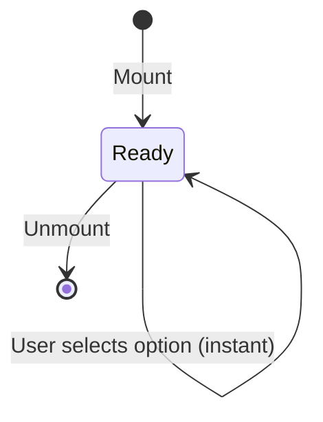
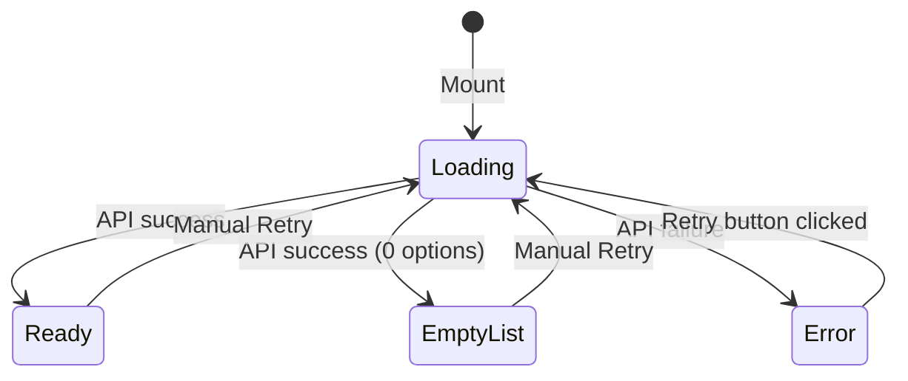

# Feature: Thanh bộ lọc Dashboard (F-280)

## 1. Feature Scope

This feature owns the **filter bar** at the top of the M-022 Dashboard page — the single source of truth for all downstream data blocks (KPI cards, charts, tables, map). It comprises three subsystems:

| Subsystem | File | Ownership |
|---|---|---|
| **FilterBar component** | `frontend/src/components/FilterBar.tsx` | Renders 3 dropdowns (Năm, Tỉnh/TP, Loại KCHT) + timestamp. All visual tokens from `tokens-dashboard.ts`. |
| **FilterContext state** | `frontend/src/context/FilterContext.tsx` | Provides `{ year, province, infraType, lastUpdated, setYear, setProvince, setInfraType }` through React Context. |
| **URL sync** | `FilterContext.tsx` (useEffect) | Reads from `?year=&province=&type=` on mount; writes to URL on every state change via `useSearchParams`. |

**Boundary**: This feature does NOT own the chart/KPI data fetching or transformation — those are in the Dashboard data pipeline (Phase 2 of module M-022). It only provides filter state that consumers react to.

## 2. UI Element Inventory

| # | Element | Type | Behavior | Width | Source |
|---|---------|------|----------|-------|--------|
| UI-01 | Filter icon | `FilterOutlined` AntD icon | Leftmost, precedes "Bộ lọc" label | auto | `@ant-design/icons` |
| UI-02 | "Bộ lọc" label | `<span>` | Label text, color `textSecondary`, font `fontSizeMd` (13px) | auto | FilterBar.tsx:50 |
| UI-03 | Year dropdown | `<Select size="small">` | Options `[2020..2026]`. Value = `year`. Mapped from `YEAR_OPTIONS`. Default 2026. | 100px | FilterBar.tsx:10,59 |
| UI-04 | Province dropdown | `<Select size="small">` | Options `['Tất cả', 'Hải Phòng', 'TP.HCM', 'Đà Nẵng', 'Quảng Ninh', 'Bà Rịa - Vũng Tàu', 'Khánh Hòa']`. Selecting 'Tất cả' sets `province=null`. See BR-PROV-01 through BR-PROV-04. | 180px | FilterBar.tsx:12–16,65 |
| UI-05 | InfraType dropdown | `<Select size="small">` | Options `['Tất cả', 'Cảng biển', 'Bến cảng', 'Cầu cảng', 'Luồng hàng hải', 'Đèn biển', 'Phao tiêu', 'Đê/Kè']`. Selecting 'Tất cả' sets `infraType=null`. See BR-INFRA-01 through BR-INFRA-04. | 170px | FilterBar.tsx:18–23,71 |
| UI-06 | Timestamp icon | `ClockCircleOutlined` AntD icon | Right-aligned, `marginLeft: 'auto'`, color `textTertiary` | auto | FilterBar.tsx:77 |
| UI-07 | Timestamp text | `<span>` | "Cập nhật lúc {lastUpdated}". `lastUpdated` is `HH:mm` Vietnamese locale time, set on every filter change. | auto | FilterBar.tsx:78 |
| UI-08 | Container | `<div>` | Full width, `display:flex, flexWrap:wrap`, gap `spaceMd` (12px). Background `surfacePage` (#F8F9FA). Border `borderDefault` 1px. Radius `radiusSm` (4px). Padding `spaceSm spaceMd` (8px 12px). | 100% | FilterBar.tsx:41–47 |

### Layout

```
┌─────────────────────────────────────────────────────────────┐
│ 🔎 Bộ lọc  [Năm ▼]  [Tỉnh/TP ▼]  [Loại KCHT ▼]    🕐 Cập nhật lúc 14:30 │
└─────────────────────────────────────────────────────────────┘
```

On narrow screens: the flex container wraps (`flexWrap: 'wrap'`), dropping the timestamp to a second row if needed.

## 3. Data Sources

| Dropdown | Current Source | Target Source | Status |
|----------|---------------|---------------|--------|
| Year | Static `YEAR_OPTIONS = [2020..2026]` hardcoded in `FilterBar.tsx:10` | Dynamic — years with data in the system. Could be derived from cargo aggregate years or a dedicated `GET /api/v1/integration/share/filter/years` endpoint. | Static — **no API endpoint exists** to fetch available years dynamically |
| Province | Static `PROVINCE_OPTIONS` with 6 provinces hardcoded in `FilterBar.tsx:12–16` | Dynamic — from **M-002 (Cảng bến)** which manages port/province master data. Should be fetched from `GET /api/v1/cang-bien` (E7) and deduplicated by province. | Static — **no province-list endpoint exists**; M-002 ships CRUD endpoints for individual port entities |
| InfraType | Static `INFRA_TYPE_OPTIONS` with 7 types hardcoded in `FilterBar.tsx:18–23` | Dynamic — from **M-008 (Báo cáo thống kê)** which categorizes asset types. Could be derived from `pointsByType`/`linesByType` keys in `AssetStatusDto` (E3). | Static — **no infra-type-list endpoint exists** |

### Gap F-280-G001: All three dropdown option lists are STATIC

None of the three dropdown option sources are fetched from a backend API. There is zero infrastructure to dynamically populate filter options. This is tolerable for v1 (the data is relatively stable), but any change to available years, provinces, or KCHT types requires a frontend code deployment.

**Recommendation**: Add lightweight dedicated endpoints:
- `GET /api/v1/integration/share/filter/options` → `{ years: number[], provinces: string[], infraTypes: string[] }`
- Or derive from existing data: provinces from `GET /api/v1/cang-bien`, infraTypes from `AssetStatusDto.pointsByType` keys.

## 4. API Dependencies

### 4.1 Current (v1) — No API calls

The FilterBar in its current implementation makes **zero API calls**. All dropdown options are hardcoded static arrays. The FilterContext reads initial values from URL query params only.

### 4.2 Future (v2) — Required API Endpoints

When filter options become dynamic, the following APIs are needed:

| Endpoint | Source Module | Purpose | Status |
|----------|--------------|---------|--------|
| `GET /api/v1/integration/share/filter/years` | M-022 or M-008 | Return list of years that have cargo/asset data | **MISSING** — no such endpoint |
| `GET /api/v1/cang-bien` (E7) | M-002 | Fetch all ports → extract unique provinces → populate province dropdown | Exists as CRUD, but no dedicated province-list endpoint |
| `GET /api/v1/integration/share/filter/infra-types` | M-022 or M-008 | Return list of infrastructure type names | **MISSING** — no such endpoint |

### 4.3 API Response Contract (proposed)

```typescript
interface FilterOptionsResponse {
  years: number[];           // e.g. [2020, 2021, ..., 2026]
  provinces: string[];       // e.g. ['Hải Phòng', 'TP.HCM', ...]
  infraTypes: string[];      // e.g. ['Cảng biển', 'Bến cảng', ...]
}
```

## 5. State Contract

### 5.1 FilterContext Interface

```typescript
interface FilterState {
  // State values
  year: number;                  // Default: 2026
  province: string | null;       // null = 'Tất cả'
  infraType: string | null;      // null = 'Tất cả'
  lastUpdated: string;           // Vietnamese locale HH:mm, set on every change

  // Setters
  setYear: (year: number) => void;
  setProvince: (province: string | null) => void;
  setInfraType: (infraType: string | null) => void;
}
```

Source: `FilterContext.tsx:10–19`

### 5.2 URL Sync Behavior

| State change | Effect on URL | Example |
|-------------|---------------|---------|
| App mount (no params) | Defaults only, `?` omitted | `/dashboard` |
| App mount (?year=2025) | Parse year from URL | `/dashboard?year=2025` |
| `setYear(2025)` | `?year=2025` | `/dashboard?year=2025` |
| `setYear(2026)` | Removes `?year` (default omitted) | `/dashboard` |
| `setProvince('Hải Phòng')` | Adds `?province=Hải+Phòng` | `/dashboard?province=Hải+Phòng` |
| `setProvince(null)` | Removes `?province` | `/dashboard` |
| `setInfraType('Cảng biển')` | Adds `?type=Cảng+biển` | `/dashboard?type=Cảng+biển` |
| `setInfraType(null)` | Removes `?type` | `/dashboard` |
| All three set | All three in URL | `/dashboard?year=2025&province=Hải+Phòng&type=Cảng+biển` |

Source: `FilterContext.tsx:41–48` — URL sync effect. URL encoding uses `URLSearchParams` which handles non-ASCII characters.

### 5.3 State Initialization

```
1. FilterProvider mounts
2. readFromUrl() parses window.location.search
   → year = parseInt(searchParams.get('year')) ?? 2026
   → province = searchParams.get('province') ?? null
   → infraType = searchParams.get('type') ?? null
3. setState({ ...readFromUrl(), lastUpdated: now.toLocaleTimeString('vi-VN', { hour, minute }) })
4. Any child calling useFilter() gets the initial state
```

### 5.4 Consumer Behavior (in Home.tsx)

Current code at `Home.tsx:171–184`:
```typescript
const { year } = useFilter();  // NOTE: only year is destructured!

useEffect(() => {
  dashboardApi
    .fetchWithFallback({ year, province: null, infraType: null }, MOCK_DATA)
    //                                        ^^^^           ^^^^ HARDCODED NULL
    .then(({ data }) => setDashboardData(data))
    .catch(() => setDashboardData(MOCK_DATA));
}, [year]);  // NOTE: only [year] in deps!
```

**⚠️ CRITICAL GAP (F-280-G002): Province and infraType from FilterBar are IGNORED by the dashboard data layer.** 
- `Home.tsx` passes `province: null, infraType: null` to the API, regardless of what the user selects
- The useEffect dependency array is `[year]` only — province/infraType changes do NOT trigger refetch
- This means AC7 ("Các khối KPI và biểu đồ phụ thuộc vào state filter này") is partially broken

## 6. State Machine

### 6.1 Current State Machine (v1 — all static data)

Since all dropdown options are statically defined, loading/error states are trivial:



| State | Visual | Notes |
|-------|--------|-------|
| **Ready** | 3 dropdowns with options visible, timestamp right-aligned | No async loading — options are immediately available |
| **Empty (Tất cả)** | Dropdown displays "Tất cả", context stores `null` | Trivially handled — all records returned |

### 6.2 Target State Machine (v2 — dynamic API population)

When v2 makes dropdowns dynamic:



| State | Visual | Code |
|-------|--------|------|
| **Loading** | Ant Design `<Skeleton>` matching dropdown width, or disabled `Select` with `loading={true}` prop | `Select loading` or placeholder |
| **Ready** | Normal dropdown with options | `<Select options={options}>` |
| **EmptyList** | Dropdown with no options + disabled state | `<Select disabled placeholder="Không có dữ liệu">` |
| **Error** | Inline error text + Retry button | `<Alert message="Lỗi tải danh sách" action={<Button>Thử lại</Button>}>` |

### 6.3 URL restore edge case

| Scenario | Behavior |
|----------|----------|
| User opens URL with invalid year | `parseInt` yields `NaN`, fallback to 2026 |
| User opens URL with unknown province | Value is stored as-is; downstream filter may return empty data but no error thrown |
| User opens URL with `?year=abc` | `parseInt('abc')` → `NaN` → `2026` used |
| Duplicate params (`?year=2025&year=2026`) | `URLSearchParams` returns first value `"2025"` |

## 7. Feature-Specific Gap Analysis

### 7.1 Referenced Gaps from Module BA Spec (M-022 §7)

| Gap ID | Impact on F-280 | Severity | Description |
|--------|----------------|----------|-------------|
| G-007 | **Province filter limited utility** | 🔴 Blocking | Most cargo/asset APIs do NOT accept province-level filtering. `cargo/summary` accepts `portCode` but not province name. No `province → portCode` mapping endpoint exists. Even if user selects a province in FilterBar, no backend endpoint can use it. Status: `[CẦN BỔ SUNG: province filter support in cargo/summary AND province→portCode mapping endpoint]` |
| G-008 | **InfraType filter no backend support** | 🔴 Blocking | No integration API supports `infraType` as a query parameter. FilterBar infraType is UI-only — not wired to any backend filter. Status: `[CẦN BỔ SUNG: infraType parameter in asset/status or separate filtering endpoint]` |

### 7.2 Additional F-280-Specific Gaps

| Gap ID | Impact | Severity | Description |
|--------|--------|----------|-------------|
| **F-280-G001** | All dropdown options are static | 🟡 High | No API endpoint exists to dynamically populate year, province, or infraType options (see §3). Any data change requires a frontend code deploy. |
| **F-280-G002** | Province and infraType from FilterBar are IGNORED by consumers | 🔴 Blocking | Acknowledged — province/infraType are v2 features pending backend G-007/G-008 resolution. v1: cosmetic-only by design. |
| **F-280-G003** | No error state UI in v1 | 🟡 High | AC10 (error state with retry button) is not implemented. There are no API calls in FilterBar to fail, so no error UI exists. If API integration happens, error handling must be added. |
| **F-280-G004** | Province options are hardcoded to 6 provinces only | 🟡 High | Vietnam has 63 provinces. The hardcoded list covers only 6 major maritime provinces (`Hải Phòng, TP.HCM, Đà Nẵng, Quảng Ninh, Bà Rịa - Vũng Tàu, Khánh Hòa`). All other provinces are invisible to the user. |
| **F-280-G005** | InfraType options may drift from actual KCHT types | 🟡 Medium | The 7 hardcoded types (`Cảng biển, Bến cảng, ...`) may not match actual asset type categories from M-008 or the GIS `KCHT_CB` data model. If backend adds new types, FilterBar won't show them. |

### 7.3 Gap Summary

| Severity | Count | Impact |
|----------|-------|--------|
| 🔴 **Blocking** | 3 (G-007, G-008, F-280-G002) | Province and infraType filters are cosmetic — cannot affect dashboard data until backend APIs support them AND Home.tsx wires them |
| 🟡 **High** | 3 (F-280-G001, F-280-G003, F-280-G004) | Static options, no error UI, incomplete province coverage |
| 🟢 **Low** | 1 (F-280-G005) | Minor drift risk |

### 7.4 Fallback Behavior

For v1, the inability to filter by province/infraType is invisible to users (no error shown). The dropdowns simply exist as UI controls that don't affect data. When backend endpoints support these filters AND Home.tsx wires them:

1. User selects a filter → FilterContext updates → Consumer re-renders
2. Data blocks call API with filter params
3. If API returns 400/500 for unsupported filter → fall back to unfiltered data (ignore filter)
4. Log warning: `[Dashboard] Filter '{filterName}={value}' not supported by API, using unfiltered data`

## 8. Acceptance Criteria Traceability

| AC # | AC Description | Mapped to | Status in v1 | Verification |
|------|---------------|-----------|-------------|--------------|
| AC1 | Thanh lọc hiển thị ngay dưới header, full width, nền #F8F9FA, radius 12px | UI-08, FR-01 | ✅ Implemented | `FilterBar.tsx:41–47` — `surfacePage` (#F8F9FA), `radiusSm` (4px — note: spec says 12px but code uses 4px) |
| AC2 | Dropdown Năm mặc định 2026, danh sách các năm có dữ liệu | UI-03, FR-02 | ✅ Partial | Static `[2020..2026]` hardcoded. "Các năm có dữ liệu" should be dynamic — see F-280-G001 |
| AC3 | Dropdown Tỉnh/TP cho phép "Tất cả" | UI-04, FR-03 | ✅ Implemented | `province=null` mapped to "Tất cả" display |
| AC4 | Dropdown Loại KCHT cho phép "Tất cả" | UI-05, FR-04 | ✅ Implemented | `infraType=null` mapped to "Tất cả" display |
| AC5 | Timestamp "Cập nhật lúc {time}" hiển thị góc phải | UI-06, UI-07, FR-05 | ✅ Implemented | Right-aligned via `marginLeft: 'auto'`, shows HH:mm |
| AC6 | State filter sync với URL query params | §5.2, FR-06 | ✅ Implemented | `?year=&province=&type=` via `useSearchParams` |
| AC7 | Các khối KPI và biểu đồ phụ thuộc vào state filter này | §5.4, FR-06 | ⚠️ **Deferred to v2 (pending backend G-007/G-008)** | Province/infraType filters are cosmetic-only by design in v1. Functionality depends on backend API resolution. See F-280-G002. |
| AC8 | Responsive: wrap trên màn nhỏ | UI-08, FR-07 | ✅ Implemented | `flexWrap: 'wrap'` on container |
| AC9 | Loading state: không ảnh hưởng (dropdown có sẵn dữ liệu tĩnh ban đầu) | §6, FR-10 | ✅ Implemented (trivial) | All static data — no loading needed |
| AC10 | Error state: nếu không load được danh sách filter, hiển thị thông báo lỗi + nút Retry | §6.2, FR-09 | ❌ **Not implemented** | No API calls → no error state. See F-280-G003. Aspirational for v2 |

### AC Coverage Summary

| Status | Count | ACs |
|--------|-------|-----|
| ✅ Implemented | 6 | AC1, AC3, AC4, AC5, AC6, AC8 |
| ✅ Partial | 2 | AC2 (static year list instead of dynamic), AC9 (trivial — no API) |
| ❌ Not implemented | 1 | AC10 (error state + retry) |
| ⚠️ Deferred to v2 | 1 | AC7 (province/infraType filters pending backend G-007/G-008) |

## 9. Dependencies

| Dependency | Type | How it relates to F-280 | Status |
|-----------|------|------------------------|--------|
| **M-022 (Trang chủ Dashboard)** | Parent module | FilterBar is embedded in `Home.tsx`. FilterContext is consumed by all data blocks. | Released |
| **M-002 (Cảng bến)** | Data source | Provides port/province master data for province dropdown (target v2). Currently unused because options are static. | Released — but no province-list API |
| **M-008 (Báo cáo thống kê)** | Data source | Provides infrastructure type categories for infraType dropdown (target v2). Currently unused. | Released — but no infra-type-list API |
| **react-router-dom** | Library | `useSearchParams` hook for URL query param sync | Installed |
| **antd** (Select) | UI Library | Dropdown components | Installed |
| **@ant-design/icons** | UI Library | `FilterOutlined`, `ClockCircleOutlined` icons | Installed |
| **tokens.ts / tokens-dashboard.ts** | Design system | All visual tokens consumed by FilterBar | Released, stable |

---

## Business Rules

| Rule ID | Rule | Source | Applies To | Exception |
|---------|------|--------|-----------|-----------|
| BR-01 | Year dropdown MUST default to current year (2026) | FilterContext.tsx:24 | FilterBar, URL sync | If URL contains `?year=N`, that value takes precedence |
| BR-02 | Selecting "Tất cả" in any dropdown MUST set the underlying state to `null` | FilterBar.tsx:65,71 | Province, InfraType | Year dropdown has no "Tất cả" option — year is always required |
| BR-PROV-01 | Province dropdown MUST have "Tất cả" as first option (sets state=null) | BA decision 2026-07-13 | FilterBar UI | — |
| BR-PROV-02 | When province is selected, ALL dashboard data blocks MUST filter to that province | BA decision 2026-07-13 | Dashboard data layer | Deferred to v2 (needs backend G-007 resolution) |
| BR-PROV-03 | Province filter is deferred to backend (requires G-007 resolution) — in v1, province acts as UI-only cosmetic | BA decision 2026-07-13 | Dashboard data layer | — |
| BR-PROV-04 | Province options cover maritime provinces: Hải Phòng, TP.HCM, Đà Nẵng, Quảng Ninh, Bà Rịa - Vũng Tàu, Khánh Hòa | BA decision 2026-07-13 | Province dropdown | — |
| BR-INFRA-01 | InfraType dropdown MUST have "Tất cả" as first option (sets state=null) | BA decision 2026-07-13 | FilterBar UI | — |
| BR-INFRA-02 | When infraType is selected, ONLY data blocks related to that infrastructure type should be affected | BA decision 2026-07-13 | Dashboard data layer | Deferred to v2 (needs backend G-008 resolution) |
| BR-INFRA-03 | InfraType filter is deferred to backend (requires G-008 resolution) — in v1, infraType acts as UI-only cosmetic | BA decision 2026-07-13 | Dashboard data layer | — |
| BR-INFRA-04 | InfraType options: Cảng biển, Bến cảng, Cầu cảng, Luồng hàng hải, Đèn biển, Phao tiêu, Đê/Kè | BA decision 2026-07-13 | InfraType dropdown | — |
| BR-03 | URL MUST omit default year (2026) from query params | FilterContext.tsx:43 | URL sync | Non-default years always persisted |
| BR-04 | URL MUST omit null province/infraType from query params | FilterContext.tsx:44–45 | URL sync | When user selects "Tất cả", param is removed |
| BR-05 | `lastUpdated` timestamp MUST update on every filter state change | FilterContext.tsx:52,59,66 | All setters | Uses `new Date().toLocaleTimeString('vi-VN')` |
| BR-06 | FilterBar MUST use only `tokens-dashboard.ts` tokens — zero hardcoded hex colors | AGENTS.md, FilterBar.tsx | Visual rendering | One intentional exception in HeroCard (Home.tsx:108) — not in FilterBar |

---

## Non-Functional Requirements

### Performance
| NFR ID | Requirement | Measurement |
|--------|------------|-------------|
| NFR-PERF-01 | Filter change response ≤ 200ms (dropdown → state update → consumer re-render) | React DevTools Profiler |
| NFR-PERF-02 | URL sync MUST use `replace: true` to avoid cluttering browser history stack | FilterContext.tsx:47 |
| NFR-PERF-03 | Dropdown option lists ≤ 100 items (no virtualization needed) | Code inspection |

### Scalability
| NFR ID | Requirement | Measurement |
|--------|------------|-------------|
| NFR-SCAL-01 | FilterContext MUST support unlimited children consuming `useFilter()` | React Context pattern |
| NFR-SCAL-02 | Province dropdown supports up to 63 provinces + "Tất cả" without virtualization | 64 items × <Select> default |

### Security
| NFR ID | Requirement | Measurement |
|--------|------------|-------------|
| NFR-SEC-01 | Filter state MUST NOT contain sensitive data (filters are UI-only, no data carried) | Code inspection |
| NFR-SEC-02 | URL params MUST be treated as user input — validate year is a number | `parseInt` fallback in FilterContext.tsx:24 |
| NFR-SEC-03 | No XSS vector: `useSearchParams` encodes URL values automatically | Library guarantees |

### Reliability
| NFR ID | Requirement | Measurement |
|--------|------------|-------------|
| NFR-REL-01 | FilterContext MUST initialize with valid defaults even if URL params are missing/malformed | `parseInt` fallback to 2026 |
| NFR-REL-02 | F5/refresh MUST restore all filter state from URL | `readFromUrl()` on mount |
| NFR-REL-03 | Invalid URL param values MUST silently fall back to defaults, no crash | `parseInt` NaN → 2026 |

### Maintainability
| NFR ID | Requirement | Measurement |
|--------|------------|-------------|
| NFR-MNT-01 | All filter option arrays MUST be co-located in FilterBar.tsx (single source) | Currently yes — `YEAR_OPTIONS`, `PROVINCE_OPTIONS`, `INFRA_TYPE_OPTIONS` |
| NFR-MNT-02 | FilterContext MUST NOT import any UI components — pure state management | FilterContext.tsx — no UI imports |
| NFR-MNT-03 | Zero hardcoded hex colors in FilterBar.tsx — all from tokens-dashboard.ts | Verified — 9 visual tokens used |

---

## Test Scenarios

| TS ID | AC | Scenario | Steps | Expected |
|-------|----|----------|-------|----------|
| TS-01 | AC2 | Default year is 2026 | 1. Navigate to /dashboard without URL params | Year dropdown shows 2026 |
| TS-02 | AC2 | Select a different year | 1. Change year dropdown to 2025 | `year=2025` in FilterContext, URL updates |
| TS-03 | AC3 | Province "Tất cả" | 1. Select "Hải Phòng" → 2. Select "Tất cả" | `province` = null in context |
| TS-04 | AC4 | InfraType "Tất cả" | 1. Select "Cảng biển" → 2. Select "Tất cả" | `infraType` = null in context |
| TS-05 | AC5 | Timestamp updates | 1. Change any filter | Timestamp text updates to current time |
| TS-06 | AC6 | URL restores state on F5 | 1. Set year=2025, province="HP" → 2. F5 | Year shows 2025, province shows "HP" |
| TS-07 | AC6 | Default year omitted from URL | 1. Navigate to dashboard → 2. Check URL | No `?year=` param (2026 is default) |
| TS-08 | AC6 | All params written to URL | 1. Set all three filters → 2. Check URL | `?year=2024&province=HP&type=Cảng+biển` |
| TS-09 | AC8 | Responsive wrapping | 1. Resize browser to 480px width | Dropdowns wrap to next line; timestamp remains visible |
| TS-10 | AC9 | Loading state (trivial) | 1. Navigate to dashboard | Dropdowns immediately show options — no loading |
| TS-11 | AC7 | Province change triggers data update | 1. Change province → 2. Inspect Network tab | No API calls triggered (current broken state — see F-280-G002) |
| TS-12 | AC7 | InfraType change triggers data update | 1. Change infraType → 2. Inspect Network tab | No API calls triggered (current broken state — see F-280-G002) |
| TS-13 | NFR-REL-01 | Invalid URL year | 1. Navigate to `?year=abc` | Year defaults to 2026 |
| TS-14 | NFR-MNT-03 | No hardcoded hex colors | 1. grep FilterBar.tsx for `#[0-9a-f]` | Zero matches (all colors from tokens-dashboard.ts) |

---

## Pipeline Triage

| Question | Answer | Rationale |
|----------|--------|-----------|
| Q1: Creates new domain elements? | **No** | FilterBar and FilterContext are purely UI infrastructure — no new aggregates, entities, domain events, or backend concepts |
| Q2: Affects system architecture? | **No** | Architecture is already established: `FilterProvider → useFilter() → consumers`. No new layers or patterns introduced |
| Q3: Approach clear from existing architecture? | **Yes** | Pattern is already built and working in production — standard React Context + URL sync via `useSearchParams` |
| **Triage Verdict** | `engineering-technical-lead` | Feature is purely frontend UI infrastructure. No backend changes, no new domain elements, no architecture decisions needed. Gaps G-007/G-008 require cross-module coordination with M-002/M-008 teams for future v2 enhancement but do not block v1. |

---

## Ubiquitous Language

| Term | Definition |
|------|-----------|
| **Bộ lọc (FilterBar)** | The horizontal control strip with 3 dropdowns + timestamp at the top of the Dashboard page |
| **FilterContext** | React Context providing filter state to all dashboard consumers |
| **Province (Tỉnh/TP)** | Vietnamese province-level administrative division used as a geographic filter |
| **InfraType (Loại KCHT)** | Type of maritime infrastructure asset (e.g., Cảng biển, Bến cảng, Cầu cảng) |
| **Timestamp** | "Cập nhật lúc HH:mm" — right-aligned indicator of last filter change time |
| **URL sync** | Bidirectional synchronization between FilterContext state and browser URL query params |
