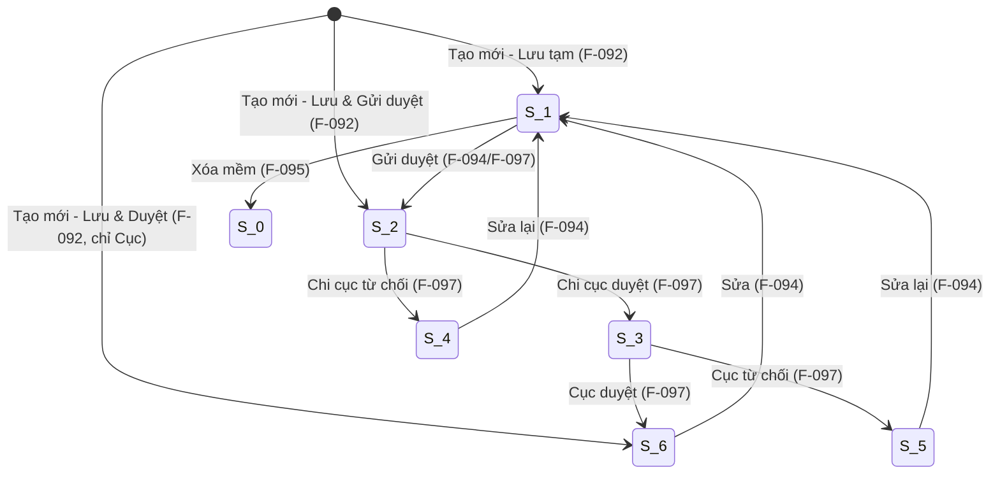

# Tạo mới Đèn biển và nhà trạm gắn với Đèn biển

## Summary

Hệ thống cần số hóa việc đăng ký Đèn biển và nhà trạm gắn với Đèn biển (DBNT) thuộc nhóm KCHT_ATHH. Tính năng cho phép Chuyên viên/Cán bộ tạo mới bản ghi DBNT với đầy đủ thông tin cơ bản, kỹ thuật đèn biển & nhà trạm, tọa độ GIS và file đính kèm. Bản ghi sau tạo có 3 trạng thái tùy action: S_1 (Lưu tạm), S_2 (Chờ Chi cục duyệt), S_6 (Đã duyệt — chỉ Cấp Cục). Thành công khi bản ghi được lưu chính xác, mã DBNT tự sinh không trùng, và ghi nhận đầy đủ lịch sử.

## Scope

| | Items |
|---|---|
| In scope | FormCrud mode=Create với 3 phần: InfoForm (28 field), LocationInformationForm (tọa độ GIS), UploadFileTable (file đính kèm); 3 nút lưu (Lưu tạm/Lưu & Gửi duyệt/Lưu & Duyệt); Validate required fields + decimal + max length; Tự sinh mã DBNT-{seq}; Ghi lịch sử tạo mới |
| Out of scope | Sửa (F-094); Xóa (F-095); Phê duyệt qua PDKC_053 (F-097); Tra cứu công khai (TCKC_018); Gắn tài sản (QLTS_108); Vận hành/bảo trì/sự cố (TTVH_090/091/092) |
| Assumptions | Infrastructure KchtAthhRestControllerImpl + KchtAthhDto đã có; Sequence DB cho mã DBNT đã được thiết lập; Người dùng đã xác thực và phân quyền |

## Domain Model

### Aggregate Root: DenBienVaNhaTram (DBNT)

F-092 là tính năng gốc (aggregate root) của module M-023 — định nghĩa thực thể DBNT mà tất cả tính năng khác trong module tham chiếu hoặc mở rộng.

| Thuộc tính | Kiểu | Ràng buộc | Mô tả |
|---|---|---|---|
| id | UUID | PK | Định danh duy nhất |
| ma | String | UNIQUE, NOT NULL, format DBNT-{seq} | Mã DBNT tự sinh — bất biến |
| ten | String | NOT NULL, max 255 | Tên đèn biển |
| fkDonViQl | String | NOT NULL | Đơn vị quản lý |
| fkCangBien | UUID | Optional, FK→CangBien | Thuộc cảng biển |
| fkDonViVh | String | NOT NULL | Đơn vị vận hành |
| diaDiem | String | Optional | Tỉnh/TP |
| diaDiemChiTiet | String | Optional, max 500 | Địa điểm chi tiết |
| tinhTrang | Int | NOT NULL, default=1 | Chưa KT/VH; Đang KT/VH; Dừng KT/VH |
| status | Enum | NOT NULL | S_0..S_6 |
| chungLoaiDenChinh | String | Optional, max 100 | Chủng loại đèn chính |
| chungLoaiDenDuPhong | String | Optional, max 100 | Chủng loại đèn dự phòng |
| capTramDen | Int | NOT NULL | Cấp trạm đèn |
| ngayBd | Date | Optional | Ngày đưa vào SD |
| ngaySc | Date | Optional | Ngày sửa chữa gần nhất |
| zobjDataSub | JSON | 15 field đặc thù | Thông tin kỹ thuật + nhà trạm |
| zlstDataGeo | JSON[] | | Tọa độ GIS |
| zlstFileDk | JSON[] | | File đính kèm |

### Lifecycle State Transitions

### Invariants

| # | Invariant | Cơ chế bảo vệ |
|---|---|---|
| I-001 | `ma` bất biến sau khi tạo | Backend: từ chối payload chứa ma khác; UI: disabled |
| I-002 | `status` mặc định = S_1 (Lưu tạm) khi action=LUU_TAM | Server-side set theo enumActionKcht |
| I-003 | `ma` duy nhất toàn hệ thống, kể cả bản ghi S_0 | UNIQUE constraint DB + atomic sequence |
| I-004 | `fkDonViQl` mặc định theo user đăng nhập | Server-side set khi CREATE |
| I-005 | `createdAt` do hệ thống tự sinh | Server-side set khi INSERT |

## User Stories

| US-ID | Actor | Goal | Value | Priority |
|---|---|---|---|---|
| US-001 | Chuyên viên/Cán bộ | Tạo mới Đèn biển và nhà trạm với đầy đủ thông tin | Đăng ký DBNT vào hệ thống | Must Have |
| US-002 | Chuyên viên | Lưu tạm bản ghi để sửa sau | Linh hoạt trong nhập liệu | Must Have |
| US-003 | Chuyên viên | Lưu & gửi phê duyệt ngay | Rút ngắn quy trình | Must Have |
| US-004 | Cấp Cục | Lưu & phê duyệt thẳng S_6 | Duyệt nhanh 1 bước | Should Have |
| US-005 | Người dùng | Mã DBNT tự động sinh | Không cần nhập tay | Must Have |

## Acceptance Criteria

| AC-ID | US-ref | Scenario | Given/When/Then | Constraints |
|---|---|---|---|---|
| AC-001 | US-001 | Hiển thị form tạo mới | Given user có quyền; When bấm "Thêm mới"; Then FormCrud mode=Create hiển thị 3 phần | InfoForm + LocationInformationForm + UploadFileTable |
| AC-002 | US-001 | Validate required fields | Given form thiếu ten/capTramDen/fkDonViVh...; When bấm Lưu; Then lỗi đỏ tại field thiếu, không submit | 6 field required |
| AC-003 | US-005 | Mã DBNT tự sinh | Given form hợp lệ; When lưu thành công; Then ma = DBNT-{seq 6 chữ số}, hiển thị disabled | Không trùng, kể cả S_0 |
| AC-004 | US-002 | Lưu tạm S_1 | Given form hợp lệ; When chọn "Lưu tạm"; Then POST LUU_TAM → status=S_1 → thông báo → về DS | |
| AC-005 | US-003 | Lưu & Gửi duyệt S_2 | Given form hợp lệ; When chọn "Lưu và gửi phê duyệt"; Then POST LUU_VA_GUI_PHE_DUYET → status=S_2 | |
| AC-006 | US-004 | Lưu & Duyệt S_6 (Cục) | Given user Cấp Cục + form hợp lệ; When chọn "Lưu và phê duyệt"; Then POST LUU_VA_PHE_DUYET → status=S_6 | Backend chặn nếu không phải Cục |
| AC-007 | US-001 | Validate số | Given dienTich < 0 hoặc không phải số; When bấm Lưu; Then lỗi validation | Decimal(20,4), min=0 |

## Business Rules

| BR-ID | Rule | Applies to | Exception |
|---|---|---|---|
| BR-001 | Mã DBNT format DBNT-{seq 6 chữ số}, duy nhất toàn hệ thống | AC-003 | Không có ngoại lệ |
| BR-002 | Status sau tạo: S_1/S_2/S_6 tùy action | AC-004/005/006 | Cấp Cục được S_6 |
| BR-003 | DBNT thuộc KCHT_ATHH, dùng KchtAthhRestControllerImpl + KchtAthhDto | Tất cả | Không dùng chung KCHT_CB |
| BR-004 | Chưa duyệt (S_1-S_5) không được tham chiếu bởi module khác | AC-004/005 | |
| BR-005 | Transaction atomic: root + zobjDataSub + zlstDataGeo cùng rollback nếu lỗi | AC-004/005/006 | |

## Non-Functional Requirements

| Area | Requirement | Target |
|---|---|---|
| Performance | API POST ≤ 1 giây; Form load ≤ 2 giây | < 100 concurrent |
| Security | RBAC server-side; LUU_VA_PHE_DUYET chặn non-Cục | 403 nếu sai quyền |
| Reliability | Transaction atomic | Rollback toàn bộ nếu lỗi |
| Audit | Ghi lịch sử tạo mới | 100% coverage |

## Test Scenarios

| TS-ID | AC-ref | Scenario | Type |
|---|---|---|---|
| TS-001 | AC-001 | Chuyên viên truy cập form tạo mới thành công | Acceptance |
| TS-002 | AC-002 | Bỏ trống tên đèn biển → lỗi validation | UI / Negative |
| TS-003 | AC-004 | Điền đầy đủ → Lưu tạm → kiểm tra DB có S_1 | Integration |
| TS-004 | AC-005 | Lưu & Gửi duyệt → kiểm tra status=S_2 | Integration |
| TS-005 | AC-006 | Cấp Cục Lưu & Duyệt → S_6 | Integration |
| TS-006 | AC-006 | Chi cục gọi LUU_VA_PHE_DUYET → 403 | Security |
| TS-007 | AC-007 | Nhập dienTich = -5 → lỗi validation | Unit / Negative |
| TS-008 | AC-003 | Kiểm tra mã không trùng sau 2 lần tạo | Integration |

## Pipeline Triage

| Question | Answer | Rationale |
|---|---|---|
| Domain model affected? | Yes — new aggregate root | Tạo mới DBNT chưa tồn tại; entity + lifecycle + 5 invariants đã formalized |
| Architecture affected? | Yes | REST endpoint mới, DB table KCHT_ATHH, sequence DBNT, RBAC permission mới |
| Implementation clear? | No | Cần SA: REST resource naming, transaction boundary, sequence mechanism |
| **Verdict** | `Ready for solution architecture` | Domain đã formalized; SA cần quyết định endpoint, DB schema, permission seed |
