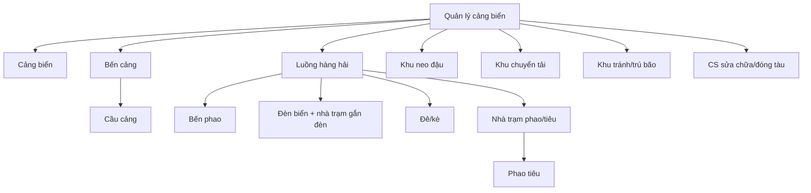

# M-024 Tái cấu trúc Menu & Navigation — Lean Spec (BA)

> **Nguồn sự thật (đọc cùng tài liệu này):**
> - `HH_Menu_21-08-2026.xlsx` — cây menu mục tiêu: 7 nhóm cấp 1 (I–VII), cấp 2–4.
> - `SO-DO-VA-MA-TRAN-CHA-CON-KCHT.md` — ma trận cha–con 28 loại KCHT (3–4 lớp).
> - Triage `docs/intel/_intake/TRI-1787631386205-0f2e.json` — done-oracle, edit-target files (đợt 1).
> - Triage `docs/intel/_intake/TRI-1787823566528-bb3e.json` — ô tìm kiếm menu sidebar (đợt 2 — C1 scope_expansion: `AppLayout.tsx`, `AppLayout.test.tsx`, feature-brief).
> - Triage `docs/intel/_intake/TRI-1787899754098-59d2.json` — sidebar/header theo chuẩn theme CHK (đợt 3).
> - Triage `docs/intel/_intake/TRI-1787912936669-7a04.json` — docs-only sync (đợt 4, C2 solo): ghi nhận `themetokenchk.ts` + `ThemeTokenProvider`; code đã xong + verify.
> - Triage `docs/intel/_intake/TRI-1788409709741-75fa.json` — mô hình 2 màn hình (đợt 5): màn "Danh mục chức năng" 6 khối sau đăng nhập → route `/kcht-directory` hiển thị 28 loại KCHT phân cấp cha–con theo SO-DO; sidebar 6 nhóm cấp 1 phẳng; màn khối + màn danh mục không có filter bar.
> - Code hiện tại: `frontend/src/components/AppLayout.tsx`, `frontend/src/store/authStore.ts`, `frontend/src/store/permissionStore.ts`, `frontend/src/themetokenchk.ts`, `src/main/java/com/hanghai/kchtg/config/PermissionSeeder.java`.

---

## 1. Mô tả ngắn

Tái cấu trúc toàn bộ menu & điều hướng hệ thống theo mô hình **2 màn hình** (chốt đợt 5 — triage TRI-1788409709741-75fa):

**BƯỚC 1 — Màn "Danh mục chức năng" (sau đăng nhập):** hiển thị đúng 6 khối chức năng — (1) Quản lý KCHT hàng hải; (2) Quản lý tài sản KCHT hàng hải; (3) Quản lý quy hoạch & vận hành; (4) Phê duyệt; (5) Báo cáo thống kê; (6) Quản trị hệ thống. Các khối (1)(2)(3)(5)(6) là cổng vào một nhóm nghiệp vụ và điều hướng được; riêng khối (4) "Phê duyệt" hiển thị disabled + tooltip "Chưa triển khai", KHÔNG điều hướng (BR-024-08 / AC-024-07). Màn này KHÔNG có filter bar.

**BƯỚC 2 — Màn danh mục KCHT (route `/kcht-directory`):** click khối 1 "Quản lý KCHT hàng hải" mở màn liệt kê **đúng 28 loại KCHT** phân cấp cha–con C0–C3 đúng `SO-DO-VA-MA-TRAN-CHA-CON-KCHT.md`: Cảng biển (C0) → Bến cảng (C1) → Cầu cảng (C2); Cảng biển → Luồng hàng hải (C1) → { Bến phao (C2); Nhà trạm quản lý vận hành phao tiêu (C2) → Phao, tiêu (C3); Đèn biển & nhà trạm (C2); Đê chắn sóng, đê chắn cát, kè (C2) }; Cảng biển → { Khu neo đậu; Khu chuyển tải; Khu tránh, trú bão; Cơ sở sửa chữa, đóng tàu } (C1); Hệ thống VTS (C0) → Trung tâm điều hành VTS (C1) → { Trạm Radar; Hệ thống AIS; Hệ thống CCTV; Hệ thống SCADA; Hệ thống truyền dẫn; Hệ thống phụ trợ VTS } (C2); Cảng cạn (C0); nhóm "Đài viễn thông hàng hải" (gắn lỏng) → { Đài TTDH; Hệ thống VHF; Đài Inmarsat; Đài LRIT; Đài Cospas-Sarsat; Đài TTXLTT Hà Nội }. Màn này KHÔNG có filter bar.

**Sidebar:** 6 nhóm cấp 1 phẳng — tên trùng 6 khối ở BƯỚC 1; KHÔNG còn submenu đa cấp sâu như mô hình cũ "7 nhóm cấp 1 (I–VII) + nhánh 13 thực thể KCHT" (đợt 1) — mô hình cũ hết hiệu lực từ đợt 5.

Không tạo entity nghiệp vụ mới, không đổi schema, không có migration; phân quyền gating theo quyền động (nhóm/tài khoản) hiện có giữ nguyên.

**Lịch sử bổ sung (các đợt):**

- **Đợt 2 — Ô tìm kiếm menu sidebar** (triage TRI-1787823566528-bb3e): input `placeholder="Tìm kiếm"` tại `AppLayout.tsx` dòng 645–647 (state `searchQuery` dòng 237); người dùng gõ chuỗi → lọc nhanh các mục menu theo `label` tiếng Việt qua `filterMenuByQuery` (dòng 200–217) trên `menuItems` sau gating quyền (dòng 572): chuỗi `.trim()` + lowercase trước khi so khớp (VAL-024-06), so khớp chuỗi con không phân biệt hoa/thường; nhánh có con khớp tự mở (`collectOpenableKeys` dòng 219, `effectiveOpenKeys` dòng 577); xóa chuỗi → menu khôi phục đầy đủ; chỉ thu hẹp hiển thị, không navigate, không gọi API (UC-024-09/10, BR-024-13/14/15, AC-024-11/12/13).

- **Đợt 3 — Theme CHK cho sidebar/header** (triage TRI-1787899754098-59d2): nền sidebar navy `#1a3f83` (`themetokenchk.sidebarBg` dòng 72), accent tiêu đề `#273e7c` (`themetokenchk.actionPrimary` dòng 36 — áp dụng tại `AppLayout.tsx` dòng 634 sidebar fullscreen và dòng 871 title topbar); giữ dark-menu, cấu trúc 7 nhóm, phân quyền, ô tìm kiếm.

- **Đợt 4 — CHK Conversion hoàn chỉnh (C2 solo, docs-only)** (triage TRI-1787912936669-7a04): sidebar/header phân phối token qua `themetokenchk.ts` + `ThemeTokenProvider` theo `docs/conventions/chk-theme-standard-architecture.md` — `AppLayout.tsx` import dòng 43–45, wrap Desktop Sider dòng 776 và Mobile Drawer dòng 799 (fallback `var(--bg-sidebar, #1a3f83)` dòng 788): nền sidebar `#1a3f83` (`sidebarBg` dòng 72), `sidebarActiveBg #1B84FF` (dòng 84), `sidebarSearchBg rgba(255,255,255,0.12)` (dòng 87), CSS vars `--bg-sidebar`/`--sidebar-search-bg`/`--sidebar-active-bg` (dòng 484–486), antdTheme Layout/Menu dark tokens (dòng 439–447). `theme.ts` `sidebarBg` REVERT về `#12468C` (dòng 50) cho các màn hình không-CHK.

- **Đợt 5 — Mô hình 2 màn hình (chốt cùng owner — reconcile-add, docs-only)** (triage TRI-1788409709741-75fa): thay mô hình cũ "Dashboard 6 khối + Sidebar 7 nhóm cấp 1 / nhánh 13 thực thể" bằng màn "Danh mục chức năng" đúng 6 khối sau đăng nhập → click khối 1 "Quản lý KCHT hàng hải" mở route `/kcht-directory` hiển thị 28 loại KCHT phân cấp C0–C3 đúng `SO-DO-VA-MA-TRAN-CHA-CON-KCHT.md`; sidebar chỉ còn 6 nhóm cấp 1 phẳng, không submenu sâu; màn khối + màn danh mục KHÔNG có filter bar; UI dùng token `theme.ts`/`tokens.ts`/`themetokenchk.ts`, không hardcode màu/spacing/font-size. Bộ AC-024 được viết lại theo mô hình mới (AC-024-01/02/03, AC-024-12, AC-024-14/15/16 thay thế các assert cũ 7 nhóm / 13 thực thể).

---

## 2. Hiện trạng (đối chiếu code hiện tại với menu mục tiêu)

### 2.1 Cơ chế menu hiện tại

| Thành phần | Vị trí (anchor) | Vai trò |
|---|---|---|
| `MENU_PERMISSION_MAP` | `AppLayout.tsx` dòng 51 | Map route → quyền `<resource>:<action>` (hoặc mảng quyền); quyết định item nào hiển thị |
| `canAccessMenu(path)` | `AppLayout.tsx` dòng 110 | Gọi `usePermissionStore.hasPermission / hasAnyPermission` để lọc item |
| `rawMenuItems` | `AppLayout.tsx` dòng 314 | Cấu trúc menu thủ công (AntD `MenuProps['items']`), label tiếng Việt, key tiếng Anh |
| `filterEmptyChildren` | `AppLayout.tsx` dòng 182 | Loại submenu rỗng + divider thừa |
| `filterMenuByQuery` | `AppLayout.tsx` dòng 200–217 | Lọc menu theo từ khóa tìm kiếm (xem UC-024-09, BR-024-13) |
| `collectOpenableKeys` | `AppLayout.tsx` dòng 219 | Gom key các submenu có con để tự mở khi đang tìm kiếm (xem BR-024-13) |
| `normalizePermissionKey` | `permissionStore.ts` dòng 20–52 | Chuẩn hóa key quyền (dot-notation → `<resource>:<action>`) |
| `.map((permission) => normalizePermissionKey(permission.trim()))` | `permissionStore.ts` dòng 61 | Build `Set` quyền; hỗ trợ `*`, `admin:all`, `resource:manage`, `resource:*`, `resource:write` |
| `hasPermissionFromList` | `permissionStore.ts` dòng 55–95 | Logic bypass quyền (quản trị) |
| `useAuthStore` / `parseJwt` | `authStore.ts` (symbol `parseJwt`) | Lấy `permissions` từ JWT khi đăng nhập / renew token |
| `run()` + `seedPermission(...)` | `PermissionSeeder.java` dòng 41 / dòng 726 | Seed quyền động theo nhóm/tài khoản; không gán role |

### 2.2 Cấu trúc menu hiện tại (`rawMenuItems`, `AppLayout.tsx` dòng 314)

1. `Trang chủ` (`/`)
2. `Quản trị hệ thống` — `/users`, `/organizations`, `/groups`, `/interconnect`, `/logs`
3. (Ẩn) `Quản lý KCHT trên nền bản đồ (GIS)` — block comment
4. `Báo hiệu hàng hải` — `Nhà trạm Phao, tiêu` → `/buoys`; `/beacon-stations`
5. `Quản lý KCHT Hàng Hải` — `Quản lý cảng biển` → `Quản lý bến cảng` → `/pier`; `/dry-port`; `/water-zone`
6. (Ẩn) `Biến động tài sản` — block comment
7. `Văn bản & Sự cố` — `/documents/legal`, `/documents/incidents`, `/documents/port-planning`
8. `Khu nước & VTS` — `/navigation-channel`, `/dike-revetment`, `/ship-repair-facility`, `/radar-station`, `/vts-system`
9. `Đài duyên hải & Vệ tinh` — `/station/coastal`, `/station/special`
10. (Ẩn) `BÁO CÁO THỐNG KÊ` — block comment (chứa sẵn ~60 mục báo cáo F-141..F-189)
11. `/connections` (Liên thông dữ liệu), `/symbols` (biểu tượng bản đồ), `/settings` (Cấu hình hệ thống)

### 2.3 Sai lệch so với menu mục tiêu `HH_Menu_21-08-2026.xlsx` (bắt buộc khắc phục)

| # | Sai lệch | Chi tiết |
|---|---|---|
| D1 | **Chỉ ~9 nhóm cấp 1, không đúng 7 nhóm** | Target: I. QUẢN LÝ KCHT HÀNG HẢI, II. QUẢN LÝ TÀI SẢN KCHT HÀNG HẢI, III. PHÊ DUYỆT, IV. BÁO CÁO THỐNG KÊ, V. QUẢN LÝ NGƯỜI DÙNG, VI. QUẢN LÝ QUY HOẠCH & VẬN HÀNH, VII. TÍCH HỢP |
| D2 | **13 thực thể KCHT phân tán** | `/port /berth /pier` nằm dưới `Quản lý KCHT Hàng Hải`; `navigation-channel / dike-revetment / ship-repair-facility / radar-station / vts-system` nằm dưới `Khu nước & VTS`; beacon nằm dưới `Báo hiệu hàng hải` — target: gom về 1 nhánh phân cấp theo ma trận cha–con |
| D3 | **Thiếu 4 thực thể KCHT** | `Bến phao`, `Khu neo đậu`, `Khu chuyển tải`, `Khu tránh/trú bão` chưa có route/quyền/item nào (M-003 chưa có feature tương ứng) — xem Decision Point D-1 |
| D4 | **Nhóm II (Tài sản) gần như vắng** | `asset-increase/decrease/inventory/exploitation` đang bị ẩn (block comment); target có `Tài sản cảng biển, Tài sản bến cảng, ... , Kiểm kê & Xử lý` |
| D5 | **Nhóm III (Phê duyệt) hoàn toàn vắng** | Không có menu duyệt nào; target có `Duyệt Bến cảng, Duyệt Cầu cảng, ..., Duyệt cảng cạn, Duyệt sản lượng cảng biển` |
| D6 | **Nhóm IV (Báo cáo) đang ẩn** | Block comment chứa đủ cây báo cáo (F-141..F-189); xlsx ghi "(giữ nguyên)" — cần restore |
| D7 | **Nhóm V (Người dùng) nằm sai chỗ** | `/users /organizations /groups /logs` đang dưới `Quản trị hệ thống`; target tách thành nhóm riêng `QUẢN LÝ NGƯỜI DÙNG` (Quản lý đơn vị, Quản lý nhóm người dùng, Quản lý người dùng, Quản lý log truy cập); `/interconnect` phải chuyển sang nhóm VII |
| D8 | **Nhóm VI (Quy hoạch & Vận hành) thiếu mục** | Target có: Quản lý quy hoạch, thông tin vận hành khai thác, bảo trì, sự cố, KCHT trên bản đồ, biểu tượng bản đồ, danh mục đối tượng điểm/đường/vùng, văn bản pháp lý, hồ sơ — hiện tại `/documents/legal` nằm dưới `Văn bản & Sự cố`, GIS bị ẩn |
| D9 | **Nhóm VII (Tích hợp) phân tán** | `/connections` là item phẳng; `/interconnect` nằm dưới `Quản trị hệ thống`; target: Quản lý kết nối liên thông chia sẻ dữ liệu + Tích hợp mảnh hải đồ điện tử + Tích hợp bản đồ quy hoạch cảng biển |
| D10 | **VTS subtree chưa đủ cấp** | Target: `Hệ thống VTS → Thông tin hệ thống VTS`; `Trung tâm điều hành VTS → Thông tin TT ĐHVTS, Radar, AIS, CCTV, SCADA, Truyền dẫn, Phụ trợ VTS, VHF, Đài TT duyên hải, Inmarsat, Sarsat, LRIT, Trung tâm xử lý TT` (13 mục cấp 4) |
| D11 | **`/water-zone` (Quản lý vùng nước) không có trong target** | Target tách 3 Khu (neo đậu/chuyển tải/tránh trú bão) thành mục riêng; `/water-zone` giữ hay bỏ do SA chốt (D-1) |
| D12 | **Menu phụ sinh tồn** | `Trang chủ` (`/`), `Cấu hình hệ thống` (`/settings`) không nằm trong 7 nhóm xlsx — đề xuất giữ là item tiện ích ngoài 7 nhóm (D-3) |

---

## 3. Actors, trigger, preconditions

| Actor | Mô tả |
|---|---|
| Người dùng đã đăng nhập (các vai trò/phân quyền động theo nhóm & tài khoản) | Duyệt menu, điều hướng chức năng |
| Quản trị hệ thống (`ROLE_SYSTEM_ADMIN`, `admin:all`, `*`) | Thấy toàn bộ menu (bypass qua `hasPermissionFromList`) |
| Admin Cục | Full quyền theo tài liệu nền mục 3.8 — thấy toàn bộ menu nghiệp vụ |

- **Trigger:** user đăng nhập thành công → vào Dashboard Grid 6 khối; user click khối hoặc mở sidebar → duyệt cây menu.
- **Preconditions:** user có token hợp lệ (JWT chứa `permissions` — `authStore.ts` `parseJwt`); `permissionStore` đã đồng bộ quyền (subscribe `useAuthStore`); quyền được seed trong DB qua `PermissionSeeder.run()`.

---

## 4. Use Cases

| ID | Use Case | Luồng chính |
|---|---|---|
| UC-024-01 | Xem Dashboard Grid 6 khối | User đăng nhập → trang chủ render đúng 6 khối chức năng; mỗi khối có label tiếng Việt, là entry điều hướng |
| UC-024-02 | Vào nhóm qua khối Dashboard | User click khối "Quản lý KCHT hàng hải" → điều hướng tới màn hình đầu của nhóm; sidebar đồng bộ mở nhánh tương ứng |
| UC-024-03 | Duyệt sidebar phân cấp | User mở sidebar → thấy 7 nhóm cấp 1; mở nhánh "Quản lý cảng biển" → thấy cây 13 thực thể theo ma trận cha–con |
| UC-024-04 | Điều hướng tới màn hình con | User click item lá (có route) → navigate đúng route; `selectedKey`/`openKeys` cập nhật đúng nhánh (logic hiện có `useEffect` theo `selectedKey`) |
| UC-024-05 | Menu theo quyền | User thiếu quyền `port:read` → không thấy item Cảng biển; submenu không còn con hợp lệ → tự ẩn (`filterEmptyChildren`) |
| UC-024-06 | Quản trị thấy toàn bộ | User có `admin:all`/`*` → thấy mọi item bất kể quyền chi tiết (`hasPermissionFromList` dòng 55–95) |
| UC-024-07 | Item chưa có màn hình | Item thuộc target (xlsx) nhưng chưa có route/màn hình → hiển thị trạng thái "chưa triển khai" (disabled + tooltip), KHÔNG navigate tới route giả (D-1) |
| UC-024-08 | Deep link không hợp lệ | User truy cập trực tiếp URL thiếu quyền → backend trả 403 (không phụ thuộc việc ẩn menu frontend) |
| UC-024-09 | Tìm kiếm mục menu theo tên | User gõ chuỗi vào ô tìm kiếm sidebar (`AppLayout.tsx` input dòng 645–647, state `searchQuery` dòng 237) → `trimmedSearchQuery` (dòng 574); nếu khác rỗng, `filterMenuByQuery` (dòng 200–217) giữ item có `label` tiếng Việt chứa chuỗi con (không phân biệt hoa/thường), cha giữ khi có con khớp, submenu hết con khớp bị loại (`filterEmptyChildren` dòng 182); nhánh còn hiển thị tự mở (`effectiveOpenKeys` dòng 577 + `collectOpenableKeys` dòng 219). Chỉ thu hẹp hiển thị — không navigate, không gọi API |
| UC-024-10 | Xóa từ khóa — khôi phục menu | User xóa toàn bộ chuỗi (hoặc chuỗi chỉ gồm khoảng trắng) → `isSearching = false` (dòng 575), `displayedItems = menuItems` (dòng 576) → menu hiển thị đầy đủ theo quyền như trước khi tìm kiếm; `openKeys` trở về trạng thái do user điều khiển |

---

## 5. Business Rules (BR-024-xx)

| ID | Quy tắc | Áp dụng |
|---|---|---|
| BR-024-01 | Menu có đúng **7 nhóm cấp 1** theo `HH_Menu_21-08-2026.xlsx` (I–VII); không thêm/bớt/đổi tên nhóm so với file | Hierarchy |
| BR-024-02 | Nhánh **"Quản lý cảng biển"** hiển thị đúng **13 thực thể KCHT** thuộc cây con của Cảng biển theo ma trận cha–con (`SO-DO-VA-MA-TRAN-CHA-CON-KCHT.md` mục 2): Cảng biển, Bến cảng, Cầu cảng, Bến phao, Luồng hàng hải, Khu neo đậu, Khu chuyển tải, Khu tránh/trú bão, CS sửa chữa/đóng tàu, Đèn biển + nhà trạm, Đê/kè, Nhà trạm phao/tiêu, Phao tiêu | Hierarchy |
| BR-024-03 | Phân cấp menu theo **chuỗi cha–con của ma trận** (không phân cấp phẳng): `Cảng biển → Bến cảng → Cầu cảng`; `Cảng biển → Luồng hàng hải → {Bến phao, Đèn biển + nhà trạm, Đê/kè, Nhà trạm phao/tiêu → Phao tiêu}`; `Cảng biển → {Khu neo đậu, Khu chuyển tải, Khu tránh/trú bão, CS sửa chữa/đóng tàu}` | Hierarchy |
| BR-024-04 | Mọi item menu gated bởi `canAccessMenu` + `MENU_PERMISSION_MAP` (`AppLayout.tsx` dòng 51, 110): thiếu quyền → item ẩn; submenu hết con hợp lệ → ẩn cả nhánh | Permission |
| BR-024-05 | Bypass quyền chỉ qua `admin:all` / `*` / `resource:manage` / `resource:*` / `resource:write` (cho create/update/delete) — logic chuẩn hóa và kiểm tra nằm trong `permissionStore.ts` (`normalizePermissionKey` dòng 20–52, `hasPermissionFromList` dòng 55–95); `admin:manage` KHÔNG phải toàn quyền | Permission |
| BR-024-06 | Dashboard hiển thị **đúng 6 khối** (done-oracle); mỗi khối là cổng vào một nhóm chức năng; click khối → điều hướng + đồng bộ sidebar | Dashboard |
| BR-024-07 | Sidebar phân cấp (hierarchical PMS Model); giữ trạng thái mở/đóng submenu đồng bộ với route hiện tại (mở rộng logic `setOpenKeys` theo `selectedKey` hiện có) | Navigation |
| BR-024-08 | Item chưa có màn hình/route thật KHÔNG được navigate tới route giả hoặc dữ liệu placeholder — render disabled với tooltip tiếng Việt "Chưa triển khai" (nguyên tắc Data thật, không gán mặc định) | Navigation |
| BR-024-09 | Mọi permission mới phải khai qua `seedPermission(definitions, resource, action, name, description)` trong `run()` (`PermissionSeeder.java` dòng 41, 726) — quyền động theo nhóm/tài khoản, KHÔNG có bước gán role | Permission |
| BR-024-10 | Định danh kỹ thuật (key, route, resource) bằng tiếng Anh chuẩn; label/message/tooltip bằng tiếng Việt có dấu; không hardcode màu/spacing/font-size — UI theo `theme.ts` + `tokens.ts` | Naming |
| BR-024-11 | Module này KHÔNG tạo entity nghiệp vụ mới → không phát sinh `orgUnitId` / `@Filter(orgUnitFilter)` / `@DataScope`; menu không lọc theo đơn vị, không phải dữ liệu nghiệp vụ có scope | Data scope |
| BR-024-12 | An ninh điều hướng không chỉ dựa vào ẩn menu: route trực tiếp (deep link) vẫn bị backend chặn 403 khi thiếu quyền | Security |
| BR-024-13 | Ô tìm kiếm menu lọc theo `label` tiếng Việt sau khi `.trim()`: `filterMenuByQuery` (`AppLayout.tsx` dòng 200–217) so khớp chuỗi con không phân biệt hoa/thường trên `label`; chuỗi rỗng sau `.trim()` → không lọc (`displayedItems = menuItems` dòng 576); submenu không còn con khớp → bị loại bởi `filterEmptyChildren` (dòng 182) | Search |
| BR-024-14 | Tìm kiếm chỉ thu hẹp hiển thị tạm thời: xóa toàn bộ từ khóa (hoặc chuỗi chỉ khoảng trắng) → menu khôi phục đầy đủ theo quyền như trước (UC-024-10); không navigate (chỉ item lá click mới navigate qua `handleMenuClick` dòng 584), không gọi API, không thay đổi trạng thái hiển thị theo quyền | Search |
| BR-024-15 | Tìm kiếm không bypass quyền và không phát sinh permission mới: lọc trên `menuItems` SAU gating quyền (`canAccessMenu` dòng 110; `menuItems` build tại dòng 572); không item ngoài quyền hiển thị kể cả khi khớp từ khóa (thống nhất D-4, BR-024-11) | Search / Permission |

---

## 6. Domain Model — cây menu mục tiêu

### 6.1 Bảy nhóm cấp 1 (nguồn: `HH_Menu_21-08-2026.xlsx` mục "Phân cấp menu")

| # | Nhóm cấp 1 (label tiếng Việt) | Cấp 2 tiêu biểu | Cấp 3–4 |
|---|---|---|---|
| I | QUẢN LÝ KCHT HÀNG HẢI | 13 thực thể KCHT (xem 6.2) + Hệ thống VTS + Thông tin cảng cạn | Cầu cảng; Nhà trạm/Phao tiêu; VTS → TT điều hành → 13 mục cấp 4 |
| II | QUẢN LÝ TÀI SẢN KCHT HÀNG HẢI | Tài sản cảng biển, Tài sản bến cảng, ..., Tài sản cảng cạn, Kiểm kê & Xử lý | Tài sản cầu cảng; Tài sản nhà trạm / phao tiêu; Tài sản TT ĐHVTS → 14 mục |
| III | PHÊ DUYỆT | Duyệt Bến cảng, Duyệt Bến phao, ..., Duyệt cảng cạn, Duyệt sản lượng cảng biển | Duyệt Cầu cảng; Duyệt Nhà trạm / Phao tiêu; Duyệt TT ĐHVTS → 12 mục |
| IV | BÁO CÁO THỐNG KÊ | (giữ nguyên cây báo cáo hiện có F-141..F-189 trong block comment) | các nhóm chỉ tiêu |
| V | QUẢN LÝ NGƯỜI DÙNG | Quản lý đơn vị, Quản lý nhóm người dùng, Quản lý người dùng, Quản lý log truy cập | — |
| VI | QUẢN LÝ QUY HOẠCH & VẬN HÀNH | Quản lý quy hoạch, thông tin vận hành khai thác, bảo trì, sự cố, KCHT trên bản đồ, biểu tượng bản đồ, danh mục đối tượng điểm/đường/vùng, văn bản pháp lý, hồ sơ | — |
| VII | TÍCH HỢP | Quản lý kết nối liên thông chia sẻ dữ liệu, Tích hợp các mảnh hải đồ điện tử, Tích hợp bản đồ quy hoạch cảng biển | — |

### 6.2 Nhánh "Quản lý cảng biển" — 13 thực thể (done-oracle)

Phân cấp theo ma trận cha–con (`SO-DO-VA-MA-TRAN-CHA-CON-KCHT.md` mục 2 — chuỗi 3–4 lớp):

Bảng ánh xạ route/quyền hiện có (đề xuất BA — SA chốt):

| # | Thực thể | Route đề xuất | Quyền (tồn tại trong `PermissionSeeder`) | Trạng thái route |
|---|---|---|---|---|
| 1 | Cảng biển | `/port` | `port:read` (dòng 182) | Có |
| 2 | Bến cảng | `/berth` | `berth:read` | Có |
| 3 | Cầu cảng | `/pier` | `pier:read` (dòng 190–195) | Có |
| 4 | Luồng hàng hải | `/navigation-channel` | `navigationchannel:read` | Có |
| 5 | Bến phao | *(chưa có)* | *(chưa có)* | **Chưa có — D-1** |
| 6 | Khu neo đậu | *(chưa có)* | *(chưa có)* | **Chưa có — D-1** |
| 7 | Khu chuyển tải | *(chưa có)* | *(chưa có)* | **Chưa có — D-1** |
| 8 | Khu tránh/trú bão | *(chưa có)* | *(chưa có)* | **Chưa có — D-1** |
| 9 | CS sửa chữa/đóng tàu | `/ship-repair-facility` | `shiprepair:read` | Có |
| 10 | Đèn biển + nhà trạm gắn đèn | `/beacon-stations` | `data:read` (map hiện tại) | Có |
| 11 | Đê/kè | `/dike-revetment` | `dikerevetment:read` | Có |
| 12 | Nhà trạm phao/tiêu | `/buoy-station` | `data:read` | Có |
| 13 | Phao tiêu | `/buoys` | `buoy:read` (dòng 449) | Có |

### 6.3 Nhánh VTS (cấp 2–4 theo xlsx)

- `Hệ thống VTS` → `Thông tin hệ thống VTS` (`/vts-system`, `vts:read`)
- `Hệ thống VTS` → `Trung tâm điều hành VTS` → cấp 4: Thông tin TT ĐHVTS, Radar (`/radar-station`, `radarstation:read`), AIS, CCTV, SCADA, Truyền dẫn, Phụ trợ VTS, VHF, Đài TT duyên hải (`/station/coastal`, `coastalstation:read`), Inmarsat (`/station/special`, `specialstation:read`), Sarsat, LRIT, Trung tâm xử lý TT.
- Ghi chú: các mục cấp 4 ngoài Radar/Đài duyên hải/Inmarsat chưa có route — áp dụng BR-024-08 (hiển thị trạng thái chưa triển khai).

### 6.4 Dashboard Grid 6 khối

- Trang chủ (`/`) render **đúng 6 khối** (đếm được = 6) — done-oracle.
- Mỗi khối: label tiếng Việt của một nhóm chức năng + biểu tượng (icon theo thư viện hiện có), là entry điều hướng.
- **Đề xuất BA:** 6 khối = nhóm I–VI; nhóm VII (TÍCH HỢP) chỉ hiển thị trong sidebar. *(Nếu photo mockup `docs/inputs/photo_2026-07-09_15-47-20.jpg` quy định ánh xạ khác, PMO/SA chốt lại — xem D-2.)*

### 6.5 Phân quyền menu (ánh xạ route → quyền mục tiêu)

| Nhóm | Route | Quyền |
|---|---|---|
| I (KCHT) | `/port /berth /pier /navigation-channel /dike-revetment /ship-repair-facility /beacon-stations /buoy-station /buoys /vts-system /radar-station /station/coastal /station/special /dry-port` | `port:read`, `berth:read`, `pier:read`, `navigationchannel:read`, `dikerevetment:read`, `shiprepair:read`, `data:read`, `buoy:read`, `vts:read`, `radarstation:read`, `coastalstation:read`, `specialstation:read`, `dryport:read` |
| II (Tài sản) | `/asset/increase /asset/decrease /asset/inventory /asset/exploitation` (+ mục mới theo module tài sản) | `data:read` hiện tại; tách `asset:*` khi module chốt |
| III (Phê duyệt) | *(màn hình duyệt theo module sở hữu)* | `<resource>:approve` / `approvec1` / `approvec2` |
| IV (Báo cáo) | `/reports`, `/reports/F-*` | `report:read` |
| V (Người dùng) | `/users /organizations /groups /logs` | `user:read`, `orgunit:read`, `group:read`, `admin:view` (log) |
| VI (Quy hoạch & Vận hành) | `/documents/legal /symbols /gis/*` (+ mục mới) | `document:read`, `map:manage`, `data:read` |
| VII (Tích hợp) | `/connections /interconnect` | `connection:read` |
| Tiện ích | `/` (Trang chủ), `/settings` | Không cần quyền / `admin:manage` |

---

## 7. Validation rules

| ID | Quy tắc kiểm tra | Mục đích |
|---|---|---|
| VAL-024-01 | Mỗi item có `key` duy nhất trong cùng cấp; key lá bắt đầu bằng `/` (route) hoặc là key định danh submenu tiếng Anh | Tránh trùng key, hỏng `selectedKeys` |
| VAL-024-02 | `label` không rỗng, tiếng Việt có dấu; `key`/`resource`/route tiếng Anh chuẩn (không transliterated Vietnamese) | Quy ước đa ngôn ngữ |
| VAL-024-03 | Cấp sâu tối đa = 4 (nhóm cấp 1 → cấp 4 theo xlsx); nhánh Quản lý cảng biển tuân thủ BR-024-03 | Đúng phân cấp target |
| VAL-024-04 | Mọi item lá có phân quyền phải có entry trong `MENU_PERMISSION_MAP`; item không có quyền (chưa triển khai) phải render disabled theo BR-024-08 | Không có đường đi vô quyền |
| VAL-024-05 | Sau khi build menu, không còn item nào tham chiếu route không tồn tại (trừ trạng thái disabled); không hardcode màu/spacing trong cấu trúc menu | Chống link hỏng / vi phạm UI convention |
| VAL-024-06 | Chuỗi nhập liệu (nếu có, ví dụ ô tìm kiếm menu) phải `.trim()` trước khi dùng | Quy tắc xử lý input chung |

---

## 8. Data scope & phân quyền (tuyên bố đầy đủ)

- **Không cần entity mới** (BR-024-11): module là tái cấu trúc menu/điều hướng, không quản lý dữ liệu nghiệp vụ → không phát sinh `orgUnitId`, `@Filter(orgUnitFilter)`, `@DataScope`, không có chiều ghi dữ liệu, không có migration/backfill.
- Menu KHÔNG lọc theo đơn vị; phân cấp menu theo ma trận cha–con KCHT là **cấu trúc hiển thị**, không phải data scope.
- Ô tìm kiếm menu chỉ lọc client-side trên menu đã gating quyền — không quản lý dữ liệu, không có chiều ghi, không phát sinh ngoại lệ data scope (BR-024-13/15).
- Phân quyền menu: dynamic theo nhóm/tài khoản (quyền từ JWT → `permissionStore`); mọi permission mới seed qua `seedPermission` trong `run()` (BR-024-09). Module này dự kiến KHÔNG cần permission mới (dùng lại `resource:read` hiện có); nếu SA chốt thêm `menu:view` thì bắt buộc seed — xem Decision Point D-4.

---

## 9. Decision Points (BA mở, chờ PMO/SA chốt)

| ID | Câu hỏi | Phương án đề xuất | Owner |
|---|---|---|---|
| D-1 | Route cho 4 thực thể chưa có màn hình (Bến phao, Khu neo đậu, Khu chuyển tải, Khu tránh/trú bão) | (a) Render item disabled "Chưa triển khai" theo BR-024-08 (giữ 13 mục cho done-oracle); (b) bỏ item cho tới khi module có màn hình — vi phạm oracle; (c) tạo route mới trong scope module KCHT tương ứng (M-003) — ngoài edit-scope của M-024. **Đề xuất (a)** | PMO + SA |
| D-2 | Ánh xạ 6 khối Dashboard | Đề xuất: nhóm I–VI; TÍCH HỢP chỉ ở sidebar. Cần đối chiếu `docs/inputs/photo_2026-07-09_15-47-20.jpg` (file ảnh — session này không đọc được nội dung hình, chỉ nhận base64) | PMO |
| D-3 | Vị trí item tiện ích (`Trang chủ`, `Cấu hình hệ thống`) | Giữ ngoài 7 nhóm (đầu/cuối sidebar) — không đổi tên nhóm xlsx | SA |
| D-4 | Có cần permission `menu:view` mới không | Đề xuất KHÔNG — dùng quyền nghiệp vụ hiện có để gating; tránh phình cây quyền. Nếu cần, seed qua `seedPermission` | SA + PMO |

---

## 10. Acceptance Criteria (observable — verifier có thể chạy)

> **Đợt 5 (triage TRI-1788409709741-75fa):** bộ AC dưới đây assert **mô hình 2 màn hình** — màn "Danh mục chức năng" 6 khối → màn route `/kcht-directory` 28 loại KCHT, sidebar 6 nhóm cấp 1 phẳng, không filter bar. Các assert cũ "7 nhóm cấp 1 / nhánh 13 thực thể" (đợt 1–4) hết hiệu lực, được thay thế bởi AC-024-01/02/03, AC-024-12, AC-024-14/15/16. AC-024-11/12/13 (ô tìm kiếm sidebar, đợt 2) giữ nguyên hành vi.

| ID | Given | When | Then |
|---|---|---|---|
| AC-024-01 | User đã đăng nhập, có quyền ≥ 1 chức năng | Sau đăng nhập, màn hình đầu tiên render | Hiển thị màn **"Danh mục chức năng"** với **đúng 6 khối** (đếm phần tử = 6), đúng tên và thứ tự: (1) Quản lý KCHT hàng hải; (2) Quản lý tài sản KCHT hàng hải; (3) Quản lý quy hoạch & vận hành; (4) Phê duyệt; (5) Báo cáo thống kê; (6) Quản trị hệ thống; mỗi khối có label tiếng Việt có dấu; khối (1)(2)(3)(5)(6) điều hướng được, riêng khối (4) "Phê duyệt" hiển thị disabled + tooltip "Chưa triển khai", KHÔNG navigate (BR-024-08 / AC-024-07) |
| AC-024-02 | User trên màn "Danh mục chức năng" | Click khối 1 "Quản lý KCHT hàng hải" | Điều hướng tới route `/kcht-directory`; màn render **đúng 28 loại KCHT** phân cấp cha–con C0–C3 theo `SO-DO-VA-MA-TRAN-CHA-CON-KCHT.md` (đếm node loại = 28; chuỗi cha–con chi tiết xem AC-024-15) — thay thế assert cũ "13 thực thể trong nhánh sidebar" |
| AC-024-03 | Mọi user | Mở sidebar | Sidebar hiển thị **đúng 6 nhóm cấp 1 phẳng** — tên trùng 6 khối (AC-024-01); KHÔNG còn submenu đa cấp sâu; item tiện ích hiển thị theo quyền — thay thế assert cũ "7 nhóm cấp 1 I–VII" |
| AC-024-04 | User thiếu quyền của một nhóm nghiệp vụ (vd thiếu `port:read`) | Mở sidebar / màn "Danh mục chức năng" | Không thấy item/khối không thuộc quyền; nhóm cấp 1 hết item hợp lệ → ẩn cả nhóm (filterEmptyChildren) |
| AC-024-05 | User có `admin:all` (hoặc `*`) | Mở sidebar | Thấy toàn bộ menu bất kể quyền chi tiết |
| AC-024-06 | User click item lá có route | Click item lá trên sidebar | Navigate đúng route; `selectedKey` + `openKeys` mở đúng nhóm (không lạc nhóm) |
| AC-024-07 | Item chưa có màn hình (D-1 phương án a) | Hover item | Hiển thị disabled + tooltip tiếng Việt "Chưa triển khai"; KHÔNG navigate tới route giả |
| AC-024-08 | — | Kiểm tra tĩnh | Key/route/resource tiếng Anh chuẩn; label tiếng Việt có dấu; không hardcode hex/spacing/font-size trong menu |
| AC-024-09 | — | Chạy verification | `cd frontend && npx tsc --noEmit` pass; `mvn compile -DskipTests` pass (theo triage) |
| AC-024-10 | Permission mới được thêm (nếu D-4 = có) | Khởi động backend | Permission xuất hiện trong DB qua `seedPermission` trong `run()`; không gán role |
| AC-024-11 | User gõ từ khóa kèm khoảng trắng thừa, vd `" cảng "` | So khớp sau `.trim()` | Chỉ item có `label` chứa "cảng" (không phân biệt hoa/thường) hiển thị; submenu hết con khớp → ẩn nhánh; không item ngoài quyền hiển thị |
| AC-024-12 | User xóa toàn bộ chuỗi (hoặc chuỗi chỉ gồm khoảng trắng) | — | Menu khôi phục đầy đủ như trước khi tìm kiếm: đúng 6 nhóm cấp 1 phẳng + item tiện ích theo quyền; `openKeys` trở về do user điều khiển |
| AC-024-13 | User gõ từ khóa + Enter / click item khớp | — | Không navigate ngoài ý muốn (chỉ item lá có route navigate khi click qua `handleMenuClick`); không phát sinh request API tìm kiếm |
| AC-024-14 | Mở màn "Danh mục chức năng" hoặc màn route `/kcht-directory` | Kiểm tra giao diện cả 2 màn | **KHÔNG có filter bar** trên màn khối lẫn màn danh mục 28 loại KCHT (không ô tìm kiếm từ khóa, không select lọc, không date range) |
| AC-024-15 | Mở màn route `/kcht-directory` | Đối chiếu từng chuỗi cha–con với `SO-DO-VA-MA-TRAN-CHA-CON-KCHT.md` | Cây hiển thị đúng các chuỗi: Cảng biển → Bến cảng → Cầu cảng; Cảng biển → Luồng hàng hải → { Bến phao; Nhà trạm quản lý vận hành phao tiêu → Phao, tiêu; Đèn biển & nhà trạm; Đê chắn sóng, đê chắn cát, kè }; Cảng biển → { Khu neo đậu; Khu chuyển tải; Khu tránh, trú bão; Cơ sở sửa chữa, đóng tàu }; Hệ thống VTS → Trung tâm điều hành VTS → { Trạm Radar; Hệ thống AIS; Hệ thống CCTV; Hệ thống SCADA; Hệ thống truyền dẫn; Hệ thống phụ trợ VTS }; Cảng cạn (đỉnh); nhóm "Đài viễn thông hàng hải" (gắn lỏng — đài/hệ thống thuộc Trung tâm điều hành VTS **hoặc** Cảng biển) → { Đài TTDH; Hệ thống VHF; Đài Inmarsat; Đài LRIT; Đài Cospas-Sarsat; Đài TTXLTT Hà Nội } |
| AC-024-16 | Mở màn route `/kcht-directory` | Đếm tổng loại + đối chiếu cấp | Tổng cộng **đúng 28 loại KCHT** không trùng lặp; cấp C0–C3 khớp ma trận SO-DO; không hiển thị theo mô hình cũ (7 nhóm / 13 thực thể) |

---

## 11. Out of scope

- KHÔNG sửa màn hình nghiệp vụ các module khác (PortPage, BerthPage, ...) — chỉ edit-target files của M-024.
- KHÔNG tạo entity/bảng/migration mới.
- KHÔNG sửa code/theme/token trong đợt docs-sync này (đợt 4 — triage TRI-1787912936669-7a04, C2 solo): theme CHK của sidebar/header đã được phân phối qua `themetokenchk.ts` + `ThemeTokenProvider` (`AppLayout.tsx` dòng 43–45 import, dòng 776/799 wrap Desktop Sider/Mobile Drawer, fallback `var(--bg-sidebar, #1a3f83)` dòng 788); `theme.ts` GIỮ `sidebarBg #12468C` (dòng 50) cho các màn hình không-CHK — không thay đổi giá trị theme/token trong đợt này.
- KHÔNG thêm test scenario ở đây (thuộc QA stage).
