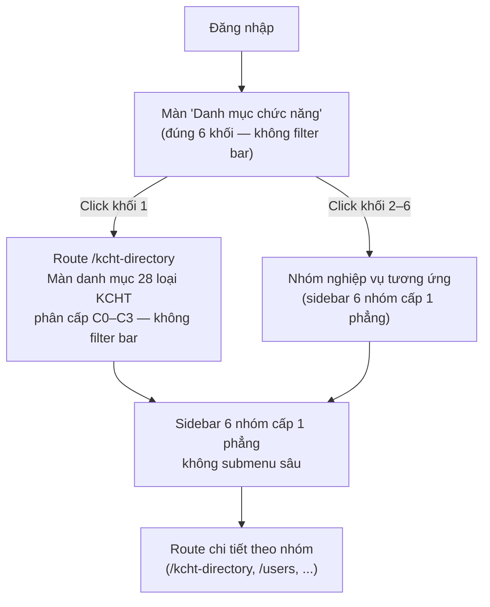

# M-024 — Wireframe mô hình 2 màn hình: "Danh mục chức năng" → `/kcht-directory`

> **Module:** M-024 — Tái cấu trúc Menu & Navigation
> **Feature:** F-292 — Tái cấu trúc Menu & Navigation
> **Triage:** `TRI-1788409709741-75fa` (đợt 5 — mô hình 2 màn hình)
> **Nguồn chuẩn:** `SO-DO-VA-MA-TRAN-CHA-CON-KCHT.md` (28 loại KCHT C0–C3), `ba/00-lean-spec.md` §1, `_features/F-292-.../feature-brief.md` §1/§5, `design/00-design-plan.md` §8.
> **Ngày:** 2026-09-03

---

## 1. Flow 2 màn hình (mermaid)

## 2. Màn 1 — "Danh mục chức năng" (6 khối, đúng thứ tự)

Sau đăng nhập hiển thị màn "Danh mục chức năng" gồm đúng 6 khối:

1. **Quản lý KCHT hàng hải** — click mở route `/kcht-directory` (28 loại KCHT phân cấp C0–C3).
2. **Quản lý tài sản KCHT hàng hải**
3. **Quản lý quy hoạch & vận hành**
4. **Phê duyệt**
5. **Báo cáo thống kê**
6. **Quản trị hệ thống**

Màn này KHÔNG có filter bar; mỗi khối là cổng vào một nhóm nghiệp vụ.

## 3. Màn 2 — `/kcht-directory`: cây 28 loại KCHT (markmap, C0–C3)

Cấu trúc phân cấp chuẩn `SO-DO-VA-MA-TRAN-CHA-CON-KCHT.md` — markmap dạng heading tree:

# 28 loại KCHT (C0–C3)

## Cảng biển (C0)
### Bến cảng (C1)
#### Cầu cảng (C2)
### Luồng hàng hải (C1)
#### Bến phao (C2)
#### Nhà trạm quản lý vận hành phao tiêu (C2)
##### Phao, tiêu (C3)
#### Đèn biển & nhà trạm (C2)
#### Đê chắn sóng, đê chắn cát, kè (C2)
### Khu neo đậu (C1)
### Khu chuyển tải (C1)
### Khu tránh, trú bão (C1)
### Cơ sở sửa chữa, đóng tàu (C1)
## Hệ thống VTS (C0)
### Trung tâm điều hành VTS (C1)
#### Trạm Radar (C2)
#### Hệ thống AIS (C2)
#### Hệ thống CCTV (C2)
#### Hệ thống SCADA (C2)
#### Hệ thống truyền dẫn (C2)
#### Hệ thống phụ trợ VTS (C2)
## Cảng cạn (C0)
## Nhóm "Đài viễn thông hàng hải" (gắn lỏng — cha là Trung tâm điều hành VTS hoặc Cảng biển)
### Đài TTDH
### Hệ thống VHF
### Đài Inmarsat
### Đài LRIT
### Đài Cospas-Sarsat
### Đài TTXLTT Hà Nội

## 4. Mô tả 2 màn hình (tóm tắt)

**Màn 1 — "Danh mục chức năng":** hiển thị ngay sau đăng nhập, gồm đúng 6 khối chức năng theo thứ tự cố định: Quản lý KCHT hàng hải; Quản lý tài sản KCHT hàng hải; Quản lý quy hoạch & vận hành; Phê duyệt; Báo cáo thống kê; Quản trị hệ thống. Màn này không có filter bar; mỗi khối mở nhóm nghiệp vụ tương ứng. Click khối 1 (Quản lý KCHT hàng hải) điều hướng sang màn 2.

**Màn 2 — route `/kcht-directory`:** liệt kê đúng 28 loại KCHT phân cấp cha–con C0–C3 theo `SO-DO-VA-MA-TRAN-CHA-CON-KCHT.md`. Không có filter bar. Sidebar hiển thị 6 nhóm cấp 1 phẳng (không submenu sâu) tương ứng 6 khối ở màn 1; click nhóm điều hướng tới route chi tiết.

**Ràng buộc UI:** dùng token `theme.ts` / `tokens.ts` / `themetokenchk.ts`; không hardcode màu/spacing/font-size (hex). Tên route/key/identifier tiếng Anh (`/kcht-directory`, `KchtDirectoryPage`); nhãn hiển thị tiếng Việt có dấu.
