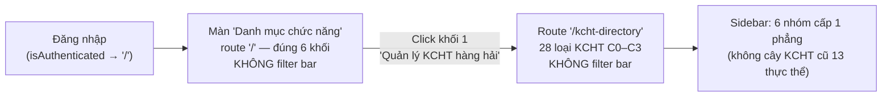

# M-024 Đợt 5 — QA Report W1: Acceptance Oracle — Mô hình 2 màn hình

> Wave-1 chỉ AUTHOR oracle — KHÔNG chạy battery, KHÔNG ghi kết quả chạy nào.
> Mọi `pass_state` trong oracle là **trạng thái kỳ vọng** của probe; bằng chứng thực thi thuộc wave-2
> (`qa/07-qa-report-w2.md` + cập nhật `qa/acceptance-map.json` với evidence thật).
> Oracle đợt-4 (7 nhóm cấp 1 / nhánh 13 thực thể trong sidebar) **HẾT HIỆU LỰC từ đợt 5** — thay bằng
> mô hình 2 màn hình: màn "Danh mục chức năng" 6 khối → route `/kcht-directory` 28 loại KCHT C0–C3
> (nguồn: `ba/00-lean-spec.md` §10 header + §1 dòng 33–56; quyết định thiết kế: `design/00-design-plan.md`
> §8 dòng 294–331; wireframe: `design/wireframe-menu-khoi.md`).

## 1. Nguồn sự thật của oracle (đọc trong wave-1)

| # | Nguồn | Vai trò |
|---|---|---|
| 1 | `docs/modules/M-024-tai-cau-truc-menu-navigation/ba/00-lean-spec.md` | AC-024-01..16 (bảng §10, dòng 265–284) — **criteria gốc**; §1 (33–56) mô tả flow |
| 2 | `docs/modules/M-024-tai-cau-truc-menu-navigation/design/00-design-plan.md` §8 (294–331) | 5 quyết định thiết kế + chuẩn 28 loại C0–C3 (8.2) |
| 3 | `docs/modules/M-024-tai-cau-truc-menu-navigation/design/wireframe-menu-khoi.md` | Flow 2 màn + cây 28 loại (markmap) + ràng buộc UI |
| 4 | `SO-DO-VA-MA-TRAN-CHA-CON-KCHT.md` | Ma trận cha–con 28 loại KCHT (chuẩn đối chiếu) |
| 5 | `docs/intel/_intake/TRI-1788409709741-75fa.json` | done-oracle, edit-target (4 code files), verification `npx tsc --noEmit` (cwd `frontend`) |
| 6 | 4 code files | `frontend/src/App.tsx`, `frontend/src/components/AppLayout.tsx`, `frontend/src/pages/Home.tsx`, `frontend/src/pages/kcht-directory/KchtDirectoryPage.tsx` |

**Anchors code được re-grep tại thời điểm authoring (2026-09-03).** Wave-2 PHẢI re-grep lại anchor
trước khi chạy (rủi ro anchor-drift R5 — design-plan §8.3); nếu anchor đã dịch chuyển thì re-anchor
và ghi nhận, không chạy mù theo số dòng cũ.

## 2. Mô hình 2 màn hình (được kiểm thử)

**Mapping code hiện tại (anchor authoring-time):**

| Thành phần | Anchor |
|---|---|
| Route `/login` (ngoài layout) | `frontend/src/App.tsx:138` |
| Wrapper bảo vệ `<Route element={<AppLayout />}>` | `frontend/src/App.tsx:144` |
| Route `/` → `HomePage` | `frontend/src/App.tsx:145` |
| Route `/kcht-directory` → `KchtDirectoryPage` (không `PermissionGuard`; gating per-node trong page) | `frontend/src/App.tsx:148` |
| Redirect authed → `'/'` | `frontend/src/App.tsx:324-325` |
| `BLOCKS` 6 khối (key/title; route hoặc disabled) | `frontend/src/pages/Home.tsx:46-88` |
| Heading "Danh mục chức năng" + render map khối (Tooltip `:169`, `disabled` `:178`, onClick guard `:179`) | `frontend/src/pages/Home.tsx:159` |
| `KCHT_TREE` 28 loại (level C0–C3) | `frontend/src/pages/kcht-directory/KchtDirectoryPage.tsx:71-145` |
| `DEFAULT_OPEN_KEYS` (mở sẵn cây khi vào màn) | `KchtDirectoryPage.tsx:183-191` |
| `buildMenuItems` (submenu/lá, disabled + Tooltip, navigate) | `KchtDirectoryPage.tsx:259-312` |
| Sidebar `rawMenuItems` (6 nhóm cấp 1 phẳng) | `frontend/src/components/AppLayout.tsx:215-381` |
| Gating quyền item + prune nhóm rỗng | `AppLayout.tsx:95-105` (`canAccessMenu`), `:382` (`filterEmptyChildren(rawMenuItems)`) |
| Search menu (đợt 2 giữ nguyên): trim/lowercase/filter | `AppLayout.tsx:130-142` (`filterMenuByQuery`), `:384-387` |
| Ô tìm kiếm sidebar + Menu render | `AppLayout.tsx:455`, `:465-475` |

## 3. Coverage map AC-024-01..16 → verification method

Máy đọc: `qa/acceptance-map.json` (1 entry/AC). Bảng dưới là bản người đọc của cùng map.

| AC | File chính | Probe (exact) | Kỳ vọng (`pass_state`) |
|---|---|---|---|
| AC-024-01 | Home.tsx, App.tsx | read `Home.tsx:46-88`: đếm entry `BLOCKS` = 6, `title` đúng thứ tự (1 Quản lý KCHT hàng hải; 2 Quản lý tài sản KCHT hàng hải; 3 Quản lý quy hoạch & vận hành; 4 Phê duyệt; 5 Báo cáo thống kê; 6 Quản trị hệ thống), label tiếng Việt có dấu; khối (1)(2)(3)(5)(6) có `route` (`:51` `/kcht-directory`, `:58` `/asset/inventory`, `:65` `/gis/map`, `:79` `/reports`, `:86` `/users`) + `icon`; khối (4) "Phê duyệt" `:69-73` có `disabled: true` (`:73`), KHÔNG `route`, tooltip 'Chưa triển khai' (`:169`), `onClick={() => block.route && navigate(block.route)}` (`:179`) + native `disabled` (`:178`) → không navigate (AC-024-01 **đã amended** — miễn trừ block 4); heading "Danh mục chức năng" tại `Home.tsx:159`; route `/` → `HomePage` tại `App.tsx:145` + redirect authed `'/'` tại `App.tsx:325` | pass |
| AC-024-02 | Home.tsx, App.tsx, KchtDirectoryPage.tsx | grep khối 1: `Home.tsx:49` `route: '/kcht-directory'`; route đăng ký `App.tsx:148` element `KchtDirectoryPage`; đếm node loại trên `/kcht-directory` = 28 (xem AC-024-16) | pass |
| AC-024-03 | AppLayout.tsx | read `AppLayout.tsx:215-381`: depth-1 (sau divider) gồm item tiện ích `'/'` (dòng 216) + **đúng 6 nhóm cấp 1** label khớp 6 khối AC-024-01, đúng thứ tự; nhánh KCHT = **1 lá duy nhất** `key: '/kcht-directory'` (dòng 219, không `children`); **0** key thực thể KCHT cũ trong vùng 215–381 (`grep -n "key: '/pier'|key: '/berth'|key: '/buoys'|key: '/radar-station'|key: '/navigation-channel'|key: '/vts-operation-center'|key: '/dai-ttdh'"` → 0 match) | pass |
| AC-024-04 | AppLayout.tsx, KchtDirectoryPage.tsx | read `AppLayout.tsx:226-231/:240-249/:372-377` (children gói `canAccessMenu(...)`), `:382` `menuItems = filterEmptyChildren(rawMenuItems)` + `:106-128` (nhóm 0 con hợp lệ bị loại, divider dư bị bỏ); directory: `KchtDirectoryPage.tsx:300-301` node thiếu quyền → disabled + Tooltip `NO_PERMISSION_NOTE` | pass (cơ chế sidebar); xem OBS-2 cho mệnh đề "màn khối" |
| AC-024-05 | AppLayout.tsx, permissionStore.ts | read `AppLayout.tsx:95-105`: `canAccessMenu` delegate `usePermissionStore...hasPermission/hasAnyPermission`; bypass `admin:all` / `*` / `<resource>:manage|:*|:write` tại `permissionStore.ts:55-95` (read-only tham chiếu; unit suite `src/store/permissionStore.test.ts` có sẵn — guard tùy chọn) | pass |
| AC-024-06 | AppLayout.tsx | read `AppLayout.tsx:394-399` `handleMenuClick` (navigate khi key bắt đầu `/`), Menu `onClick={handleMenuClick}` tại `:471`; mapping `selectedKey` theo path (vùng ~168–198: `/` landing; `/reports/<biểu>`; `/asset|/gis|/documents`; **mọi route KCHT-entity gom về `/kcht-directory`**); `openKeys` mở đúng nhóm theo prefix tại effect ~200–215 | pass (tĩnh); facet click runtime nằm ngoài battery tĩnh — xem OBS |
| AC-024-07 | AppLayout.tsx, KchtDirectoryPage.tsx | grep `'Chưa triển khai'` → `AppLayout.tsx:254` (lá Phê duyệt `disabled: true, title: 'Chưa triển khai'`); `KchtDirectoryPage.tsx:139` `noRouteNote` Hệ thống VHF → `:273-274` `disabled: true` + `<Tooltip>`; `:300-301` thiếu quyền → disabled + Tooltip; disabled item KHÔNG có `onClick`/`onTitleClick` navigate (chỉ `:288` onTitleClick khi có route + quyền; `:308` onClick lá có route) | pass |
| AC-024-08 | Home.tsx, KchtDirectoryPage.tsx, AppLayout.tsx | (a) label tiếng Việt có dấu, key/route tiếng Anh — read vùng label/icon nêu trên; (b) theme: `grep -nE "#[0-9A-Fa-f]{3,8}"` trên `Home.tsx` + `KchtDirectoryPage.tsx` → **0 match**; vùng `rawMenuItems` 215–381 không chứa style object (0 hex); (c) spacing/font-size/radius/weight chỉ từ token `../themetokenchk`/`theme.ts`/`tokens.ts` — ngoại lệ được phép: kích thước layout (56px icon box), border `1px`, pill `2px 10px` (Pill Badge Standard AGENTS.md), `lineHeight` — xem mục 5 | pass |
| AC-024-09 | — (gate) | GATE-1: `cd frontend && npx tsc --noEmit` → **exit 0**; mệnh đề `mvn compile -DskipTests` không áp dụng đợt này (edit-scope frontend-only) — OBS-3 | pass (GATE-1) |
| AC-024-10 | 4 code files | Premise D-4 = KHÔNG permission mới (lean-spec §8/BR; BA chốt reuse `resource:read`) → **vacuous**; probe premise: `grep -n "menu:"` trên App.tsx + AppLayout.tsx + Home.tsx + KchtDirectoryPage.tsx → **0 match** (không token permission mới lọt vào) | pass (vacuous) |
| AC-024-11 | AppLayout.tsx | read `AppLayout.tsx:130-142`: `query.trim().toLowerCase()` (dòng 131), so khớp substring `label.toLowerCase().includes(q)` (~141), prune nhánh 0 con khớp qua `filterEmptyChildren` (141); thứ tự gating: menu đã lọc quyền tại `:382` trước khi search `:386` → không item ngoài quyền hiển thị; guard tùy chọn: `npx vitest run src/components/AppLayout.test.tsx` (A1/A2/A5–A8 hiện có) | pass |
| AC-024-12 | AppLayout.tsx | read `AppLayout.tsx:384-387`: `isSearching = trimmedSearchQuery.length > 0` (chuỗi rỗng/khoảng trắng → `false`); `displayedItems = menuItems` (full 6 nhóm + item tiện ích); `effectiveOpenKeys = openKeys` (user điều khiển); guard tùy chọn vitest A3/A9 | pass |
| AC-024-13 | AppLayout.tsx | read vùng ô tìm kiếm `:449-460`: input `onChange={(e) => setSearchQuery(...)}` — không Enter-submit, không API, không navigate; navigate chỉ qua `handleMenuClick` (`:394-399`, guard key `/`), không handler navigate nào trong search | pass |
| AC-024-14 | Home.tsx, KchtDirectoryPage.tsx | grep `FilterBar|Input|Select|DatePicker|RangePicker|keyword|Tìm kiếm|placeholder=` trên `Home.tsx` + `KchtDirectoryPage.tsx` → **0 match** (Home render chỉ Row khối `:165-173`; Kcht render `ScreenHeader` + card + `Menu` `:322-385`); ô "Tìm kiếm" sidebar (`AppLayout.tsx:455`) là feature menu-search đợt 2 (AC-024-11/12/13), KHÔNG phải filter bar màn hình | pass |
| AC-024-15 | KchtDirectoryPage.tsx, SO-DO | read `KchtDirectoryPage.tsx:71-145`: từng chuỗi cha–con đối chiếu `SO-DO-VA-MA-TRAN-CHA-CON-KCHT.md` + `design/00-design-plan.md` §8.2: Cảng biển(C0)→Bến cảng(C1)→Cầu cảng(C2); Cảng biển→Luồng hàng hải(C1)→{Bến phao(C2); Nhà trạm QLVH phao tiêu(C2)→Phao, tiêu(C3); Đèn biển & nhà trạm(C2); Đê chắn sóng, đê chắn cát, kè(C2)}; Cảng biển→{Khu neo đậu; Khu chuyển tải; Khu tránh, trú bão; Cơ sở sửa chữa, đóng tàu}(C1); Hệ thống VTS(C0)→Trung tâm điều hành VTS(C1)→6 hệ thống(C2); Cảng cạn(C0); nhóm "Đài viễn thông hàng hải" (`note: 'gắn lỏng'`)→6 đài/hệ thống(C1); `DEFAULT_OPEN_KEYS` mở sẵn `/port`,`/berth`,`/navigation-channel`,`/buoy-station`,`/vts-system`,`/vts-operation-center`,`dai-vien-thong-hang-hai` | pass |
| AC-024-16 | KchtDirectoryPage.tsx | `grep -n "level: 'C[0-3]'"` → **28 dòng** (75,81,82,87,89,93,94,96,97,100,101,102,103,109,115,117,118,119,120,121,122,127,134,138,141,142,143,144), không trùng key; C0 chỉ 3 gốc: Cảng biển(75), Hệ thống VTS(109), Cảng cạn(127); không artifact mô hình cũ (7 nhóm/13 thực thể) — phủ bởi AC-024-03 probe | pass |

## 4. Gates (wave-2 chạy)

| Gate | Lệnh | Kỳ vọng |
|---|---|---|
| GATE-1 | `cd frontend && npx tsc --noEmit` | exit 0 |
| GATE-2 (tùy chọn, guard hồi quy search) | `cd frontend && npx vitest run src/components/AppLayout.test.tsx` | exit 0 (bộ A1–A12 hiện có; wave-2 xác nhận file còn hợp lệ sau refactor) |

Wave-2 chỉ chạy exact test file như trên — không chạy suite rộng qua prose (vitest.config chỉ thu
collection mặc định cho `src/store`+`src/services`; component test phải nêu đích danh file).

**Authoring sanity (wave-1 — KHÔNG chạy battery):** theo hợp đồng wave, wave-1 **không thực thi** GATE-1
`npx tsc --noEmit` ("do NOT execute the battery and do NOT record any run results") — trạng thái compile
của 4 file code anchor chỉ được xác nhận khi wave-2 chạy GATE-1 và ghi evidence thật. Trong wave-1 chỉ
thực hiện: author oracle + re-grep anchor khớp working tree (2026-09-03, danh sách dòng ở mục 2/3 phản
ánh đúng code hiện tại) + read-back cấu trúc map. `acceptance-map.json` giữ nguyên
`pass_state`/`evidence = PENDING wave-2`.

## 5. Observations (authoring-time; KHÔNG phải kết quả chạy)

- **OBS-1 (AC-024-03 — diễn giải "phẳng"):** sidebar hiện giữ nhóm `Báo cáo thống kê` với folder con
  2 cấp (`reports-chung`, `Nhóm chỉ tiêu kết cấu hạ tầng`... tại `AppLayout.tsx:263-365`) — kế thừa từ
  trước đợt 5. Oracle đo mệnh đề "KHÔNG còn submenu đa cấp sâu" theo nghĩa phân biệt của AC
  (supersede mô hình cũ): **cây KCHT-entity 13 thực thể (C0–C3) đã bị gỡ khỏi sidebar**, nhánh KCHT chỉ
  còn 1 lá `/kcht-directory`. Nếu BA chủ đích nghĩa đen "flatten cả folder báo cáo" → cần change
  request upstream; wave-2 ghi nhận hiện trạng thực tế khi chạy.
- **OBS-2 (AC-024-04 — mệnh đề "màn khối"):** `Home.tsx` render 6 khối **cố định, không gating quyền**
  (không import `usePermissionStore`) — nhất quán AC-024-01 (đúng 6 khối cho user có ≥1 quyền) nhưng
  mệnh đề "không thấy khối không thuộc quyền" của AC-024-04 **không có seam để pass** trên màn khối;
  mệnh đề khả thi = phía sidebar (nhóm rỗng bị ẩn) + directory (node thiếu quyền disabled). Cần BA
  adjudicate hoặc wave-2 ghi nhận là unverifiable theo đúng chữ AC.
- **OBS-3 (AC-024-09):** edit-scope triage = `frontend` only → mệnh đề `mvn compile -DskipTests` không
  áp dụng; chỉ GATE-1 `tsc` có seam. Nếu PMO muốn backend gate, bổ sung ở orchestrator gate.
- **OBS-4 (AC-024-10):** premise D-4 = KHÔNG — AC vacuous; probe premise (0 token `menu:`) là phép đo
  trung thực duy nhất của "nếu D-4 = có".
- **OBS-5 (khối 'Phê duyệt') — D1 FIXED:** block 4 `Home.tsx:69-73` = `disabled: true` (`:73`), KHÔNG có
  `route`, bọc tooltip 'Chưa triển khai' (`:169`), `onClick={() => block.route && navigate(block.route)}`
  (`:179`) + native `disabled` (`:178`) → không navigate, hết self-loop. Sidebar lá `Phê duyệt` disabled
  'Chưa triển khai' tại `AppLayout.tsx:254` nhất quán. AC-024-01 đã amended để encode miễn trừ block 4
  (chỉ khối (1)(2)(3)(5)(6) navigable).
- **OBS-6 (theme — ngoại lệ được phép khi audit AC-024-08):** `padding: '2px 10px'` của `LevelBadge`
  (`KchtDirectoryPage.tsx`) là **Pill Badge Standard** bắt buộc theo AGENTS.md (list-screen convention);
  `1px` border, kích thước layout (56/width/height), `lineHeight` không thuộc thang cấm (radius/spacing/
  font-size/weight 6-7-10-14-18...). `LevelBadge` dùng token `actionPrimary`/`colors.sidebarBg`/`surfaceCard`
  + `${color}15`/`${color}40` alpha đúng quy chuẩn pill.

## 6. Kết luận (wave-1 — authoring)

Oracle đợt 5 đã author đủ 16/16 AC-024-01..16 (bảng mục 3 + `qa/acceptance-map.json`), anchor bám code
hiện tại (re-grep 2026-09-03), encode đủ: mô hình 2 màn hình, 6 khối → `/kcht-directory` 28 loại C0–C3,
sidebar 6 nhóm cấp 1 phẳng (không cây KCHT cũ), không filter bar 2 màn, theme token (không hardcode
hex/spacing/font-size), label tiếng Việt có dấu, key/route tiếng Anh. **KHÔNG có kết quả chạy nào được
ghi** — wave-2 thực thi battery theo map và ghi evidence vào `07-qa-report-w2.md` + `acceptance-map.json`.
