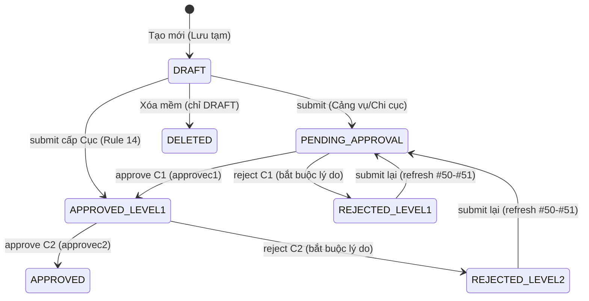

# Luồng hàng hải CHK (navigationchannelchk) — Clone frontend-only

## Summary

M-027 là module **frontend-only** nhân bản (clone) trung thực module Luồng hàng hải (`navigationchannel`) hiện có, chạy trên **CHK theme** (`themetokenchk`). Không có bất kỳ thay đổi backend/DB/permission nào: tái sử dụng nguyên vẹn service `navigationChannelCRUD`/`navigationChannelApproval` (`frontend/src/services/navigationChannelService.ts`) và quyền `navigationchannel:*`. Phạm vi thay đổi chỉ gồm: (1) đổi tên component, (2) đăng ký route mới, (3) đổi label hiển thị breadcrumb/title, (4) thêm 5 mục mirror trong `AppLayout.tsx`. Base pages `NavigationChannelList.tsx`/`NavigationChannelForm.tsx` **đã nằm trên CHK theme** (import `themetokenchk`, bọc `ThemeTokenProvider`, Modal dùng `rootClassName={THEME_SCOPE_CLASS}`) nên việc clone là copy trung thực — **không đổi** service/type/field identifier. Toàn bộ logic nghiệp vụ (quy trình phê duyệt 2 cấp C1/C2, data scope, soft-delete, history) được kế thừa nguyên vẹn từ M-003 (F-038..F-043) và từ backend dùng chung.

## Scope

| | Items |
|---|---|
| In scope | Clone 2 trang: list (`NavigationChannelChkList`) + form/drawer (`NavigationChannelChkForm`); đăng ký 6 route `/navigation-channel-chk` + `/luong-hang-hai-chk` (mỗi tiền tố 3 route: list/create/:id); 5 mục mirror trong `AppLayout.tsx`; đổi label "Luồng hàng hải" → "Luồng hàng hải CHK" (breadcrumb/title). |
| Out of scope | Mọi thay đổi backend (Java controller/service/entity), DB/migration, `PermissionSeeder`, `tokens.ts`, `themetokenchk.ts`, `theme.ts`, và mọi file trong `frontend/src/pages/navigationchannel/` (base — READ-ONLY). Không thêm service/type mới. Không đổi hành vi nghiệp vụ nào so với base. |
| Assumptions | Base pages đã hoạt động đúng trên CHK theme và giữ nguyên trạng thái đó (đã xác minh: `NavigationChannelList.tsx:39-41,518,572` và `NavigationChannelForm.tsx` header import `themetokenchk` + `ThemeTokenProvider` + `THEME_SCOPE_CLASS`). Backend `/v1/navigation-channel/*` + quyền `navigationchannel:*` đã tồn tại và dùng chung (không cần đăng ký gì mới). |

## Nguồn tham chiếu (evidence anchors — đã mở trong phiên này)

| Nguồn | Anchor | Nội dung |
|---|---|---|
| `frontend/src/pages/navigationchannel/NavigationChannelList.tsx` | :48-51, :56-62, :155-156, :183, :258-333, :353-367, :507, :518-521, :525, :572 | Condition status colors; 6 status tabs; search params; đếm theo tab; cột bảng; rowActions view/edit/delete; nút Thêm mới; ThemeTokenProvider wrap; breadcrumb "KCHT hàng hải > Luồng hàng hải"; FilterTableLayout |
| `frontend/src/pages/navigationchannel/NavigationChannelForm.tsx` | :30, :45-48, :528/:542/:590/:623/:1089, :604, :721-725, :775, :788, :1025, :1108 | GisLocationSelector; ApprovalActionBar/HistoryTimeline/AttachmentList/ApprovalStatusBadge; navigate('/navigation-channel'); breadcrumb; `record.attachments` → AttachmentList; ApprovalActionBar; HistoryTimeline; GisLocationSelector `defaultGeometryType="LINE"`; title Tạo mới/Chỉnh sửa/Chi tiết |
| `frontend/src/services/navigationChannelService.ts` | :12-44, :46-73 | `navigationChannelCRUD` (list/search/getById/create/update/delete/getByStatus) + `navigationChannelApproval` (submitApproval/approveC1/approveC2/rejectLevel1/rejectLevel2/getHistory) — endpoint `/v1/navigation-channel/*` |
| `frontend/src/types/navigationChannel.ts` | toàn file | Model 71 trường (#1-#46 write, #47-#71 read-only); `ConditionStatus`; `ApprovalStatus`; `GisGeometryType`; `ChannelRouteDetail`; `NavigationChannelCoordinate`; `Attachment`; `ListParams` |
| `frontend/src/App.tsx` | :82-86, :234-240, :263-273 | Pattern lazy import + route CHK clone (vd `vts-system-chk`); 6 route base của navigationchannel (3 `/navigation-channel` + 3 alias `/luong-hang-hai`); PermissionGuard dùng quyền base |
| `frontend/src/components/AppLayout.tsx` | :77, :249-276, :298 | permission map; pathSegments/selectedKey arrays (chứa `/navigation-channel`); cần 5 mục mirror |
| `docs/conventions/chk-theme-standard-architecture.md` | mục 2-4 | Chuẩn CHK theme: `ThemeTokenProvider` + `themetokenchk`, màn tham chiếu `vtssystemchk` |
| M-003 `_features/F-038..F-043/feature-brief.md` + `ba/00-lean-spec.md` | F-041 lean-spec :44-68, :83-91; F-040 lean-spec Summary; F-043 lean-spec BR-043-01..07 | Quy trình duyệt C1/C2 (AC-041-01..11, BR-041-01..09); soft-delete chỉ DRAFT; history |

## Bản đồ đổi tên (RENAME MAP — bắt buộc ghi nguyên văn)

**Components:**
- `NavigationChannelList` → `NavigationChannelChkList`
- `NavigationChannelForm` → `NavigationChannelChkForm`
- `NavigationChannelFormProps` → `NavigationChannelChkFormProps`
- `NavigationChannelFormInner` → `NavigationChannelChkFormInner`

**Routes:**
- `/navigation-channel` → `/navigation-channel-chk`
- `/luong-hang-hai` → `/luong-hang-hai-chk`

**Labels (chỉ breadcrumb/title):**
- "Luồng hàng hải" → "Luồng hàng hải CHK"

**KHÔNG đổi (cấm đổi tên):** service identifiers (`navigationChannelCRUD`, `navigationChannelApproval`), type/field identifiers (`NavigationChannelResponse`, `CreateNavigationChannelRequest`, `channelName`, `approvalStatus`, ...), endpoint paths, permissions (`navigationchannel:*`), import path của service/type/component dùng chung (ngoài import của 2 file base đang được copy).

## Danh sách chức năng (functionally-identical-to-base — full feature list)

Module clone phải giữ **toàn bộ** chức năng của base, không thêm/bớt/sửa hành vi. Danh sách chức năng kế thừa:

| # | Chức năng | Hành vi cần giữ nguyên | Nguồn gốc |
|---|---|---|---|
| F1 | Danh sách + lọc | 6 tab trạng thái (Tất cả / Lưu tạm `DRAFT` / Chờ Cảng vụ duyệt `PENDING_APPROVAL` / Chờ Cục duyệt `APPROVED_LEVEL1` / Đã duyệt `APPROVED` / Từ chối `REJECTED`+`REJECTED_LEVEL1`+`REJECTED_LEVEL2`); sidebar filter (`FilterTableLayout`): keyword, `channelCode`, `orgUnitId` (cây đơn vị), `seaportId`, `provinceId`, `conditionStatus`, `approvalStatus`, khoảng ngày cập nhật; cột: STT, Tên/Mã luồng hàng hải, Thuộc cảng biển, Đơn vị quản lý, Địa điểm Tỉnh/TP, Tình trạng, Trạng thái, Cán bộ cập nhật; rowActions: Xem chi tiết / Sửa (`canEditApprovalRecord`) / Xóa (`canDeleteApprovalRecord`) | `NavigationChannelList.tsx:56-62,258-333,353-367`; service search |
| F2 | Tạo mới | Form/drawer với write surface #1-#46 (hồ sơ chính, tuyến luồng `routeDetails`, phạm vi bảo vệ, thông tin bản đồ, tọa độ, file đính kèm); bắt buộc `orgUnitId` (#1)/`channelName` (#5)/`conditionStatus` (#8); `channelCode` tự sinh prefix `LHH`; field #47-#71 read-only; nút Lưu tạm / Lưu và gửi phê duyệt / Lưu và phê duyệt | F-038 lean-spec; `CreateNavigationChannelRequest` |
| F3 | Cập nhật | Partial update trên cùng write surface #1-#46; `updatedBy`/`updatedAt` ghi từ session; sau sửa gửi lại quy trình duyệt qua submit-approval | F-039 brief mục 1-2 |
| F4 | Xóa mềm | Chỉ xóa hồ sơ `DRAFT` (Lưu tạm), do người nhập thực hiện, cần `navigationchannel:delete`; gán `deletedAt`/`deletedBy` từ session; xóa GIS object nếu có; frontend chỉ hiện nút Xóa khi `approvalStatus === 'DRAFT'` | F-040 lean-spec Summary (đính chính 26/08/2026) |
| F5 | Phê duyệt C1/C2 | Quy trình 2 cấp đầy đủ (mục "Quy trình phê duyệt C1/C2" bên dưới) | F-041 lean-spec |
| F6 | Xem chi tiết | Drawer view: toàn bộ trường #1-#71, `#47-#71` read-only; tab Lịch sử & Phê duyệt chỉ hiện khi `drawerMode !== 'create'`; nút duyệt C1/C2 hiển thị theo trạng thái + quyền | F-042; `NavigationChannelForm.tsx:775` |
| F7 | Lịch sử | HistoryTimeline từ GET /v1/navigation-channel/{id}/history; sự kiện PROPOSED/APPROVED/REJECTED kèm cấp xử lý approvalLevel; sắp xếp giảm dần; cần quyền navigationchannel:history | F-043 lean-spec BR-043-01..06; `NavigationChannelForm.tsx:788` |
| F8 | File đính kèm | `AttachmentList` hiển thị `record.attachments` (bảng `infrastructure_attachments`, `ref_type = NAVIGATION_CHANNEL` — comment tại `types/navigationChannel.ts:90`) | `NavigationChannelForm.tsx:721-725` (`record.attachments` → `AttachmentList`); `types/navigationChannel.ts:137,207` (`attachments?: NavigationChannelAttachment[]`) |
| F9 | GIS | `GisLocationSelector` (`defaultGeometryType="LINE"`), tọa độ `longitude`/`latitude`, `geometryType` POINT/LINE/POLYGON, `spatialId` | `NavigationChannelForm.tsx:30,1025`; types |
| F10 | Modal + routed mode | Form hỗ trợ cả 2 chế độ: modal (`open` prop, mở từ list) và routed (`/:id`, `?mode=edit`); sau lưu navigate về `/navigation-channel-chk` | `NavigationChannelForm.tsx:528,542,590,623,1089` |

**Màn hình tham chiếu CHK:** `frontend/src/pages/vtssystemchk/VtsSystemChkList.tsx` + `VtsSystemChkForm.tsx` (theo `chk-theme-standard-architecture.md` mục 4). File mới đề xuất: `frontend/src/pages/navigationchannelchk/NavigationChannelChkList.tsx` + `NavigationChannelChkForm.tsx` (BA đề xuất, SA chốt).

## Quy trình phê duyệt C1/C2 (kế thừa nguyên vẹn từ M-003 F-041)

Clone **tái sử dụng nguyên vẹn** quy trình 2 cấp đã implement ở base — chỉ giữ nguyên code gọi service, không viết lại:

**State machine (lưu dạng ordinal trong DB theo enum `ApprovalStatus`):**

**Endpoints + quyền (gọi qua `navigationChannelApproval`, KHÔNG đổi):**

| Method | Đường dẫn | Mô tả | Quyền |
|---|---|---|---|
| POST | `/v1/navigation-channel/{id}/submit-approval` | Gửi phê duyệt; ghi #50-#51; Rule 14 quyết định trạng thái đích | `navigationchannel:update` |
| POST | `/v1/navigation-channel/{id}/approve/c1` | Duyệt cấp Cảng vụ/Chi cục; ghi #52-#54 | `navigationchannel:approvec1` |
| POST | `/v1/navigation-channel/{id}/reject-level-1` | Trả về C1 (bắt buộc lý do); ghi #54 | `navigationchannel:approvec1` |
| POST | `/v1/navigation-channel/{id}/approve/c2` | Duyệt cấp Cục; ghi #55-#57 | `navigationchannel:approvec2` |
| POST | `/v1/navigation-channel/{id}/reject-level-2` | Trả về C2 (bắt buộc lý do); ghi #57 | `navigationchannel:approvec2` |
| GET | `/v1/navigation-channel/{id}/history` | Lịch sử phê duyệt (F7) | `navigationchannel:history` |

**Quy tắc kế thừa (trích từ BR-041-01..09, F-041 lean-spec :60-68):**
- **BR-041-01:** Submit chỉ từ `DRAFT`/`PROPOSED`/`REJECTED_LEVEL1`/`REJECTED_LEVEL2`/`REJECTED`.
- **BR-041-02 (Rule 14):** Submit từ cấp Cục → thẳng `APPROVED_LEVEL1`.
- **BR-041-03:** Duyệt C1 chỉ từ `PENDING_APPROVAL` (hoặc `PROPOSED`).
- **BR-041-04:** Duyệt C2 chỉ từ `APPROVED_LEVEL1`.
- **BR-041-05 (4-eyes):** Người tạo không tự duyệt; C2 ≠ C1. (ROLE_SYSTEM_ADMIN vượt kiểm tra quyền nhưng vẫn bị chặn 4-eyes theo `userId`.)
- **BR-041-06:** Người duyệt lấy từ `Authentication` (session), không nhận từ body.
- **BR-041-07:** Trả về bắt buộc có lý do; trim và lưu vào `rejectionReason` + `level1/2ApprovalContent`.
- **BR-041-08/09:** Mỗi bước ghi history (`PROPOSED`/`APPROVED`/`REJECTED` + `approvalLevel`) vào bảng `approval_history` dùng chung.

**Giao diện:** nút Duyệt/Trả về chỉ hiển thị theo trạng thái hồ sơ + quyền user (qua `ApprovalActionBar` — `NavigationChannelForm.tsx:775`); dialog trả về bắt buộc nhập lý do.

## Ranh giới dữ liệu & phân quyền

- **Không thay đổi backend:** không sửa Java controller/service/entity, không migration, không `PermissionSeeder` (AGENTS.md mục Permission Registration không áp dụng — không có permission mới).
- **Permission dùng chung:** `navigationchannel:read` / `navigationchannel:create` dùng cho route guard của clone (giống base `App.tsx:234-240` và pattern CHK clone `App.tsx:263-273`); `navigationchannel:update`/`approvec1`/`approvec2`/`delete`/`history` dùng chung qua `PermissionMiddleware`/`@PreAuthorize` backend — không khai báo mới.
- **Data scope:** giữ nguyên cơ chế `DataScopeAspect` + `orgUnitFilter` phía backend (entity `NavigationChannel` đã có `@DataScope` controller — clone frontend chỉ hiển thị dữ liệu backend trả về, không tự lọc).
- **Cấm:** gán dữ liệu placeholder/hardcode, đổi cấu trúc bảng, đổi enum, đổi endpoint.

## Actors

| Actor | Mô tả | Quyền liên quan |
|---|---|---|
| Người nhập hồ sơ (Cảng vụ/Chi cục) | Tạo mới, sửa, xóa DRAFT, gửi phê duyệt | `navigationchannel:create`, `update`, `delete` |
| Cán bộ duyệt C1 (Cảng vụ/Chi cục) | Duyệt/trả về cấp 1 | `navigationchannel:approvec1` |
| Cán bộ duyệt C2 (Cục) | Duyệt/trả về cấp 2; submit cấp Cục vào thẳng `APPROVED_LEVEL1` | `navigationchannel:approvec2`, `update` |
| Người xem | Xem danh sách, chi tiết, lịch sử | `navigationchannel:read`, `history` |
| Admin Cục | Xem thêm thông tin nhạy cảm (người tạo/sửa, thời gian) | quyền đặc biệt Admin Cục (đã có ở base) |

## Acceptance Criteria (bắt buộc — từ parent, ghi nguyên văn)

1. **AC-1:** ChkList + ChkForm pages tồn tại với đầy đủ chức năng base (list + create/edit/detail + approval C1/C2 + attachments + GIS), trên CHK theme.
2. **AC-2:** `App.tsx` có 2 lazy imports + 6 routes (`/navigation-channel-chk` + `/luong-hang-hai-chk`, mỗi route gồm list/create/:id).
3. **AC-3:** `AppLayout.tsx` có 5 mục mirror (permission map, label map, pathSegments, selectedKey, menu item) nhãn "Luồng hàng hải CHK".
4. **AC-4:** `npm run build` từ `frontend/` thoát mã 0.
5. **AC-5:** `git diff` cho thấy ZERO thay đổi dưới `pages/navigationchannel/`, `tokens.ts`, `themetokenchk.ts`, `theme.ts`, và không có thay đổi backend Java/db nào.

**Oracle cho từng AC:**
- AC-1: mở route `/navigation-channel-chk` và `/luong-hang-hai-chk` → render đúng list/form; thao tác tạo/sửa/detail/duyệt C1/C2/đính kèm/GIS hoạt động như base (so sánh hành vi với base page); giao diện dùng token `themetokenchk` (không hardcode màu).
- AC-2: grep `App.tsx` đủ 2 `lazy(() => import('./pages/navigationchannelchk/...'))` + 6 `<Route>` mới.
- AC-3: grep `AppLayout.tsx` đủ 5 vị trí mirror + nhãn "Luồng hàng hải CHK".
- AC-4: chạy `npm run build` trong `frontend/` → exit 0.
- AC-5: `git status`/`git diff --stat` không liệt kê file thuộc các đường dẫn cấm (chỉ file mới dưới `pages/navigationchannelchk/` + `App.tsx` + `AppLayout.tsx`).

## Non-goals (explicit)

- Không sửa base `NavigationChannelList.tsx`/`NavigationChannelForm.tsx` (bản sao phải độc lập).
- Không tạo endpoint/service/type/permission/migration mới.
- Không đổi cấu trúc bảng, enum, data scope.
- Không thêm chức năng vượt base (không GIS editing mới, không thông báo email/SMS...).
- Không đổi label trong nội dung form field/button khác ngoài breadcrumb/title (theo RENAME MAP).

## Pipeline Triage

| Question | Answer | Rationale |
|---|---|---|
| Domain model affected? | No | Không đổi entity/DTO/schema — backend dùng chung nguyên vẹn. |
| Architecture affected? | Low | Chỉ frontend: 2 file page mới + routes + menu mirror, theo pattern `vtssystemchk` đã có (`App.tsx:82-86,263-273`). |
| Implementation clear? | Yes | RENAME MAP + feature list + 5 AC đều observable; dev chỉ cần copy-trung-thành + đổi tên/route/label. |
| Documentation risk | Low | Module clone, nguồn gốc rõ ràng (M-003 F-038..F-043 + base pages); spec này là scope anchor duy nhất. |
| **Verdict** | `Ready for Solution Designer review` | Clone frontend-only, không xung đột quyền/backend; SA chốt vị trí file + route guard. |

## Risks & Unknowns

- **Không có blocker.** Điểm cần SA chốt (không phải rủi ro nghiệp vụ): vị trí file mới (`pages/navigationchannelchk/`), route guard dùng `navigationchannel:read`/`create` (giống base), xử lý selectedKey cho 2 tiền tố route trỏ cùng menu item.
- Mọi thay đổi ngoài phạm vi trên (vd sửa base page, thêm permission) phải báo PMO trước khi thực hiện.
