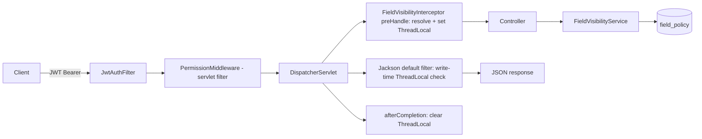

# M-1004 Field-level Authorization PoC — Threat Model & Security Requirements

Source of truth: `docs/modules/M-1004-field-level-authorization/design/00-design-plan.md` (locked direction — this document does not redesign it; amended 2026-08-17 to resolve F-01/F-02 and fold F-03..F-11 into §9 "Security requirements") + triage `TRI-1786938535184-0213` (C3, one-way door at `src/main/resources/db/migration/V120__create_field_visibility_policy.sql`, deviated to V121 per design decision D1).

Re-check status (2026-08-17): F-01 and F-02 are **REMEDIATED in the accepted design plan** (verified below against the amended plan and primary sources). F-03..F-11 are **addressed/documented-out-of-scope** in design §9. No blocking findings remain → verdict **Pass**.

Knowledge-base grounding (queried 2026-08-17, domain=`security`): the KB has **no entries specific** to field-level authorization patterns, PermissionMiddleware gating, ThreadLocal/Jackson strip mechanics, or enum-ordinal storage — those findings rest on primary source evidence (read/grep/lsp/impact). The general principles below are KB-grounded: server-side authorization on every object access (`kb-fcdfc0494629b767`, OWASP A01; UUIDs are defense-in-depth, not a substitute for the check — supports F-01/F-06); security-sensitive auth/RBAC changes need an explicit security review + design note (`kb-3d3f9c70a0e3a9dc` — this artifact is that note); parameterized queries only (`kb-ec57779b5b64c469` — supports F-06); OWASP Top 10 2025 A01 Broken Access Control and A10 Mishandling of Exceptional Conditions / fail-open (`kb-0309e880693bbe0a` — supports F-03/F-04); sanitized error output, no stack traces to consumers (`kb-27da07d28143d9d8` — supports the error-path analysis); VN personal-data frame: NĐ 13/2023 plus Luật Bảo vệ Dữ liệu Cá nhân 91/2025/QH15 (`kb-743ab332c4eef62a`, `kb-a650410811229b08`).

## 1. Review scope

Domains assessed: authentication, authorization (RBAC integration), data protection (wire-level field stripping), secrets management (N/A — no new secrets), input validation (visibility endpoint), output encoding/serialization (Jackson strip boundary), audit/logging (policy audit columns), availability (per-request DB reads), data-at-rest (enum ordinals).

Threat surface: the `field_policy` rule table, the resolution service, the interceptor + ThreadLocal context, the global Jackson default-filter strip, and `GET /api/field-visibility`. The strip is a **serialization-time enforcement point, not an access-control point** — the design correctly keeps it as defense-in-depth (no data-scope or write-rejection claims).

Trust boundaries and traced data paths:

| TB | Boundary | Path traced | Verified anchors |
|---|---|---|---|
| TB1 | Client ↔ API (authN) | JWT → principal User set by `JwtAuthFilter.java:73`; `/api/**` requires authentication (`SecurityConfig.java:104`) | `SecurityConfig.java:104`, `JwtAuthFilter.java:73` |
| TB2 | API ↔ permission model (subject source) | `User.java:129` → policy resolution subject set (USER id, ACTIVE GROUP ids, PERMISSION codes) | `User.java:129`, `User.java:143`, `User.java:153` |
| TB3 | API ↔ policy DB | interceptor → `FieldVisibilityService.resolve(user, resource)` → `findByActiveTrue()` | design §5, WO-BE-3/4 |
| TB4 | Serialization boundary (enforcement point) | MVC mapper → default filter → `serializeAsField` consults the ThreadLocal per field at write time | WO-BE-8, `ApiResponse.java:19` |
| TB5 | Request-lifecycle boundary | `preHandle` set / `afterCompletion` clear of the ThreadLocal; async writer threads carry no context | WO-BE-5/6, `AsyncConfig.java:22` |

## 2. Findings

Status legend: **REMEDIATED** = fixed in the accepted design plan (line-cited); **ADDRESSED** = folded into design §9 as binding requirement / documented out-of-scope; **VERIFIED** = confirmed sound, no action.

| ID | Domain | Finding | Severity | Evidence | Status / Remediation |
|---|---|---|---|---|---|
| F-01 | Authorization / integration | `GET /api/field-visibility` would 403 every non-admin: PermissionMiddleware (servlet filter registered after JwtAuthFilter at `SecurityConfig.java:117`) does not skip the path (list at `PermissionMiddleware.java:53` has no `field-visibility` entry), the resource normalizes to `"fieldvisibility"`, and `checkPermission` returns false for the unseeded code (`PermissionRoleService.java:99`); admins pass only via the authority bypass (`PermissionMiddleware.java:103`). FE fail-open then shows a column the wire payload stripped → done_oracle fails. | High | `SecurityConfig.java:117`; `PermissionMiddleware.java:53`, `PermissionMiddleware.java:103`, `PermissionMiddleware.java:130`; `PermissionRoleService.java:99`; design §6 | **REMEDIATED** — design plan: WO-BE-10 (line 231) appends the exact prefix `/api/field-visibility` to the public-path list at `PermissionMiddleware.java:53`, skipped via startsWith at `PermissionMiddleware.java:147`; authN retained (JwtAuthFilter + `SecurityConfig.java:104` unchanged); no new permission seeded (line 234); PermissionMiddleware.java recorded as the PMO-authorized 12th edit target (line 175); WO-INT-1 checklist covers it (line 254). Source anchors `PermissionMiddleware.java:53/:130/:147` grep/read-verified. Implementation pending WO-BE-10; closure = WO-INT-1 review + runtime oracle. |
| F-02 | Data integrity / seed | The original V121 seed used `target_type = 2` (= ALL) while D6 mandates FIELD (= 0): the demo rule would land under the special key `'*'` and hide every field of resource `vts` for non-admins (fail-safe direction, but the demo breaks). | High | design §4 seed block (pre-amendment), D6, D8 | **REMEDIATED** — design plan line 95 now reads `SELECT 0, 'vts:read', 'vts', 0, 'updatedDate', 0, 10, TRUE` (`target_type = 0` = FIELD, matching the DDL comment at line 79 and D6); WO-BE-4 unit test asserts exactly `updatedDate` hidden, no other vts field (line 161); WO-INT-1 checklist verifies it (line 254). Implementation pending WO-BE-1; closure = migration value 0 + unit test green + QA oracle. |
| F-03 | Output serialization | JSON strip bypass channels: standalone mappers (`ChartIntegrationService.java:34`), StreamingResponseBody async writers (`LogExportController.java:56`), byte/CSV exports (`ReportController.java:146`, `SiemController.java:43`, `LegalDocumentController.java:264`) — none are stripped. | Medium | `ChartIntegrationService.java:34`; `PermissionMiddleware.java:74`; `LogExportController.java:56`; `ReportController.java:146` | **ADDRESSED (out of scope, documented)** — design §9 line 162 records the channels as an accepted PoC boundary; WO-INT-1 records it; fix-as-convention before any policy lands on a resource with export/stream endpoints. No JSON streaming exists on policy-bearing resources today (current usage is CSV-only). |
| F-04 | Concurrency / lifecycle | ThreadLocal residual surfaces: async/streaming writer threads have an empty ThreadLocal (strip is a no-op → HIDE fields would leak on any JSON written there); filter-level short-circuits (locked-account 403 at `JwtAuthFilter.java:168`, stale-token 401) never reach the interceptor lifecycle. | Medium | WO-BE-5/6; `JwtAuthFilter.java:168`; `AsyncConfig.java:22` | **ADDRESSED (mitigated)** — design §9 line 163: `afterCompletion` clears unconditionally incl. unauthenticated and exception paths; async/streaming writers are never populated; async JSON responses on policy-bearing resources are out of PoC scope. Keep it that way at WO-BE-6; WO-INT-1 verifies no JSON async/streaming on policy-bearing resources. |
| F-05 | Authorization logic | Wildcard blast radius: a `resource='*'` + `target_type=ALL` rule would strip across all 22 screens; default ALLOW is the safety net only when no rule matches; specificity (subject, then target) dominates priority lexicographically. | Low | design §5 (`beats` spec), D5, §10 | **ADDRESSED** — design §9 line 164: PoC seeds no wildcard rules; unit tests must cover wildcard behavior; WO-INT-1 greps V121 for `'*'` in resource/target columns. |
| F-06 | Input validation | Visibility-endpoint subject spoofing: not exploitable — subjects derive only from the authenticated principal; `resource` is a parameterized lookup key (no SQLi, `kb-ec57779b5b64c469`); callers learn only their own effective map. | Low | design §5/§6, WO-BE-9 | **ADDRESSED** — design §9 line 165: principal-derived subjects only; optional length cap on `resource`. |
| F-07 | Data-at-rest | Enum ordinal evolution: `subject_type`/`target_type`/`effect` stored as SMALLINT ordinals — reordering or mid-list insertion silently remaps stored rows (F-02 was a live instance of the trap). | Medium | design §4 DDL, D8 | **ADDRESSED** — design §9 line 167: evolve append-only, never reorder/insert mid-list; enforced in WO-BE-2 (entity Javadoc) + WO-INT-1 (enum order vs DDL comment). |
| F-08 | Availability / DoS | Per-request DB reads: `checkPermission` → `findByIdWithRelations` (`PermissionRoleService.java:98`) plus the new `findByActiveTrue()` per request (1-row table, indexed); visibility endpoint triggers up to two `countByResource` queries via `isKnownDbResource` (`PermissionMiddleware.java:215`). | Low | `PermissionRoleService.java:98`; `PermissionMiddleware.java:215`; design §4 indexes | **ADDRESSED** — design §9 line 168: per-request read accepted for the PoC (tiny rule set); caching deferred to post-PoC; when added, use evict-after-commit semantics (workspace `OrgUnitCacheService` convention), not a plain TTL cache. |
| F-09 | Authentication / bypass | Admin bypass is structurally sound (verified): `getAllPermissions()` lowercases codes (`User.java:129`) and group inheritance excludes `admin:all`/`*` (`User.java:153`); consistent with `PermissionRoleService.java:85` and `PermissionMiddleware.java:103`. Dev mock token (`JwtAuthFilter.java:82`) authenticates as user "admin" — pre-existing; keep it dev-profile-only. | Low | `User.java:129`, `User.java:153`; `PermissionRoleService.java:85`; `JwtAuthFilter.java:82` | **VERIFIED — no action** — WO-BE-4 unit test #3 (admin:all → empty map) and #2 (vts:read holder → `updatedDate` hidden) cover it; not listed in design §9 (no remediation needed). |
| F-10 | Authorization consistency | GROUP null-status drift: `getAllPermissions()` treats `status == null` as ACTIVE (`User.java:143`); resolution must mirror that predicate or group rules fail open for null-status groups. | Low | `User.java:143`; design D3 | **ADDRESSED** — design §9 line 168-169 (F-10): GROUP subjects use the ACTIVE-or-null predicate mirroring `User.java:143`; add WO-BE-4 unit test for a null-status group. |
| F-11 | Audit / logging | Policy audit columns exist (`BaseEntity.java:71` getDeletedAt, soft-delete via `@SQLRestriction`); no query-side audit needed (self-service reads). | Informational | `BaseEntity.java:60` (updatedAt), `BaseEntity.java:71` (getDeletedAt) | **ADDRESSED (compliant)** — design §9 line 169: no policy-mutation endpoints in the PoC; DDL audit columns reserved for the future admin UI. |

## 3. Compliance considerations

| Standard | Requirement | Status | Gap |
|---|---|---|---|
| VN personal-data protection (NĐ 13/2023; Luật Bảo vệ Dữ liệu Cá nhân 91/2025/QH15 per `kb-a650410811229b08`; NĐ 13/2023 cited in `kb-743ab332c4eef62a`) | Personal data must not be exposed beyond need; consent/purpose/DPO duties apply to regulated data | Compliant (N/A) | `field_policy` stores permission/group/user identifiers and JSON property names only; the hidden demo field is audit metadata (`BaseEntity.java:60` updatedAt), not personal data. Re-assess under Law 91/2025/QH15 when policy data includes personal attributes. |
| OWASP Top 10 2025 A01 / A10 (`kb-0309e880693bbe0a`) | Broken Access Control: server-side authorization on every access (`kb-fcdfc0494629b767`); no fail-open of enforcement (A10) | Addressed in design | F-01 fix keeps authN (fail-closed) and exempts only the resource-permission gate for the self-service endpoint; the FE hook is deliberately fail-open but UX-only, never enforcement. |
| Internal RBAC convention (AGENTS.md permission registration) | New protected endpoints must map to registered permissions | Addressed in design | F-01 remediation is a config exemption (public-path prefix, `PermissionMiddleware.java:53`), not a new permission; PermissionSeeder/RolePermissionSeeder untouched (WO-BE-10 constraint). |
| OWASP ASPS / ASVS 4.0 — V4.1 & V8.3 (access control, sensitive data in JSON) | Field stripping is defense-in-depth, never the sole control; error output sanitized (`kb-27da07d28143d9d8`) | Partial (accepted) | Write rejection for READONLY is out of scope (accepted); async/streaming and byte-export bypass channels are documented limitations (F-03/F-04, design §9) — acceptable while no policy-bearing resource has exports or async JSON endpoints. Exception handlers (`GlobalExceptionHandler.java:34`) return the `ApiResponse.java:19` envelope without stack traces — compliant. |
| Project audit convention (AGENTS.md item 8) | Mutation paths record operator identity | Compliant (N/A) | PoC has no policy-mutation endpoints; DDL audit columns present for future use (F-11). |

## 4. Blockers — status (was: must-fix)

| ID | Finding | Status | Owner | Expected evidence | Closure criteria |
|---|---|---|---|---|---|
| F-01 | Visibility endpoint 403 via PermissionMiddleware | **REMEDIATED in design** (WO-BE-10, design line 231; anchors verified `PermissionMiddleware.java:53/:130/:147`) | engineering-backend-developer (WO-BE-10 / WO-INT-1) | V121 untouched; diff appends the exact prefix `/api/field-visibility` to `PermissionMiddleware.java:53`; no new permission; no SecurityConfig/JwtAuthFilter change | Non-admin `GET /api/field-visibility?resource=vts` → 200 `{updatedDate: HIDE}`; `mvn clean compile` green (implementer gate, not yet executed) |
| F-02 | V121 seed `target_type=2` (=ALL) vs D6 FIELD | **REMEDIATED in design** (design line 95 now `target_type = 0`; WO-BE-4 test at line 161) | engineering-backend-developer (WO-BE-1 / WO-BE-4) | V121 seeds `target_type = 0` (FIELD); unit test asserts exactly `updatedDate` hidden | Unit test green; QA runtime oracle: regular user loses only the "Ngày cập nhật" column |

## 5. Should-fix items (post-PoC obligations carried by design §9)

| ID | Finding | Risk if deferred | Priority |
|---|---|---|---|
| F-03 | Serialization bypass channels (standalone mappers, streaming, exports) | A future policy on a resource with export/stream endpoints silently leaks HIDE fields | High (fix-as-convention; re-audit before new policies) |
| F-04 | ThreadLocal lifecycle residual (async writers, filter short-circuits) | Cross-request wrong-strip or leak once any async JSON response appears on a policy-bearing resource | Medium |
| F-07 | Enum ordinal evolution | Silent policy remapping on any future enum edit (F-02 hit this trap) | Medium |
| F-10 | GROUP null-status predicate | Group-scoped HIDE rules silently fail open for null-status groups | Medium |
| F-08 | Per-request DB reads | DoS surface grows with rule count; add evict-after-commit caching post-PoC | Low |
| F-06 | `resource` param length cap | None today; cheap hardening | Low |
| F-05 | Wildcard `'*'`/`'*'` rule blast radius | Accidental global strip on a future seed/edit | Low (covered by unit tests) |

## 6. Design corrections — resolution status

1. **DC-1 (F-01):** RESOLVED — design §6 (line 128) now acknowledges the PermissionMiddleware gate; WO-BE-10 (line 231) mandates the public-path exemption; PermissionMiddleware.java added as the 12th edit target (line 175, PMO-authorized). Verified against source: `PermissionMiddleware.java:53` (list), `:130` (gate call), `:147` (startsWith skip).
2. **DC-2 (F-02):** RESOLVED — design line 95 seed is now `target_type = 0` (FIELD), matching D6 and the DDL comment at line 79 (`0=FIELD 1=GROUP 2=ALL`).

## 7. Verification notes

- **Verification executed this session: source-level only** — `read`/`grep`/`lsp`/`impact` on the cited files plus KB queries. NO build/typecheck/test command was run: this seat's allowlist is read-only on source plus the report path (no `bash`); `mvn clean compile` / `npm run build` named in closure criteria are **forward-looking implementer gates** (design §12), not executed results. The LSP diagnostics emitted during report writes are a JRE `ct.sym` init failure plus unrelated `orgunit` Lombok-resolution errors — not evidence about this artifact.
- **Re-check verification (2026-08-17):** amended design plan read — F-01 (lines 128/160/175/231-234/254), F-02 (line 95 seed `target_type = 0`, lines 161/254), §9 security-requirements section (lines 156-169, F-03..F-11) — all confirmed present verbatim; source anchors re-pinned by grep/read this session: `PermissionMiddleware.java:53` (list), `:130` (`checkPermission` gate call), `:147` (`startsWith` skip), `SecurityConfig.java:104` (`/api/**` authenticated), `SecurityConfig.java:117` (addFilterAfter), `JwtAuthFilter.java:82` (mock token), `ApiResponse.java:19` (class), `User.java:129/143/153`, `VtsSystemController.java:31`, `PermissionSeeder.java:105`, `BaseEntity.java:60/71`, `ChartIntegrationService.java:34`, `LogExportController.java:56`, `ReportController.java:146`, `GlobalExceptionHandler.java:34`, `PermissionRoleService.java:98`, `PermissionMiddleware.java:215`.
- `impact` on `User.getAllPermissions`: 21 references / 13 files (JWT claims, DataScopeAspect, PermissionAuthorizationManager, DTO mappers) — the design reuses it read-only, which is correct; WO-BE-4 must not modify it.
- `impact` on `PermissionRoleService.checkPermission`: 0 typed callers (invoked from the middleware filter path); callee `findByIdWithRelations` is the per-request load cited in F-08.
- Not covered in this design-phase review: runtime behavior of the serializer filter under load, migration execution on a real DB, frontend token conformance — those belong to the `review`-stage security audit.
