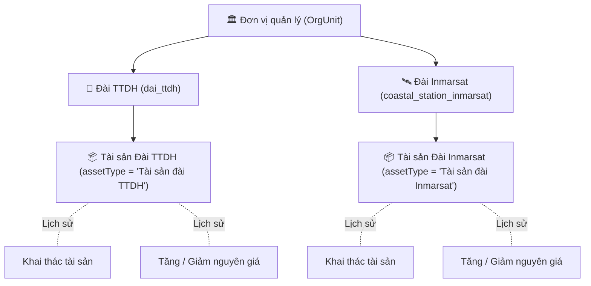

# TÀI LIỆU ĐẶC TẢ THIẾT KẾ CHI TIẾT (TKCT)
# PHÂN HỆ QUẢN LÝ TÀI SẢN KCHT HÀNG HẢI
## 1. TÀI SẢN ĐÀI THÔNG TIN DUYÊN HẢI (TTDH)
## 2. TÀI SẢN ĐÀI INMARSAT
*(Tuân thủ Ma trận 94 trường dữ liệu nghiệp vụ, quy chuẩn UI/UX và cơ chế chia sẻ bảng CSDL)*

---

## PHẦN 1. TỔNG QUAN VÀ BỐI CẢNH KIẾN TRÚC

### 1.1. Mục tiêu nghiệp vụ
Hệ thống KCHTGT Hàng hải Việt Nam quản lý tài sản theo vòng đời từ khi hình thành, đưa vào sử dụng, theo dõi biến động, khai thác kinh doanh cho đến khi thanh lý/tiêu hủy. Hai nhóm tài sản thiết bị chuyên ngành viễn thông hàng hải:
1. **Tài sản Đài Thông tin Duyên hải (TTDH)**: Các máy móc, trang thiết bị phát sóng, thu tín hiệu, ăng ten, nguồn dự phòng... thuộc quyền quản lý và vận hành của các Đài TTDH dọc bờ biển Việt Nam.
2. **Tài sản Đài Inmarsat**: Các trang thiết bị kết nối vệ tinh mặt đất Inmarsat (trạm LES/MES, thiết bị đầu cuối thông tin vệ tinh biển).

### 1.2. Mối quan hệ Cha – Con (Infrastructure & Asset Hierarchy)
Cả 2 loại tài sản đều tuân thủ mô hình quản lý phân cấp nhiều lớp:
* **Cơ quan quản lý cấp trên / Đơn vị quản lý / Đơn vị sử dụng**: Gắn với cây tổ chức `OrgUnit` (Cục Hàng hải, Cảng vụ, Công ty TNHH MTV Thông tin điện tử hàng hải Việt Nam - VISHIPEL...).
* **Hạ tầng đài cha trực thuộc (`parent_id` / `station_id`)**:
  * Tài sản Đài TTDH $\rightarrow$ trực thuộc **Đài TTDH** (Bảng `dai_ttdh`).
  * Tài sản Đài Inmarsat $\rightarrow$ trực thuộc **Đài Inmarsat** (Bảng `coastal_station_inmarsat`).



### 1.3. Kiến trúc Chia sẻ Bảng CSDL (Single Table Inheritance)
Tương tự cặp `transmissionasset` (Hệ thống truyền dẫn) và `vhfasset` (Hệ thống VHF), hai chức năng này **dùng chung bảng CSDL `transmission_assets`** (hoặc bảng tài sản thiết bị tập trung) với các đặc điểm:
1. **Phân loại qua cột `asset_type`**:
   * `'Tài sản đài TTDH'`
   * `'Tài sản đài Inmarsat'`
2. **Liên kết đài cha qua trường `station_id` (UUID)** (hoặc `transmission_id` đóng vai trò khóa ngoại đa năng `parent_id`).
3. **Quy tắc sinh mã tự động**:
   * Tài sản Đài TTDH: `TS-TTDH-XXXXXX`
   * Tài sản Đài Inmarsat: `TS-INM-XXXXXX`
4. **Quy trình Phê duyệt 2 cấp**: 7 trạng thái chuẩn (Lưu tạm $\rightarrow$ Chờ Cảng vụ duyệt $\rightarrow$ Chờ Cục duyệt $\rightarrow$ Đã duyệt / Bị trả về).

---

## PHẦN 2. MA TRẬN 94 TRƯỜNG DỮ LIỆU CHI TIẾT (CRUD & OPERATION MATRIX)

Bảng ma trận định nghĩa rõ vai trò của từng trường thông tin trên các màn hình:
* **DS**: Hiển thị trên bảng Danh sách (`DataTable`).
* **Lọc**: Xuất hiện trên Sidebar bộ lọc (`FilterBar` / `TableFilter`).
* **Xem CT**: Hiển thị trên Drawer Xem chi tiết (`DynamicViewSidebar`).
* **Tạo**: Có mặt trên Form Thêm mới (`DynamicFormSidebar`).
* **Sửa**: Có mặt trên Form Chỉnh sửa (`DynamicFormSidebar`).
* **KT**: Trường nhập trong Form Khai thác tài sản (`AssetExploitationForm`).
* **Tăng**: Trường nhập trong Form Tăng nguyên giá (`AssetAdjustmentForm` - Tăng).
* **Giảm**: Trường nhập trong Form Giảm nguyên giá (`AssetAdjustmentForm` - Giảm).

### TAB 1: THÔNG TIN CHUNG (Trường 1 – 25)

| STT | Tên trường | Loại điều khiển | DS | Lọc | Xem CT | Tạo | Sửa | KT | Tăng | Giảm | Ghi chú & Mapping CSDL |
|:---:|---|---|:---:|:---:|:---:|:---:|:---:|:---:|:---:|:---:|---|
| **1** | Cơ quan quản lý cấp trên | SelectOrgCode | ❌ | ❌ | ✅ | ✅ | ✅ | ❌ | ❌ | ❌ | `parent_org_unit_id` (UUID) |
| **2** | Đơn vị quản lý | SelectOrgCode | ✅ | ✅ | ✅ | ✅ | ✅ | ❌ | ❌ | ❌ | `org_unit_id` (UUID) - Bắt buộc |
| **3** | Đơn vị sử dụng | SelectOrgCode | ✅ | ✅ | ✅ | ✅ | ✅ | ❌ | ❌ | ❌ | `using_org_unit_id` (UUID) |
| **4** | Mã đài | Select | ✅ | ✅ | ✅ | ✅ | ✅ | ❌ | ❌ | ❌ | `transmission_id` / `station_id` (UUID) - Trỏ `dai_ttdh` hoặc `coastal_station_inmarsat` |
| **5** | Loại tài sản | Select | ✅ | ✅ | ✅ | ✅ | ✅ | ❌ | ❌ | ❌ | `asset_type` (VARCHAR) - Cố định theo màn hình |
| **6** | Mã tài sản | Input Text (disabled) | ✅ | ✅ | ✅ | ✅ | ✅ | ❌ | ❌ | ❌ | `asset_code` (VARCHAR, Unique, tự sinh) |
| **7** | Tên tài sản | InputTextArea | ✅ | ✅ | ✅ | ✅ | ✅ | ❌ | ❌ | ❌ | `asset_name` (VARCHAR) |
| **8** | Barcode | Input Text | ❌ | ❌ | ✅ | ✅ | ✅ | ❌ | ❌ | ❌ | `barcode` (VARCHAR) |
| **9** | Tình trạng tài sản | Select | ✅ | ✅ | ✅ | ✅ | ✅ | ❌ | ❌ | ❌ | `asset_condition` (Tốt, Hư hỏng cần sửa chữa, Không sử dụng được) |
| **10** | Hiện trạng sử dụng | Select | ✅ | ❌ | ✅ | ✅ | ✅ | ❌ | ❌ | ❌ | `usage_status` (Đang sử dụng, Chưa sử dụng, Tạm dừng) |
| **11** | Nhóm tài sản | Select | ✅ | ❌ | ✅ | ✅ | ✅ | ❌ | ❌ | ❌ | `asset_group` (Nhà CTXD, Máy móc thiết bị, Khác) |
| **12** | Phân nhóm tài sản | Input Text | ❌ | ❌ | ✅ | ✅ | ✅ | ❌ | ❌ | ❌ | `asset_subgroup` (VARCHAR) |
| **13** | Địa chỉ | InputTextArea | ❌ | ❌ | ✅ | ✅ | ✅ | ❌ | ❌ | ❌ | `address` (VARCHAR 500) |
| **14** | Nguồn gốc | Select | ❌ | ❌ | ✅ | ✅ | ✅ | ❌ | ❌ | ❌ | `origin` (Mua sắm, ĐTXD, Tiếp nhận, Khác) |
| *--* | **Chỉ số tổng hợp** | *Nhóm trường* | ❌ | ❌ | ❌ | ❌ | ❌ | ❌ | ❌ | ❌ | *Header Section kỹ thuật* |
| **15** | Số lượng | InputDecimal | ❌ | ❌ | ✅ | ✅ | ✅ | ❌ | ❌ | ❌ | `quantity` (NUMERIC 15,3, mặc định 1) |
| **16** | Đơn vị tính số lượng | Select | ❌ | ❌ | ✅ | ✅ | ✅ | ❌ | ❌ | ❌ | `quantity_unit` (Bộ, Cái, Chiếc, Hệ thống...) |
| **17** | Model | Input Text | ❌ | ❌ | ✅ | ✅ | ✅ | ❌ | ❌ | ❌ | `model` (VARCHAR 100) |
| **18** | Serial | Input Text | ❌ | ❌ | ✅ | ✅ | ✅ | ❌ | ❌ | ❌ | `serial_number` (VARCHAR 100) |
| **19** | Xuất xứ | Input Text | ❌ | ❌ | ✅ | ✅ | ✅ | ❌ | ❌ | ❌ | `country_of_origin` (VARCHAR 100) |
| **20** | Hãng sản xuất | Input Text | ❌ | ❌ | ✅ | ✅ | ✅ | ❌ | ❌ | ❌ | `manufacturer` (VARCHAR 200) |
| **21** | Năm xây dựng | DatePicker (Year) | ❌ | ❌ | ✅ | ✅ | ✅ | ❌ | ❌ | ❌ | `construction_year` (INTEGER YYYY) |
| **22** | Ngày sử dụng tài sản | DatePicker | ✅ | ❌ | ❌ | ❌ | ❌ | ❌ | ❌ | ❌ | `use_date` (DATE DD/MM/YYYY) - Hiển thị DS |
| **23** | Diện tích (đất, sàn sử dụng: m2) | InputDecimal | ❌ | ❌ | ✅ | ✅ | ✅ | ❌ | ❌ | ❌ | `land_area` (NUMERIC 15,3) |
| **24** | Diện tích (sàn sử dụng: m2) | InputDecimal | ❌ | ❌ | ✅ | ✅ | ✅ | ❌ | ❌ | ❌ | `floor_area` (NUMERIC 15,3) |
| **25** | Vị trí tài sản | InputTextArea | ❌ | ❌ | ✅ | ✅ | ✅ | ❌ | ❌ | ❌ | `asset_location` (VARCHAR 500) |

---

### TAB 2: HỒ SƠ TÀI SẢN (Trường 26)

| STT | Tên trường | Loại điều khiển | DS | Lọc | Xem CT | Tạo | Sửa | KT | Tăng | Giảm | Ghi chú & Mapping CSDL |
|:---:|---|---|:---:|:---:|:---:|:---:|:---:|:---:|:---:|:---:|---|
| **26** | Tên file | Upload/Attachment | ❌ | ❌ | ✅ | ✅ | ✅ | ❌ | ❌ | ❌ | Bảng `infrastructure_attachments` + `attachment_name` |

---

### TAB 3: THÔNG TIN CHI TIẾT (TÀI CHÍNH & KHẤU HAO) (Trường 27 – 38)
> *Ghi chú nghiệp vụ: Các trường này được lưu trữ trong CSDL và dùng để theo dõi giá trị tài sản ban đầu, tự động tính toán giá trị hao mòn và phục vụ đối chiếu khi phát sinh thay đổi nguyên giá ở Tab 5.*

| STT | Tên trường | Loại điều khiển | DS | Lọc | Xem CT | Tạo | Sửa | KT | Tăng | Giảm | Ghi chú & Mapping CSDL |
|:---:|---|---|:---:|:---:|:---:|:---:|:---:|:---:|:---:|:---:|---|
| **27** | Ngày kê khai tài sản | DatePicker | ❌ | ❌ | ❌ | ❌ | ❌ | ❌ | ❌ | ❌ | `declaration_date` (DATE) |
| **28** | Nguyên giá (ngân sách, khác) | InputMoney | ❌ | ❌ | ❌ | ❌ | ❌ | ❌ | ❌ | ❌ | `original_value` (NUMERIC 15,2) |
| **29** | Tỷ lệ hao mòn/Khấu hao (%) | InputDecimal | ❌ | ❌ | ❌ | ❌ | ❌ | ❌ | ❌ | ❌ | `depreciation_rate` (NUMERIC 7,4) |
| **30** | Giá trị còn lại | InputMoney (disabled) | ❌ | ❌ | ❌ | ❌ | ❌ | ❌ | ❌ | ❌ | `remaining_value` (tự động tính = Nguyên giá - Khấu hao lũy kế) |
| **31** | Đơn vị tính giá trị | Select (disabled) | ❌ | ❌ | ❌ | ❌ | ❌ | ❌ | ❌ | ❌ | Cố định `VNĐ` |
| **32** | Số QĐ giao (gồm tăng vốn) | Input Text | ❌ | ❌ | ❌ | ❌ | ❌ | ❌ | ❌ | ❌ | `assignment_decision_number` (VARCHAR) |
| **33** | Ngày tính khấu hao | DatePicker | ❌ | ❌ | ❌ | ❌ | ❌ | ❌ | ❌ | ❌ | `depreciation_start_date` (DATE) |
| **34** | Số tháng tính khấu hao | Input Text / Number | ❌ | ❌ | ❌ | ❌ | ❌ | ❌ | ❌ | ❌ | `depreciation_months` (INTEGER) |
| **35** | Ngày hết khấu hao | DatePicker | ❌ | ❌ | ❌ | ❌ | ❌ | ❌ | ❌ | ❌ | `depreciation_end_date` (DATE) |
| **36** | Khấu hao lũy kế | InputMoney | ❌ | ❌ | ❌ | ❌ | ❌ | ❌ | ❌ | ❌ | `accumulated_depreciation` (NUMERIC 15,2) |
| **37** | Khấu hao tháng | InputMoney (tự tính) | ❌ | ❌ | ❌ | ❌ | ❌ | ❌ | ❌ | ❌ | `monthly_depreciation` (tự động tính) |
| **38** | Hình thức xử lý tài sản | Select | ❌ | ❌ | ❌ | ❌ | ❌ | ❌ | ❌ | ❌ | `disposal_method` (Thanh lý, Điều chuyển, Bán...) |

---

### TAB 4: KHAI THÁC TÀI SẢN (Trường 39 – 50)
> *Lưu trữ tại bảng con `transmission_asset_exploitations` (liên kết qua `asset_id`).*

| STT | Tên trường | Loại điều khiển | DS | Lọc | Xem CT | Tạo | Sửa | KT | Tăng | Giảm | Ghi chú & Mapping CSDL |
|:---:|---|---|:---:|:---:|:---:|:---:|:---:|:---:|:---:|:---:|---|
| **39** | Đơn vị khai thác | SelectOrgCode | ❌ | ❌ | ✅ | ❌ | ❌ | ✅ | ❌ | ❌ | `operator_org_unit_id` (UUID) |
| **40** | Danh mục tài sản | Input Text (disabled) | ❌ | ❌ | ✅ | ❌ | ❌ | ✅ | ❌ | ❌ | `asset_category` (Tự động điền theo tên tài sản) |
| **41** | Đơn vị tính | Select | ❌ | ❌ | ✅ | ❌ | ❌ | ✅ | ❌ | ❌ | `unit_of_measure` (Bộ, Hệ thống...) |
| **42** | Số lượng | InputDecimal | ❌ | ❌ | ✅ | ❌ | ❌ | ✅ | ❌ | ❌ | `quantity` (NUMERIC 15,3) |
| **43** | Thời hạn khai thác | DatePicker | ❌ | ❌ | ✅ | ❌ | ❌ | ✅ | ❌ | ❌ | `exploitation_deadline` (DATE) |
| **44** | Tổng số tiền thu được (VNĐ) | InputMoney | ❌ | ❌ | ✅ | ❌ | ❌ | ✅ | ❌ | ❌ | `total_revenue` (NUMERIC 15,2) |
| **45** | Chi phí có liên quan | InputMoney | ❌ | ❌ | ✅ | ❌ | ❌ | ✅ | ❌ | ❌ | `related_costs` (NUMERIC 15,2) |
| **46** | Nộp NSNN | InputMoney | ❌ | ❌ | ✅ | ❌ | ❌ | ✅ | ❌ | ❌ | `state_budget_payment` (NUMERIC 15,2) |
| **47** | Số tiền được thực hiện dự án | InputMoney | ❌ | ❌ | ✅ | ❌ | ❌ | ✅ | ❌ | ❌ | `project_amount` (NUMERIC 15,2) |
| **48** | Ghi chú (khai thác) | InputTextArea | ❌ | ❌ | ✅ | ❌ | ❌ | ✅ | ❌ | ❌ | `notes` (TEXT) |
| **49** | Ngày cập nhật | Text (read-only) | ❌ | ❌ | ✅ | ❌ | ❌ | ❌ | ❌ | ❌ | `created_at` / `updated_at` (TIMESTAMPTZ) |
| **50** | Cán bộ cập nhật | Text (read-only) | ❌ | ❌ | ✅ | ❌ | ❌ | ❌ | ❌ | ❌ | `created_by` / `updated_by` (UUID $\rightarrow$ FullName) |

---

### TAB 5: LỊCH SỬ THAY ĐỔI NGUYÊN GIÁ (Trường 51 – 83)
> *Lưu trữ tại bảng con `transmission_asset_adjustments` (liên kết qua `asset_id`). Phân loại: `adjustment_type = 'INCREASE'` (Tăng) hoặc `'DECREASE'` (Giảm).*

| STT | Tên trường | Loại điều khiển | DS | Lọc | Xem CT | Tạo | Sửa | KT | Tăng | Giảm | Ghi chú & Mapping CSDL |
|:---:|---|---|:---:|:---:|:---:|:---:|:---:|:---:|:---:|:---:|---|
| **51** | Loại thay đổi nguyên giá | Select | ❌ | ❌ | ✅ | ❌ | ❌ | ❌ | ❌ | ❌ | `adjustment_type` (Tăng / Giảm nguyên giá) |
| **52** | Số QĐ tăng/giảm nguyên giá | Input Text | ❌ | ❌ | ✅ | ❌ | ❌ | ❌ | ✅ | ✅ | `decision_number` (VARCHAR 100) |
| **53** | Ngày ra QĐ tăng/giảm | DatePicker | ❌ | ❌ | ✅ | ❌ | ❌ | ❌ | ✅ | ✅ | `decision_date` (DATE) |
| **54** | Ngày tăng/giảm nguyên giá | DatePicker | ❌ | ❌ | ✅ | ❌ | ❌ | ❌ | ✅ | ✅ | `adjustment_date` (DATE) |
| **55** | Lý do tăng/giảm nguyên giá | Select | ❌ | ❌ | ✅ | ❌ | ❌ | ❌ | ✅ | ✅ | `adjustment_reason` (Nâng cấp, Đánh giá lại...) |
| **56** | Ghi chú (điều chỉnh) | InputTextArea | ❌ | ❌ | ✅ | ❌ | ❌ | ❌ | ✅ | ✅ | `notes` (TEXT) |
| **57** | Nguyên giá trước khi tăng/giảm | InputMoney (disabled) | ❌ | ❌ | ✅ | ❌ | ❌ | ❌ | ✅ | ✅ | `original_value_before` (Lấy từ tài sản hiện tại) |
| **58** | Nguyên giá sau khi tăng/giảm | InputMoney (disabled) | ❌ | ❌ | ✅ | ❌ | ❌ | ❌ | ✅ | ✅ | `original_value_after` (Tự tính theo giá trị điều chỉnh) |
| **59** | Giá trị còn lại trước điều chỉnh | InputMoney (disabled) | ❌ | ❌ | ✅ | ❌ | ❌ | ❌ | ✅ | ✅ | `remaining_value_before` |
| **60** | Giá trị còn lại sau điều chỉnh | InputMoney (disabled) | ❌ | ❌ | ✅ | ❌ | ❌ | ❌ | ✅ | ✅ | `remaining_value_after` |
| **61** | Ngày cập nhật | Text (read-only) | ❌ | ❌ | ✅ | ❌ | ❌ | ❌ | ❌ | ❌ | `created_at` (TIMESTAMPTZ) |
| **62** | Cán bộ cập nhật | Text (read-only) | ❌ | ❌ | ✅ | ❌ | ❌ | ❌ | ❌ | ❌ | `created_by` (UUID $\rightarrow$ FullName) |
| **63** | Trạng thái thay đổi nguyên giá | Text (read-only) | ❌ | ❌ | ✅ | ❌ | ❌ | ❌ | ❌ | ❌ | `status` (DRAFT, APPROVED...) |
| *--* | **Thông tin chi tiết điều chỉnh** | *(Popup xem 1 bản ghi)* | ❌ | ❌ | ✅ | ❌ | ❌ | ❌ | ❌ | ❌ | *Hiển thị khi click xem chi tiết 1 lần biến động* |
| **64** | Ngày kê khai tài sản | DatePicker | ❌ | ❌ | ✅ | ❌ | ❌ | ❌ | ✅ | ✅ | `declaration_date` |
| **65** | Nguyên giá điều chỉnh | Input Text / Money | ❌ | ❌ | ✅ | ❌ | ❌ | ❌ | ✅ | ✅ | `adjusted_original_value` |
| **66** | Tỷ lệ hao mòn/Khấu hao (%) | Input Text / Decimal | ❌ | ❌ | ✅ | ❌ | ❌ | ❌ | ✅ | ✅ | `depreciation_rate` |
| **67** | Giá trị còn lại | InputMoney (disabled) | ❌ | ❌ | ✅ | ❌ | ❌ | ❌ | ✅ | ✅ | `remaining_value` |
| **68** | Đơn vị tính | Input (disabled) | ❌ | ❌ | ✅ | ❌ | ❌ | ❌ | ✅ | ✅ | Mặc định `VNĐ` |
| **69** | Số QĐ giao (tăng vốn) | Input Text | ❌ | ❌ | ✅ | ❌ | ❌ | ❌ | ✅ | ✅ | `decision_number` |
| **70** | Ngày tính khấu hao | DatePicker | ❌ | ❌ | ✅ | ❌ | ❌ | ❌ | ✅ | ✅ | `depreciation_start_date` |
| **71** | Số tháng tính khấu hao | Input Text / Number | ❌ | ❌ | ✅ | ❌ | ❌ | ❌ | ✅ | ✅ | `depreciation_months` |
| **72** | Ngày hết khấu hao | Input Text / DatePicker | ❌ | ❌ | ✅ | ❌ | ❌ | ❌ | ✅ | ✅ | `depreciation_end_date` |
| **73** | Khấu hao lũy kế | Input Text / Money | ❌ | ❌ | ✅ | ❌ | ❌ | ❌ | ✅ | ✅ | `accumulated_depreciation` |
| **74** | Khấu hao tháng | Input Text / Money | ❌ | ❌ | ✅ | ❌ | ❌ | ❌ | ✅ | ✅ | `monthly_depreciation` |
| **75** | Hình thức xử lý tài sản | Select | ❌ | ❌ | ✅ | ❌ | ❌ | ❌ | ✅ | ✅ | `disposal_method` |
| *--* | **Thông tin phê duyệt biến động** | *(Theo dõi phê duyệt)* | ❌ | ❌ | ✅ | ❌ | ❌ | ❌ | ❌ | ❌ | *Lịch sử xét duyệt biến động* |
| **76** | Ngày gửi phê duyệt | Text (read-only) | ❌ | ❌ | ✅ | ❌ | ❌ | ❌ | ❌ | ❌ | `submitted_at` (TIMESTAMPTZ) |
| **77** | Cán bộ gửi phê duyệt | Text (read-only) | ❌ | ❌ | ✅ | ❌ | ❌ | ❌ | ❌ | ❌ | `submitted_by` (UUID) |
| **78** | Ngày Cảng vụ/Chi cục duyệt | Text (read-only) | ❌ | ❌ | ✅ | ❌ | ❌ | ❌ | ❌ | ❌ | `port_authority_approved_at` |
| **79** | Cán bộ Cảng vụ/Chi cục duyệt | Text (read-only) | ❌ | ❌ | ✅ | ❌ | ❌ | ❌ | ❌ | ❌ | `port_authority_approved_by` |
| **80** | Nội dung Cảng vụ duyệt | Text (read-only) | ❌ | ❌ | ✅ | ❌ | ❌ | ❌ | ❌ | ❌ | `port_authority_approval_content` |
| **81** | Ngày Cục duyệt | Text (read-only) | ❌ | ❌ | ✅ | ❌ | ❌ | ❌ | ❌ | ❌ | `department_approved_at` |
| **82** | Cán bộ Cục duyệt | Text (read-only) | ❌ | ❌ | ✅ | ❌ | ❌ | ❌ | ❌ | ❌ | `department_approved_by` |
| **83** | Nội dung Cục duyệt | Text (read-only) | ❌ | ❌ | ✅ | ❌ | ❌ | ❌ | ❌ | ❌ | `department_approval_content` |

---

### TAB 6: XỬ LÝ & THEO DÕI PHÊ DUYỆT (Trường 84 – 94)
> *Áp dụng cho hồ sơ tài sản chính (Trang Danh sách & Drawer Xem chi tiết).*

| STT | Tên trường | Loại điều khiển | DS | Lọc | Xem CT | Tạo | Sửa | KT | Tăng | Giảm | Ghi chú & Mapping CSDL |
|:---:|---|---|:---:|:---:|:---:|:---:|:---:|:---:|:---:|:---:|---|
| **84** | Trạng thái phê duyệt | Select (Pill Badge) | ✅ | ✅ | ✅ | ❌ | ❌ | ❌ | ❌ | ❌ | `approval_status` (Lưu tạm, Chờ Cảng vụ duyệt, Chờ Cục duyệt, Đã duyệt, Từ chối) |
| **85** | Cán bộ cập nhật | Text (read-only) | ✅ | ❌ | ✅ | ❌ | ❌ | ❌ | ❌ | ❌ | `updated_by` $\rightarrow$ Tên cán bộ |
| **86** | Ngày cập nhật | DatePicker (read-only) | ✅ | ✅ | ✅ | ❌ | ❌ | ❌ | ❌ | ❌ | `updated_at` (TIMESTAMPTZ) |
| **87** | Ngày gửi phê duyệt | Text (read-only) | ✅ | ❌ | ✅ | ❌ | ❌ | ❌ | ❌ | ❌ | `submitted_at` |
| **88** | Cán bộ gửi phê duyệt | Text (read-only) | ✅ | ❌ | ✅ | ❌ | ❌ | ❌ | ❌ | ❌ | `submitted_by` $\rightarrow$ Tên cán bộ |
| **89** | Ngày Cảng vụ/Chi cục duyệt | Text (read-only) | ✅ | ❌ | ✅ | ❌ | ❌ | ❌ | ❌ | ❌ | `port_authority_approved_at` |
| **90** | Cán bộ Cảng vụ/Chi cục duyệt | Text (read-only) | ✅ | ❌ | ✅ | ❌ | ❌ | ❌ | ❌ | ❌ | `port_authority_approved_by` $\rightarrow$ Tên cán bộ |
| **91** | Nội dung Cảng vụ duyệt | Text (read-only) | ❌ | ❌ | ✅ | ❌ | ❌ | ❌ | ❌ | ❌ | `port_authority_approval_content` |
| **92** | Ngày Cục duyệt | Text (read-only) | ✅ | ❌ | ✅ | ❌ | ❌ | ❌ | ❌ | ❌ | `department_approved_at` |
| **93** | Cán bộ Cục duyệt | Text (read-only) | ✅ | ❌ | ✅ | ❌ | ❌ | ❌ | ❌ | ❌ | `department_approved_by` $\rightarrow$ Tên cán bộ |
| **94** | Nội dung Cục duyệt | Text (read-only) | ❌ | ❌ | ✅ | ❌ | ❌ | ❌ | ❌ | ❌ | `department_approval_content` |

---

## PHẦN 3. THIẾT KẾ GIAO DIỆN & TRẢI NGHIỆM NGƯỜI DÙNG (UI/UX SPEC)

Tuân thủ nghiêm ngặt quy định tại **`AGENTS.md`** và Design System của dự án:

### 3.1. Màn hình Danh sách (List Screen)
* **Thành phần cấu thành:**
  1. `ScreenHeader`: Tiêu đề màn hình ("Tài sản đài thông tin duyên hải" / "Tài sản đài Inmarsat"), Breadcrumb, các nút hành động (Thêm mới, Xuất Excel).
  2. `CommonStatusTabs`: 6 tab trạng thái chuẩn (Tất cả, Lưu tạm `#93A3B3`, Chờ Cảng vụ duyệt `#EDA100`, Chờ Cục duyệt `#0284C7`, Đã duyệt `#1BAF7A`, Từ chối `#E34948`).
  3. `FilterTableLayout`: Cấu hình cố định `hideFilterToggle={true}`, Sidebar lọc dọc 280px cuộn riêng (`overflowY: 'auto'`). Đáy có 2 nút: **Tải lại** + **Tìm kiếm**.
  4. `DataTable`:
     * Các cột hiển thị (cờ DS = TRUE): Mã tài sản, Tên tài sản, Đơn vị quản lý, Đơn vị sử dụng, Mã đài, Loại tài sản, Tình trạng, Hiện trạng, Nhóm tài sản, Ngày sử dụng, Trạng thái phê duyệt, Cán bộ cập nhật, Ngày cập nhật, Cột thao tác (Xem, Sửa, Khai thác, Tăng nguyên giá, Giảm nguyên giá, Xóa, Lịch sử).
     * Style Badge trạng thái: **Pill Badge Standard** (`borderRadius: 999px`, viền và nền trong suốt theo mã màu semantic).
     * Bảng rỗng giữ cố định chiều cao `--list-table-scroll-y`, scroll ngang nằm ở đáy.
  5. `Pagination`: Phân trang đồng bộ phía dưới.

### 3.2. Drawer Xem chi tiết (DynamicViewSidebar)
* Kích thước: `width={1000}`.
* Bắt buộc truyền `record={selectedRecord}` vào `DynamicViewSidebar`.
* Gồm **6 Tab thông tin**:
  * **Tab 1: Thông tin chung**:
    * Section 1: *Thông tin cơ bản & Quản lý vận hành* (Cơ quan cấp trên, Đơn vị quản lý, Đơn vị sử dụng, Mã đài, Tên đài, Tên tài sản, Barcode, Tình trạng, Hiện trạng, Nhóm, Phân nhóm, Địa chỉ, Nguồn gốc).
    * Section 2: *Chỉ số tổng hợp & Kỹ thuật* (Số lượng, ĐVT, Model, Serial, Xuất xứ, Hãng SX, Năm XD, Diện tích đất, Diện tích sàn, Vị trí).
  * **Tab 2: Hồ sơ tài sản**: Thành phần `InfrastructureAttachmentTab` (read-only, cho phép tải file).
  * **Tab 3: Thông tin chi tiết**: Section *Giá trị tài sản & Khấu hao* (Ngày kê khai, Nguyên giá, Tỷ lệ hao mòn, Giá trị còn lại, Số QĐ giao, Ngày tính khấu hao, Số tháng, Ngày hết khấu hao, Khấu hao lũy kế, Khấu hao tháng, Hình thức xử lý).
  * **Tab 4: Khai thác tài sản**: Bảng danh sách nhật ký khai thác kèm số lượng bản ghi trên tiêu đề.
  * **Tab 5: Lịch sử thay đổi nguyên giá**: Bảng danh sách các đợt tăng/giảm nguyên giá kèm Pill Badge trạng thái và icon tăng (xanh) / giảm (đỏ).
  * **Tab 6: Thông tin phê duyệt**: Chi tiết tiến trình duyệt 2 cấp, cán bộ gửi/duyệt và nội dung phê duyệt Cảng vụ & Cục.

### 3.3. Drawer Thêm mới & Sửa (DynamicFormSidebar)
* Chia làm 3 Tab:
  * Tab 1: *Thông tin chung* (Tất cả trường có cờ Tạo/Sửa = TRUE).
  * Tab 2: *Hồ sơ tài sản* (Khung Dragger upload file đính kèm).
  * Tab 3: *Thông tin chi tiết* (Khấu hao, nguyên giá ban đầu).
* Khóa cứng chiều cao thân bảng và phân trang bằng hằng số `DRAWER_TABLE_SCROLL_Y` từ `themetokenchk.ts`.
* Chân Drawer hiển thị đủ 3 nút hành động chuẩn:
  1. **Lưu tạm**
  2. **Lưu và gửi phê duyệt**
  3. **Lưu và phê duyệt** (nếu tài khoản có thẩm quyền phê duyệt).

### 3.4. Drawer Khai thác & Tăng / Giảm nguyên giá
* Mở dạng Form Drawer phụ từ menu dòng hoặc từ Tab tương ứng:
  * **Form Khai thác tài sản**: Nhập Đơn vị khai thác, Số lượng, Thời hạn, Doanh thu, Chi phí, Nộp NSNN, Ghi chú.
  * **Form Tăng / Giảm nguyên giá**: Nhập Số QĐ, Ngày QĐ, Ngày biến động, Lý do, Giá trị điều chỉnh (tự tính Nguyên giá mới và Giá trị còn lại mới).

---

## PHẦN 4. THIẾT KẾ KỸ THUẬT & ÁNH XẠ CƠ SỞ DỮ LIỆU

### 4.1. Cơ sở dữ liệu (PostgreSQL)
Tận dụng bảng `transmission_assets` đã có đầy đủ 94 trường hoặc bổ sung cột liên kết nếu cần:
```sql
-- Kiểm tra và bổ sung cột liên kết trạm/đài cha (nếu chưa có)
ALTER TABLE transmission_assets 
ADD COLUMN IF NOT EXISTS station_id UUID;

CREATE INDEX IF NOT EXISTS idx_transmission_assets_station_id 
ON transmission_assets(station_id);

CREATE INDEX IF NOT EXISTS idx_transmission_assets_asset_type 
ON transmission_assets(asset_type);
```

### 4.2. API Backend Contract
Backend sử dụng chung Controller `/api/v1/asset/transmission-assets`:
* **GET `/api/v1/asset/transmission-assets`**:
  * Param: `assetType=Tài sản đài TTDH` hoặc `assetType=Tài sản đài Inmarsat`.
  * Param: `transmissionId` (hoặc `stationId`), `orgUnitId`, `usingOrgUnitId`, `assetCondition`, `approvalStatus`, `page`, `size`.
* **GET `/api/v1/asset/transmission-assets/{id}`**: Lấy chi tiết hồ sơ tài sản.
* **POST `/api/v1/asset/transmission-assets`**: Tạo mới tài sản (tự sinh mã theo tiền tố tương ứng).
* **PUT `/api/v1/asset/transmission-assets/{id}`**: Cập nhật thông tin tài sản.
* **DELETE `/api/v1/asset/transmission-assets/{id}`**: Xóa mềm tài sản (chỉ cho phép khi ở trạng thái Lưu tạm).
* **POST `/api/v1/asset/transmission-assets/{id}/exploitations`**: Thêm đợt khai thác tài sản.
* **POST `/api/v1/asset/transmission-assets/{id}/adjustments`**: Thêm biến động tăng/giảm nguyên giá.
* **POST `/api/v1/asset/transmission-assets/{id}/approve`**: Phê duyệt hồ sơ (Cấp 1 hoặc Cấp 2).

### 4.3. Cấu trúc Thư mục Mã nguồn Frontend
```
frontend/src/
├── pages/
│   ├── daittdhasset/                 # Phân hệ Tài sản Đài TTDH
│   │   ├── DaiTtdhAssetList.tsx      # Danh sách & Bộ lọc
│   │   ├── DaiTtdhAssetForm.tsx      # Form Thêm mới / Sửa (DynamicFormSidebar)
│   │   ├── DaiTtdhAssetDetailContent.tsx # Chi tiết (DynamicViewSidebar)
│   │   └── DaiTtdhAssetOperationForm.tsx # Khai thác & Tăng/Giảm nguyên giá
│   │
│   └── inmarsatasset/                # Phân hệ Tài sản Đài Inmarsat
│       ├── InmarsatAssetList.tsx
│       ├── InmarsatAssetForm.tsx
│       ├── InmarsatAssetDetailContent.tsx
│       └── InmarsatAssetOperationForm.tsx
│
└── services/
    ├── daiTtdhAsset/api.ts           # Gọi API với assetType: 'Tài sản đài TTDH'
    └── inmarsatAsset/api.ts          # Gọi API với assetType: 'Tài sản đài Inmarsat'
```

### 4.4. Routing & Phân quyền
Thêm 2 routes trong `App.tsx`:
```tsx
{/* Tài sản Đài TTDH */}
<Route 
  path="/asset/dai-ttdh" 
  element={<PermissionGuard permission="infraasset:manage"><DaiTtdhAssetList /></PermissionGuard>} 
/>

{/* Tài sản Đài Inmarsat */}
<Route 
  path="/asset/inmarsat" 
  element={<PermissionGuard permission="infraasset:manage"><InmarsatAssetList /></PermissionGuard>} 
/>
```
Menu hiển thị trong `AppLayout.tsx` tại nhánh `Quản lý biến động tài sản KCHTGT` (M-005).

---

## PHẦN 5. KẾ HOẠCH TRIỂN KHAI THEO CÁC BƯỚC

1. **Bước 1: Chuẩn bị Backend & CSDL**:
   * Kiểm tra và tạo migration Flyway bổ sung index `asset_type` và cột `station_id` (nếu cần phân biệt rõ với `transmission_id`).
   * Cập nhật enum / hằng số `AssetType` trong `TransmissionAssetService.java` để sinh mã tự động chuẩn `TS-TTDH-` và `TS-INM-`.
2. **Bước 2: Xây dựng Services Frontend**:
   * Tạo `services/daiTtdhAsset/api.ts` và `services/inmarsatAsset/api.ts` kế thừa payload types.
3. **Bước 3: Xây dựng Giao diện Tài sản Đài TTDH**:
   * Tạo bộ 4 components (`List`, `Form`, `DetailContent`, `OperationForm`) trong `pages/daittdhasset/`.
   * Gắn dropdown chọn đài cha lấy danh sách từ API `/v1/station/coastal` hoặc bảng `dai_ttdh`.
4. **Bước 4: Xây dựng Giao diện Tài sản Đài Inmarsat**:
   * Tạo bộ 4 components (`List`, `Form`, `DetailContent`, `OperationForm`) trong `pages/inmarsatasset/`.
   * Gắn dropdown chọn đài cha lấy danh sách từ API `/v1/station/inmarsat`.
5. **Bước 5: Cấu hình Navigation & Menu**:
   * Bổ sung routes vào `App.tsx` và menu vào `AppLayout.tsx` / `navigation.tsx`.
6. **Bước 6: Kiểm thử & Nghiệm thu**:
   * Kiểm tra toàn bộ vòng đời CRUD, lọc, xuất Excel, khai thác, tăng/giảm nguyên giá và quy trình duyệt 2 cấp.
